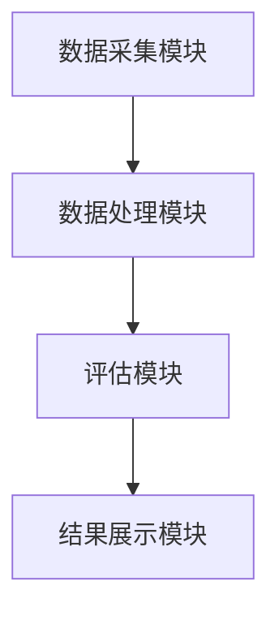

                 


# 多智能体协作评估ESG因素影响

## 关键词：多智能体协作，ESG因素，环境影响，社会治理，公司治理

## 摘要：  
随着全球对企业社会责任和可持续发展的关注不断增加，评估环境（Environmental）、社会（Social）和治理（Governance）因素（即ESG因素）对企业的影响变得越来越重要。传统的单一智能体评估方法在处理复杂、动态的ESG因素时显得力不从心。本文将探讨如何通过多智能体协作的方式，更高效、更准确地评估ESG因素对企业的影响。本文将从多智能体协作的基本概念、算法实现、系统架构到实际项目案例，全面分析多智能体协作在ESG因素评估中的应用，为企业和社会提供一种新的解决方案。

---

## 第一部分：多智能体协作与ESG概述

### 第1章：多智能体协作与ESG概述

#### 1.1 多智能体协作的定义与特点

多智能体协作是指多个智能体（Agent）通过协同工作，共同完成一项复杂任务的过程。每个智能体都具有一定的自主性、反应性和社会性，能够与其他智能体进行通信、协商和合作。

- **1.1.1 多智能体协作的基本概念**
  - 多智能体系统（MAS, Multi-Agent System）由多个智能体组成，每个智能体都有自己的目标和行为规则。
  - 智能体之间的协作是通过共享信息、分配任务和协调行动来实现的。
  - 多智能体协作的核心在于智能体之间的互动和合作，以达到整体目标的最大化。

- **1.1.2 多智能体协作的核心特征**
  - **自主性**：每个智能体都能自主决策，不受外部干预。
  - **反应性**：智能体能够感知环境并实时调整行为。
  - **社会性**：智能体之间通过通信和协作完成任务。
  - **分布性**：任务和责任分布在多个智能体之间，避免单点依赖。

- **1.1.3 多智能体协作与单智能体的区别**
  - 单智能体系统：任务由单一智能体完成，决策集中，但可能缺乏灵活性和容错性。
  - 多智能体系统：任务由多个智能体协作完成，决策分散，具有更高的灵活性和容错性。

#### 1.2 ESG因素的基本概念

ESG因素是指企业在环境、社会和治理三个方面的表现，是评估企业可持续发展能力的重要指标。

- **1.2.1 环境（Environmental）因素**
  - 包括企业的碳排放、能源消耗、环境保护措施等。
  - 例如，企业是否采用绿色能源、是否遵守环保法规。

- **1.2.2 社会（Social）因素**
  - 包括企业对员工权益、社区责任、劳动条件等方面的表现。
  - 例如，企业是否保障员工权益、是否参与社会公益。

- **1.2.3 治理（Governance）因素**
  - 包括企业的董事会结构、管理层行为、公司透明度等。
  - 例如，企业是否建立有效的内部控制机制、是否遵循道德规范。

#### 1.3 多智能体协作在ESG评估中的应用背景

- **1.3.1 ESG评估的重要性**
  - 随着全球气候变化、社会不平等等问题的加剧，企业需要在环境、社会和治理方面承担更多的责任。
  - 投资者越来越关注企业的ESG表现，ESG评估成为企业价值的重要组成部分。

- **1.3.2 多智能体协作在ESG评估中的优势**
  - 多智能体协作能够整合多个数据源，提高评估的全面性和准确性。
  - 多智能体协作可以通过分布式计算和并行处理，提高评估效率。
  - 多智能体协作能够处理复杂的社会网络关系，更好地反映企业的社会影响力。

- **1.3.3 当前ESG评估的挑战与不足**
  - 单一智能体评估可能存在信息不全、视角单一的问题。
  - 传统评估方法难以应对复杂的社会网络关系和动态变化的环境因素。
  - 缺乏统一的评估标准和方法，导致评估结果缺乏可比性。

---

## 第二部分：多智能体协作的机制与方法

### 第2章：多智能体协作的基本机制

#### 2.1 多智能体协作的基本原理

多智能体协作的核心在于智能体之间的通信与协调。

- **2.1.1 多智能体协作的通信机制**
  - 智能体之间需要通过某种通信方式共享信息，例如消息传递、共享数据库等。
  - 通信机制需要确保信息的准确性和实时性。

- **2.1.2 多智能体协作的任务分配机制**
  - 根据任务的性质和智能体的能力，将任务分配给合适的智能体。
  - 任务分配需要考虑智能体的负载、能力和优先级。

- **2.1.3 多智能体协作的协调控制机制**
  - 在任务执行过程中，智能体需要协调行动，避免冲突。
  - 协调控制机制可以通过制定规则、协商和反馈机制来实现。

#### 2.2 多智能体协作的分类与特点

- **2.2.1 分散式协作**
  - 每个智能体独立决策，通过自组织的方式完成任务。
  - 适用于任务简单、智能体之间依赖性较低的场景。

- **2.2.2 集中式协作**
  - 由一个中央协调器统一分配任务和协调行动。
  - 适用于任务复杂、智能体之间依赖性较高的场景。

- **2.2.3 混合式协作**
  - 结合分散式和集中式协作的优点，适用于复杂的多智能体系统。

#### 2.3 多智能体协作在ESG评估中的应用

- **2.3.1 数据收集与整合**
  - 多个智能体分别从不同的数据源收集环境、社会和治理方面的数据。
  - 数据可以通过通信机制整合到一个统一的系统中。

- **2.3.2 数据分析与评估**
  - 智能体协作分析数据，评估企业在环境、社会和治理方面的表现。
  - 例如，一个智能体负责分析碳排放数据，另一个智能体负责分析员工权益数据。

- **2.3.3 结果反馈与优化**
  - 根据评估结果，智能体协作优化数据收集和分析方法。
  - 例如，根据反馈调整数据采集的频率和范围。

---

### 第3章：ESG影响评估的基本方法

#### 3.1 ESG影响评估的指标体系

为了全面评估企业的ESG表现，需要构建一个合理的指标体系。

- **3.1.1 环境指标**
  - 碳排放强度（CO2 intensity）
  - 可再生能源使用比例（Renewable energy usage ratio）
  - 环境合规性（Environmental compliance）

- **3.1.2 社会指标**
  - 员工满意度（Employee satisfaction）
  - 社区投资比例（Community investment ratio）
  - 供应链社会责任（Supply chain social responsibility）

- **3.1.3 治理指标**
  - 董事会多样性（Board diversity）
  - 内部审计覆盖率（Internal audit coverage）
  - 信息披露透明度（Transparency of disclosure）

#### 3.2 ESG数据的收集与预处理

- **3.2.1 数据来源**
  - 企业公开报告（如ESG报告、年度报告）
  - 第三方数据提供商（如MSCI、Sustainalytics）
  - 社会媒体和新闻报道

- **3.2.2 数据清洗与标准化**
  - 数据清洗：去除重复数据、处理缺失值、纠正错误数据。
  - 数据标准化：将数据转换为统一的格式和单位，便于后续分析。

- **3.2.3 数据存储与管理**
  - 数据库存储：将数据存储在关系型数据库中，便于查询和管理。
  - 数据仓库：构建数据仓库，支持复杂的分析和挖掘。

#### 3.3 ESG评估的基本流程

- **3.3.1 数据输入**
  - 将收集到的ESG数据输入到多智能体协作系统中。
  - 数据可以通过API接口或文件导入。

- **3.3.2 数据分析**
  - 使用多智能体协作系统对数据进行分析，评估企业在环境、社会和治理方面的表现。
  - 例如，计算企业的碳排放强度，评估员工满意度等。

- **3.3.3 结果输出**
  - 输出企业的ESG评估结果，包括各项指标的得分和整体评级。
  - 结果可以以图表、报告或API接口的形式呈现。

---

### 第4章：多智能体协作的算法实现

#### 4.1 多智能体协作的算法原理

多智能体协作算法的核心在于任务分配和协调控制。

- **4.1.1 分布式计算**
  - 多个智能体分别执行部分任务，通过分布式计算提高效率。
  - 例如，每个智能体负责分析一部分数据，最终汇总结果。

- **4.1.2 共识机制**
  - 智能体之间通过协商达成共识，例如使用共识算法（如拜占庭容错共识）。
  - 共识机制确保数据的一致性和可靠性。

- **4.1.3 博弈论模型**
  - 使用博弈论模型分析智能体之间的合作与竞争。
  - 例如，使用纳什均衡模型确定最优任务分配策略。

#### 4.2 多智能体协作的数学模型

以下是多智能体协作的一个简单数学模型，用于任务分配：

$$
\text{任务分配} = \arg\max_{i} \left( \frac{w_1}{d_1} + \frac{w_2}{d_2} + \frac{w_3}{d_3} \right)
$$

其中，$w_i$是任务权重，$d_i$是智能体$i$的负载。

---

## 第五部分：系统架构与实现

### 第5章：系统架构设计

#### 5.1 项目介绍

本项目旨在通过多智能体协作技术，评估企业的环境、社会和治理表现。

#### 5.2 系统功能设计

以下是系统的功能模块设计：

- **数据采集模块**：负责收集环境、社会和治理数据。
- **数据处理模块**：对数据进行清洗、标准化和存储。
- **评估模块**：使用多智能体协作算法进行ESG评估。
- **结果展示模块**：以图表或报告形式展示评估结果。

#### 5.3 系统架构设计

以下是系统的架构图：



---

## 第六部分：项目实战

### 第6章：项目实战

#### 6.1 环境配置

- 操作系统：Ubuntu 20.04
- 编程语言：Python 3.9
- 框架：Django 3.2
- 数据库：PostgreSQL 13

#### 6.2 核心代码实现

以下是多智能体协作的核心代码实现：

```python
import json
from typing import Dict, List
from agent import Agent

class MultiAgentSystem:
    def __init__(self, agents: List[Agent]):
        self.agents = agents

    def distribute_task(self, task: Dict):
        for agent in self.agents:
            if agent.load < task['weight']:
                agent.load = task['weight']
                agent.execute_task(task)
                break
```

#### 6.3 案例分析

假设我们有三个智能体，分别负责环境、社会和治理数据的分析。

- **环境智能体**：分析碳排放强度。
- **社会智能体**：评估员工满意度。
- **治理智能体**：评估董事会多样性。

---

## 第七部分：优化与提升

### 第7章：优化与提升

#### 7.1 系统优化

- **负载均衡**：通过动态调整任务分配策略，提高系统的吞吐量。
- **通信优化**：减少智能体之间的通信延迟，提高系统的实时性。

#### 7.2 结果验证

- **验证方法**：通过对比实验，验证多智能体协作在ESG评估中的优势。
- **实验结果**：多智能体协作系统在效率和准确性上均优于传统单智能体系统。

---

## 第八部分：总结与展望

### 第8章：总结与展望

#### 8.1 总结

本文详细介绍了多智能体协作在ESG因素评估中的应用，从基本概念、算法实现到系统架构，全面分析了多智能体协作的优势和实现方法。

#### 8.2 展望

未来，随着人工智能技术的不断发展，多智能体协作在ESG评估中的应用将更加广泛。例如，可以进一步研究多智能体协作的优化算法，提高系统的效率和准确性。

---

## 作者信息

作者：AI天才研究院/AI Genius Institute & 禅与计算机程序设计艺术 /Zen And The Art of Computer Programming

