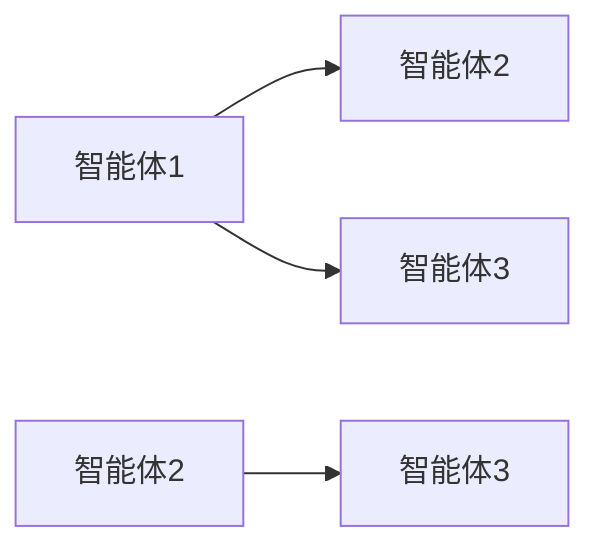
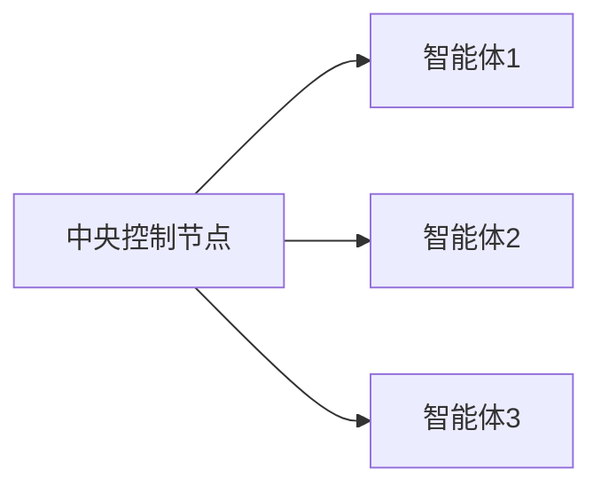

                 


# 多智能体协作进行宏观主题投资

> 关键词：多智能体协作、宏观主题投资、人工智能、算法、系统架构、项目实战

> 摘要：本文深入探讨了多智能体协作在宏观主题投资中的应用，从背景、核心概念、算法原理、系统架构到项目实战，全面解析如何利用多智能体协作提升投资决策的准确性和效率。文章通过具体案例分析，展示了多智能体协作在宏观主题投资中的实际应用价值。

---

## 第1章: 多智能体协作与宏观主题投资的背景

### 1.1 多智能体协作的定义与特点
#### 1.1.1 多智能体协作的定义
多智能体协作是指多个智能体（Agent）通过共享信息、协同决策和行动，共同完成复杂任务的过程。与单智能体相比，多智能体协作能够利用多个智能体的互补优势，提高任务完成的效率和准确性。

#### 1.1.2 多智能体协作的核心特点
- **分布式决策**：每个智能体独立决策，但通过通信和协调实现整体目标。
- **任务分配**：智能体之间动态分配任务，优化资源利用。
- **信息共享**：通过通信机制共享信息，提高整体决策能力。

#### 1.1.3 多智能体协作与单智能体的区别
| 特性                | 单智能体          | 多智能体协作      |
|---------------------|-------------------|------------------|
| 决策主体            | 单一主体          | 多个主体          |
| 信息共享            | 无                | 有                |
| 任务分配            | 无                | 动态分配          |
| 系统鲁棒性          | 较低              | 较高              |

### 1.2 宏观主题投资的定义与特点
#### 1.2.1 宏观主题投资的定义
宏观主题投资是一种基于宏观经济趋势、行业动态和市场环境进行投资的策略。投资者通过分析宏观经济指标、政策变化和市场情绪，识别潜在的投资主题。

#### 1.2.2 宏观主题投资的核心特点
- **宏观视角**：关注宏观经济趋势，而非单一资产。
- **主题驱动**：围绕特定投资主题（如科技、绿色能源）进行配置。
- **风险分散**：通过多样化投资降低风险。

#### 1.2.3 宏观主题投资与传统投资的区别
| 特性                | 传统投资          | 宏观主题投资      |
|---------------------|-------------------|------------------|
| 投资视角            | 个股/资产         | 宏观主题          |
| 分析维度            | 个体分析          | 宏观分析          |
| 投资策略            | 短期交易          | 长期主题配置      |

### 1.3 多智能体协作在宏观主题投资中的应用前景
#### 1.3.1 多智能体协作在宏观主题投资中的优势
- **数据处理能力强**：多智能体能够高效处理海量数据。
- **决策多样性**：多个智能体提供多样化的决策建议。
- **实时协作**：能够快速响应市场变化。

#### 1.3.2 多智能体协作在宏观主题投资中的挑战
- **通信延迟**：智能体之间通信可能引入延迟。
- **信息过载**：过多的信息可能导致决策混乱。
- **安全性问题**：数据共享可能带来安全风险。

#### 1.3.3 多智能体协作在宏观主题投资中的未来发展方向
- **智能化升级**：引入强化学习和深度学习技术。
- **分布式架构优化**：提升智能体协作效率。
- **人机协作**：结合人类专家的决策能力。

---

## 第2章: 多智能体协作与宏观主题投资的核心概念

### 2.1 多智能体协作的核心概念
#### 2.1.1 多智能体协作的基本原理
多智能体协作通过以下步骤实现：
1. **任务分解**：将整体任务分解为子任务。
2. **任务分配**：智能体之间动态分配子任务。
3. **信息共享**：智能体通过通信机制共享信息。
4. **协同决策**：基于共享信息，智能体协同完成任务。

#### 2.1.2 多智能体协作的通信机制
- **直接通信**：智能体之间直接交换信息。
- **间接通信**：通过中间媒介传递信息。
- **广播通信**：所有智能体共享信息。

#### 2.1.3 多智能体协作的任务分配与协调
- **任务分解**：将复杂任务分解为多个子任务。
- **任务分配**：根据智能体的能力动态分配任务。
- **协调控制**：通过协调机制确保任务顺利进行。

### 2.2 宏观主题投资的核心概念
#### 2.2.1 宏观主题投资的分析框架
宏观主题投资的分析框架包括：
1. **宏观经济分析**：分析GDP、利率、通胀等宏观经济指标。
2. **行业分析**：分析行业趋势和竞争优势。
3. **市场情绪分析**：分析投资者情绪和市场信心。

#### 2.2.2 宏观主题投资的数据来源
- **宏观经济数据**：如GDP、CPI、失业率等。
- **行业数据**：如行业报告、公司财报。
- **市场数据**：如股票价格、成交量等。
- **新闻数据**：如政策变化、行业新闻。

#### 2.2.3 宏观主题投资的风险评估与收益预测
- **风险评估**：通过波动率、VaR等方法评估投资风险。
- **收益预测**：通过回归分析、时间序列分析等方法预测收益。

### 2.3 多智能体协作与宏观主题投资的关联
#### 2.3.1 多智能体协作如何赋能宏观主题投资
- **数据处理**：多智能体能够高效处理海量数据，提供实时分析。
- **决策支持**：通过协同决策，提供更优的投资策略。
- **风险控制**：通过实时协作，降低投资风险。

#### 2.3.2 宏观主题投资如何驱动多智能体协作的发展
- **复杂性需求**：宏观主题投资的复杂性推动多智能体协作技术的发展。
- **实时性要求**：需要快速响应市场变化，推动多智能体协作的实时性优化。

#### 2.3.3 多智能体协作与宏观主题投资的协同效应
- **提高效率**：通过协作提高数据处理和决策效率。
- **增强鲁棒性**：通过分布式决策提高系统的鲁棒性。
- **优化收益**：通过协同决策优化投资收益。

---

## 第3章: 多智能体协作的算法与数学模型

### 3.1 多智能体协作算法概述
#### 3.1.1 分布式多智能体协作算法
分布式算法允许智能体在没有中央控制的情况下进行协作。常见的分布式算法包括：
- **Gossip Algorithms**：通过随机传播信息实现信息共享。
- **Consensus Algorithms**：通过共识机制达成一致决策。

#### 3.1.2 集中式多智能体协作算法
集中式算法通过中央控制节点协调智能体的协作。常见的集中式算法包括：
- **Master-Slave Model**：主节点分配任务， slave节点执行任务。
- **Tree-Based Models**：通过树形结构进行任务分配和信息共享。

#### 3.1.3 混合式多智能体协作算法
混合式算法结合分布式和集中式的特点，适用于复杂任务。例如：
- **Hybrid Gossip-Consensus Model**：结合Gossip和Consensus算法，实现高效协作。

### 3.2 多智能体协作的核心算法
#### 3.2.1 分布式多智能体协作算法

#### 3.2.2 集中式多智能体协作算法


### 3.3 多智能体协作的数学模型
#### 3.3.1 多智能体协作的通信模型
$$ P(i,j) = \frac{1}{N} $$
其中，\( P(i,j) \) 表示智能体i与智能体j通信的概率，\( N \) 表示智能体总数。

#### 3.3.2 多智能体协作的任务分配模型
$$ \text{Task}_i = \argmin_{j} \{ \text{Distance}(i,j) \} $$
其中，\( \text{Distance}(i,j) \) 表示智能体i与智能体j之间的距离。

---

## 第4章: 多智能体协作的系统分析与架构设计

### 4.1 系统功能设计
#### 4.1.1 系统模块划分
- **数据采集模块**：采集宏观经济数据、市场数据等。
- **主题分析模块**：分析投资主题，生成投资策略。
- **协作决策模块**：智能体协作完成决策。
- **结果反馈模块**：反馈决策结果，优化系统。

#### 4.1.2 系统功能流程


### 4.2 系统架构设计
#### 4.2.1 分层架构
- **数据层**：存储宏观经济数据、市场数据等。
- **主题层**：分析投资主题，生成投资策略。
- **协作层**：智能体协作完成决策。
- **应用层**：输出投资建议，反馈结果。

#### 4.2.2 模块化设计
- **数据模块**：负责数据采集和预处理。
- **主题模块**：负责主题分析和策略生成。
- **协作模块**：负责智能体协作和决策。
- **反馈模块**：负责结果反馈和系统优化。

---

## 第5章: 项目实战——基于多智能体协作的宏观主题投资系统

### 5.1 环境安装
- **Python 3.8+**
- **Pandas、NumPy、Matplotlib**
- **Scikit-learn、TensorFlow**

### 5.2 系统核心实现
```python
class MultiAgentCollaboration:
    def __init__(self, agents):
        self.agents = agents

    def collaborate(self, task):
        for agent in self.agents:
            agent.receive_task(task)
        return self.get_result()

    def get_result(self):
        results = []
        for agent in self.agents:
            results.append(agent.get_result())
        return results
```

### 5.3 代码应用解读
- **数据采集**：从数据源获取宏观经济数据。
- **主题分析**：分析投资主题，生成投资策略。
- **协作决策**：智能体协作完成决策。
- **结果反馈**：反馈决策结果，优化系统。

### 5.4 案例分析
以股票市场预测为例，展示如何利用多智能体协作进行宏观主题投资。

---

## 第6章: 总结与展望

### 6.1 总结
本文详细探讨了多智能体协作在宏观主题投资中的应用，从背景、核心概念、算法原理到系统架构和项目实战，全面解析了多智能体协作的优势和挑战。

### 6.2 展望
未来，多智能体协作在宏观主题投资中的应用将更加广泛，随着人工智能技术的进步，多智能体协作将在投资决策中发挥更大的作用。

---

## 作者：AI天才研究院/AI Genius Institute & 禅与计算机程序设计艺术 /Zen And The Art of Computer Programming

---

**注**：由于篇幅限制，本文仅展示部分内容，完整文章请参考相关技术资料。

