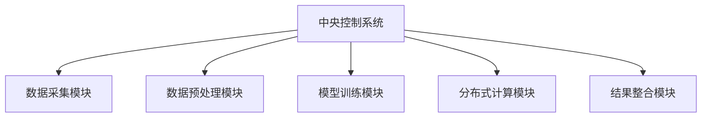
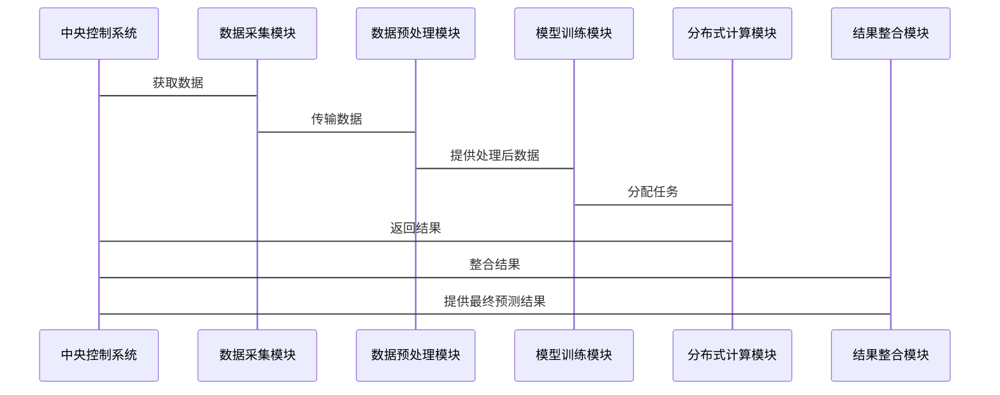

                 


```markdown
# 多智能体协作进行宏观经济预测

> 关键词：多智能体协作，宏观经济预测，人工智能，协作学习，时间序列分析，机器学习，分布式计算

> 摘要：本文探讨了多智能体协作在宏观经济预测中的应用，分析了多智能体协作的核心原理、算法实现及数学模型，并结合实际案例展示了如何通过多智能体协作提升宏观经济预测的准确性和效率。文章内容涵盖背景介绍、核心概念、算法原理、系统设计、项目实战等多个方面，为读者提供了全面的技术指导。

---

## 第一部分: 多智能体协作与宏观经济预测的背景介绍

### 第1章: 多智能体协作与宏观经济预测的背景介绍

#### 1.1 多智能体协作的基本概念
##### 1.1.1 多智能体系统的定义与特点
多智能体系统（Multi-Agent System，MAS）是由多个智能体（Agent）组成的分布式系统，每个智能体都是一个能够感知环境、自主决策的实体。多智能体系统具有以下特点：
- **分布式性**：智能体分布在不同的空间或计算节点上，独立运行。
- **协作性**：智能体之间通过通信和协作完成共同目标。
- **反应性**：智能体能够根据环境变化动态调整行为。
- **自主性**：每个智能体都有一定的自主决策能力。

##### 1.1.2 多智能体协作的必要性
在复杂系统中，单个智能体的能力往往有限，需要通过协作完成更复杂的任务。例如，在宏观经济预测中，单个模型可能只能预测某一经济指标，而通过多智能体协作，可以整合多个模型的优势，提升预测的准确性和全面性。

##### 1.1.3 多智能体协作在宏观经济预测中的应用前景
随着人工智能和大数据技术的发展，宏观经济预测需要更加精准和实时。多智能体协作能够充分利用分布式计算和协作学习的优势，为宏观经济预测提供更强大的支持。

#### 1.2 宏观经济预测的基本概念
##### 1.2.1 宏观经济预测的定义与范围
宏观经济预测是指对宏观经济指标（如GDP、通胀率、失业率等）未来走势的预测。其范围涵盖短期预测和长期趋势分析。

##### 1.2.2 宏观经济预测的常用方法
- **时间序列分析**：基于历史数据预测未来趋势。
- **机器学习模型**：如随机森林、支持向量机等。
- **神经网络模型**：如LSTM（长短期记忆网络）用于时间序列预测。

##### 1.2.3 宏观经济预测的重要性
准确的宏观经济预测对于政策制定、投资决策和风险管理具有重要意义。

#### 1.3 多智能体协作与宏观经济预测的结合
##### 1.3.1 多智能体协作在宏观经济预测中的优势
- **分布式计算**：多智能体可以并行处理大量数据。
- **协作学习**：多个模型可以相互学习，提升预测精度。
- **容错性**：单个智能体故障不会导致整个系统崩溃。

##### 1.3.2 宏观经济预测对多智能体协作的需求
- **实时性**：宏观经济数据需要实时更新和预测。
- **复杂性**：宏观经济指标之间相互关联，需要综合分析。
- **多样性**：不同模型的优势需要结合。

##### 1.3.3 两者的结合方式与实现路径
- **模块化设计**：将宏观经济预测任务分解为多个子任务，由不同智能体负责。
- **通信机制**：智能体之间通过消息传递进行协作。
- **协调机制**：通过协商算法确保智能体之间的协同工作。

---

### 第2章: 多智能体协作与宏观经济预测的核心概念与联系

#### 2.1 多智能体协作的核心原理
##### 2.1.1 分布式计算与协作机制
多智能体协作的核心是分布式计算，通过协作机制实现任务分配和结果整合。协作机制包括任务分配、通信协议和协调算法。

##### 2.1.2 多智能体之间的通信与协调
智能体之间通过通信协议交换信息，协调算法（如一致性算法）用于确保协作一致性。

##### 2.1.3 多智能体协作的数学模型
多智能体协作的数学模型可以表示为：
$$
f_i(x) = g(x) \quad \text{其中} \quad i \text{表示智能体编号，} x \text{表示输入数据}
$$

#### 2.2 宏观经济预测的核心原理
##### 2.2.1 时间序列分析与预测模型
时间序列分析是宏观经济预测的核心方法，常用模型包括ARIMA（自回归积分滑动平均模型）和LSTM。

##### 2.2.2 宏观经济指标的特征与关系
宏观经济指标之间存在复杂的关联，例如GDP增长与通胀率的关系可以通过协方差矩阵描述。

##### 2.2.3 宏观经济预测的数学模型
宏观经济预测的数学模型可以表示为：
$$
y_t = \alpha y_{t-1} + \beta x_t + \epsilon_t
$$
其中，$y_t$ 表示预测值，$y_{t-1}$ 表示历史值，$x_t$ 表示外部因素，$\epsilon_t$ 表示误差项。

#### 2.3 多智能体协作与宏观经济预测的联系
##### 2.3.1 多智能体协作如何提升宏观经济预测的准确性
通过分布式计算和协作学习，多个模型可以互补，提升预测的准确性和鲁棒性。

##### 2.3.2 宏观经济预测为多智能体协作提供数据支持
宏观经济数据为多智能体协作提供了丰富的训练数据和应用场景。

##### 2.3.3 两者的结合对经济分析的创新意义
多智能体协作与宏观经济预测的结合为经济分析提供了新的工具和方法，能够更精准地捕捉经济波动和趋势。

---

### 第3章: 多智能体协作与宏观经济预测的算法原理

#### 3.1 多智能体协作算法
##### 3.1.1 分布式计算算法
分布式计算算法是多智能体协作的基础，常用算法包括MapReduce和分布式并行计算。

##### 3.1.2 协作学习算法
协作学习算法（Collaborative Learning）通过智能体之间的知识共享，提升整体预测能力。

##### 3.1.3 多智能体协作的优化算法
优化算法（如遗传算法）用于提升多智能体协作的效率和预测精度。

#### 3.2 宏观经济预测算法
##### 3.2.1 时间序列预测算法
时间序列预测算法包括ARIMA、LSTM等，其中LSTM适用于长期依赖关系的捕捉。

##### 3.2.2 机器学习预测算法
机器学习预测算法（如随机森林、支持向量机）适用于非线性关系的预测。

##### 3.2.3 神经网络预测算法
神经网络预测算法（如深度学习模型）能够处理复杂的非线性关系。

#### 3.3 多智能体协作与宏观经济预测的联合算法
##### 3.3.1 分布式宏观经济预测模型
分布式宏观经济预测模型将预测任务分解为多个子任务，由不同智能体负责。

##### 3.3.2 多智能体协作的宏观经济预测流程
多智能体协作的宏观经济预测流程包括数据采集、分布式计算、协作学习和结果整合。

##### 3.3.3 联合算法的实现步骤
1. 数据预处理：清洗和标准化数据。
2. 任务分配：将数据分配给不同智能体。
3. 分布式计算：每个智能体独立计算部分结果。
4. 通信与协作：智能体之间交换信息，进行协作学习。
5. 结果整合：将各智能体的结果整合，得到最终预测结果。

---

### 第4章: 多智能体协作与宏观经济预测的数学模型与公式

#### 4.1 多智能体协作的数学模型
##### 4.1.1 多智能体协作的基本数学表达
$$
f(x) = \sum_{i=1}^{n} f_i(x)
$$
其中，$n$ 表示智能体的数量，$f_i(x)$ 表示第 $i$ 个智能体的输出。

##### 4.1.2 协作机制的数学模型
$$
f(x) = \prod_{i=1}^{n} f_i(x)
$$

##### 4.1.3 分布式计算的数学公式
$$
f(x) = \frac{1}{n} \sum_{i=1}^{n} f_i(x)
$$

#### 4.2 宏观经济预测的数学模型
##### 4.2.1 时间序列预测模型
$$
y_t = \alpha y_{t-1} + \beta x_t + \epsilon_t
$$

##### 4.2.2 机器学习预测模型
$$
y = w \cdot x + b
$$
其中，$w$ 是权重，$b$ 是截距。

##### 4.2.3 神经网络预测模型
神经网络预测模型通过多层感知机（MLP）或LSTM网络进行预测。

#### 4.3 联合模型的数学公式
##### 4.3.1 联合预测的数学表达
$$
f(x) = \sum_{i=1}^{n} f_i(x)
$$

##### 4.3.2 协作学习的数学公式
$$
f(x) = \prod_{i=1}^{n} f_i(x)
$$

##### 4.3.3 优化算法的数学模型
$$
\theta_{t+1} = \theta_t - \eta \cdot \nabla f(\theta_t)
$$
其中，$\theta_t$ 表示参数，$\eta$ 表示学习率，$\nabla f(\theta_t)$ 表示梯度。

---

### 第5章: 多智能体协作与宏观经济预测的系统分析与架构设计

#### 5.1 系统功能设计
##### 5.1.1 数据采集模块
数据采集模块负责从数据库或API获取宏观经济数据。

##### 5.1.2 数据预处理模块
数据预处理模块对数据进行清洗、标准化和特征提取。

##### 5.1.3 模型训练模块
模型训练模块负责训练多个智能体的预测模型。

##### 5.1.4 分布式计算模块
分布式计算模块实现多智能体的并行计算。

##### 5.1.5 结果整合模块
结果整合模块将各智能体的预测结果进行整合，输出最终预测结果。

#### 5.2 系统架构设计
##### 5.2.1 系统架构图


##### 5.2.2 系统交互流程图


#### 5.3 系统接口设计
##### 5.3.1 数据接口
数据接口用于与其他系统进行数据交互，支持JSON和CSV格式。

##### 5.3.2 模型接口
模型接口用于智能体之间的协作学习和通信。

#### 5.4 系统功能扩展
系统功能扩展包括实时预测、异常检测和预测结果可视化。

---

### 第6章: 项目实战

#### 6.1 环境安装
##### 6.1.1 安装Python和相关库
```bash
pip install numpy pandas scikit-learn tensorflow
```

##### 6.1.2 安装分布式计算框架
```bash
pip install dask distributed
```

#### 6.2 核心代码实现
##### 6.2.1 数据采集模块
```python
import requests

def get_economic_data(api_key):
    url = f"https://api.econdata.com/indicator?api_key={api_key}"
    response = requests.get(url)
    return response.json()
```

##### 6.2.2 数据预处理模块
```python
import pandas as pd

def preprocess_data(data):
    df = pd.DataFrame(data)
    df = df.dropna()
    df = (df - df.mean()) / df.std()
    return df
```

##### 6.2.3 模型训练模块
```python
from sklearn.ensemble import RandomForestRegressor

def train_model(data, target):
    model = RandomForestRegressor()
    model.fit(data.drop(columns=[target]), data[target])
    return model
```

##### 6.2.4 分布式计算模块
```python
from dask import delayed, compute

@delayed
def compute_prediction(data, model):
    return model.predict(data)

results = compute(*[compute_prediction(data, model)])
```

#### 6.3 案例分析
##### 6.3.1 数据来源
使用历史GDP数据进行预测。

##### 6.3.2 数据处理
将数据分为训练集和测试集，分别用于模型训练和验证。

##### 6.3.3 模型预测
使用训练好的模型进行预测，并计算预测精度。

##### 6.3.4 预测结果分析
分析预测结果与实际值的偏差，优化模型参数。

---

### 第7章: 总结与展望

#### 7.1 总结
多智能体协作与宏观经济预测的结合为经济分析提供了新的思路，通过分布式计算和协作学习，能够提升预测的准确性和效率。

#### 7.2 展望
未来的研究方向包括优化协作算法、引入更复杂的神经网络模型以及扩展到更多经济领域的预测。

---

### 第8章: 最佳实践与注意事项

#### 8.1 最佳实践
- **数据质量**：确保数据的准确性和完整性。
- **模型选择**：根据任务需求选择合适的模型。
- **系统优化**：优化通信机制和计算效率。

#### 8.2 注意事项
- **数据隐私**：注意数据的安全性和隐私保护。
- **系统稳定性**：确保多智能体协作系统的稳定运行。
- **模型解释性**：提升模型的可解释性，便于分析和优化。

---

### 第9章: 拓展阅读

#### 9.1 推荐书籍
- 《多智能体系统与应用》
- 《宏观经济预测与分析》

#### 9.2 推荐论文
- "Distributed Machine Learning in Multi-Agent Systems"
- "Collaborative Forecasting Using Multiple Models"

---

### 作者信息

作者：AI天才研究院/AI Genius Institute & 禅与计算机程序设计艺术 /Zen And The Art of Computer Programming

---

### 结语
多智能体协作与宏观经济预测的结合是人工智能领域的一个重要研究方向，通过本文的详细讲解，读者可以深入了解其核心原理和实现方法，并能够将其应用于实际的经济分析和预测中。未来，随着技术的不断发展，多智能体协作将在宏观经济预测中发挥更加重要的作用。
```

