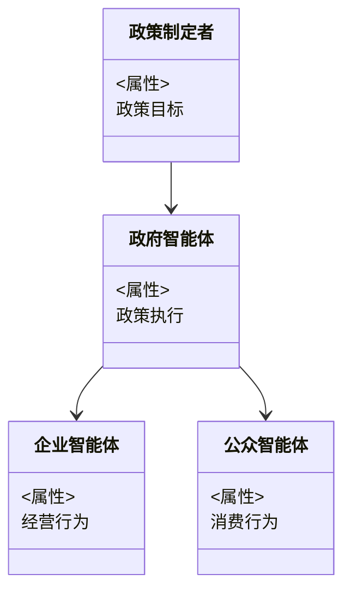
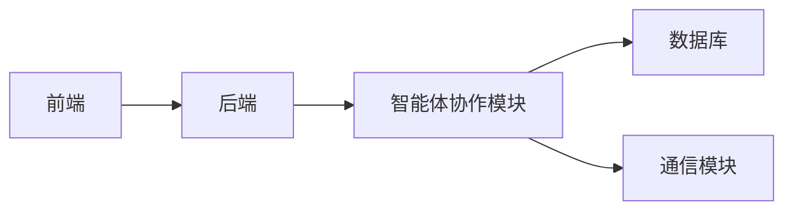
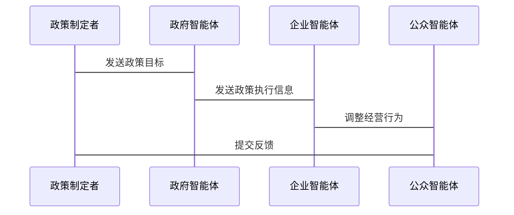

                 


# 多智能体协作进行政策影响分析

## 关键词：多智能体协作、政策影响分析、算法原理、系统架构、项目实战

## 摘要：  
本文详细探讨了多智能体协作在政策影响分析中的应用，从理论基础到实际应用，结合算法原理和系统架构设计，分析了多智能体协作如何助力政策模拟、优化和评估。通过具体案例和项目实战，展示了多智能体协作在政策影响分析中的实际应用价值和未来发展方向。

---

## 第1章 多智能体协作与政策影响分析概述

### 1.1 多智能体协作的背景与意义  
多智能体协作（Multi-Agent Collaboration）是一种分布式智能系统，通过多个智能体的协同工作，实现复杂任务的高效完成。在政策影响分析中，多智能体协作能够模拟不同主体的行为、交互和决策过程，为政策制定者提供科学依据。

#### 1.1.1 多智能体协作的基本概念  
- 多智能体系统由多个独立但相互作用的智能体组成，每个智能体都有自己的目标和行为规则。  
- 协作是指智能体通过通信和协调，共同完成比单个智能体能力更大的任务。  

#### 1.1.2 政策影响分析的定义与目标  
政策影响分析是对政策实施后可能产生的社会、经济、环境等多方面影响进行评估的过程。其目标是通过模拟和预测，为政策优化提供支持。

#### 1.1.3 多智能体协作在政策分析中的优势  
- **复杂性降低**：通过分解问题，多个智能体分别处理部分任务，降低系统复杂性。  
- **分布式决策**：多个智能体可以独立决策，提高系统的鲁棒性和适应性。  
- **实时模拟**：能够动态模拟政策实施后的各种可能结果，支持实时调整和优化。

### 1.2 多智能体协作的核心概念  
#### 1.2.1 多智能体协作的基本原理  
多智能体协作的核心在于智能体之间的通信与协调。智能体通过共享信息、协商任务分工，实现协作目标。  

#### 1.2.2 政策影响分析的关键要素  
- **政策目标**：明确政策的核心目标和预期效果。  
- **主体行为**：分析政策涉及的各主体（如政府、企业、公众）的行为特征。  
- **交互规则**：定义主体之间的交互规则和信息传递机制。  

#### 1.2.3 多智能体协作与政策分析的结合  
通过多智能体协作，可以模拟政策在不同情景下的实施效果，帮助政策制定者更好地理解政策的潜在影响。

### 1.3 多智能体协作的典型应用场景  
#### 1.3.1 政策模拟与预测  
通过模拟不同政策方案的效果，预测其对社会经济的影响。  

#### 1.3.2 政策优化与决策支持  
利用多智能体协作，优化政策方案，提供决策支持。  

#### 1.3.3 政策评估与效果分析  
评估政策的实际效果，分析其与预期目标的差异。

### 1.4 本章小结  
本章介绍了多智能体协作的基本概念、政策影响分析的核心目标，以及两者结合的应用优势。通过多智能体协作，可以更高效地模拟和分析政策的影响。

---

## 第2章 多智能体协作的核心概念与联系  

### 2.1 多智能体协作的核心原理  
多智能体协作的核心在于智能体之间的通信与协调。通过共享信息和任务分工，多个智能体能够协同完成复杂任务。

#### 2.1.1 多智能体系统的定义与特点  
- **定义**：由多个智能体组成的分布式系统。  
- **特点**：智能体独立性、协作性、动态性。  

#### 2.1.2 协作机制的基本原理  
协作机制包括通信、协商、任务分配等步骤，确保智能体之间的高效协作。

#### 2.1.3 政策影响分析的数学模型  
政策影响分析可以通过数学模型描述政策与主体行为之间的关系。  

### 2.2 多智能体协作的属性特征对比  
通过对比分析，明确多智能体协作的核心属性。  

#### 2.2.1 属性对比表格  
| 属性         | 多智能体协作 | 单智能体系统 |  
|--------------|--------------|--------------|  
| 独立性       | 高           | 低           |  
| 协作性       | 高           | 无           |  
| 灵活性       | 高           | 低           |  

#### 2.2.2 Mermaid 实体关系图  


### 2.3 多智能体协作与政策分析的联系  
通过多智能体协作，可以模拟政策实施后的各种可能结果，为政策优化提供支持。

---

## 第3章 多智能体协作的算法原理  

### 3.1 算法原理概述  
#### 3.1.1 Mermaid 算法流程图  


#### 3.1.2 Python 实现代码  
```python
class Agent:
    def __init__(self, id):
        self.id = id
        self.state = None

    def receive_message(self, message):
        self.state = message

    def send_message(self, message):
        return message

def multi_agent_collaboration():
    agent1 = Agent(1)
    agent2 = Agent(2)
    message = "完成任务"
    agent1.receive_message(message)
    response = agent1.send_message(message)
    agent2.receive_message(response)
    return response

if __name__ == "__main__":
    print(multi_agent_collaboration())
```

### 3.2 数学模型与公式  
#### 3.2.1 基本公式推导  
假设政策效果 \( E \) 与政策力度 \( P \) 和主体行为 \( B \) 的关系为：  
$$ E = f(P, B) $$  

#### 3.2.2 示例说明  
例如，政策效果 \( E \) 可以通过以下公式计算：  
$$ E = \alpha P + \beta B $$  
其中，\( \alpha \) 和 \( \beta \) 是系数，表示政策力度和主体行为对效果的影响程度。

---

## 第4章 系统分析与架构设计  

### 4.1 问题场景介绍  
#### 4.1.1 政策影响分析的典型场景  
例如，分析某项环保政策对企业和公众行为的影响。

#### 4.1.2 多智能体协作的应用需求  
需要模拟政府、企业和公众之间的交互关系。

### 4.2 系统功能设计  
#### 4.2.1 领域模型 Mermaid 类图  


#### 4.2.2 系统架构 Mermaid 架构图  


### 4.3 系统接口与交互设计  
#### 4.3.1 接口设计  
- 政策制定者与政府智能体的接口：传递政策目标。  
- 政府智能体与企业智能体的接口：传递政策执行信息。  

#### 4.3.2 Mermaid 序列图  


---

## 第5章 项目实战  

### 5.1 环境安装与配置  
#### 5.1.1 开发环境搭建  
- 安装 Python 和必要的库（如 `networkx`、`matplotlib`）。  

#### 5.1.2 依赖库安装  
```bash
pip install networkx matplotlib
```

### 5.2 核心功能实现  
#### 5.2.1 多智能体协作算法实现  
```python
import networkx as nx

def create_agents(n):
    return [Agent(i) for i in range(n)]

def collaboration(agents, task):
    for agent in agents:
        message = agent.send_message(task)
        print(f"Agent {agent.id} sends message: {message}")
    return "任务完成"

class Agent:
    def __init__(self, id):
        self.id = id

    def send_message(self, message):
        return f"Agent {self.id}完成任务"
```

#### 5.2.2 政策影响分析系统实现  
```python
def policy_analysis(agents, policy):
    for agent in agents:
        response = agent.receive_message(policy)
        print(f"Agent {agent.id}的响应：{response}")
    return "政策分析完成"
```

### 5.3 案例分析与解读  
#### 5.3.1 典型案例分析  
例如，分析某项环保政策对企业和公众行为的影响。  

#### 5.3.2 代码应用解读  
通过代码模拟政策实施后各智能体的行为变化，分析政策效果。

### 5.4 项目总结与优化建议  
项目实战展示了多智能体协作在政策影响分析中的具体应用，为后续研究提供了参考。

---

## 第6章 最佳实践与注意事项  

### 6.1 最佳实践 tips  
- 在设计系统时，应明确智能体的职责分工。  
- 在实现协作机制时，需考虑通信的效率和安全性。  

### 6.2 小结与展望  
本章总结了多智能体协作在政策影响分析中的应用，并展望了未来的研究方向，如智能体的自适应性和学习能力。

### 6.3 拓展阅读推荐  
推荐阅读相关领域的书籍和论文，深入理解多智能体协作的理论与应用。

---

## 作者：AI天才研究院 & 禅与计算机程序设计艺术

---

通过以上章节的详细讲解，我们系统地介绍了多智能体协作在政策影响分析中的应用，从理论到实践，为读者提供了全面的知识体系和实践指导。

