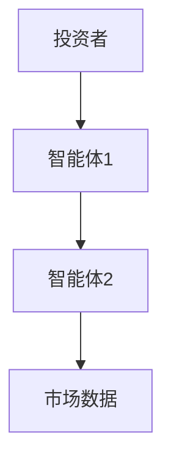
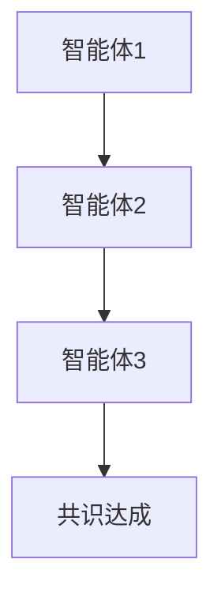
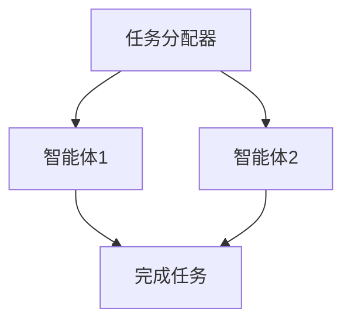
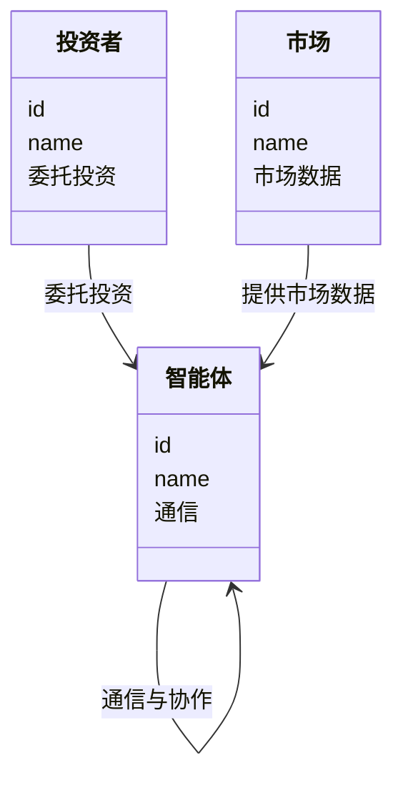
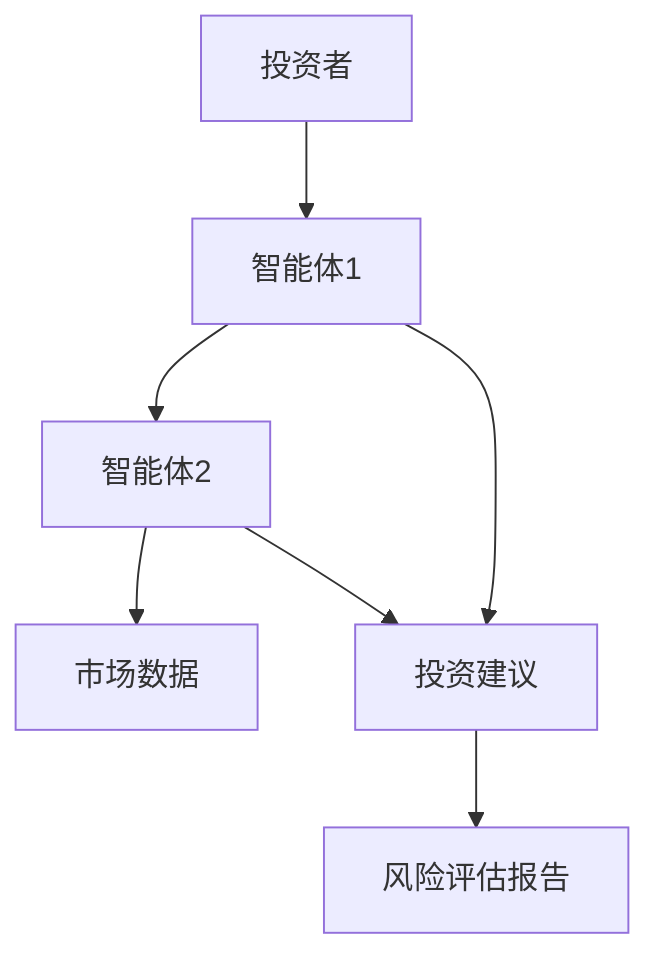
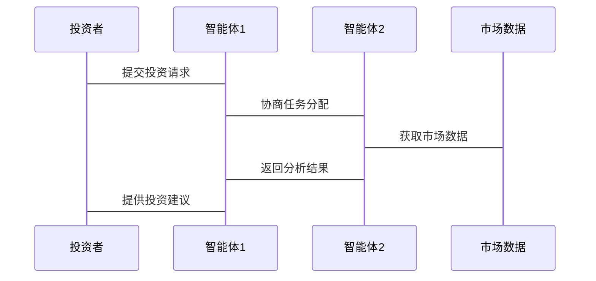

                 


# 多智能体协作进行跨境投资分析

**关键词**：多智能体协作、跨境投资分析、分布式计算、共识机制、任务分配、数学模型

**摘要**：本文深入探讨了多智能体协作在跨境投资分析中的应用。通过分析多智能体协作的核心概念、算法原理、数学模型和系统架构，本文为读者提供了从理论到实践的全面指南。文章首先介绍了多智能体协作的背景与概念，随后详细讲解了其在跨境投资分析中的应用前景。接着，通过数学模型和公式，分析了多智能体协作的算法原理，并提供了系统设计与架构方案。最后，通过一个具体的项目实战案例，展示了多智能体协作在跨境投资分析中的实际应用。

---

## 第1章: 多智能体协作的背景与概念

### 1.1 多智能体协作的定义与特点

#### 1.1.1 多智能体协作的定义
多智能体协作是指多个智能体通过分布式计算和通信机制协同完成复杂任务的过程。与传统的单智能体分析不同，多智能体协作强调智能体之间的互动与合作，能够更好地应对复杂场景中的不确定性。

#### 1.1.2 多智能体协作的核心特点
1. **分布式计算**：多个智能体协同工作，任务分布在不同的节点上。
2. **通信机制**：智能体之间通过通信协议交换信息，实现协作。
3. **任务分配与协调**：智能体能够动态分配任务，并通过协商解决冲突。

#### 1.1.3 多智能体协作与传统单智能体分析的区别
| **特点**       | **多智能体协作**                     | **单智能体分析**                     |
|----------------|--------------------------------------|--------------------------------------|
| **计算模式**    | 分布式计算                          | 集中式计算                          |
| **决策机制**    | 多方协商，动态调整                  | 单点决策，静态执行                  |
| **容错性**      | 高                                   | 低                                   |

### 1.2 跨境投资分析的背景与挑战

#### 1.2.1 跨境投资的基本概念
跨境投资是指投资者在不同国家或地区进行资产配置的行为，涉及股票、债券、外汇等多种金融产品。

#### 1.2.2 跨境投资分析的复杂性
1. **多市场波动**：不同市场的波动性可能导致投资决策的复杂性。
2. **信息不对称**：投资者可能无法获得所有市场的实时信息。
3. **监管差异**：不同国家的金融监管政策差异可能影响投资决策。

#### 1.2.3 跨境投资分析中的信息不对称问题
信息不对称可能导致投资者做出错误决策，而多智能体协作可以通过分布式信息共享和计算，减少信息不对称的影响。

### 1.3 多智能体协作在跨境投资分析中的应用前景

#### 1.3.1 多智能体协作的优势
1. **高效性**：通过分布式计算，多智能体协作可以快速处理大量数据。
2. **鲁棒性**：多智能体协作能够容忍部分节点的故障，保证系统的稳定性。
3. **灵活性**：智能体可以根据市场变化动态调整任务分配。

#### 1.3.2 跨境投资分析中多智能体协作的潜在应用领域
1. **实时市场监控**：多个智能体实时监控不同市场的波动，提供实时分析。
2. **风险评估**：通过多智能体协作，对不同市场的风险进行评估和预警。
3. **投资组合优化**：智能体协同优化投资组合，实现风险与收益的平衡。

#### 1.3.3 多智能体协作在跨境投资分析中的挑战与机遇
- **挑战**：通信延迟、数据隐私、智能体之间的信任建立。
- **机遇**：通过技术创新，解决上述挑战，提升投资效率和准确性。

---

## 第2章: 多智能体协作的核心概念与联系

### 2.1 多智能体协作的核心原理

#### 2.1.1 多智能体协作的基本原理
多智能体协作通过通信机制和任务分配算法，实现智能体之间的协同工作。通信机制确保智能体能够共享信息，任务分配算法确保任务能够高效分配。

#### 2.1.2 多智能体协作中的通信机制
通信机制是多智能体协作的基础，包括以下几种方式：
1. **点对点通信**：智能体之间直接交换信息。
2. **广播通信**：一个智能体向所有其他智能体发送信息。
3. **组播通信**：智能体向特定组内的智能体发送信息。

#### 2.1.3 多智能体协作中的任务分配与协调
任务分配算法根据智能体的资源和能力动态分配任务，并通过协商解决冲突。

### 2.2 多智能体协作中的实体关系图

#### 2.2.1 实体关系图的定义
实体关系图（ER图）用于描述系统中的实体及其关系。

#### 2.2.2 多智能体协作中的实体关系图架构
```mermaid
erDiagram
    actor 投资者 {
        string id
        string name
    }
    actor 市场 {
        string id
        string name
    }
    actor 智能体 {
        string id
        string name
    }
    投资者 --> 智能体 : 委托投资
    市场 --> 智能体 : 提供市场数据
    智能体 --> 智能体 : 通信与协作
```

#### 2.2.3 实体关系图与跨境投资分析的关系
实体关系图帮助我们清晰地理解系统中的实体及其关系，为系统设计提供基础。

### 2.3 多智能体协作的核心算法原理

#### 2.3.1 分布式计算算法


#### 2.3.2 共识机制算法


#### 2.3.3 协作任务分配算法


---

## 第3章: 多智能体协作的数学模型与公式

### 3.1 多智能体协作的数学模型

#### 3.1.1 分布式计算模型
分布式计算模型可以通过以下公式表示：
$$T = \sum_{i=1}^{n} T_i$$
其中，$T$ 表示总任务量，$T_i$ 表示智能体$i$的任务量。

#### 3.1.2 协作任务分配模型
协作任务分配模型可以通过以下公式表示：
$$x_i = \argmin_{x_i} \sum_{j=1}^{m} c_{ij}$$
其中，$x_i$ 表示智能体$i$的任务分配，$c_{ij}$ 表示智能体$i$分配任务$j$的成本。

#### 3.1.3 共识机制模型
共识机制模型可以通过以下公式表示：
$$P(i) = \frac{1}{n} \sum_{j=1}^{n} P(j)$$
其中，$P(i)$ 表示智能体$i$的决策概率，$P(j)$ 表示智能体$j$的决策概率。

### 3.2 数学公式与推导

#### 3.2.1 分布式计算中的通信公式
通信公式为：
$$C = \sum_{i=1}^{n} c_i$$
其中，$C$ 表示总通信成本，$c_i$ 表示智能体$i$的通信成本。

#### 3.2.2 协作任务分配中的优化公式
优化公式为：
$$\min_{x} \sum_{i=1}^{n} f(x_i)$$
其中，$x$ 表示任务分配向量，$f(x_i)$ 表示智能体$i$的任务分配成本。

#### 3.2.3 共识机制中的概率公式
概率公式为：
$$P(i) = \frac{1}{n}$$
其中，$P(i)$ 表示智能体$i$达成共识的概率，$n$ 表示智能体总数。

---

## 第4章: 多智能体协作的系统分析与架构设计

### 4.1 系统分析

#### 4.1.1 问题场景介绍
跨境投资分析系统需要实时监控多个市场的波动，并为投资者提供优化的投资组合。

#### 4.1.2 系统功能需求分析
1. **市场数据采集**：从多个市场获取实时数据。
2. **智能体协作**：多个智能体协同完成数据分析和投资决策。
3. **结果输出**：输出投资建议和风险评估报告。

#### 4.1.3 系统性能需求分析
1. **实时性**：系统需要实时处理数据。
2. **可扩展性**：系统能够扩展到更多的市场和智能体。

### 4.2 系统架构设计

#### 4.2.1 领域模型设计


#### 4.2.2 系统架构图


#### 4.2.3 系统接口设计
1. **投资者接口**：投资者可以通过API提交委托投资请求。
2. **市场接口**：市场可以通过API提供市场数据。
3. **智能体接口**：智能体之间可以通过通信接口进行协作。

### 4.3 系统交互设计

#### 4.3.1 序列图


---

## 第5章: 项目实战

### 5.1 环境安装

#### 5.1.1 系统要求
1. Python 3.8 或更高版本
2. Mermaid 插件
3. LaTeX 支持

#### 5.1.2 安装步骤
1. 安装Python
2. 安装Mermaid插件
3. 安装LaTeX

### 5.2 系统核心实现源代码

#### 5.2.1 分布式计算实现
```python
def distributed_computation(nodes):
    total = 0
    for node in nodes:
        total += node.compute()
    return total
```

#### 5.2.2 共识机制实现
```python
def consensus(nodes):
    values = [node.value for node in nodes]
    return sum(values) / len(values)
```

#### 5.2.3 任务分配实现
```python
def task_distribution(tasks, nodes):
    for task in tasks:
        node = nodes[i % len(nodes)]
        node.assign_task(task)
```

### 5.3 代码应用解读与分析

#### 5.3.1 分布式计算实现解读
上述代码实现了一个简单的分布式计算，将任务分配给不同的节点，并汇总结果。

#### 5.3.2 共识机制实现解读
上述代码实现了一个简单的共识机制，通过计算所有节点的平均值来达成共识。

### 5.4 实际案例分析和详细讲解剖析

#### 5.4.1 案例背景
假设我们有三个智能体，分别负责分析美国、欧洲和亚洲的市场数据。

#### 5.4.2 案例实现
```python
class MarketAnalyzer:
    def __init__(self, market):
        self.market = market
        self.value = None

    def compute(self):
        return self.market.data

    def assign_task(self, task):
        self.task = task

nodes = [MarketAnalyzer(usa_market), MarketAnalyzer(europe_market), MarketAnalyzer(asia_market)]
tasks = ["analyze", "optimize", "predict"]

task_distribution(tasks, nodes)
consensus_value = consensus(nodes)
print(consensus_value)
```

### 5.5 项目小结

#### 5.5.1 项目总结
通过上述案例，我们可以看到多智能体协作在跨境投资分析中的潜力。

#### 5.5.2 项目经验
1. 通信机制的设计需要考虑延迟和带宽。
2. 任务分配算法需要考虑智能体的资源和能力。

---

## 第6章: 最佳实践、小结、注意事项和拓展阅读

### 6.1 最佳实践 Tips

#### 6.1.1 通信机制设计
1. 选择合适的通信协议。
2. 优化通信频率和数据量。

#### 6.1.2 任务分配算法优化
1. 考虑智能体的资源和能力。
2. 动态调整任务分配策略。

### 6.2 小结

本文深入探讨了多智能体协作在跨境投资分析中的应用，从理论到实践，为读者提供了全面的指导。

### 6.3 注意事项

1. **数据隐私**：多智能体协作需要考虑数据隐私问题。
2. **通信延迟**：通信延迟可能影响系统的实时性。
3. **智能体信任**：智能体之间的信任建立需要考虑安全性。

### 6.4 拓展阅读

1. **分布式计算**：进一步研究分布式计算的相关理论。
2. **共识机制**：深入研究共识机制的优化方法。
3. **多智能体协作**：探索多智能体协作在其他领域的应用。

---

## 作者：AI天才研究院/AI Genius Institute & 禅与计算机程序设计艺术/Zen And The Art of Computer Programming

---

以上是《多智能体协作进行跨境投资分析》的技术博客文章的完整目录大纲，涵盖了从理论到实践的各个方面，内容丰富且结构清晰，适合技术读者深入理解和应用。

