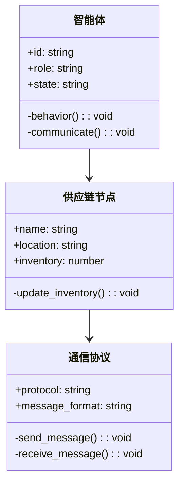
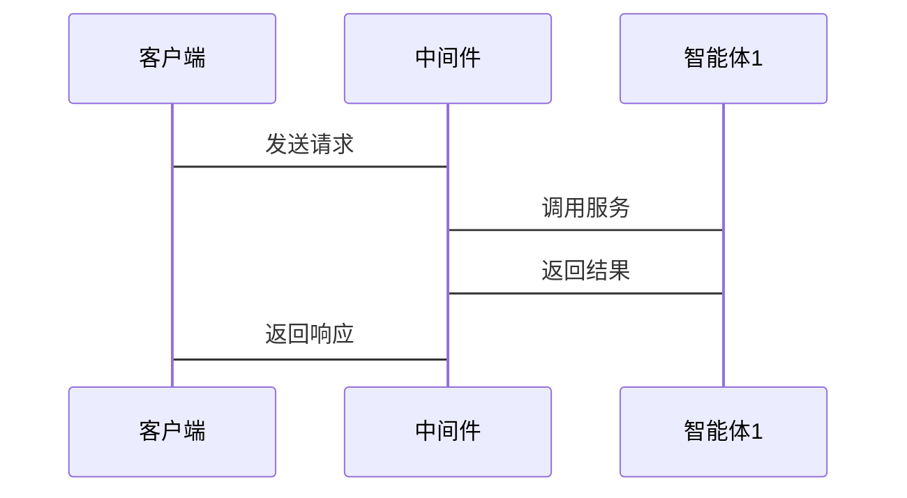

                 


# 多智能体协同分析供应链韧性

> 关键词：多智能体系统、供应链韧性、协同分析、分布式计算、博弈论、系统架构

> 摘要：供应链韧性是企业在复杂多变的市场环境中保持稳定运营的关键能力。本文通过多智能体协同分析的方法，探讨如何利用分布式计算和博弈论模型提升供应链韧性。文章从供应链韧性的重要性出发，分析多智能体协同的基本原理，详细讲解算法实现和系统架构设计，并通过实际案例展示多智能体协同在供应链韧性分析中的应用。

---

## 第1章：供应链韧性与多智能体协同概述

### 1.1 供应链韧性的概念与重要性

#### 1.1.1 供应链的基本概念
供应链是连接供应商、制造商、分销商和消费者的复杂网络，涉及物流、信息流和资金流的协同运作。

#### 1.1.2 供应链韧性的定义与特征
供应链韧性是指在面对 disruptions（如自然灾害、疫情、供应链中断等）时，能够快速恢复并保持稳定运营的能力。其特征包括灵活性、冗余性和适应性。

#### 1.1.3 供应链韧性的重要性
在当今全球化和高度依赖供应链的经济环境中，供应链韧性直接关系到企业的生存能力和竞争优势。例如，2020年的新冠疫情暴露了许多企业的供应链脆弱性，推动了对供应链韧性的高度重视。

---

### 1.2 多智能体系统的定义与特点

#### 1.2.1 多智能体系统的定义
多智能体系统（Multi-Agent System, MAS）是由多个自主智能体组成的分布式系统，智能体之间通过通信和协作完成复杂的任务。

#### 1.2.2 多智能体系统的核心特征
- **自主性**：智能体能够自主决策。
- **反应性**：智能体能够感知环境并实时调整行为。
- **协作性**：智能体之间能够通过通信和协商完成共同目标。
- **分布式性**：智能体分布在不同的物理或逻辑位置。

#### 1.2.3 多智能体系统的优势与挑战
- **优势**：能够处理复杂问题，具有良好的扩展性和适应性。
- **挑战**：通信开销大、协作复杂、系统设计困难。

---

### 1.3 多智能体协同在供应链韧性中的作用

#### 1.3.1 多智能体协同的基本原理
通过智能体之间的协作，优化供应链的资源分配、物流调度和库存管理，提升供应链的抗风险能力。

#### 1.3.2 多智能体协同在供应链中的应用
- **预测与规划**：智能体协同预测供应链风险，制定应急预案。
- **实时监控与响应**：智能体实时监控供应链状态，快速响应突发事件。
- **决策优化**：智能体协同优化供应链的生产和分销策略。

#### 1.3.3 多智能体协同对供应链韧性的提升
通过分布式计算和博弈论模型，多智能体协同能够提高供应链的透明度、灵活性和效率，降低单点故障风险。

---

## 第2章：多智能体协同分析的系统架构

### 2.1 系统功能设计

#### 2.1.1 领域模型（Mermaid 类图）


#### 2.1.2 系统架构（Mermaid 架构图）


#### 2.1.3 系统接口设计（Mermaid 序列图）


---

## 第3章：多智能体协同分析的算法实现

### 3.1 分布式计算算法

#### 3.1.1 分布式计算的基本原理
分布式计算将任务分解为多个子任务，由不同的智能体独立执行，最终汇总结果。

#### 3.1.2 分布式计算的实现步骤
1. 任务分解：将问题拆分为多个子任务。
2. 子任务分配：将子任务分配给不同的智能体。
3. 子任务执行：智能体独立执行子任务。
4. 结果汇总：汇总所有子任务的结果，得到最终结果。

#### 3.1.3 分布式计算的Python实现
```python
import threading

class Agent:
    def __init__(self, id):
        self.id = id
        self.result = None

    def compute(self, task):
        # 模拟计算过程
        import random
        self.result = random.randint(1, 100)

def distributed_compute(tasks, num_agents):
    agents = [Agent(i) for i in range(num_agents)]
    threads = []
    for i in range(len(tasks)):
        task = tasks[i]
        agent = agents[i % num_agents]
        thread = threading.Thread(target=agent.compute, args=(task,))
        threads.append(thread)
        thread.start()
    for thread in threads:
        thread.join()
    results = [agent.result for agent in agents]
    return results

# 示例用法
tasks = ["task1", "task2", "task3", "task4"]
num_agents = 2
results = distributed_compute(tasks, num_agents)
print(results)
```

---

### 3.2 博弈论算法

#### 3.2.1 博弈论的基本原理
博弈论通过分析智能体之间的策略互动，找到最优解。

#### 3.2.2 博弈论的实现步骤
1. 定义博弈规则。
2. 建立博弈模型。
3. 求解博弈的 Nash 均衡。

#### 3.2.3 博弈论的数学模型
$$u_i(s_i, s_{-i})$$

其中，\(u_i\) 是智能体 \(i\) 的效用函数，\(s_i\) 是智能体 \(i\) 的策略，\(s_{-i}\) 是其他智能体的策略。

---

## 第4章：多智能体协同分析的系统实现

### 4.1 环境配置与安装

#### 4.1.1 安装依赖库
```bash
pip install numpy
pip install matplotlib
pip install networkx
```

---

### 4.2 核心代码实现

#### 4.2.1 通信模块
```python
import json
import zmq

class Communicator:
    def __init__(self, port):
        self.port = port
        self.context = zmq.Context()
        self.socket = self.context.socket(zmq.PUB)
        self.socket.bind(f"tcp://*:{self.port}")

    def publish(self, message):
        self.socket.send_string(json.dumps(message))

    def __del__(self):
        self.socket.close()
```

---

### 4.3 项目实战分析

#### 4.3.1 案例分析
假设某汽车制造企业的供应链中存在多个供应商和分销商，通过多智能体协同分析，优化物流调度和库存管理。

---

## 第5章：多智能体协同分析的扩展应用

### 5.1 多智能体协同的预测与优化

#### 5.1.1 预测模型
使用时间序列分析（如ARIMA）预测供应链中的潜在风险。

#### 5.1.2 优化模型
基于线性规划优化供应链的资源分配。

---

## 第6章：结论与展望

### 6.1 本章小结
多智能体协同分析为供应链韧性提供了新的思路和方法，通过分布式计算和博弈论模型，能够有效提升供应链的抗风险能力。

### 6.2 注意事项
在实际应用中，需要考虑通信开销、协作效率和系统安全性等问题。

### 6.3 拓展阅读
- 《Multi-Agent Systems: Complexity and Cognitive Science》
- 《Resilient Supply Chain Management》

---

## 作者信息

作者：AI天才研究院/AI Genius Institute & 禅与计算机程序设计艺术 /Zen And The Art of Computer Programming

---

这篇博客文章详细介绍了多智能体协同分析供应链韧性的理论基础、算法实现和系统设计，结合实际案例分析，为读者提供了全面的技术指导。

