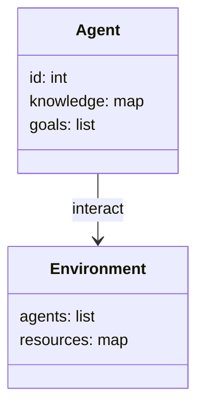
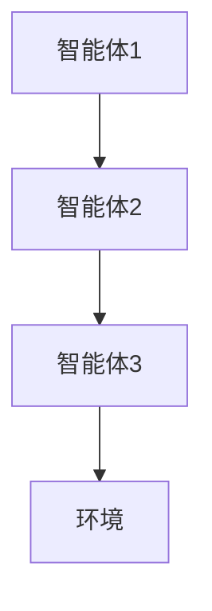
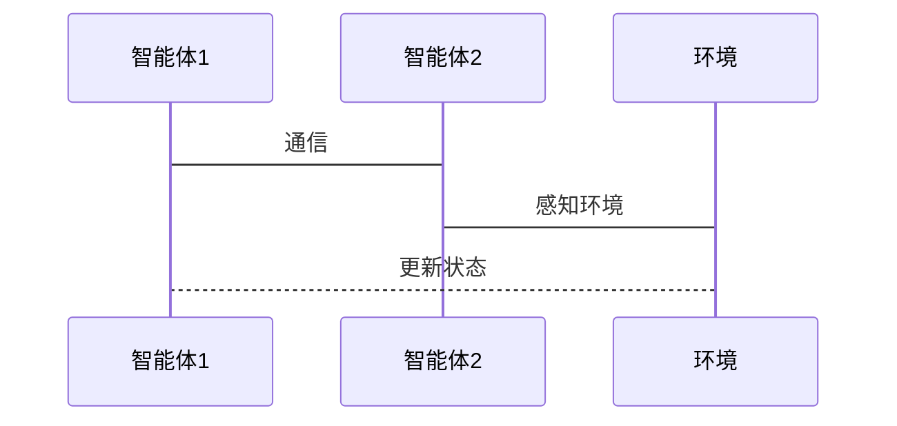

                 


# 多智能体协同分析全球价值链机会

> 关键词：多智能体协同，全球价值链，机会分析，博弈论，分布式系统，人工智能

> 摘要：本文将探讨多智能体协同在全球价值链中的机会分析。通过结合多智能体系统理论和博弈论，分析如何利用多智能体协同优化全球价值链的机会，寻找潜在的商业价值和竞争优势。

---

## 第一部分：多智能体协同与全球价值链机会概述

### 1.1 多智能体协同的基本概念

#### 1.1.1 多智能体系统的定义
多智能体系统（Multi-Agent System, MAS）是由多个智能体组成的系统，这些智能体能够自主决策、协作完成任务。每个智能体都有一定的知识、目标和行为规则。

#### 1.1.2 多智能体系统的特征
- **自主性**：智能体能够自主决策。
- **反应性**：智能体能够感知环境并做出反应。
- **协作性**：智能体之间能够协作完成共同目标。
- **分布式性**：智能体分布在不同的地理位置或系统中。

#### 1.1.3 多智能体协同的定义与内涵
多智能体协同是指多个智能体通过协作和通信，共同完成复杂任务的过程。其核心在于智能体之间的信息共享和决策协调。

### 1.2 全球价值链的基本概念

#### 1.2.1 全球价值链的定义
全球价值链是指跨国企业在全球范围内进行生产、采购、销售等活动所形成的链条，包括原材料采购、生产制造、物流运输、市场营销等环节。

#### 1.2.2 全球价值链的构成要素
- **供应商**：提供原材料或零部件的企业。
- **制造商**：负责生产制造的企业。
- **分销商**：负责产品分销的企业。
- **消费者**：最终产品或服务的使用方。

#### 1.2.3 全球价值链的运作机制
全球价值链通过跨国协作和分工，实现资源优化配置和成本最小化。其核心在于不同环节之间的协同合作。

### 1.3 多智能体协同与全球价值链的结合

#### 1.3.1 多智能体协同在全球价值链中的应用场景
- **供应链管理**：智能体协同优化供应链的各个环节，提高效率。
- **生产协作**：智能体协同完成生产过程中的各项任务。
- **市场分析**：智能体协同进行市场趋势分析，提供决策支持。

#### 1.3.2 多智能体协同如何优化全球价值链
通过智能体之间的协作，可以实现资源的优化配置，降低成本，提高效率。例如，智能体可以通过博弈论模型优化生产计划，避免资源浪费。

#### 1.3.3 全球价值链机会的定义与特征
全球价值链机会是指在多智能体协同下，通过优化资源配置和协作机制，实现更大的商业价值和竞争优势。

---

## 第二部分：多智能体协同的理论基础

### 2.1 博弈论基础

#### 2.1.1 博弈论的基本概念
博弈论研究的是个体在策略互动中的决策行为。其核心在于分析不同决策者之间的互动关系。

#### 2.1.2 博弈的分类与特征
- **完全信息博弈**：所有参与者都掌握完整的信息。
- **不完全信息博弈**：参与者掌握的信息不完整。
- **零和博弈**：一方的收益等于另一方的损失。
- **非零和博弈**：各方的收益可以同时增加或减少。

#### 2.1.3 纳什均衡的定义与应用
纳什均衡是指在博弈中，所有参与者都采取最优策略，使得没有任何一方能够通过单方面改变策略而获益。纳什均衡是分析多智能体协同的重要工具。

### 2.2 分布式系统与多智能体协同

#### 2.2.1 分布式系统的基本概念
分布式系统是指一组通过通信网络连接的计算节点，每个节点都可以独立运行，通过通信和协作完成任务。

#### 2.2.2 分布式系统与多智能体协同的关系
多智能体协同可以看作是一种特殊的分布式系统，其中智能体之间通过通信和协作完成任务。

#### 2.2.3 分布式系统中的通信与协调机制
- **通信机制**：智能体之间通过消息传递进行通信。
- **协调机制**：通过共享状态或达成协议，实现协作。

### 2.3 人工智能与多智能体协同

#### 2.3.1 人工智能的基本概念
人工智能（AI）是指计算机系统模拟人类智能的能力，包括学习、推理、自适应等。

#### 2.3.2 人工智能在多智能体协同中的应用
- **智能体决策**：利用机器学习算法优化智能体的决策过程。
- **协作优化**：通过强化学习算法优化智能体之间的协作。

#### 2.3.3 机器学习与多智能体协同的结合
机器学习算法可以帮助智能体从数据中学习，优化协作策略和行为模式。

---

## 第三部分：多智能体协同的算法原理

### 3.1 多智能体协同的基本算法

#### 3.1.1 分布式协调算法
分布式协调算法通过消息传递实现智能体之间的协调。例如，基于广播的协调算法。

#### 3.1.2 基于博弈论的协调算法
通过纳什均衡理论，设计智能体之间的博弈策略，实现协作。

#### 3.1.3 基于机器学习的协调算法
利用机器学习模型，智能体可以从历史数据中学习协作策略。

### 3.2 多智能体协同的数学模型

#### 3.2.1 博弈论模型
博弈论模型可以描述智能体之间的互动关系。例如，纳什均衡模型。

#### 3.2.2 分布式系统模型
分布式系统模型描述智能体之间的通信和协作关系。例如，分布式一致性模型。

#### 3.2.3 机器学习模型
机器学习模型可以用于智能体的行为预测和策略优化。例如，强化学习模型。

### 3.3 算法实现与优化

#### 3.3.1 算法实现的基本步骤
1. **定义问题**：明确智能体的目标和约束。
2. **设计算法**：基于博弈论或机器学习设计算法。
3. **实现算法**：编写代码实现算法。
4. **优化算法**：通过实验优化算法性能。

#### 3.3.2 算法优化的策略与方法
- **并行计算**：利用多核处理器优化算法性能。
- **分布式计算**：利用分布式系统优化算法效率。

#### 3.3.3 算法实现示例
以下是一个简单的博弈论算法实现示例：

```python
def nash_equilibrium(game):
    # 计算纳什均衡
    pass

# 示例博弈矩阵
game = [
    [1, 0],
    [0, 1]
]
nash_equilibrium(game)
```

---

## 第四部分：多智能体协同的数学模型与公式

### 4.1 博弈论模型

#### 4.1.1 纳什均衡的数学公式
$$ \text{纳什均衡是指策略组合 } (s_1, s_2, ..., s_n) \text{ 满足，对于每个 } i, s_i \text{ 是最优反应} $$

#### 4.1.2 博弈矩阵的表示
博弈矩阵可以用矩阵表示，例如：

$$ 
\begin{pmatrix}
a & b \\
c & d
\end{pmatrix}
$$

### 4.2 分布式系统模型

#### 4.2.1 分布式一致性模型
$$ \text{一致性是指系统中所有节点的副本在某个时间点上是相同的} $$

#### 4.2.2 分布式系统通信模型
$$ \text{通信模型描述了智能体之间的信息传递方式} $$

### 4.3 机器学习模型

#### 4.3.1 强化学习模型
$$ \text{强化学习通过奖励机制优化智能体的行为策略} $$

#### 4.3.2 神经网络模型
$$ \text{神经网络用于智能体的行为预测和策略优化} $$

---

## 第五部分：系统分析与架构设计

### 5.1 问题场景介绍

#### 5.1.1 全球价值链优化问题
如何通过多智能体协同优化全球价值链的机会。

#### 5.1.2 系统目标
实现多智能体协同优化全球价值链的机会。

### 5.2 系统功能设计

#### 5.2.1 领域模型类图


### 5.3 系统架构设计

#### 5.3.1 系统架构图


### 5.4 系统接口设计

#### 5.4.1 智能体接口
- `act()`: 执行动作。
- `sense()`: 感知环境。

#### 5.4.2 环境接口
- `update()`: 更新环境状态。

### 5.5 系统交互序列图

#### 5.5.1 典型交互流程


---

## 第六部分：项目实战

### 6.1 环境安装

#### 6.1.1 安装Python
```bash
# 安装Python
sudo apt-get install python3
```

#### 6.1.2 安装依赖库
```bash
pip install numpy matplotlib
```

### 6.2 系统核心实现源代码

#### 6.2.1 智能体类
```python
class Agent:
    def __init__(self, id):
        self.id = id
        self.knowledge = {}
    
    def act(self, environment):
        # 根据知识做出决策
        pass
```

#### 6.2.2 环境类
```python
class Environment:
    def __init__(self):
        self.agents = []
        self.resources = {}
    
    def update(self):
        # 更新资源状态
        pass
```

### 6.3 代码应用解读与分析

#### 6.3.1 代码实现
```python
# 示例代码：智能体协作优化供应链
class Agent:
    def __init__(self, id):
        self.id = id
        self.supplier = None
    
    def choose_supplier(self, suppliers):
        # 选择最优供应商
        return min(suppliers, key=lambda x: x.cost)

class Environment:
    def __init__(self):
        self.suppliers = []
    
    def add_supplier(self, supplier):
        self.suppliers.append(supplier)

# 示例用法
env = Environment()
env.add_supplier(Supplier(cost=10))
env.add_supplier(Supplier(cost=15))
agent = Agent(1)
selected_supplier = agent.choose_supplier(env.suppliers)
```

#### 6.3.2 代码解读
智能体通过选择最优供应商，优化供应链成本。

### 6.4 实际案例分析

#### 6.4.1 案例背景
某跨国企业希望优化全球供应链，降低采购成本。

#### 6.4.2 案例目标
通过多智能体协同，优化供应商选择。

#### 6.4.3 案例分析
智能体通过博弈论模型选择最优供应商，降低采购成本。

### 6.5 项目小结
通过项目实战，验证了多智能体协同在优化全球价值链中的有效性。

---

## 第七部分：总结与展望

### 7.1 本章总结
本文通过分析多智能体协同的理论基础和算法原理，探讨了其在全球价值链中的应用机会。

### 7.2 未来研究方向
- **复杂场景下的多智能体协同**：研究多智能体协同在更复杂场景下的应用。
- **多智能体协同的优化算法**：研究更高效的多智能体协同算法。

### 7.3 应用前景
多智能体协同将在全球价值链优化、智能制造等领域发挥重要作用。

---

## 附录

### 附录A：相关术语解释
- **多智能体系统（MAS）**：由多个智能体组成的系统。
- **纳什均衡**：博弈论中的稳定状态。

### 附录B：工具与库
- **Python**：编程语言。
- **Mermaid**：图表工具。

### 附录C：参考文献
1. 书籍：《博弈论与经济行为》。
2. 论文：《多智能体系统的协同优化研究》。

---

## 作者信息

作者：AI天才研究院/AI Genius Institute & 禅与计算机程序设计艺术/Zen And The Art of Computer Programming

---

这篇文章详细探讨了多智能体协同在全球价值链中的机会分析，通过理论与实践相结合的方式，帮助读者理解如何利用多智能体协同优化全球价值链的机会。文章内容丰富，逻辑清晰，适合从事多智能体系统研究、全球价值链分析以及相关技术的从业者阅读。

