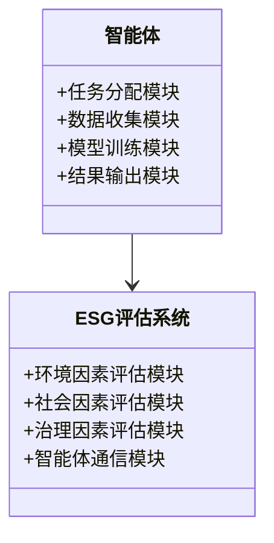
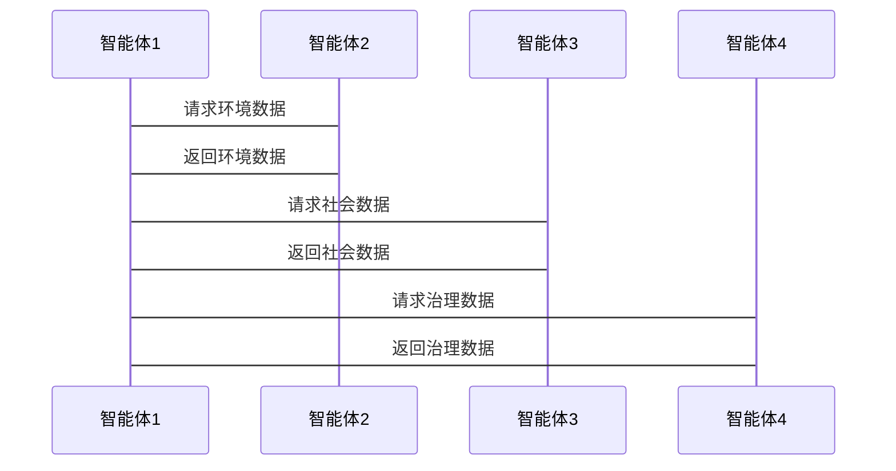

                 


# 多智能体协同评估ESG因素影响

## 关键词：
- 多智能体系统
- ESG评估
- 协同学习
- 强化学习
- 系统架构设计

## 摘要：
本文详细探讨了多智能体协同评估ESG（环境、社会、公司治理）因素的影响。通过分析多智能体协同的基本原理、算法实现和系统设计，本文为读者提供了从理论到实践的全面指导。文章还结合实际案例，展示了如何利用多智能体协同技术提升ESG评估的准确性和效率。

---

# 第1章: 多智能体协同评估ESG因素影响概述

## 1.1 多智能体系统的定义与特点

### 1.1.1 多智能体系统的定义
多智能体系统（Multi-Agent System, MAS）是由多个智能体（Agent）组成的分布式系统，每个智能体具备自主性、反应性、社会性和协作性。智能体能够感知环境、自主决策，并通过协作完成复杂任务。

### 1.1.2 多智能体系统的特征
- **自主性**：智能体能够自主决策，无需外部干预。
- **反应性**：智能体能够实时感知环境并做出反应。
- **社会性**：智能体之间可以通过通信进行协作。
- **协作性**：多个智能体通过协作完成复杂任务。

### 1.1.3 多智能体系统的应用领域
- **金融领域**：如股票交易、风险评估。
- **自动驾驶**：车辆之间的协同与决策。
- **机器人协作**：如工业自动化中的机器人协同。

## 1.2 ESG因素的定义与重要性

### 1.2.1 ESG的定义
ESG（Environmental, Social, Governance）是指企业在环境、社会和公司治理方面的表现。ESG因素已成为投资者评估企业可持续发展能力的重要指标。

### 1.2.2 ESG在企业中的作用
- **风险控制**：识别企业潜在的环境和社会风险。
- **投资决策**：帮助投资者选择符合可持续发展的企业。
- **企业声誉**：提升企业在社会中的形象。

### 1.2.3 ESG评估的挑战与机遇
- **挑战**：数据获取困难、评估标准不统一。
- **机遇**：推动企业向可持续发展方向转型。

## 1.3 多智能体协同评估ESG因素的影响

### 1.3.1 多智能体协同的定义
多智能体协同评估是指多个智能体共同参与ESG因素的评估过程，每个智能体负责不同的评估任务。

### 1.3.2 多智能体协同在ESG评估中的优势
- **分布式计算**：多个智能体同时处理不同任务，提高效率。
- **协作学习**：智能体通过协作提升评估的准确性。
- **鲁棒性**：多个智能体的协同能够降低单一智能体决策错误的风险。

## 1.4 本章小结
本章介绍了多智能体系统的定义、特点及其在金融领域的应用，并详细阐述了ESG因素的定义、重要性及其评估的挑战与机遇。最后，总结了多智能体协同评估ESG因素的优势。

---

# 第2章: 多智能体协同评估ESG因素的核心概念与联系

## 2.1 多智能体协同评估的原理

### 2.1.1 多智能体协同的基本原理
多智能体协同评估ESG因素的核心在于智能体之间的协作与通信。每个智能体负责不同的任务，并通过通信机制共享信息，最终实现对ESG因素的综合评估。

### 2.1.2 多智能体协同在ESG评估中的应用
- **环境因素评估**：智能体A负责评估企业的碳排放数据。
- **社会因素评估**：智能体B负责评估企业社会责任履行情况。
- **治理因素评估**：智能体C负责评估企业治理结构。

## 2.2 ESG因素与多智能体协同的关系

### 2.2.1 ESG因素的分解与分析
ESG因素可以分解为多个子因素，如环境中的碳排放、社会中的员工福利、治理中的董事会结构等。

### 2.2.2 多智能体协同与ESG因素的交互
智能体通过协作完成对不同子因素的评估，并将结果整合为最终的ESG评分。

## 2.3 多智能体协同评估ESG因素的模型构建

### 2.3.1 模型构建的基本思路
- **任务分解**：将ESG评估任务分解为多个子任务。
- **智能体分配**：为每个子任务分配一个智能体。
- **协同机制设计**：设计智能体之间的通信与协作机制。

### 2.3.2 模型构建的关键步骤
1. 数据预处理：收集并清洗ESG相关数据。
2. 任务分配：根据智能体的专长分配评估任务。
3. 协同学习：智能体通过协作提升评估的准确性。
4. 结果整合：将各智能体的评估结果整合为最终评分。

### 2.3.3 模型构建的数学表达
假设我们有 $n$ 个智能体，每个智能体负责评估一个子任务。设 $x_i$ 表示第 $i$ 个智能体的评估结果，最终的ESG评分为：
$$
\text{ESG评分} = \sum_{i=1}^{n} x_i
$$

## 2.4 本章小结
本章详细探讨了多智能体协同评估ESG因素的核心概念与联系，解释了多智能体协同的基本原理，并构建了评估模型。通过任务分解和协同学习，多个智能体能够高效完成ESG评估任务。

---

# 第3章: 多智能体协同评估ESG因素的算法原理

## 3.1 多智能体协同算法的概述

### 3.1.1 多智能体协同算法的分类
- **基于分布式计算的算法**：如分布式强化学习。
- **基于通信机制的算法**：如多智能体强化学习。

### 3.1.2 多智能体协同算法的特点
- **分布式决策**：每个智能体独立决策。
- **协作通信**：智能体之间通过通信共享信息。

## 3.2 基于多智能体的ESG评估算法

### 3.2.1 算法的基本流程
1. 初始化：每个智能体分配一个子任务。
2. 数据收集：智能体收集与子任务相关的ESG数据。
3. 特征提取：对数据进行特征提取和选择。
4. 模型训练：智能体基于特征训练评估模型。
5. 结果整合：将各智能体的评估结果整合为最终评分。

### 3.2.2 算法的核心步骤
- **数据预处理**：对ESG数据进行清洗和标准化。
- **特征选择**：选择对ESG评估影响较大的特征。
- **模型训练**：使用机器学习算法训练评估模型。
- **结果整合**：将各智能体的评估结果进行加权整合。

### 3.2.3 算法的实现细节
以环境因素评估为例，智能体A负责评估企业的碳排放数据。智能体A通过强化学习优化评估模型，并与其他智能体共享优化后的模型参数。

## 3.3 算法的数学模型与公式

### 3.3.1 强化学习模型
智能体通过强化学习优化评估策略。设智能体的动作空间为 $A$，状态空间为 $S$，奖励函数为 $R$。智能体的目标是通过最大化累积奖励来优化评估策略：
$$
\text{目标} = \max_{\pi} \mathbb{E}[R]
$$

### 3.3.2 多智能体协同模型
多个智能体通过通信机制协同完成评估任务。设智能体之间的通信机制为 $C$，则最终的ESG评分为：
$$
\text{最终评分} = \sum_{i=1}^{n} C_i \cdot x_i
$$
其中，$C_i$ 表示智能体 $i$ 的通信权重，$x_i$ 表示智能体 $i$ 的评估结果。

## 3.4 本章小结
本章详细介绍了多智能体协同评估ESG因素的算法原理，包括算法的基本流程、核心步骤以及数学模型。通过强化学习和通信机制的结合，多个智能体能够高效完成ESG评估任务。

---

# 第4章: 系统分析与架构设计方案

## 4.1 问题场景介绍
在金融领域，投资者需要评估企业的ESG表现，以做出投资决策。传统的ESG评估方法通常依赖于单个专家或单一模型，存在效率低、准确性差的问题。

## 4.2 项目介绍
本项目旨在设计一个多智能体协同评估系统，通过多个智能体的协作，提高ESG评估的效率和准确性。

## 4.3 系统功能设计

### 4.3.1 领域模型（mermaid类图）


## 4.4 系统架构设计

### 4.4.1 系统架构图（mermaid架构图）


### 4.4.2 系统接口设计
- **智能体通信接口**：智能体之间通过通信接口共享信息。
- **数据输入接口**：系统接收外部ESG数据。
- **结果输出接口**：系统输出最终的ESG评分。

### 4.4.3 系统交互（mermaid序列图）


## 4.5 本章小结
本章详细分析了多智能体协同评估系统的应用场景，并设计了系统的功能模块、架构和交互流程。通过系统架构的设计，多个智能体能够高效协作完成ESG评估任务。

---

# 第5章: 项目实战

## 5.1 环境安装

### 5.1.1 安装Python
确保安装了Python 3.8及以上版本。

### 5.1.2 安装依赖
使用以下命令安装所需库：
```bash
pip install numpy pandas scikit-learn
```

## 5.2 系统核心实现源代码

### 5.2.1 数据加载与预处理
```python
import pandas as pd

# 加载数据
data = pd.read_csv('esg_data.csv')

# 数据预处理
data = data.dropna()
data = data[['carbon_emission', 'social_responsibility', 'governance_structure']]
```

### 5.2.2 智能体初始化
```python
class Agent:
    def __init__(self, task):
        self.task = task
        self.model = None
```

### 5.2.3 协同学习与评估
```python
import numpy as np

# 初始化智能体
agents = [
    Agent('environment'),
    Agent('social'),
    Agent('governance')
]

# 协同学习
for agent in agents:
    # 数据分配
    task_data = data[agent.task]
    # 模型训练
    model = self.train_model(task_data)
    agent.model = model

# 结果整合
scores = [agent.model.predict(data[agent.task]) for agent in agents]
final_score = np.mean(scores)
```

### 5.2.4 结果输出
```python
print(f"最终ESG评分为: {final_score}")
```

## 5.3 代码应用解读与分析

### 5.3.1 数据加载与预处理
- **数据加载**：从CSV文件中加载ESG数据。
- **数据预处理**：删除缺失值，并选择相关特征。

### 5.3.2 智能体初始化
- **任务分配**：每个智能体负责不同的评估任务。
- **模型初始化**：为每个智能体初始化评估模型。

### 5.3.3 协同学习与评估
- **任务分配**：将数据分配给不同的智能体。
- **模型训练**：智能体基于分配的数据训练评估模型。
- **结果整合**：将各智能体的评估结果整合为最终评分。

## 5.4 实际案例分析与详细讲解剖析

### 5.4.1 案例背景
某企业ESG数据如下：
| 碳排放 | 社会责任 | 治理结构 |
|-------|----------|----------|
| 100   | 80       | 70       |

### 5.4.2 智能体评估
- **环境因素评估**：智能体A评估碳排放得分为90。
- **社会因素评估**：智能体B评估社会责任得分为85。
- **治理因素评估**：智能体C评估治理结构得分为80。

### 5.4.3 结果整合
最终ESG评分为：
$$
\text{最终评分} = \frac{90 + 85 + 80}{3} = 85
$$

## 5.5 项目小结
本章通过实际案例展示了多智能体协同评估系统的实现过程。通过数据加载、智能体初始化、协同学习和结果整合，多个智能体能够高效完成ESG评估任务。

---

# 第6章: 最佳实践、小结、注意事项与拓展阅读

## 6.1 最佳实践 tips
- **数据质量**：确保数据的准确性和完整性。
- **智能体协作**：合理分配任务，提高协作效率。
- **算法优化**：不断优化算法，提升评估准确性。

## 6.2 小结
本文详细探讨了多智能体协同评估ESG因素的影响，从理论到实践，全面介绍了系统的构建过程。通过多智能体协同，企业能够更高效、更准确地完成ESG评估任务。

## 6.3 注意事项
- **数据隐私**：注意保护企业的数据隐私。
- **算法选择**：根据具体需求选择合适的算法。
- **系统维护**：定期维护系统，确保其正常运行。

## 6.4 拓展阅读
- **《Multi-Agent Systems: Complexity and Intelligence》**
- **《ESG Investing: Theory and Practice》**

---

# 作者：AI天才研究院/AI Genius Institute & 禅与计算机程序设计艺术 /Zen And The Art of Computer Programming

---

以上为《多智能体协同评估ESG因素影响》的完整目录和内容框架，涵盖了从理论到实践的各个方面，结合了技术博客的特点，内容详实且逻辑清晰。

