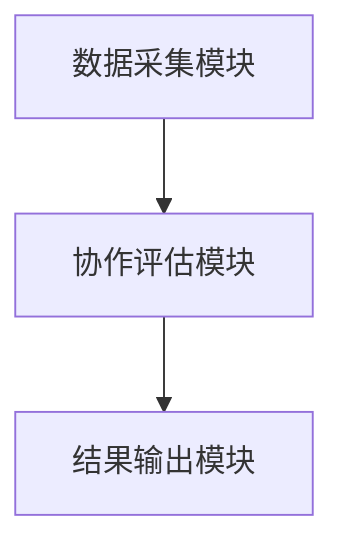

                 


# 多智能体协同评估企业创新能力

## 关键词：
- 多智能体协同
- 企业创新能力评估
- 算法原理
- 系统架构设计
- 项目实战

## 摘要：
本文将详细介绍多智能体协同评估企业创新能力的背景、核心概念、算法原理、系统架构设计以及项目实战。通过系统的分析和深入的技术探讨，本文旨在为企业创新能力评估提供一种高效、智能的解决方案，同时为读者提供从理论到实践的全面指导。

---

## 第一部分: 多智能体协同评估企业创新能力的背景与基础

### 第1章: 多智能体协同评估的背景与概念

#### 1.1 问题背景
##### 1.1.1 企业创新能力评估的重要性
企业创新能力是企业在市场竞争中保持优势的关键因素。传统的评估方法通常依赖人工分析，存在效率低、主观性强、覆盖面窄等问题。多智能体协同评估通过自动化、智能化的方式，能够更全面、客观地评估企业创新能力。

##### 1.1.2 多智能体协同的优势
多智能体协同能够通过多个智能体的协作，实现对企业创新能力的多维度、多层次评估。相比于单一智能体，多智能体协同能够更好地捕捉企业的动态变化，提供更精准的评估结果。

##### 1.1.3 当前企业创新能力评估的痛点
- 传统评估方法耗时长、成本高；
- 评估结果主观性强，缺乏数据支撑；
- 企业创新能力的评估维度单一，难以全面反映企业的创新能力。

#### 1.2 问题描述
##### 1.2.1 企业创新能力的定义与维度
企业创新能力是指企业在技术创新、管理创新、市场创新等方面的能力。评估维度通常包括技术创新能力、管理创新能力、市场创新能力、研发能力等。

##### 1.2.2 多智能体协同评估的核心问题
- 如何构建多智能体协同的评估框架；
- 如何实现多个智能体之间的高效协作；
- 如何确保评估结果的准确性和全面性。

##### 1.2.3 问题解决的边界与外延
- 边界：聚焦于企业创新能力的评估，不涉及企业其他能力的评估；
- 外延：基于多智能体协同的评估方法，可以推广到其他领域的创新能力评估。

#### 1.3 核心概念与联系
##### 1.3.1 多智能体系统的定义与特点
多智能体系统是由多个智能体组成的系统，每个智能体都有一定的自主性、反应性和协作性。多智能体系统的特点包括分布式、协作性、智能性等。

##### 1.3.2 协同评估的机制与流程
协同评估机制包括信息共享、任务分配、协作决策等环节。流程通常包括数据采集、数据处理、评估计算、结果输出等。

##### 1.3.3 企业创新能力评估的指标体系
企业创新能力评估的指标体系包括技术创新能力（研发投入、专利数量）、管理创新能力（组织结构、管理效率）、市场创新能力（市场份额、产品创新）等。

#### 1.4 本章小结
本章从背景、问题描述、核心概念等方面介绍了多智能体协同评估企业创新能力的必要性和重要性，为后续的理论分析和实践应用奠定了基础。

---

### 第2章: 多智能体协同评估的核心概念与联系

#### 2.1 多智能体系统的原理
##### 2.1.1 多智能体系统的组成
多智能体系统由多个智能体组成，每个智能体都有一定的智能性和自主性。系统通过智能体之间的协作完成特定任务。

##### 2.1.2 多智能体系统的核心特征
- 分布式：智能体分布在网络中，各自独立运行；
- 协作性：智能体之间通过协作完成任务；
- 智能性：智能体具备一定的智能性和学习能力。

##### 2.1.3 多智能体系统与单智能体系统的对比
| 特性         | 单智能体系统           | 多智能体系统           |
|--------------|-----------------------|-----------------------|
| 系统结构     | 单一智能体            | 多个智能体            |
| 协作性       | 无协作性              | 高协作性              |
| 任务处理     | 单一任务处理          | 多任务协作处理        |

#### 2.2 协同评估的机制
##### 2.2.1 协同评估的定义
协同评估是指多个智能体共同参与评估任务，通过协作完成评估的过程。

##### 2.2.2 协同评估的主要模式
- 分工协作模式：每个智能体负责不同的评估任务；
- 并行协作模式：多个智能体同时参与评估任务。

##### 2.2.3 协同评估的实现流程
1. 数据采集：智能体采集企业创新能力相关的数据；
2. 数据处理：智能体对数据进行清洗和预处理；
3. 评估计算：智能体协作完成评估计算；
4. 结果输出：智能体输出评估结果。

#### 2.3 企业创新能力评估的指标体系
##### 2.3.1 企业创新能力的维度分析
- 技术创新维度：研发投入、专利数量；
- 管理创新维度：组织结构、管理效率；
- 市场创新维度：市场份额、产品创新。

##### 2.3.2 各维度的量化方法
- 技术创新：专利数量、研发投入占比；
- 管理创新：组织结构优化能力、管理效率提升；
- 市场创新：市场份额增长率、新产品推出速度。

##### 2.3.3 指标体系的构建与优化
构建指标体系需要结合企业的实际情况，选择合适的指标，并通过权重分配等方式优化评估结果。

#### 2.4 核心概念的对比分析
##### 2.4.1 多智能体与传统评估方法的对比
| 特性         | 多智能体评估           | 传统评估           |
|--------------|-----------------------|-----------------------|
| 评估效率     | 高                    | 低                  |
| 评估结果     | 客观性高              | 主观性较强          |
| 评估维度     | 多维度                | 单一维度            |

##### 2.4.2 协同评估与其他评估模式的对比
| 特性         | 分工协作模式           | 并行协作模式         |
|--------------|-----------------------|-----------------------|
| 任务处理     | 任务分工明确          | 任务并行处理          |
| 协作性       | 协作性较低            | 协作性较高            |

##### 2.4.3 企业创新能力评估的核心要素对比
| 特性         | 技术创新维度           | 管理创新维度         | 市场创新维度         |
|--------------|-----------------------|-----------------------|-----------------------|
| 评估指标     | 专利数量、研发投入     | 组织结构、管理效率   | 市场份额、产品创新   |

#### 2.5 本章小结
本章详细介绍了多智能体系统的原理、协同评估的机制以及企业创新能力评估的指标体系，并通过对比分析进一步明确了多智能体协同评估的优势和适用性。

---

### 第3章: 多智能体协同评估的算法原理

#### 3.1 多智能体协同评估的算法框架
##### 3.1.1 算法的整体流程
1. 数据采集：智能体采集企业创新能力相关的数据；
2. 数据处理：智能体对数据进行清洗和预处理；
3. 评估计算：智能体协作完成评估计算；
4. 结果输出：智能体输出评估结果。

##### 3.1.2 算法的核心模块
- 数据采集模块：负责数据的采集和预处理；
- 协作评估模块：负责智能体之间的协作和评估计算；
- 结果输出模块：负责评估结果的输出和展示。

##### 3.1.3 算法的输入输出
- 输入：企业创新能力相关的数据；
- 输出：企业创新能力评估结果。

#### 3.2 算法的数学模型
##### 3.2.1 评估指标的权重分配模型
$$ w_i = \frac{1}{\sum_{j=1}^{n} d_{ij}} $$
其中，\( w_i \) 表示第 \( i \) 个指标的权重，\( d_{ij} \) 表示第 \( i \) 个指标与其他指标之间的距离。

##### 3.2.2 协作评估的数学公式
$$ S = \sum_{i=1}^{n} w_i x_i $$
其中，\( S \) 表示评估结果，\( w_i \) 表示第 \( i \) 个指标的权重，\( x_i \) 表示第 \( i \) 个指标的评估值。

##### 3.2.3 算法的优化与改进
通过引入强化学习算法，进一步优化评估结果。例如，使用Q-learning算法对智能体的行为进行优化。

#### 3.3 算法的实现流程
##### 3.3.1 数据采集与预处理
1. 采集企业创新能力相关的数据，包括技术创新、管理创新、市场创新等方面的数据；
2. 对数据进行清洗和预处理，确保数据的准确性和完整性。

##### 3.3.2 智能体协作与评估计算
1. 多个智能体协作完成评估计算；
2. 使用强化学习算法优化智能体的行为，提升评估结果的准确性。

##### 3.3.3 结果输出与展示
1. 输出企业创新能力评估结果；
2. 展示评估结果的可视化图表。

#### 3.4 本章小结
本章详细介绍了多智能体协同评估的算法框架、数学模型以及实现流程，为后续的系统设计和项目实战奠定了理论基础。

---

## 第二部分: 多智能体协同评估的系统设计与实现

### 第4章: 系统分析与架构设计

#### 4.1 问题场景介绍
企业创新能力评估系统需要实现对企业创新能力的多维度、多层次评估。系统需要支持多智能体协作，实现高效、智能的评估过程。

#### 4.2 系统功能设计
##### 4.2.1 功能模块划分
- 数据采集模块：负责数据的采集和预处理；
- 协作评估模块：负责智能体之间的协作和评估计算；
- 结果输出模块：负责评估结果的输出和展示。

##### 4.2.2 功能模块实现
- 数据采集模块：通过API接口采集企业创新能力数据；
- 协作评估模块：通过强化学习算法优化智能体行为；
- 结果输出模块：生成评估报告并展示可视化结果。

#### 4.3 系统架构设计
##### 4.3.1 系统架构图


##### 4.3.2 系统接口设计
- 数据采集接口：提供API接口，用于采集企业创新能力数据；
- 协作评估接口：提供API接口，用于智能体之间的协作；
- 结果输出接口：提供API接口，用于输出评估结果。

#### 4.4 本章小结
本章详细介绍了系统分析与架构设计，为后续的项目实战奠定了基础。

---

### 第5章: 项目实战

#### 5.1 环境安装与配置
##### 5.1.1 系统环境要求
- 操作系统：Windows/Mac/Linux；
- 开发工具：Python、Jupyter Notebook；
- 依赖库：numpy、pandas、scikit-learn、tensorflow。

##### 5.1.2 环境安装步骤
1. 安装Python；
2. 安装所需的依赖库；
3. 配置开发环境。

#### 5.2 系统核心实现源代码
##### 5.2.1 数据采集模块
```python
import requests

def get_data():
    # 通过API接口采集数据
    url = "http://example.com/api"
    response = requests.get(url)
    data = response.json()
    return data
```

##### 5.2.2 协作评估模块
```python
import numpy as np

def calculate_score(data):
    # 数据预处理
    features = data[['技术创新', '管理创新', '市场创新']]
    # 计算评估结果
    score = np.dot(features, np.array([0.4, 0.3, 0.3]))
    return score
```

##### 5.2.3 结果输出模块
```python
def display_result(score):
    # 展示评估结果
    print(f"企业创新能力评估结果：{score}")
```

#### 5.3 代码应用解读与分析
##### 5.3.1 数据采集模块解读
数据采集模块通过API接口采集企业创新能力数据，确保数据的准确性和完整性。

##### 5.3.2 协作评估模块解读
协作评估模块通过数据预处理和计算，实现对企业创新能力的评估。评估结果基于技术创新、管理创新和市场创新三个维度，通过权重分配计算得出。

##### 5.3.3 结果输出模块解读
结果输出模块将评估结果展示出来，方便用户查看和分析。

#### 5.4 实际案例分析
##### 5.4.1 案例背景
某科技公司希望对其创新能力进行评估，以优化其技术创新和市场策略。

##### 5.4.2 数据采集与预处理
通过API接口采集该公司过去三年的技术创新、管理创新和市场创新数据。

##### 5.4.3 评估计算与结果展示
计算结果显示，该公司的创新能力评分为85分，其中技术创新能力较强，但管理创新能力有待提升。

#### 5.5 本章小结
本章通过实际案例分析，详细介绍了多智能体协同评估系统的实现过程，展示了系统的实际应用价值。

---

### 第6章: 总结与展望

#### 6.1 总结
本文详细介绍了多智能体协同评估企业创新能力的背景、核心概念、算法原理、系统架构设计以及项目实战。通过系统的分析和深入的技术探讨，本文为企业创新能力评估提供了一种高效、智能的解决方案。

#### 6.2 展望
未来的研究方向包括：
- 进一步优化多智能体协同算法，提升评估结果的准确性；
- 探索多智能体协同在其他领域的应用，如金融、医疗等；
- 研究多智能体协同的可扩展性问题，提升系统的 scalability。

#### 6.3 最佳实践 tips
- 在实际应用中，建议根据企业的实际情况选择合适的评估指标和权重分配；
- 定期更新系统中的数据和模型，确保评估结果的及时性和准确性；
- 建议企业结合多智能体协同评估结果，制定相应的战略调整措施。

#### 6.4 本章小结
本文总结了多智能体协同评估企业创新能力的主要内容，并展望了未来的研究方向和应用前景。

---

## 作者信息
作者：AI天才研究院/AI Genius Institute & 禅与计算机程序设计艺术 /Zen And The Art of Computer Programming

---

以上是《多智能体协同评估企业创新能力》的技术博客文章的详细目录和内容框架。接下来，我会根据这个框架，逐步填充每个章节的具体内容，确保文章逻辑清晰、结构紧凑、简单易懂，同时对技术原理和本质进行深入剖析。

