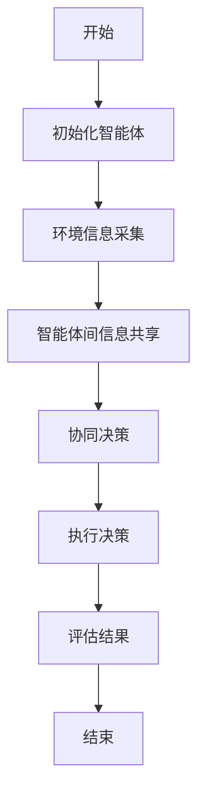

                 


# 《多智能体协同评估监管环境变化》

---

## 关键词：  
多智能体协同、监管环境变化、算法原理、系统架构、项目实战、数学模型

---

## 摘要：  
多智能体协同是解决复杂动态环境问题的重要技术，尤其在监管环境变化评估中具有广泛应用。本文从多智能体协同的基本概念出发，结合监管环境变化的特征，详细阐述了多智能体协同评估的算法原理、数学模型、系统架构及实际应用。通过案例分析和项目实战，深入探讨了多智能体协同在监管环境变化评估中的实现方法，并总结了相关经验与最佳实践。

---

## 第一部分：多智能体协同评估的背景与概念

### 第1章：多智能体协同评估的背景介绍

#### 1.1 问题背景与问题描述  
- **多智能体协同的基本概念**：多智能体系统是由多个智能体组成的分布式系统，每个智能体具有自主性、反应性和社会性。  
- **监管环境变化的复杂性**：监管环境涉及政策、市场、技术等多个维度的变化，具有动态性、不确定性和复杂性。  
- **多智能体协同在监管环境中的应用价值**：通过多智能体协同，可以实现对监管环境变化的实时感知、预测和应对，提高监管效率和准确性。  

#### 1.2 多智能体协同评估的核心要素  
- **多智能体协同的基本属性**：自主性、反应性、分布式性、协作性。  
- **监管环境变化的核心要素**：政策变化、市场波动、技术更新、用户行为变化。  
- **多智能体协同与监管环境变化的关联性**：通过信息共享和协同决策，多智能体能够更好地适应环境变化。  

#### 1.3 问题解决与边界分析  
- **多智能体协同评估的解决方案**：基于分布式计算和协同决策的技术方案。  
- **问题解决的边界与外延**：限定在监管环境中的特定场景，不涉及其他领域的问题。  
- **核心概念的结构与组成**：多智能体协同、环境变化、协同决策三者构成一个有机整体。  

### 第2章：多智能体协同评估的核心概念与联系

#### 2.1 多智能体协同的原理与机制  
- **分布式计算与多智能体协同**：通过分布式计算实现多智能体之间的信息共享与协同。  
- **协同决策与信息共享**：智能体通过信息共享和协商达成一致的决策。  
- **多智能体间的博弈与均衡**：在竞争与合作中寻找均衡点，实现全局最优。  

#### 2.2 监管环境变化的特征分析  
- **环境变化的动态性**：环境变化具有实时性和连续性。  
- **环境变化的不确定性**：环境变化受到多种不可预测因素的影响。  
- **环境变化的复杂性**：环境变化涉及多个维度和多个因素的综合作用。  

#### 2.3 多智能体协同与监管环境变化的关系  
- **多智能体协同对环境变化的适应性**：通过动态调整协同策略，快速响应环境变化。  
- **环境变化对多智能体协同的影响**：环境变化的不确定性要求智能体具有更强的自适应能力。  
- **多智能体协同在环境变化中的角色**：通过协同决策，多智能体能够更好地应对环境变化带来的挑战。  

### 第3章：多智能体协同评估的算法原理

#### 3.1 多智能体协同算法的流程图  


#### 3.2 算法实现的Python代码示例  
```python
class Agent:
    def __init__(self, id):
        self.id = id
        self.state = None
    def receive_info(self, info):
        self.state = info

def main():
    agent1 = Agent(1)
    agent2 = Agent(2)
    agent1.receive_info("环境变化")
    agent2.receive_info("环境变化")
    # 协同决策
    decision = "应对策略"
    print("协同决策结果:", decision)

if __name__ == "__main__":
    main()
```

#### 3.3 算法的数学模型与公式  
- **数学模型**：$f(x) = \sum_{i=1}^{n} a_i x_i$  
- **公式说明**：表示多个智能体协同决策的加权和模型，$a_i$为权重，$x_i$为决策变量。  

---

## 第二部分：多智能体协同评估的数学模型与系统架构

### 第4章：数学模型与公式推导

#### 4.1 数学模型的构建与分析  
- **概率分布模型**：$P(x) = \frac{1}{\sqrt{2\pi\sigma^2}} e^{-x^2/(2\sigma^2)}$  
- **博弈论模型**：$V = \max_{i} \min_{j} a_{ij}$  

#### 4.2 公式推导与应用案例  
- **案例分析**：通过具体案例说明数学模型在多智能体协同中的应用。  

### 第5章：系统分析与架构设计

#### 5.1 系统功能设计  
- **领域模型**：使用Mermaid类图表示系统功能模块。  

#### 5.2 系统架构设计  
- **架构图**：使用Mermaid架构图表示系统架构。  

#### 5.3 系统接口设计  
- **接口描述**：定义系统接口的输入输出参数。  

#### 5.4 系统交互设计  
- **交互流程**：使用Mermaid序列图表示系统交互流程。  

---

## 第三部分：项目实战与总结

### 第6章：项目实战

#### 6.1 环境安装与配置  
- **安装说明**：如何安装必要的开发工具和库。  

#### 6.2 系统核心实现  
- **核心代码**：实现多智能体协同的核心算法。  

#### 6.3 代码应用与分析  
- **代码解读**：详细解读代码的功能和实现逻辑。  

#### 6.4 案例分析与总结  
- **案例分析**：通过具体案例分析多智能体协同的应用效果。  

### 第7章：总结与展望

#### 7.1 最佳实践与经验总结  
- **最佳实践**：总结多智能体协同评估中的最佳实践。  

#### 7.2 小结与未来展望  
- **小结**：总结全文的主要内容。  
- **未来展望**：展望多智能体协同评估技术的未来发展。  

---

## 作者：  
**AI天才研究院/AI Genius Institute** & **禅与计算机程序设计艺术 /Zen And The Art of Computer Programming**

