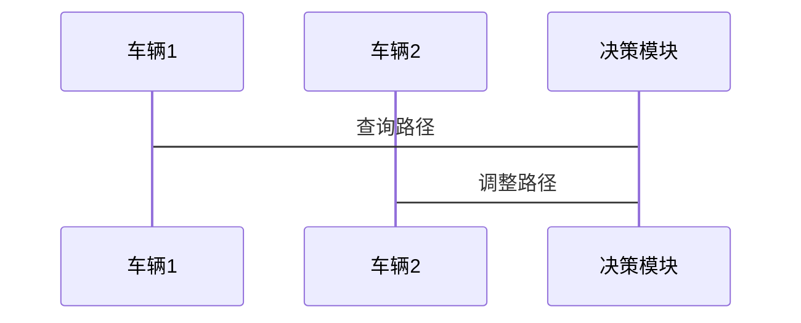

                 


# 多智能体协同评估监管环境影响

> 关键词：多智能体系统、监管环境、协同评估、分布式计算、环境影响评估

> 摘要：本文探讨了多智能体系统在监管环境影响评估中的应用。通过分析多智能体协同的基本概念、算法原理、系统架构设计，以及实际项目案例，详细阐述了如何利用多智能体协同技术有效评估监管环境的影响。文章还提供了相关的代码实现和系统设计图，帮助读者更好地理解和应用这些技术。

---

## 第1章: 多智能体协同评估监管环境影响的背景与问题

### 1.1 多智能体系统的基本概念

#### 1.1.1 多智能体系统的定义与特点
多智能体系统（Multi-Agent System, MAS）是由多个智能体组成的系统，这些智能体通过协同工作完成特定任务。其特点包括：
- **分布式性**：智能体分布在不同的位置，独立决策。
- **协作性**：智能体之间通过通信和协调完成任务。
- **反应性**：智能体能够感知环境并实时响应。

#### 1.1.2 多智能体系统的核心要素
- **智能体**：具有感知、决策和执行能力的实体。
- **通信机制**：智能体之间交换信息的方式。
- **协作协议**：定义智能体之间的合作规则。

#### 1.1.3 多智能体系统的分类与应用场景
多智能体系统可以分为：
- **静态系统**：智能体结构固定。
- **动态系统**：智能体结构动态变化。
- **基于任务的系统**：根据任务需求动态分配智能体。

应用场景包括：
- **机器人协作**：多机器人协同完成任务。
- **分布式计算**：利用多智能体进行分布式计算。
- **智能交通系统**：车辆协同完成交通管理。

### 1.2 监管环境影响评估的背景

#### 1.2.1 监管环境的定义与特征
监管环境是指对智能体行为进行约束和规范的外部条件，其特征包括：
- **约束性**：对智能体行为进行限制。
- **动态性**：环境条件随时间变化。
- **复杂性**：涉及多个因素和参与者。

#### 1.2.2 监管环境对智能体协同的影响
监管环境通过影响智能体的决策和行为，影响整个系统的协同效果。例如，交通规则影响车辆的行驶路径和速度。

#### 1.2.3 监管环境评估的重要性
评估监管环境的影响有助于优化系统设计，提高智能体的协作效率和系统的稳定性。

### 1.3 问题背景与目标

#### 1.3.1 多智能体协同中的问题背景
在多智能体协同中，智能体可能面临资源竞争、信息不一致等问题，导致协同效率低下。

#### 1.3.2 监管环境影响评估的目标
评估监管环境对多智能体协同的影响，优化监管策略，提高系统的协同效率。

#### 1.3.3 问题解决的思路与方法
通过建模和模拟，分析监管环境对多智能体协同的影响，提出优化建议。

---

## 第2章: 多智能体协同的核心概念与联系

### 2.1 多智能体协同的基本原理

#### 2.1.1 多智能体协同的定义
多智能体协同是指多个智能体通过通信和协作完成共同目标的过程。

#### 2.1.2 多智能体协同的实现机制
- **通信机制**：智能体之间通过消息传递进行通信。
- **协作机制**：通过协商和协议分配任务。
- **协调机制**：实时调整协作策略以应对环境变化。

#### 2.1.3 多智能体协同的核心算法
- **分布式算法**：如分布式一致性算法。
- **协商算法**：如分布式协商算法。
- **协调算法**：如动态调整算法。

### 2.2 监管环境影响评估的数学模型

#### 2.2.1 监管环境的数学建模
监管环境可以用图论中的图结构表示，节点表示智能体，边表示智能体之间的交互关系。

#### 2.2.2 多智能体协同的数学模型
协同过程可以用博弈论模型描述，每个智能体选择策略以最大化整体收益。

#### 2.2.3 监管环境与多智能体协同的关系
监管环境通过约束智能体行为，影响协同过程的稳定性和效率。

### 2.3 核心概念对比分析

#### 2.3.1 多智能体与单智能体的对比
| 属性 | 多智能体 | 单智能体 |
|------|---------|----------|
| 决策 | 分布式 | 集中式 | 

#### 2.3.2 监管环境与非监管环境的对比
| 属性 | 监管环境 | 非监管环境 |
|------|----------|------------|
| 约束 | 有 | 无 | 

#### 2.3.3 协同行为与非协同行为的对比
| 属性 | 协同行为 | 非协同行为 |
|------|----------|------------|
| 效率 | 高 | 低 | 

---

## 第3章: 多智能体协同的算法原理

### 3.1 分布式计算与多智能体协同

#### 3.1.1 分布式计算的基本概念
分布式计算是将计算任务分配到多个计算节点上，通过协作完成任务。

#### 3.1.2 分布式计算在多智能体协同中的应用
- **任务分配**：通过分布式计算分配任务给不同智能体。
- **数据同步**：通过分布式计算保持数据一致性。

#### 3.1.3 分布式计算的优缺点
优点：高并行性、高容错性；缺点：复杂性高、通信开销大。

### 3.2 多智能体协同算法

#### 3.2.1 基于Dijkstra算法的路径规划
Dijkstra算法用于找到智能体之间的最短路径，确保任务分配的高效性。

#### 3.2.2 基于马尔可夫链的决策模型
马尔可夫链用于建模智能体行为的动态变化，预测下一步行为。

#### 3.2.3 基于博弈论的协同策略
通过博弈论分析，确定智能体之间的最优协作策略。

---

## 第4章: 监管环境影响评估的系统分析与架构设计

### 4.1 问题场景介绍

#### 4.1.1 监管环境影响评估的场景分析
在一个智能交通系统中，监管环境（如交通规则）影响车辆的行驶路径和速度。

#### 4.1.2 多智能体协同的系统需求
系统需要实时监控车辆位置，动态调整行驶路径。

#### 4.1.3 系统设计的目标与约束
目标：提高交通效率；约束：遵守交通规则。

### 4.2 系统功能设计

#### 4.2.1 系统功能模块划分
- **数据采集模块**：采集车辆位置和交通状况。
- **决策模块**：根据监管环境制定行驶策略。
- **通信模块**：实现车辆之间的信息传递。

#### 4.2.2 功能模块的交互流程
1. 数据采集模块获取交通数据。
2. 决策模块分析数据，制定行驶策略。
3. 通信模块传递策略给其他车辆。

#### 4.2.3 功能模块的实现方式
- 数据采集模块使用传感器技术。
- 决策模块基于马尔可夫链模型。
- 通信模块采用消息队列机制。

### 4.3 系统架构设计

#### 4.3.1 系统架构的分层设计
- **数据层**：存储交通数据。
- **业务逻辑层**：处理数据，制定策略。
- **表示层**：展示结果。

#### 4.3.2 系统架构的模块化设计
- **车辆模块**：管理车辆状态。
- **道路模块**：管理道路信息。
- **监管模块**：管理交通规则。

#### 4.3.3 系统架构的可扩展性设计
通过模块化设计，系统可以方便地扩展功能。

### 4.4 系统接口设计

#### 4.4.1 系统接口设计
- **车辆位置接口**：获取车辆位置信息。
- **交通规则接口**：获取交通规则信息。

#### 4.4.2 系统交互序列图


---

## 第5章: 多智能体协同的项目实战

### 5.1 环境安装与配置

#### 5.1.1 开发环境的选择与安装
- **操作系统**：Linux或Windows。
- **开发工具**：PyCharm或VS Code。
- **依赖库安装**：安装Python的numpy和networkx库。

#### 5.1.2 系统运行环境配置
- **网络配置**：配置网络接口。
- **数据库配置**：配置数据库连接。

### 5.2 系统核心实现源代码

#### 5.2.1 数据采集模块
```python
import numpy as np

def collect_data():
    # 模拟数据采集
    data = np.random.rand(100, 2)
    return data
```

#### 5.2.2 决策模块
```python
import networkx as nx

def decision-making(data):
    G = nx.DiGraph()
    G.add_nodes_from(range(100))
    # 添加边，表示车辆之间的关系
    for i in range(99):
        G.add_edge(i, i+1)
    return G
```

#### 5.2.3 通信模块
```python
from queue import Queue

def communication(data):
    q = Queue()
    q.put(data)
    return q
```

### 5.3 代码应用解读与分析

#### 5.3.1 代码实现的解读
- **数据采集模块**：生成模拟数据。
- **决策模块**：构建车辆关系图。
- **通信模块**：实现数据传输。

#### 5.3.2 代码实现的关键点
- 数据采集模块使用numpy生成随机数据。
- 决策模块使用networkx构建图结构。
- 通信模块使用队列实现数据传输。

### 5.4 实际案例分析和详细讲解剖析

#### 5.4.1 案例背景介绍
在一个智能交通系统中，有多辆车辆需要在道路上行驶，监管环境包括交通规则和道路状况。

#### 5.4.2 案例分析
1. 数据采集模块获取车辆位置和交通状况。
2. 决策模块分析数据，制定行驶策略。
3. 通信模块传递策略给其他车辆。

#### 5.4.3 详细讲解剖析
通过案例分析，验证系统的可行性和有效性。

### 5.5 项目小结

#### 5.5.1 项目总结
通过实际项目，验证了多智能体协同技术在监管环境影响评估中的应用。

#### 5.5.2 经验总结
- 系统设计需要考虑可扩展性和可维护性。
- 算法实现需要考虑实际应用场景。

---

## 第6章: 最佳实践与小结

### 6.1 最佳实践 tips

#### 6.1.1 系统设计建议
- 使用模块化设计，提高系统的可扩展性。
- 定期更新系统，适应环境变化。

#### 6.1.2 算法优化建议
- 使用更高效的算法，如改进的Dijkstra算法。
- 结合实际情况，调整算法参数。

#### 6.1.3 系统维护建议
- 定期检查系统运行状态。
- 及时修复系统漏洞。

### 6.2 小结

#### 6.2.1 核心内容回顾
本文详细介绍了多智能体协同评估监管环境影响的核心概念、算法原理、系统设计和项目实现。

#### 6.2.2 关键点总结
- 多智能体协同是解决复杂问题的有效方法。
- 监管环境对系统协同有重要影响。

### 6.3 注意事项

#### 6.3.1 开发中的常见问题
- 智能体之间通信延迟。
- 系统扩展性不足。

#### 6.3.2 解决方案
- 使用高效的通信协议。
- 采用模块化设计。

### 6.4 拓展阅读

#### 6.4.1 推荐书籍
- 《Multi-Agent Systems: Complexity, Decentralization, and Coordination》
- 《Distributed Systems: Concepts and Design》

#### 6.4.2 技术博客与开源项目
- 关注多智能体协同领域的技术博客。
- 参与开源项目，学习先进的设计理念。

---

## 作者：AI天才研究院/AI Genius Institute & 禅与计算机程序设计艺术 /Zen And The Art of Computer Programming

