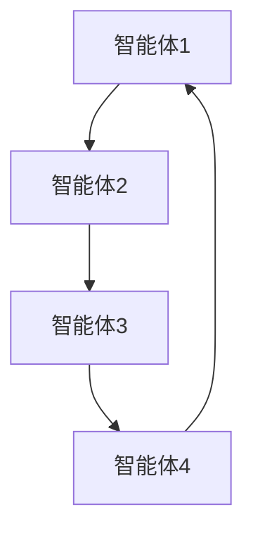
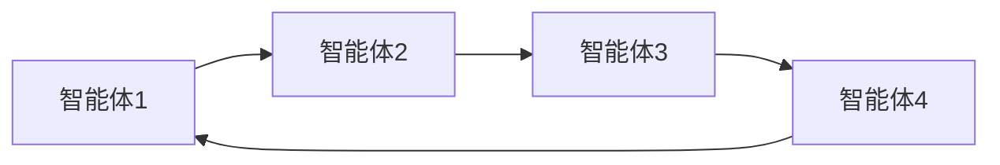
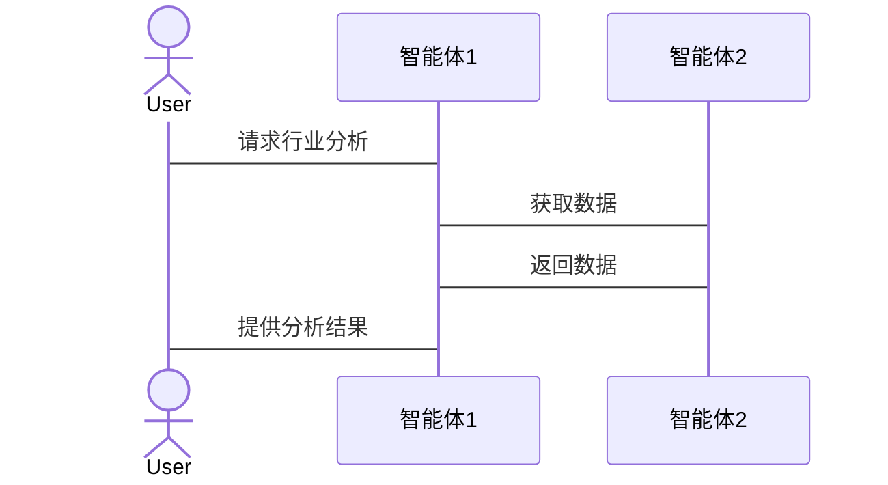

                 


# 多智能体协同进行行业轮动分析

> 关键词：多智能体协同、行业轮动分析、分布式系统、一致性算法、协作协议、通信机制

> 摘要：本文详细探讨了多智能体协同在行业轮动分析中的应用，从理论基础到实际应用，系统性地分析了多智能体协同的核心概念、算法原理、系统架构以及项目实战，旨在为读者提供一个全面而深入的技术视角。

---

## 第一部分：多智能体协同与行业轮动分析基础

### 第1章：多智能体协同与行业轮动概述

#### 1.1 多智能体协同的基本概念

##### 1.1.1 多智能体系统的定义与特点
多智能体系统（Multi-Agent System, MAS）是由多个智能体（Agent）组成的分布式系统，这些智能体能够通过协作完成复杂任务。其特点包括：
- **分布式性**：智能体独立运行，无中心节点。
- **协作性**：智能体之间通过通信和协作完成共同目标。
- **自主性**：每个智能体都有一定的自主决策能力。
- **动态性**：系统环境和任务需求可能动态变化。

##### 1.1.2 多智能体系统的分类与应用场景
多智能体系统可以分为以下几类：
- **反应式系统**：基于当前感知做出决策。
- **认知式系统**：具备推理和规划能力。
- **分布式问题求解系统**：通过协作解决复杂问题。

应用场景包括金融分析、物流调度、机器人协作等领域。

##### 1.1.3 多智能体系统的核心要素
- **智能体**：独立的实体，具备感知、决策和执行能力。
- **通信机制**：智能体之间交换信息的方式。
- **协作协议**：定义智能体之间的协作规则。

#### 1.2 行业轮动分析的背景与意义

##### 1.2.1 行业轮动的基本概念
行业轮动是指在不同时间段内，不同行业在市场中的表现出现波动，投资者通过分析行业轮动趋势，调整投资策略。

##### 1.2.2 行业轮动分析的必要性
- 帮助投资者捕捉市场机会。
- 优化资源配置，提高投资收益。
- 对应市场环境的变化，动态调整策略。

##### 1.2.3 行业轮动分析的挑战与机遇
- **挑战**：行业数据复杂，市场波动性强，分析难度大。
- **机遇**：通过多智能体协同，提高分析效率和准确性。

#### 1.3 多智能体协同与行业轮动的结合

##### 1.3.1 多智能体协同在行业轮动中的作用
- 分布式数据处理能力。
- 高效的信息协同与共享。
- 动态协作能力，适应市场变化。

##### 1.3.2 行业轮动分析的多智能体协同模型
模型包括数据采集、特征提取、预测分析和决策优化四个模块，通过多智能体协同实现高效分析。

##### 1.3.3 多智能体协同与行业轮动的未来发展趋势
- 技术融合：结合AI、大数据等技术。
- 应用场景扩展：从金融领域扩展到更多行业。

---

## 第2章：多智能体协同的核心概念与联系

### 2.1 多智能体系统的核心原理

#### 2.1.1 多智能体系统的基本原理
通过智能体之间的通信和协作，实现问题求解和任务完成。

#### 2.1.2 多智能体系统的关键技术
- **通信技术**：智能体间的信息交换。
- **协作算法**：分布式一致性算法、协商协议。

#### 2.1.3 多智能体系统的优缺点对比
| 特性 | 优点 | 缺点 |
|------|------|------|
| 分布式 | 高可用性 | 复杂性高 |
| 协作性 | 提高效率 | 协调困难 |

### 2.2 多智能体协同的核心要素

#### 2.2.1 智能体的定义与属性
- **智能体**：具备感知、决策、执行能力的实体。
- **属性**：自主性、反应性、协作性。

#### 2.2.2 智能体之间的通信机制
- **消息传递**：智能体间通过消息交换信息。
- **通信协议**：定义消息格式和交互规则。

#### 2.2.3 智能体的协作协议
- **一致性协议**：确保系统状态一致。
- **协商协议**：智能体之间达成共识。

### 2.3 多智能体协同的ER实体关系图

```mermaid
er
actor: 多智能体协同系统
attributes: 智能体ID, 智能体类型, 协作协议
relationship: 实体间协作关系
```

---

## 第3章：多智能体协同的算法原理

### 3.1 多智能体协同算法概述

#### 3.1.1 分布式一致性算法
- **算法目的**：确保分布式系统中各节点的数据一致性。
- **典型算法**：Paxos、Raft。

#### 3.1.2 多智能体协作协议
- **协商机制**：智能体之间通过协商达成一致。
- **共识机制**：如区块链中的共识算法。

#### 3.1.3 多智能体通信机制
- **通信模型**：基于消息传递的通信模型。
- **通信协议**：定义消息格式和交互规则。

### 3.2 多智能体协同算法的数学模型

#### 3.2.1 分布式一致性算法的数学模型
$$x_i = x_j \quad \text{（智能体i和智能体j的值相等）}$$

### 3.3 多智能体协同算法的流程图



---

## 第4章：多智能体协同的系统分析与架构设计

### 4.1 系统功能设计

#### 4.1.1 行业轮动分析模块
- **数据采集**：获取行业数据。
- **特征提取**：提取行业轮动特征。
- **预测分析**：基于模型预测行业趋势。

#### 4.1.2 多智能体协作模块
- **通信模块**：智能体间通信。
- **协作协议**：定义协作规则。

### 4.2 系统架构设计

#### 4.2.1 系统架构图



### 4.3 接口设计与交互图

#### 4.3.1 接口设计
- **通信接口**：定义消息格式和交互规则。
- **数据接口**：数据采集和处理接口。

#### 4.3.2 交互图



---

## 第5章：多智能体协同的项目实战

### 5.1 环境安装与配置

#### 5.1.1 系统环境
- 操作系统：Linux/Windows/macOS
- 开发工具：Python、IDE（如PyCharm）

#### 5.1.2 依赖安装
```bash
pip install numpy pandas scikit-learn
```

### 5.2 核心代码实现

#### 5.2.1 智能体通信模块

```python
class Agent:
    def __init__(self, id):
        self.id = id
        self.data = None

    def send(self, message, recipient):
        recipient.receive(message)

    def receive(self, message):
        self.data = message
```

#### 5.2.2 行业轮动分析模块

```python
from sklearn.linear_model import LinearRegression

class IndustryAnalyzer:
    def __init__(self):
        self.model = LinearRegression()

    def train(self, X, y):
        self.model.fit(X, y)

    def predict(self, X):
        return self.model.predict(X)
```

### 5.3 案例分析与解读

#### 5.3.1 数据集准备
使用金融行业数据，包括各行业的历史表现和市场指标。

#### 5.3.2 模型训练
训练行业轮动预测模型，评估模型性能。

#### 5.3.3 实验结果与分析
分析模型预测结果，验证多智能体协同的有效性。

### 5.4 项目小结
总结项目实现过程，指出优缺点，提出改进建议。

---

## 第6章：多智能体协同的总结与展望

### 6.1 核心观点总结
- 多智能体协同在行业轮动分析中具有重要应用价值。
- 需要结合分布式算法和大数据技术。

### 6.2 最佳实践 Tips
- 确保智能体间通信高效。
- 选择合适的协作协议。
- 定期更新模型和数据。

### 6.3 未来研究方向
- 更高效的分布式算法。
- 行业轮动分析的深度学习应用。

---

## 作者：AI天才研究院 & 禅与计算机程序设计艺术

---

这篇文章详细探讨了多智能体协同在行业轮动分析中的应用，从理论到实践，系统性地分析了多智能体协同的核心概念、算法原理、系统架构和项目实战，为读者提供了全面而深入的技术视角。

