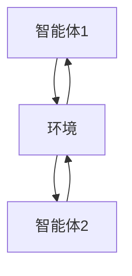
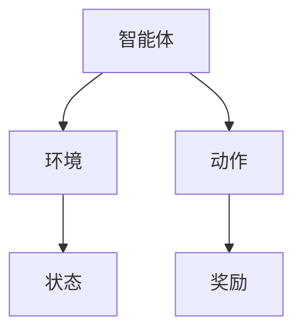
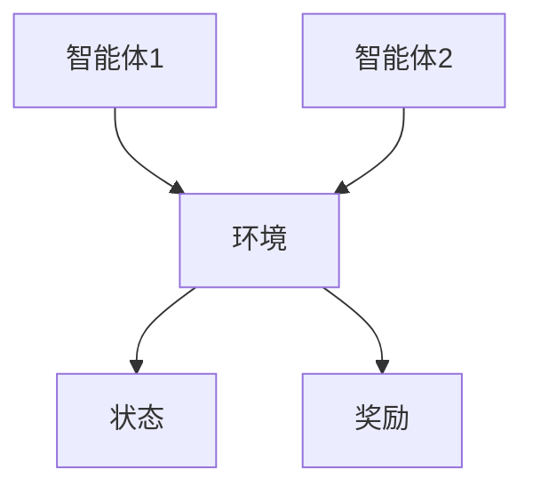
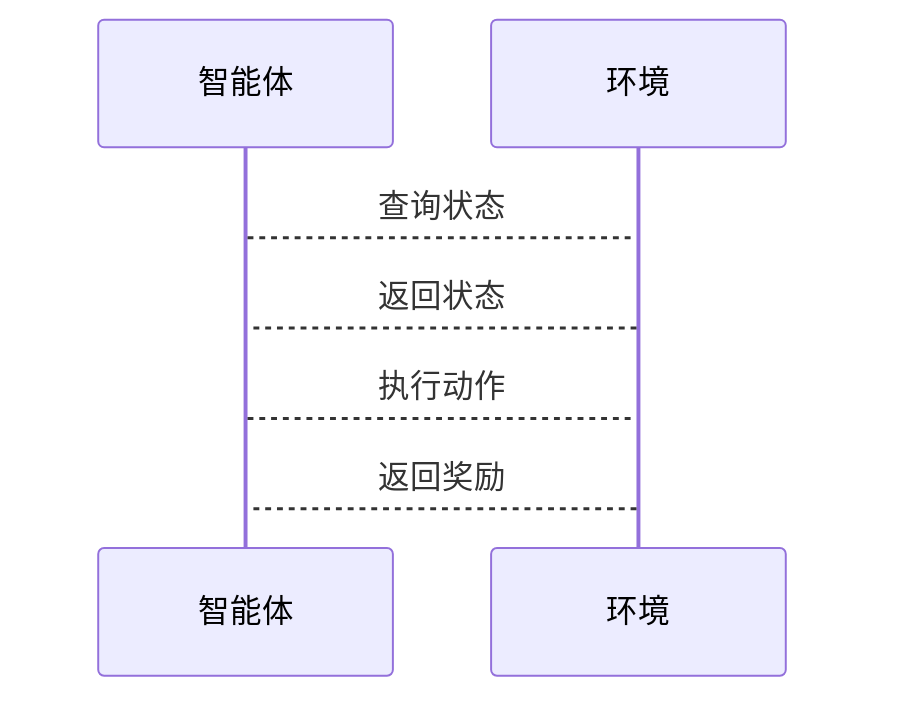

                 


# 多智能体强化学习在股票选择中的应用

## 关键词：多智能体强化学习，股票选择，强化学习，人工智能，金融应用

## 摘要：
本文深入探讨了多智能体强化学习在股票选择中的应用，从理论基础到实际案例，系统地分析了多智能体强化学习的优势、挑战及解决方案。通过详细的数学模型、算法原理和系统架构设计，本文展示了如何利用多智能体强化学习构建高效的股票选择模型，并通过实战案例验证了其有效性。

---

# 第1章: 多智能体强化学习概述

## 1.1 多智能体强化学习的定义与特点

### 1.1.1 多智能体系统的定义
多智能体系统是由多个相互作用的智能体组成的系统，每个智能体都有自己的目标和决策能力，能够通过协作或竞争完成复杂任务。

### 1.1.2 强化学习的基本概念
强化学习是一种机器学习方法，通过智能体与环境的交互，学习最优策略以最大化累积奖励。

### 1.1.3 多智能体强化学习的核心特点
- **分布式决策**：每个智能体独立决策。
- **协作与竞争**：智能体之间可以协作或竞争。
- **复杂性**：多智能体系统比单智能体系统复杂，需要处理通信和协调问题。

### 对比表格：多智能体强化学习与单智能体强化学习的对比

| 特性                | 单智能体强化学习                     | 多智能体强化学习                     |
|---------------------|--------------------------------------|--------------------------------------|
| 决策主体            | 单一智能体                          | 多个智能体                          |
| 通信方式            | 无                                  | 可以通信                            |
| 协作关系            | 无                                  | 可以协作或竞争                      |
| 任务复杂性          | 较低                               | 较高                               |

### Mermaid图：多智能体系统的架构



## 1.2 股票选择的背景与挑战

### 1.2.1 股票市场的基本特性
股票市场是一个动态、不确定的环境，受多种因素影响，如经济指标、公司业绩等。

### 1.2.2 股票选择的传统方法
- **基本面分析**：基于公司财务数据。
- **技术分析**：基于价格和成交量。
- **量化交易**：基于数学模型。

### 1.2.3 传统方法的局限性与挑战
- **动态性**：市场变化快，模型难以适应。
- **复杂性**：多因素影响，难以建模。
- **数据噪声**：数据中存在大量噪声，影响模型性能。

## 1.3 多智能体强化学习在股票选择中的应用前景

### 1.3.1 多智能体强化学习的优势
- **分布式决策**：可以模拟多个投资者的决策过程。
- **协作与竞争**：可以模拟市场中的多方博弈。
- **自适应性**：能够适应市场的动态变化。

### 1.3.2 股票选择中的多智能体模型
- **智能体角色**：每个智能体代表一个投资者或策略。
- **状态空间**：市场数据，如价格、成交量等。
- **动作空间**：买入、卖出、持有。

### 1.3.3 应用中的潜在问题与解决方案
- **通信开销**：通过限制通信频率或内容减少开销。
- **协调问题**：通过任务分配算法优化协调。

## 1.4 本章小结
本章介绍了多智能体强化学习的基本概念和特点，分析了股票选择的背景与挑战，并探讨了多智能体强化学习在股票选择中的应用前景。

---

# 第2章: 多智能体强化学习的核心概念与联系

## 2.1 多智能体强化学习的理论基础

### 2.1.1 强化学习的基本原理
强化学习通过智能体与环境的交互，学习最优策略。智能体通过选择动作，观察环境的状态和奖励，更新策略以最大化累积奖励。

### 2.1.2 多智能体系统的核心概念
- **智能体**：独立决策的主体。
- **环境**：智能体所处的外部世界。
- **状态**：环境的当前情况。
- **动作**：智能体的选择。
- **奖励**：对智能体的反馈。

### 2.1.3 状态、动作与奖励的定义
- **状态**：当前市场数据，如价格、成交量。
- **动作**：买入、卖出、持有。
- **奖励**：投资收益。

### 对比表格：多智能体强化学习与其他技术的对比

| 技术                | 监督学习                     | 非监督学习                   | 强化学习                     |
|---------------------|-----------------------------|-----------------------------|-----------------------------|
| 数据类型            | 标签数据                    | 无标签数据                  | 状态、动作、奖励             |
| 学习目标            | 预测标签                   | 分组或聚类                  | 最大化累积奖励              |
| 与环境交互          | 无                          | 无                          | 有                          |

### Mermaid图：多智能体强化学习的流程



## 2.2 多智能体强化学习的框架与模型

### 2.2.1 马尔可夫决策过程（MDP）
MDP定义了一个智能体在不确定环境中的决策过程，包括状态、动作、转移概率和奖励函数。

### 2.2.2 多智能体MDP（Multi-Agent MDP）
多智能体MDP扩展了MDP，允许多个智能体在共享环境中决策。

### 2.2.3 协作与竞争关系的建模
- **协作**：智能体之间共享信息，共同完成任务。
- **竞争**：智能体之间竞争资源，可能导致零和博弈。

## 2.3 多智能体强化学习在金融中的应用

### 2.3.1 金融市场的多智能体建模
金融市场可以看作一个由多个参与者组成的多智能体系统，每个参与者都有自己的策略和目标。

### 2.3.2 股票选择中的多智能体策略
- **分布式决策**：每个智能体负责一部分股票的选择。
- **协作策略**：智能体之间协作，优化整体投资组合。

### 实际案例分析
某公司利用多智能体强化学习模型，模拟多个投资者的决策过程，优化投资组合，实现超额收益。

## 2.4 本章小结
本章介绍了多智能体强化学习的理论基础和框架，分析了其在金融中的应用，并通过案例展示了其优势。

---

# 第3章: 强化学习的数学模型与算法原理

## 3.1 强化学习的基本数学模型

### 3.1.1 状态空间与动作空间
- **状态空间**：所有可能的状态集合。
- **动作空间**：所有可能的动作集合。

### 3.1.2 奖励函数与价值函数
- **奖励函数**：定义智能体执行动作后的奖励。
- **价值函数**：评估状态或动作的值。

### 3.1.3 动作-价值函数（Q-learning）
Q-learning算法通过更新Q值，学习最优策略。

### 3.1.4 策略-价值函数（Policy Gradient）
Policy Gradient方法通过优化策略直接最大化奖励。

## 3.2 多智能体强化学习的数学模型

### 3.2.1 多智能体MDP的数学表示
多智能体MDP由多个智能体、共享环境和奖励函数组成。

### 3.2.2 单智能体与多智能体的数学差异
- 单智能体：独立决策。
- 多智能体：协作或竞争。

### 3.2.3 多智能体中的协作与竞争建模
通过博弈论模型，定义智能体之间的协作与竞争关系。

## 3.3 常见强化学习算法的实现

### 3.3.1 Q-learning算法
Q-learning算法通过更新Q表，学习最优策略。

### 3.3.2 Deep Q-Networks（DQN）
DQN算法利用深度神经网络近似Q值函数。

### 3.3.3 Policy Gradient方法
Policy Gradient方法通过优化策略参数，最大化奖励。

### 3.3.4 Actor-Critic架构
Actor-Critic架构同时学习策略和价值函数。

## 3.4 多智能体强化学习中的挑战与解决方案

### 3.4.1 通信开销
通过限制通信频率或内容，减少通信开销。

### 3.4.2 协调问题
通过任务分配算法优化协调。

## 3.5 本章小结
本章详细介绍了强化学习的数学模型和常见算法，并分析了多智能体强化学习中的挑战与解决方案。

---

# 第4章: 多智能体强化学习的系统分析与架构设计

## 4.1 问题场景介绍

### 4.1.1 股票选择中的多智能体系统
股票市场是一个动态、复杂的环境，适合多智能体系统的应用。

### 4.1.2 系统目标
设计一个多智能体强化学习系统，实现高效的股票选择。

## 4.2 系统功能设计

### 4.2.1 领域模型（Mermaid类图）


### 4.2.2 系统架构设计（Mermaid架构图）


### 4.2.3 系统接口设计
- **输入接口**：接收市场数据。
- **输出接口**：输出投资决策。

### 4.2.4 系统交互设计（Mermaid序列图）


## 4.3 本章小结
本章通过系统分析与架构设计，展示了如何将多智能体强化学习应用于股票选择。

---

# 第5章: 多智能体强化学习的项目实战

## 5.1 环境安装与配置

### 5.1.1 环境需求
- Python 3.8+
- TensorFlow或PyTorch
- gym库或其他相关库

### 5.1.2 安装步骤
```bash
pip install gym numpy tensorflow
```

## 5.2 核心实现

### 5.2.1 智能体类
```python
class Agent:
    def __init__(self, state_space, action_space):
        self.state_space = state_space
        self.action_space = action_space
        self.model = self.build_model()
    
    def build_model(self):
        # 定义神经网络模型
        pass
    
    def act(self, state):
        # 选择动作
        pass
    
    def learn(self, state, action, reward, next_state):
        # 更新模型
        pass
```

### 5.2.2 环境类
```python
class StockEnvironment:
    def __init__(self, data):
        self.data = data
        self.current_step = 0
    
    def reset(self):
        self.current_step = 0
        return self.get_state()
    
    def get_state(self):
        # 返回当前状态
        pass
    
    def step(self, action):
        # 执行动作，返回下一个状态、奖励、是否终止
        pass
```

### 5.2.3 训练过程
```python
def train_agents():
    env = StockEnvironment(data)
    agents = [Agent(state_space, action_space) for _ in range(num_agents)]
    
    for episode in range(num_episodes):
        state = env.reset()
        while not done:
            actions = [agent.act(state) for agent in agents]
            next_state, reward, done, _ = env.step(actions)
            for i in range(num_agents):
                agents[i].learn(state, actions[i], reward[i], next_state)
            state = next_state
```

## 5.3 案例分析与结果展示

### 5.3.1 数据准备
使用历史股票数据训练模型。

### 5.3.2 训练结果
展示训练过程中智能体的学习曲线。

### 5.3.3 实验对比
对比多智能体与单智能体的收益曲线。

## 5.4 本章小结
本章通过实战案例，展示了多智能体强化学习在股票选择中的具体实现和应用。

---

# 第6章: 多智能体强化学习的最佳实践与注意事项

## 6.1 最佳实践 tips

### 6.1.1 模型选择
选择适合的强化学习算法和神经网络架构。

### 6.1.2 数据处理
确保数据质量，处理噪声和缺失值。

### 6.1.3 超参数调整
合理设置学习率、折扣因子等超参数。

## 6.2 注意事项

### 6.2.1 过拟合
避免模型过拟合训练数据。

### 6.2.2 计算开销
多智能体系统可能需要较大的计算资源。

## 6.3 拓展阅读

### 6.3.1 多智能体强化学习的最新研究
阅读相关论文和文献。

### 6.3.2 股票选择的其他技术
结合其他机器学习方法，如随机森林、神经网络等。

## 6.4 本章小结
本章总结了多智能体强化学习的最佳实践和注意事项，并提供了拓展阅读的方向。

---

# 作者：AI天才研究院/AI Genius Institute & 禅与计算机程序设计艺术 /Zen And The Art of Computer Programming

