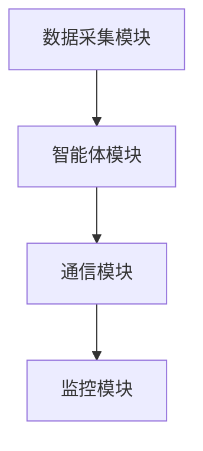
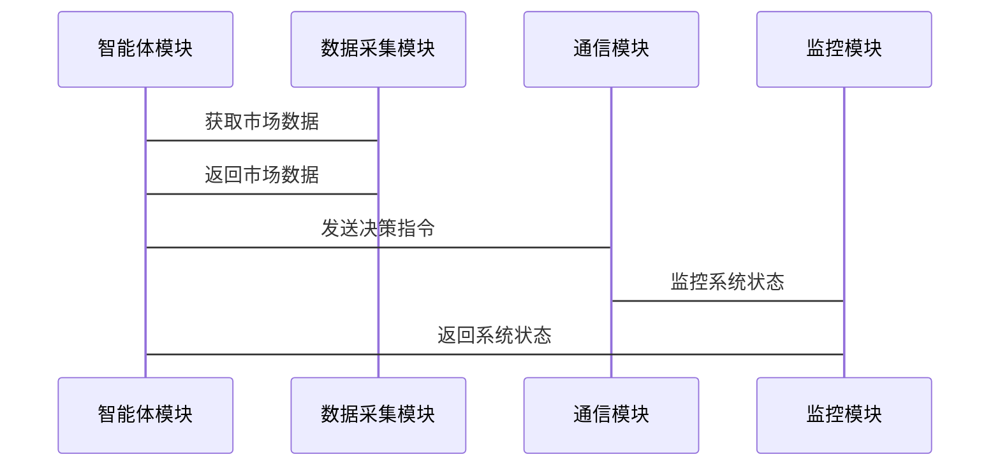

                 


# 多智能体系统优化价值投资的动态资产配置

> 关键词：多智能体系统, 动态资产配置, 价值投资, 优化算法, 强化学习

> 摘要：本文探讨了如何利用多智能体系统优化价值投资的动态资产配置问题。通过分析多智能体系统的结构与优化算法，构建了基于强化学习的动态资产配置模型，并通过项目实战展示了如何实现该系统。本文适合对金融投资和人工智能感兴趣的读者阅读。

---

## 第一章: 多智能体系统概述

### 1.1 多智能体系统的定义与特点

#### 1.1.1 多智能体系统的定义
多智能体系统（Multi-Agent System, MAS）是由多个智能体（Agent）组成的系统，每个智能体能够感知环境、自主决策并与其他智能体协作或竞争。智能体可以是软件程序、机器人或其他实体，但本文主要关注软件智能体。

#### 1.1.2 多智能体系统的特性
- **分布式**：智能体分布在不同的节点上，彼此独立。
- **协作性**：智能体之间可以协作完成共同目标。
- **动态性**：环境和智能体的行为可能不断变化。
- **反应性**：智能体能够实时感知环境并做出反应。

#### 1.1.3 多智能体系统与单智能体系统的区别
| 特性 | 多智能体系统 | 单智能体系统 |
|------|--------------|---------------|
| 决策 | 分布式决策 | 中央化决策 |
| 协作 | 可协作或竞争 | 无协作需求 |
| 复杂度 | 高 | 较低 |

### 1.2 多智能体系统的结构与通信

#### 1.2.1 多智能体系统的组成结构
多智能体系统由以下部分组成：
- **智能体**：执行具体任务的主体。
- **环境**：智能体所处的外部世界。
- **通信机制**：智能体之间交换信息的渠道。
- **协作协议**：定义智能体之间的协作规则。

#### 1.2.2 通信机制与协议
- **直接通信**：智能体之间直接交换信息。
- **间接通信**：通过中间媒介传递信息。
- **通信协议**：定义信息格式和传输规则。

#### 1.2.3 协作与竞争关系
- **协作**：智能体为了共同目标而合作。
- **竞争**：智能体为了资源或目标而竞争。

### 1.3 多智能体系统的应用场景

#### 1.3.1 金融领域的应用
多智能体系统在金融领域的应用包括：
- **股票交易**：多个智能体协同决策优化投资组合。
- **风险控制**：实时监控市场动态并做出反应。

#### 1.3.2 其他领域的应用
- **物流**：优化货物运输路径。
- **智慧城市**：管理交通、能源等城市资源。

---

## 第二章: 动态资产配置与价值投资

### 2.1 动态资产配置的定义与特点

#### 2.1.1 动态资产配置的定义
动态资产配置是一种投资策略，根据市场变化不断调整资产组合。与静态资产配置不同，动态配置强调实时调整，以应对市场波动。

#### 2.1.2 动态资产配置的核心要素
- **市场预测**：基于市场数据做出预测。
- **风险控制**：控制投资组合的风险。
- **收益最大化**：在风险可控的前提下，追求最大收益。

#### 2.1.3 动态资产配置与静态资产配置的区别
| 特性 | 动态资产配置 | 静态资产配置 |
|------|--------------|---------------|
| 调整频率 | 高 | 低 |
| 灵活性 | 高 | 低 |
| 适应性 | 强 | 弱 |

### 2.2 价值投资的理论基础

#### 2.2.1 价值投资的定义
价值投资是一种投资策略，强调以低于内在价值的价格买入优质资产。其核心思想是寻找市场低估的资产，长期持有以获得超额收益。

#### 2.2.2 价值投资的核心原则
- **长期视角**：关注企业的长期价值，而非短期波动。
- **安全边际**：买入价格低于内在价值，以降低风险。
- **优质企业**：选择具有强大竞争优势的企业。

#### 2.2.3 价值投资与短期投资的对比
| 特性 | 价值投资 | 短期投资 |
|------|-----------|----------|
| 投资期限 | 长期 | 短期 |
| 投资目标 | 追求超额收益 | 追求短期收益 |
| 风险控制 | 强调安全边际 | 风险较高 |

### 2.3 动态资产配置与价值投资的结合

#### 2.3.1 结合的必要性
- **市场变化快**：动态调整以应对市场变化。
- **价值发现**：动态配置帮助发现被低估的资产。
- **风险控制**：动态调整降低投资风险。

#### 2.3.2 结合的具体方式
- **动态筛选**：根据市场变化动态筛选优质资产。
- **权重调整**：根据市场变化调整各资产的权重。
- **实时监控**：实时监控市场变化并做出反应。

---

## 第三章: 多智能体系统优化价值投资的理论基础

### 3.1 优化算法在价值投资中的应用

#### 3.1.1 优化算法的定义
优化算法是一种用于寻找最优解的数学方法，广泛应用于工程、科学和金融等领域。

#### 3.1.2 常见优化算法的分类
- **经典优化算法**：如线性规划、非线性规划。
- **智能优化算法**：如遗传算法、粒子群优化算法。
- **深度学习优化算法**：如强化学习。

#### 3.1.3 优化算法在价值投资中的作用
- **提高收益**：通过优化算法找到最优投资组合。
- **降低风险**：通过优化算法控制投资组合的风险。
- **提高效率**：通过优化算法提高投资决策的效率。

### 3.2 多智能体系统优化的数学模型

#### 3.2.1 数学模型的构建
优化价值投资的动态资产配置问题可以表示为以下数学模型：

$$
\max_{w} \quad E[r_p(w)] - \lambda E[r_p(w)]^2
$$

其中：
- $w$ 是投资组合权重向量。
- $E[r_p(w)]$ 是投资组合的期望收益。
- $\lambda$ 是风险厌恶系数。

#### 3.2.2 数学模型的求解方法
- **拉格朗日乘数法**：用于求解带约束的优化问题。
- **动态规划**：用于处理动态变化的优化问题。
- **强化学习**：通过智能体与环境的交互不断优化策略。

#### 3.2.3 数学模型的应用案例
假设我们有三个资产，目标是找到最优的投资组合权重，使得在风险可控的前提下收益最大化。

$$
\max_{w} \quad E[r_p(w)] - \lambda E[r_p(w)]^2
$$

其中，$r_p(w) = w_1 r_1 + w_2 r_2 + w_3 r_3$，$w_1 + w_2 + w_3 = 1$。

---

## 第四章: 多智能体系统优化价值投资的算法实现

### 4.1 强化学习算法

#### 4.1.1 强化学习的基本原理
强化学习是一种基于奖励机制的优化方法。智能体通过与环境交互，学习最优策略以最大化累计奖励。

#### 4.1.2 强化学习在价值投资中的应用
- **状态空间**：市场数据，如股票价格、成交量等。
- **动作空间**：买入、卖出或持有资产。
- **奖励函数**：投资收益。

#### 4.1.3 强化学习算法的实现步骤
1. 初始化智能体参数。
2. 与环境交互，获取状态和奖励。
3. 更新智能体策略以最大化累计奖励。

### 4.2 遗传算法

#### 4.2.1 遗传算法的基本原理
遗传算法是一种基于生物进化论的优化方法，通过自然选择和遗传变异寻找最优解。

#### 4.2.2 遗传算法在价值投资中的应用
- **编码**：将投资组合表示为基因序列。
- **选择**：选择适应度高的基因。
- **交叉**：基因交叉产生新个体。
- **变异**：随机改变基因以引入多样性。

#### 4.2.3 遗传算法的实现步骤
1. 初始化种群。
2. 计算适应度。
3. 选择适应度高的个体。
4. 进行交叉和变异操作。
5. 重复步骤 2-4 直到满足终止条件。

### 4.3 其他优化算法

#### 4.3.1 模拟退火算法
模拟退火算法是一种基于概率的全局优化方法，能够跳出局部最优。

#### 4.3.2 蚁群算法
蚁群算法是一种基于蚂蚁觅食行为的优化方法，常用于组合优化问题。

#### 4.3.3 粒子群算法
粒子群算法是一种基于鸟类觅食行为的优化方法，通过粒子的移动寻找最优解。

---

## 第五章: 系统架构与实现

### 5.1 系统架构设计

#### 5.1.1 系统功能模块划分
- **数据采集模块**：采集市场数据。
- **智能体模块**：实现多智能体的决策逻辑。
- **通信模块**：实现智能体之间的通信。
- **监控模块**：监控系统运行状态。

#### 5.1.2 系统架构图


#### 5.1.3 系统接口设计
- **数据接口**：数据采集模块与智能体模块之间的接口。
- **通信接口**：智能体模块与通信模块之间的接口。
- **监控接口**：通信模块与监控模块之间的接口。

#### 5.1.4 系统交互流程图


### 5.2 系统实现

#### 5.2.1 环境搭建
- **编程语言**：Python
- **框架**：TensorFlow、Keras
- **数据源**：Yahoo Finance API

#### 5.2.2 核心算法实现
```python
import numpy as np
import pandas as pd

class Multi-AgentSystem:
    def __init__(self, assets):
        self.assets = assets
        self.num_agents = len(assets)
        self.agent_communication = {}
    
    def communicate(self, agent_id, message):
        self.agent_communication[agent_id] = message
    
    def make_decision(self):
        # 简单实现：每个智能体根据自身信息做出决策
        for agent_id in range(self.num_agents):
            asset_data = self.assets[agent_id]
            # 假设决策基于价格走势
            if asset_data['price'] > asset_data['moving_average']:
                self.agent_communication[agent_id] = 'buy'
            else:
                self.agent_communication[agent_id] = 'sell'
```

#### 5.2.3 系统测试与优化
- **测试数据**：使用历史股票数据进行回测。
- **性能优化**：通过并行计算和算法优化提高系统效率。

---

## 第六章: 项目实战

### 6.1 项目背景与目标

#### 6.1.1 项目背景
随着市场波动加剧，传统的静态资产配置已难以应对复杂的市场环境。通过多智能体系统实现动态资产配置，能够显著提升投资效率和收益。

#### 6.1.2 项目目标
- 实现一个多智能体系统，用于优化价值投资的动态资产配置。
- 通过实证分析验证系统的有效性。

### 6.2 项目实现

#### 6.2.1 环境安装
```bash
pip install numpy pandas tensorflow keras
```

#### 6.2.2 核心代码实现
```python
import numpy as np
import pandas as pd
from tensorflow.keras.models import Model
from tensorflow.keras.layers import Dense, Input

class InvestmentAgent:
    def __init__(self, state_dim, action_dim):
        self.state_dim = state_dim
        self.action_dim = action_dim
        self.model = self.build_model()
    
    def build_model(self):
        input_layer = Input(shape=(self.state_dim,))
        hidden_layer = Dense(32, activation='relu')(input_layer)
        output_layer = Dense(self.action_dim, activation='softmax')(hidden_layer)
        model = Model(inputs=input_layer, outputs=output_layer)
        model.compile(optimizer='adam', loss='categorical_crossentropy')
        return model
    
    def act(self, state):
        state = np.array([state])
        prediction = self.model.predict(state)
        action = np.argmax(prediction[0])
        return action
```

#### 6.2.3 代码解读
- ** InvestmentAgent 类**：实现一个基于强化学习的智能体。
- **build_model 方法**：构建神经网络模型。
- **act 方法**：根据当前状态做出决策。

#### 6.2.4 实际案例分析
假设我们有三个资产（股票A、股票B、股票C），目标是通过多智能体系统实现动态资产配置。

1. 初始化智能体：
```python
assets = ['股票A', '股票B', '股票C']
agent = InvestmentAgent(3, 3)
```

2. 智能体做出决策：
```python
state = [股票A的价格, 股票B的价格, 股票C的价格]
action = agent.act(state)
```

3. 根据决策调整投资组合。

---

## 第七章: 总结与展望

### 7.1 总结
本文详细探讨了多智能体系统优化价值投资的动态资产配置问题。通过分析多智能体系统的结构与优化算法，构建了基于强化学习的动态资产配置模型，并通过项目实战展示了如何实现该系统。

### 7.2 注意事项
- **数据质量**：数据是模型决策的基础，数据质量直接影响模型效果。
- **模型鲁棒性**：需要考虑模型的鲁棒性，避免单一市场环境下的过拟合。
- **实时性**：动态资产配置需要实时调整，对系统的响应速度有较高要求。

### 7.3 拓展阅读
- 《Reinforcement Learning: Theory and Algorithms》
- 《Multi-Agent Systems: Algorithmic, Complexity Theoretic, and Economic Aspects》

---

## 作者

作者：AI天才研究院/AI Genius Institute & 禅与计算机程序设计艺术 /Zen And The Art of Computer Programming

---

通过本文的详细分析，读者可以理解多智能体系统在优化价值投资动态资产配置中的重要作用，并掌握相关算法和系统实现的方法。

