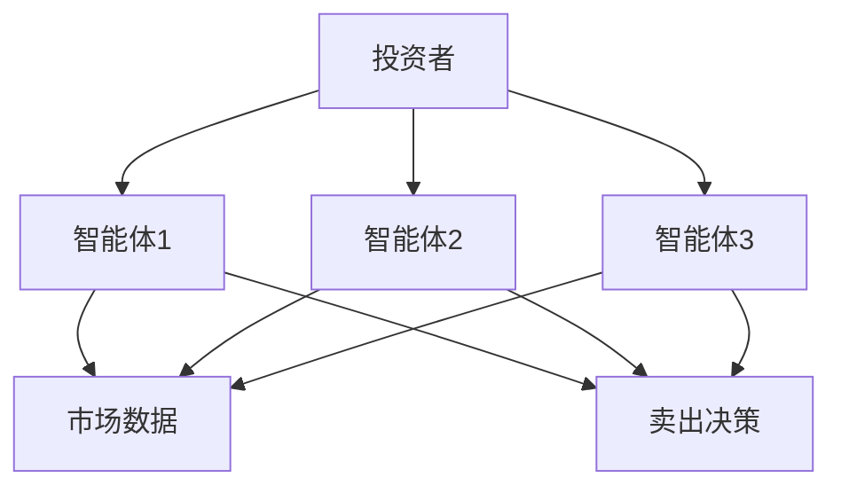
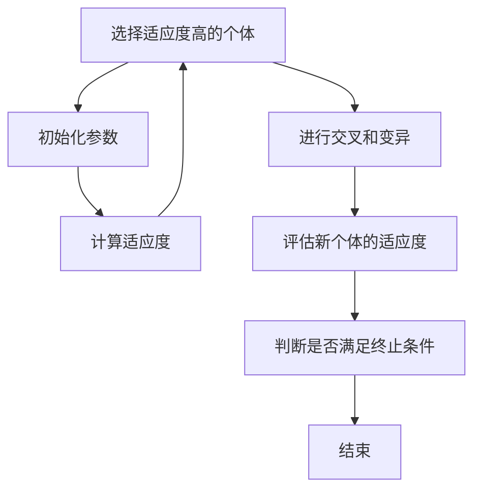
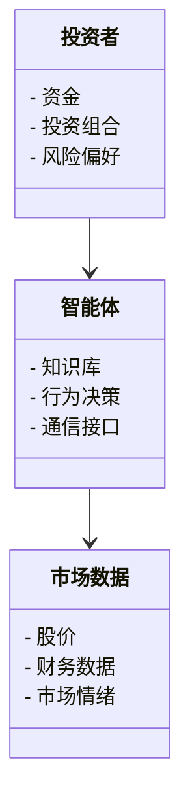
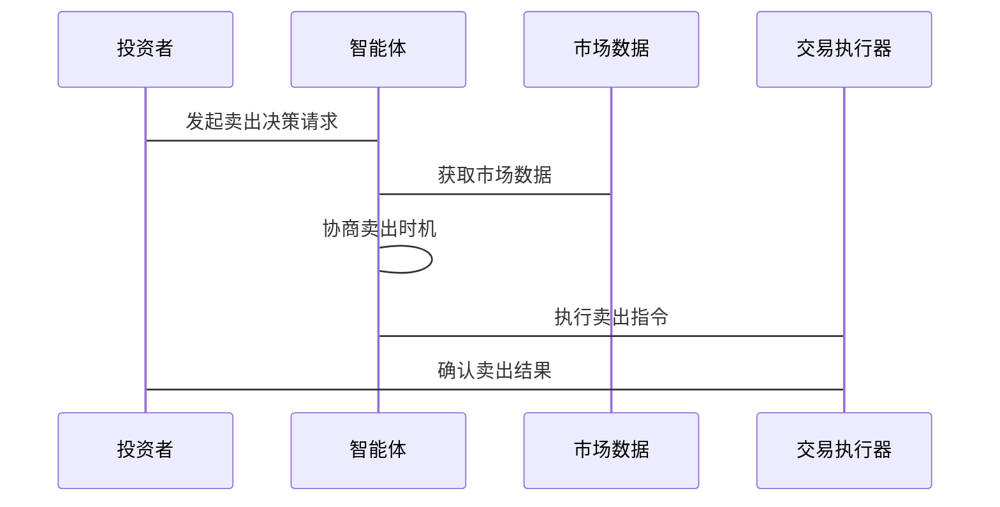

                 


# 多智能体系统优化价值投资的卖出决策

> 关键词：多智能体系统, 价值投资, 卖出决策, 优化算法, 系统架构, 实战案例

> 摘要：本文深入探讨了多智能体系统在优化价值投资卖出决策中的应用。通过分析多智能体系统的核心概念、算法原理、系统架构及实战案例，本文旨在为投资决策提供一种新的视角和解决方案，帮助投资者在复杂市场环境中做出更优的卖出决策。

---

## 第1章: 多智能体系统与价值投资的背景

### 1.1 多智能体系统的基本概念

#### 1.1.1 多智能体系统的定义
多智能体系统（Multi-Agent System, MAS）是由多个智能体（Agent）组成的分布式系统，这些智能体能够自主决策、协作并解决问题。每个智能体都有自己的目标、知识和能力，能够通过交互和通信完成复杂的任务。

#### 1.1.2 多智能体系统的特点
- **分布式性**：智能体分布在不同的位置，独立决策。
- **协作性**：智能体之间通过通信和协作完成共同目标。
- **反应性**：智能体能够感知环境并实时调整行为。
- **自治性**：每个智能体都能自主决策，无需中央控制。

#### 1.1.3 多智能体系统与单智能体系统的区别
单智能体系统依赖中心化控制，而多智能体系统通过去中心化的协作实现目标。多智能体系统在复杂环境中更具灵活性和适应性。

### 1.2 价值投资的基本概念

#### 1.2.1 价值投资的定义
价值投资是一种投资策略，强调以低于内在价值的价格买入优质资产，长期持有，等待价格回归内在价值。其核心是寻找市场低估的优质公司。

#### 1.2.2 价值投资的核心理念
- **安全边际**：买入价格远低于内在价值。
- **长期视角**：关注公司长期价值，而非短期波动。
- **逆人性**：在市场恐慌时买入，在市场狂热时卖出。

#### 1.2.3 价值投资与短期交易的区别
价值投资注重长期持有和公司基本面，而短期交易关注短期价格波动，频繁买卖。

### 1.3 多智能体系统在价值投资中的应用

#### 1.3.1 多智能体系统在投资决策中的优势
- **分布式决策**：多个智能体从不同角度分析市场，降低决策风险。
- **协作优化**：通过协作，多个智能体能够发现更好的卖出时机。
- **适应性**：智能体能够快速适应市场变化，调整策略。

#### 1.3.2 价值投资与多智能体系统的结合
多智能体系统可以模拟多个投资者的行为，分析市场的整体趋势，为价值投资提供数据支持。

#### 1.3.3 多智能体系统优化价值投资的卖出决策的意义
通过多智能体系统的协作，可以更精准地识别卖出时机，避免因个体决策失误导致的损失。

---

## 第2章: 多智能体系统优化价值投资的核心概念

### 2.1 多智能体系统优化的原理

#### 2.1.1 多智能体系统的协同优化
协同优化通过智能体之间的协作，实现全局最优。每个智能体负责一部分任务，共同完成整体目标。

#### 2.1.2 多智能体系统中的个体与群体行为
个体行为是智能体的独立决策，群体行为是多个智能体协作的结果。个体行为的多样性增加了系统的适应性。

#### 2.1.3 多智能体系统优化的数学模型
优化目标：最大化投资收益，最小化风险。数学模型可以用优化问题表示：
$$
\text{最大化} \quad \sum_{i=1}^{n} w_i r_i - \lambda \sum_{i=1}^{n} w_i^2
$$
其中，\( w_i \) 是权重，\( r_i \) 是收益，\( \lambda \) 是惩罚系数。

### 2.2 价值投资卖出决策的优化

#### 2.2.1 价值投资卖出决策的关键因素
- **内在价值评估**：判断卖出时是否低于内在价值。
- **市场情绪分析**：市场狂热时卖出。
- **组合优化**：调整投资组合，降低风险。

#### 2.2.2 卖出决策的优化目标
- **收益最大化**：在适当时机卖出，获得最大收益。
- **风险最小化**：避免因市场崩盘导致的损失。
- **决策效率**：快速做出卖出决策。

#### 2.2.3 多智能体系统在卖出决策中的角色
多智能体系统通过分析市场数据、评估公司基本面、预测市场趋势，辅助投资者做出卖出决策。

### 2.3 多智能体系统与价值投资的实体关系图



---

## 第3章: 多智能体系统优化价值投资的算法原理

### 3.1 强化学习算法

#### 3.1.1 强化学习的基本原理
强化学习通过智能体与环境的交互，学习策略以最大化累计奖励。智能体通过试错，调整动作以获得最大奖励。

#### 3.1.2 多智能体强化学习的挑战
- **状态空间**：多智能体系统的状态空间复杂。
- **动作空间**：智能体需要协调动作，避免冲突。
- **通信机制**：智能体之间需要有效通信，协作决策。

#### 3.1.3 多智能体强化学习的应用场景
在股票交易中，多个智能体分别负责分析不同指标，协作做出卖出决策。

### 3.2 遗传算法

#### 3.2.1 遗传算法的基本原理
遗传算法模拟自然选择，通过选择、交叉和变异生成新的解，逐步优化目标函数。

#### 3.2.2 遗传算法在投资决策中的应用
用于优化投资组合，寻找最优的买入和卖出时机。

#### 3.2.3 遗传算法的优化步骤
1. 初始化种群。
2. 计算适应度。
3. 选择适应度高的个体。
4. 进行交叉和变异。
5. 评估新个体的适应度。
6. 判断是否满足终止条件。

### 3.3 算法流程图



### 3.4 数学模型与公式

优化目标函数：
$$
f(x) = \sum_{i=1}^{n} w_i r_i - \lambda \sum_{i=1}^{n} w_i^2
$$

约束条件：
$$
\sum_{i=1}^{n} w_i = 1
$$

其中，\( w_i \) 是权重，\( r_i \) 是收益，\( \lambda \) 是惩罚系数。

---

## 第4章: 系统分析与架构设计

### 4.1 问题场景介绍

投资者需要在复杂市场中做出卖出决策，依赖于多智能体系统的协作优化。

### 4.2 领域模型设计



### 4.3 系统架构设计


### 4.4 接口设计与交互流程图



---

## 第5章: 项目实战

### 5.1 环境安装

安装Python和必要的库：
```
pip install numpy pandas scikit-learn gym
```

### 5.2 核心代码实现

```python
import numpy as np
import pandas as pd

class TradingAgent:
    def __init__(self, initial_capital):
        self.capital = initial_capital
        self.position = 0

    def decide_sell(self, portfolio, market_data):
        # 判断是否卖出
        return portfolio > market_data.mean()

def main():
    # 初始化数据
    data = pd.DataFrame({'price': [100, 90, 80, 70, 60]})
    agent = TradingAgent(10000)
    portfolio = data['price'].values[-1]
    
    # 执行卖出决策
    if agent.decide_sell(portfolio, data['price']):
        print("卖出信号，执行卖出操作")
    else:
        print("未触发卖出信号")

if __name__ == "__main__":
    main()
```

### 5.3 代码解读与分析

- `TradingAgent` 类：管理交易决策和资本。
- `decide_sell` 方法：根据投资组合和市场数据判断是否卖出。
- `main` 函数：初始化数据并执行卖出决策。

### 5.4 实际案例分析

案例：假设市场数据为 `[100, 90, 80, 70, 60]`，初始资本为 10000。投资组合价值为 60，市场均值为 80。判断条件为 `portfolio > market_data.mean()`，即 `60 > 80`，条件不满足，未触发卖出。

### 5.5 项目小结

本案例展示了如何使用多智能体系统进行卖出决策，通过简单判断实现基本的卖出逻辑。实际应用中，需要考虑更多复杂因素。

---

## 第6章: 最佳实践与总结

### 6.1 小结

多智能体系统通过协作优化，能够更精准地判断卖出时机，帮助投资者做出更优决策。

### 6.2 注意事项

- 数据质量：确保市场数据的准确性和及时性。
- 模型选择：根据实际情况选择合适的算法。
- 风险控制：设定止损点，避免重大损失。

### 6.3 拓展阅读

建议阅读相关书籍和论文，深入学习多智能体系统和强化学习的知识。

---

## 作者

作者：AI天才研究院/AI Genius Institute & 禅与计算机程序设计艺术 /Zen And The Art of Computer Programming

