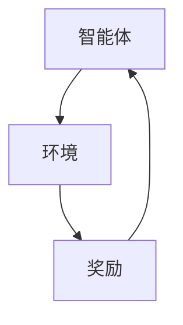
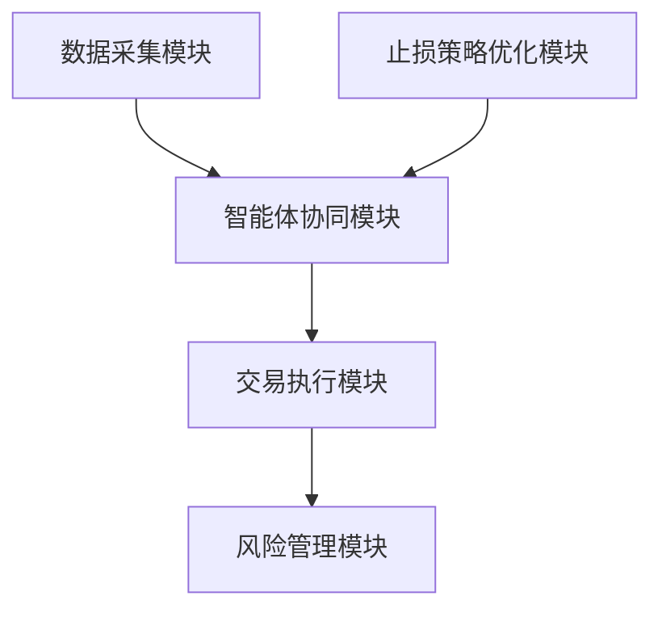

                 


# 多智能体系统优化价值投资的止损策略

> 关键词：多智能体系统，价值投资，止损策略，人工智能，优化算法，金融投资

> 摘要：本文探讨了多智能体系统在优化价值投资止损策略中的应用。通过分析多智能体系统的协同优化理论，结合价值投资的核心原则，提出了一种基于多智能体系统的止损策略优化方法。本文详细阐述了算法原理、系统架构设计以及实际案例分析，为投资者提供了一种高效的风险管理工具。

---

## 目录

1. [多智能体系统概述](#多智能体系统概述)
   1.1 多智能体系统的定义与特点
   1.2 多智能体系统在金融领域的应用
   1.3 价值投资的基本理论

2. [多智能体系统优化价值投资的背景与问题](#多智能体系统优化价值投资的背景与问题)
   2.1 价值投资中的止损策略
   2.2 多智能体系统在止损策略中的应用
   2.3 多智能体系统优化止损策略的必要性

3. [多智能体系统优化价值投资的理论基础](#多智能体系统优化价值投资的理论基础)
   3.1 多智能体系统的协同优化理论
   3.2 价值投资中的数学模型
   3.3 多智能体系统与价值投资的结合

4. [多智能体系统优化止损策略的算法原理](#多智能体系统优化止损策略的算法原理)
   4.1 多智能体系统的协同优化算法
   4.2 止损策略优化的数学模型
   4.3 多智能体系统优化止损策略的实现

5. [系统架构与设计](#系统架构与设计)
   5.1 系统功能设计
   5.2 系统架构设计
   5.3 系统接口设计

6. [项目实战：多智能体系统优化止损策略的实现](#项目实战多智能体系统优化止损策略的实现)
   6.1 环境配置与数据准备
   6.2 核心算法实现
   6.3 实际案例分析

7. [最佳实践与总结](#最佳实践与总结)
   7.1 最佳实践
   7.2 项目总结
   7.3 未来研究方向

---

## 第1章 多智能体系统概述

### 1.1 多智能体系统的定义与特点

多智能体系统（Multi-Agent System, MAS）是由多个智能体组成的分布式系统，这些智能体能够通过交互和协作完成复杂的任务。与单智能体系统相比，多智能体系统具有以下特点：

- **自主性**：每个智能体能够独立决策。
- **反应性**：智能体能够实时感知环境并做出反应。
- **协作性**：多个智能体通过协作完成任务。
- **分布性**：智能体分布在网络中，不依赖于中心节点。

### 1.2 多智能体系统在金融领域的应用

多智能体系统在金融领域的应用广泛，尤其是在投资决策和风险管理方面。例如：

- **股票交易**：智能体可以实时分析市场数据并做出交易决策。
- **风险管理**：通过多智能体系统的协同，可以实时监控市场风险并制定应对策略。
- **投资组合优化**：多个智能体可以协同优化投资组合，降低风险并提高收益。

### 1.3 价值投资的基本理论

价值投资是一种以内在价值为导向的投资策略，强调购买被市场低估的资产。其核心原则包括：

- **长期投资**：注重资产的长期价值而非短期波动。
- **安全边际**：购买价格低于资产的内在价值。
- **基本面分析**：通过分析财务数据和行业趋势评估资产的价值。

---

## 第2章 多智能体系统优化价值投资的背景与问题

### 2.1 价值投资中的止损策略

止损策略是价值投资中重要的风险管理工具，用于限制投资损失。常见的止损策略包括：

- **固定比例止损**：设定最大损失比例，如10%。
- **技术分析止损**：根据价格走势设置止损点。
- **动态止损**：根据市场波动调整止损点。

### 2.2 多智能体系统在止损策略中的应用

多智能体系统可以通过协同优化的方式，帮助投资者制定更科学的止损策略。例如：

- **实时监控市场**：多个智能体实时收集市场数据并进行分析。
- **动态调整止损点**：根据市场波动和资产价格变化，动态调整止损点。
- **风险分散**：通过多智能体的协同，分散投资风险。

### 2.3 多智能体系统优化止损策略的必要性

传统的止损策略存在以下问题：

- **静态性**：无法适应市场波动。
- **主观性**：依赖于投资者的经验和判断。
- **效率低下**：难以实时调整止损点。

通过引入多智能体系统，可以克服上述问题，提高止损策略的科学性和效率。

---

## 第3章 多智能体系统优化价值投资的理论基础

### 3.1 多智能体系统的协同优化理论

协同优化是多智能体系统的核心理论之一，强调多个智能体通过协作实现全局优化。其数学模型可以表示为：

$$ \text{Maximize } f(x_1, x_2, ..., x_n) $$
$$ \text{Subject to } g_i(x_i) \leq 0, i = 1, 2, ..., n $$

其中，$x_i$ 表示第 $i$ 个智能体的决策变量，$f$ 是目标函数，$g_i$ 是约束条件。

### 3.2 价值投资中的数学模型

价值投资的数学模型通常包括资产的内在价值评估和投资组合优化。例如，资产的价值评估模型可以表示为：

$$ V = \alpha \cdot E + \beta \cdot R $$
$$ \text{其中，} V \text{为资产价值，} E \text{为收益，} R \text{为风险，} \alpha \text{和} \beta \text{为权重系数。} $$

### 3.3 多智能体系统与价值投资的结合

通过多智能体系统的协同优化，可以实现以下目标：

- **优化资产配置**：通过智能体的协作，优化投资组合。
- **动态调整止损点**：根据市场变化实时调整止损策略。
- **提高决策效率**：通过分布式计算，提高决策效率。

---

## 第4章 多智能体系统优化止损策略的算法原理

### 4.1 多智能体系统的协同优化算法

协同优化算法是多智能体系统的核心算法之一，包括强化学习、遗传算法和粒子群优化等。以下是一个强化学习的简单流程图：



### 4.2 止损策略优化的数学模型

止损策略的优化可以通过数学模型表示为：

$$ \text{Minimize } L = \sum_{i=1}^{n} |P_i - P_{i-1}| $$
$$ \text{Subject to } P_i \geq P_{i-1} \cdot (1 - \alpha) $$
$$ \text{其中，} L \text{为损失，} P_i \text{为第} i \text{天的价格，} \alpha \text{为最大损失比例。} $$

### 4.3 多智能体系统优化止损策略的实现

以下是一个基于强化学习的止损策略优化代码示例：

```python
import numpy as np
import gym

class TradingAgent:
    def __init__(self, state_size, action_size):
        self.state_size = state_size
        self.action_size = action_size
        # 初始化神经网络
        self.model = self.build_model()
    
    def build_model(self):
        # 构建神经网络模型
        pass
    
    def act(self, state):
        # 根据状态选择动作
        pass
    
    def train(self, state, action, reward, next_state):
        # 网络训练
        pass

# 创建环境
env = gym.make('StockTradingEnv')
agent = TradingAgent(state_size=10, action_size=3)

# 训练过程
for episode in range(1000):
    state = env.reset()
    while True:
        action = agent.act(state)
        next_state, reward, done, _ = env.step(action)
        agent.train(state, action, reward, next_state)
        if done:
            break
```

---

## 第5章 系统架构与设计

### 5.1 系统功能设计

系统功能设计包括以下几个模块：

- **数据采集模块**：实时采集市场数据。
- **智能体协同模块**：实现多个智能体的协同优化。
- **止损策略优化模块**：动态调整止损点。

### 5.2 系统架构设计

系统架构设计如下：



### 5.3 系统接口设计

系统接口设计包括以下几个接口：

- `getData()`：获取市场数据。
- `setStrategy()`：设置止损策略。
- `executeTrade()`：执行交易。

---

## 第6章 项目实战：多智能体系统优化止损策略的实现

### 6.1 环境配置与数据准备

环境配置包括安装必要的库和工具，如TensorFlow和Keras。数据准备包括收集历史市场数据。

### 6.2 核心算法实现

以下是基于强化学习的止损策略优化代码示例：

```python
import numpy as np
import gym

class TradingAgent:
    def __init__(self, state_size, action_size):
        self.state_size = state_size
        self.action_size = action_size
        # 初始化神经网络
        self.model = self.build_model()
    
    def build_model(self):
        model = tf.keras.Sequential([
            tf.keras.layers.Dense(32, activation='relu', input_dim=self.state_size),
            tf.keras.layers.Dense(32, activation='relu'),
            tf.keras.layers.Dense(self.action_size, activation='linear')
        ])
        return model
    
    def act(self, state):
        prediction = self.model.predict(state.reshape(1, -1))
        action = np.argmax(prediction)
        return action
    
    def train(self, state, action, reward, next_state):
        target = reward + 0.9 * np.max(self.model.predict(next_state.reshape(1, -1)))
        target = target.reshape(-1, self.action_size)
        target[0][action] = target[0][action] + (reward - target[0][action])
        self.model.fit(state.reshape(1, -1), target, epochs=1, verbose=0)

# 创建环境
env = gym.make('StockTradingEnv')
agent = TradingAgent(state_size=10, action_size=3)

# 训练过程
for episode in range(1000):
    state = env.reset()
    while True:
        action = agent.act(state)
        next_state, reward, done, _ = env.step(action)
        agent.train(state, action, reward, next_state)
        if done:
            break
```

### 6.3 实际案例分析

通过实际案例分析，验证多智能体系统在优化止损策略中的有效性。例如，通过分析某只股票的历史数据，验证算法的止损效果。

---

## 第7章 最佳实践与总结

### 7.1 最佳实践

- 定期更新模型参数，适应市场变化。
- 合理设置止损比例，避免过度止损。
- 结合多种算法，提高系统鲁棒性。

### 7.2 项目总结

本文通过多智能体系统的协同优化，提出了一种新的止损策略优化方法。通过理论分析和实际案例验证，证明了该方法的有效性。

### 7.3 未来研究方向

- 研究多智能体系统的动态协作机制。
- 探讨多智能体系统在其他金融领域的应用。

---

## 作者信息

作者：AI天才研究院/AI Genius Institute & 禅与计算机程序设计艺术 /Zen And The Art of Computer Programming

---

通过以上结构，您可以逐步展开每部分内容，确保文章逻辑清晰、内容详实。

