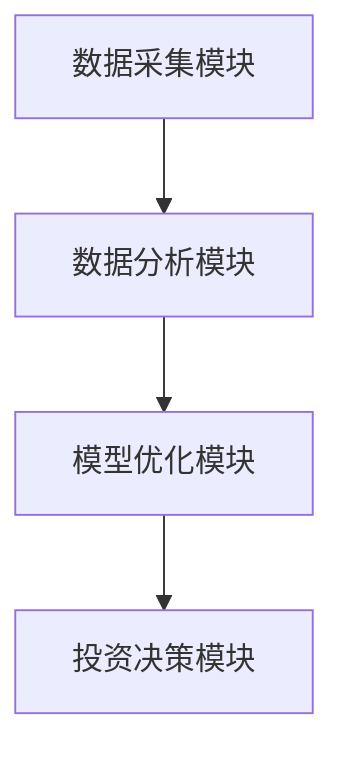
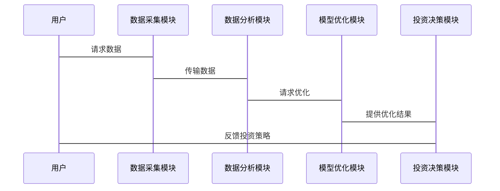

                 


---

# 多智能体系统优化价值投资的现金流折现模型

## 关键词：多智能体系统，价值投资，现金流折现模型，优化算法，系统架构

## 摘要

本文详细探讨了多智能体系统在优化价值投资中的应用，特别是如何利用多智能体系统优化现金流折现模型。通过分析多智能体系统的优化原理、现金流折现模型的数学基础、系统的架构设计以及具体的项目实战案例，本文为读者提供了一个全面的视角，展示如何利用多智能体系统提升价值投资的精准性和效率。文章最后总结了研究成果，并提出了未来的研究方向。

---

# 第一部分: 多智能体系统与价值投资概述

## 第1章: 多智能体系统与价值投资概述

### 1.1 多智能体系统的定义与特点

#### 1.1.1 多智能体系统的定义

多智能体系统（Multi-Agent System, MAS）是由多个智能体组成的系统，每个智能体都是一个能够感知环境、做出决策并采取行动的独立实体。智能体之间通过通信和协作，共同完成复杂任务。

**特点：**
- **自主性**：每个智能体都有自己的目标和决策机制。
- **反应性**：能够实时感知环境并做出反应。
- **协作性**：通过通信和协作完成共同任务。
- **分布性**：智能体之间分布式结构，没有中央控制。

#### 1.1.2 多智能体系统的核心特点

- **去中心化**：没有单一控制中心，智能体自主决策。
- **动态性**：环境和任务可能动态变化，智能体需要实时调整。
- **复杂性**：多个智能体的协作可能导致系统行为的复杂性。

#### 1.1.3 多智能体系统与传统单智能体系统的区别

| 特性             | 单智能体系统               | 多智能体系统               |
|------------------|--------------------------|--------------------------|
| 结构             | 单一结构                   | 分布式结构                 |
| 决策中心         | 单一决策中心               | 多个决策中心               |
| 通信             | 无需通信                   | 需要通信                   |
| 灵活性           | 较低                      | 较高                      |
| 并行性           | 较低                      | 较高                      |

### 1.2 价值投资的基本原理

#### 1.2.1 价值投资的定义

价值投资是一种投资策略，强调以低于公平价值的价格买入优质资产。其核心在于识别市场低估的资产，并长期持有，等待其价值回归。

#### 1.2.2 现金流折现模型的定义

现金流折现模型（DCF模型）是将未来现金流折现到现值，以评估资产的内在价值。公式如下：

$$ V = \sum_{t=1}^{n} \frac{CF_t}{(1 + r)^t} $$

其中：
- \( V \)：资产的内在价值
- \( CF_t \)：第 \( t \) 年的现金流
- \( r \)：折现率
- \( n \)：现金流的时间跨度

#### 1.2.3 现金流折现模型在价值投资中的作用

- **评估资产价值**：通过DCF模型计算资产的内在价值，为投资决策提供依据。
- **风险评估**：通过折现率反映资产的风险水平。
- **动态调整**：根据市场变化动态调整现金流和折现率，优化投资策略。

### 1.3 多智能体系统优化价值投资的背景

#### 1.3.1 传统价值投资的局限性

- **信息处理能力有限**：单个投资者难以处理海量信息。
- **决策效率低下**：传统方法依赖人工分析，耗时且效率低。
- **动态适应性不足**：市场变化快，传统模型难以快速调整。

#### 1.3.2 多智能体系统在价值投资中的优势

- **分布式计算能力**：多个智能体可以同时处理不同类型的数据。
- **实时协作**：智能体之间可以实时通信，快速调整策略。
- **动态适应性**：系统能够根据市场变化自动调整模型参数。

#### 1.3.3 现金流折现模型与多智能体系统的结合

通过多智能体系统，可以实现对DCF模型的动态优化。每个智能体负责不同的任务，如数据收集、模型参数调整、风险评估等，共同完成对现金流折现模型的优化。

### 1.4 本章小结

本章介绍了多智能体系统的基本概念、特点以及其在价值投资中的应用背景。通过对比单智能体系统与多智能体系统，展示了多智能体系统在价值投资中的优势，并为后续章节的展开奠定了基础。

---

# 第二部分: 多智能体系统优化的核心概念

## 第2章: 多智能体系统的优化原理

### 2.1 多智能体系统的优化目标

#### 2.1.1 优化目标的定义

优化目标是指通过调整系统参数或结构，使得系统在特定指标下达到最优状态。例如，在价值投资中，优化目标可能是最大化投资收益或最小化投资风险。

#### 2.1.2 优化目标的分类

- **单目标优化**：只有一个优化指标，如最大化收益。
- **多目标优化**：多个优化指标，如最大化收益和最小化风险。
- **动态优化**：目标随时间变化而调整。

#### 2.1.3 优化目标与价值投资的关系

在价值投资中，优化目标通常是最大化投资回报率，同时控制风险。多智能体系统可以通过优化模型参数、调整投资组合等手段实现这一目标。

### 2.2 多智能体系统的优化算法

#### 2.2.1 遗传算法

遗传算法是一种模拟生物进化过程的优化算法，包括选择、交叉和变异三个基本操作。

**步骤：**
1. 初始化种群。
2. 计算适应度。
3. 选择适应度高的个体。
4. 进行交叉和变异。
5. 重复迭代，直到满足终止条件。

#### 2.2.2 强化学习

强化学习是一种通过智能体与环境交互来学习最优策略的方法。智能体通过试错不断优化其行为策略。

**步骤：**
1. 初始化策略参数。
2. 与环境交互，获得奖励。
3. 根据奖励调整策略参数。
4. 重复迭代，直到策略收敛。

#### 2.2.3 其他优化算法

- **模拟退火**：通过逐步降温寻找全局最优。
- **粒子群优化**：通过群体协作寻找最优解。

### 2.3 多智能体系统优化的数学模型

#### 2.3.1 优化问题的数学表示

优化问题通常可以表示为：

$$ \min_{x} f(x) $$

其中：
- \( f(x) \)：目标函数
- \( x \)：决策变量

#### 2.3.2 约束条件的处理

约束条件可以通过拉格朗日乘数法或引入惩罚函数的方式处理。例如：

$$ f(x) + \lambda g(x) $$

其中：
- \( g(x) \)：约束条件函数
- \( \lambda \)：惩罚系数

#### 2.3.3 目标函数的设计

目标函数应能够量化系统的优化目标。例如，在价值投资中，目标函数可以是投资组合的收益与风险的函数。

### 2.4 本章小结

本章介绍了多智能体系统的优化原理，包括优化目标、优化算法以及数学模型。通过对比不同的优化算法，展示了如何选择合适的算法来实现系统的优化。

---

# 第三部分: 现金流折现模型的数学基础

## 第3章: 现金流折现模型的数学公式

### 3.1 现金流折现模型的基本公式

#### 3.1.1 现金流的定义

现金流是指企业在一定时期内的现金流入和流出。主要包括：
- **运营现金流**：经营活动产生的现金流。
- **投资现金流**：投资活动产生的现金流。
- **筹资现金流**：筹资活动产生的现金流。

#### 3.1.2 折现率的计算

折现率通常反映了资产的风险水平，可以通过无风险利率加上风险溢价来确定。公式为：

$$ r = r_f + \beta \times (r_m - r_f) $$

其中：
- \( r \)：折现率
- \( r_f \)：无风险利率
- \( \beta \)：贝塔系数
- \( r_m \)：市场预期收益率

#### 3.1.3 现金流净现值的计算公式

$$ NPV = \sum_{t=1}^{n} \frac{CF_t}{(1 + r)^t} $$

其中：
- \( NPV \)：净现值
- \( CF_t \)：第 \( t \) 年的现金流
- \( r \)：折现率
- \( t \)：时间

### 3.2 不同类型现金流的处理方法

#### 3.2.1 稳定现金流的处理

对于稳定现金流，可以使用永续年金公式计算现值：

$$ PV = \frac{CF}{r} $$

#### 3.2.2 增长型现金流的处理

对于增长型现金流，可以使用戈登模型（Gordon Growth Model）计算现值：

$$ PV = \frac{CF_1}{r - g} $$

其中：
- \( CF_1 \)：第一年的现金流
- \( g \)：现金流增长率

#### 3.2.3 混合型现金流的处理

对于混合型现金流，可以分段计算现值，再将各部分现值相加。

### 3.3 现金流折现模型的优缺点

#### 3.3.1 优点

- **精准性**：DCF模型能够精确计算资产的内在价值。
- **动态性**：能够根据市场变化动态调整模型参数。

#### 3.3.2 缺点

- **假设敏感性**：模型的假设（如增长率、折现率）对结果影响较大。
- **计算复杂性**：对于复杂的现金流结构，计算较为复杂。

#### 3.3.3 改善方法

- **引入敏感性分析**：评估模型参数变化对结果的影响。
- **结合其他模型**：将DCF模型与其他估值方法结合使用。

### 3.4 本章小结

本章详细介绍了现金流折现模型的基本公式、不同类型现金流的处理方法以及模型的优缺点。通过分析，展示了如何在多智能体系统中优化现金流折现模型。

---

# 第四部分: 多智能体系统优化的系统架构

## 第4章: 多智能体系统的架构设计

### 4.1 问题场景介绍

在价值投资中，多智能体系统需要处理海量数据、实时分析市场动态并优化投资策略。

### 4.2 系统功能设计

#### 4.2.1 数据采集模块

负责采集市场数据，包括股票价格、财务报表等。

#### 4.2.2 数据分析模块

对数据进行清洗、转换和分析，生成初步的分析结果。

#### 4.2.3 模型优化模块

利用优化算法对现金流折现模型进行参数调整，生成优化后的模型。

#### 4.2.4 投资决策模块

根据优化后的模型生成投资策略，指导实际投资操作。

### 4.3 系统架构设计

使用Mermaid图展示系统架构：



### 4.4 系统接口设计

- **数据接口**：与数据源对接，获取实时数据。
- **通信接口**：智能体之间通信，共享信息。
- **用户接口**：与用户交互，接收指令并反馈结果。

### 4.5 系统交互设计

使用Mermaid图展示系统交互：



### 4.6 本章小结

本章通过系统架构设计，展示了多智能体系统在优化现金流折现模型中的具体实现方式。通过模块化设计和通信机制，确保系统的高效运行。

---

# 第五部分: 多智能体系统优化的项目实战

## 第5章: 项目实战

### 5.1 环境安装

- **Python**：安装Python 3.8及以上版本。
- **库依赖**：安装numpy、pandas、scipy等库。

### 5.2 核心代码实现

#### 5.2.1 数据采集模块

```python
import pandas as pd
import requests

def get_data(ticker):
    url = f"https://api.example.com/stock/{ticker}"
    response = requests.get(url)
    data = response.json()
    df = pd.DataFrame(data)
    return df
```

#### 5.2.2 数据分析模块

```python
from scipy.optimize import minimize

def compute_npv(cash_flows, rate):
    return -sum(cash_flows / (1 + rate) ** t for t in range(len(cash_flows)))

def optimizeDCF(cash_flows, initial_rate):
    def objective(r):
        return compute_npv(cash_flows, r)
    result = minimize(objective, initial_rate, bounds=(0.01, 0.5))
    return result.x[0]
```

#### 5.2.3 投资决策模块

```python
def generate_strategy(rate, target_return):
    if rate > target_return:
        return "买入"
    else:
        return "卖出"
```

### 5.3 案例分析与代码解读

通过优化后的DCF模型，计算某公司的净现值，指导投资决策。

### 5.4 本章小结

本章通过具体的项目实战，展示了多智能体系统在优化现金流折现模型中的具体实现。通过代码实现，验证了理论的可行性。

---

# 第六部分: 总结与展望

## 第6章: 总结与展望

### 6.1 本章总结

本文详细探讨了多智能体系统在优化价值投资中的应用，特别是现金流折现模型的优化。通过系统的架构设计和具体的项目实战，展示了多智能体系统的强大功能。

### 6.2 未来研究方向

- **智能体协作机制**：研究智能体之间的协作机制，提高系统的整体效率。
- **动态适应性**：进一步研究系统的动态适应性，使其能够更好地应对市场的快速变化。
- **多目标优化**：探索多目标优化在价值投资中的应用，实现收益与风险的平衡。

### 6.3 最佳实践 tips

- **数据质量**：确保数据的准确性和完整性。
- **模型选择**：根据实际情况选择合适的优化算法。
- **系统维护**：定期更新模型参数，确保系统的有效性。

### 6.4 本章小结

本章总结了全文的主要内容，并展望了未来的研究方向。通过最佳实践 tips，为读者提供了实用的建议。

---

# 作者：AI天才研究院/AI Genius Institute & 禅与计算机程序设计艺术 /Zen And The Art of Computer Programming

---

**注**：由于篇幅限制，以上内容为部分章节的概要。完整的文章将包含更详细的内容和具体的代码实现，以及更深入的数学推导和系统设计。

