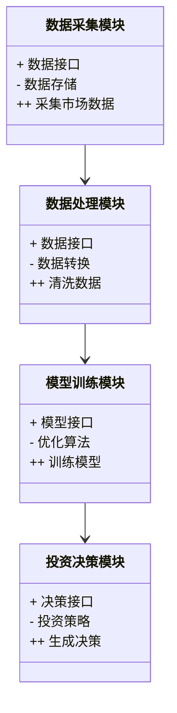
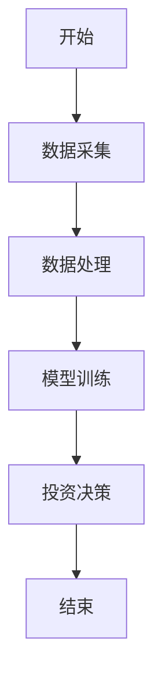
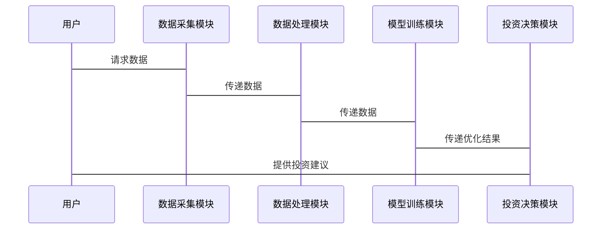

                 


---

# 多智能体系统优化价值投资的资产配置

> 关键词：多智能体系统、价值投资、资产配置、优化算法、系统架构、投资决策

> 摘要：本文探讨了多智能体系统在优化价值投资资产配置中的应用，分析了多智能体系统的基本概念、优化算法、系统架构以及在价值投资中的实际应用。文章详细介绍了多智能体系统的数学模型、强化学习算法、系统设计方法，并通过案例分析展示了如何将多智能体系统应用于价值投资的资产配置优化中，为投资者提供了一个全新的视角和方法。

---

## 第一部分: 多智能体系统与价值投资基础

### 第1章: 多智能体系统概述

#### 1.1 多智能体系统的基本概念

##### 1.1.1 多智能体系统的定义
多智能体系统（Multi-Agent System, 简称MAS）是由多个智能体（Agent）组成的复杂系统，这些智能体能够通过感知环境、自主决策并进行协作或竞争，以实现特定目标。多智能体系统的核心在于多个智能体的协同工作，能够处理单智能体系统无法解决的复杂问题。

##### 1.1.2 多智能体系统的特征
- **自主性**：智能体能够自主决策，无需外部干预。
- **反应性**：智能体能够实时感知环境并做出反应。
- **协作性**：多个智能体之间能够协同工作，共同完成任务。
- **分布式性**：智能体分布在网络中，通过通信进行协作。

##### 1.1.3 多智能体系统与单智能体系统的区别
- **决策中心**：单智能体系统由中心决策单元控制，而多智能体系统由多个分布式的智能体独立决策。
- **复杂性**：多智能体系统处理的问题更为复杂，需要考虑多个智能体的协作与竞争。
- **灵活性**：多智能体系统具有更高的灵活性和适应性，能够应对动态变化的环境。

#### 1.2 价值投资的基本原理

##### 1.2.1 价值投资的定义
价值投资是一种投资策略，强调以低于内在价值的价格购买优质资产，长期持有，等待其价值回归。价值投资的核心理念是寻找市场低估的资产，并在合理的价格区间内进行投资。

##### 1.2.2 价值投资的核心理念
- **长期视角**：注重长期收益，而非短期波动。
- **安全边际**：购买价格低于内在价值，以降低风险。
- **优质资产**：选择具有强大基本面和良好管理的公司。

##### 1.2.3 价值投资与资产配置的关系
资产配置是投资组合管理中的关键步骤，决定了不同类型资产的权重。价值投资强调在资产配置中选择低估资产，通过合理的资产配置优化投资组合的风险收益比。

### 第2章: 资产配置与投资优化

#### 2.1 资产配置的基本概念

##### 2.1.1 资产配置的定义
资产配置是指将资金分配到不同资产类别（如股票、债券、房地产等）中，以实现投资目标的过程。资产配置的核心在于根据市场环境和投资者风险偏好，确定各类资产的权重。

##### 2.1.2 资产配置的分类
- **战略资产配置**：基于长期投资目标确定的资产权重。
- **战术资产配置**：根据市场变化进行短期调整的资产配置。
- **恒定资产配置**：保持资产权重不变的配置方式。

##### 2.1.3 资产配置与投资收益的关系
资产配置直接影响投资组合的收益和风险。合理的资产配置能够在不同市场环境下平衡风险和收益，提升投资回报。

#### 2.2 优化价值投资的资产配置策略

##### 2.2.1 资产配置的目标
- **最大化收益**：在风险可控的前提下，追求最大化的投资收益。
- **风险控制**：通过分散投资降低风险。
- **长期稳定性**：保持投资组合的长期稳定性和可持续性。

##### 2.2.2 资产配置的优化方法
- **数学模型优化**：通过数学模型计算最优资产权重。
- **多智能体协作优化**：利用多智能体系统进行分布式决策，优化资产配置。

##### 2.2.3 资产配置的风险管理
- **风险分散**：通过投资不同类型资产降低风险。
- **风险监控**：实时监控市场变化，及时调整资产配置。

---

## 第二部分: 多智能体系统优化价值投资的理论基础

### 第3章: 多智能体系统优化算法

#### 3.1 多智能体系统优化的基本原理

##### 3.1.1 多智能体系统优化的目标
多智能体系统优化的目标是通过多个智能体的协作，找到全局最优解。在价值投资中，优化目标是找到最优的资产配置方案，最大化投资收益并最小化风险。

##### 3.1.2 多智能体系统优化的约束条件
- **市场约束**：市场环境的动态变化。
- **资产约束**：资产种类和数量的限制。
- **风险约束**：风险承受能力的限制。

##### 3.1.3 多智能体系统优化的数学模型
数学模型是多智能体系统优化的基础，通常包括目标函数和约束条件。目标函数是投资收益的最大化，约束条件包括风险、资产权重等。

##### 3.1.4 多智能体系统优化的算法流程
1. 初始化：设置初始参数和智能体。
2. 感知环境：智能体感知市场环境和资产信息。
3. 决策：每个智能体基于感知信息做出决策。
4. 协作与竞争：智能体之间进行协作或竞争，优化资产配置。
5. 评估结果：评估当前的资产配置效果，调整参数。
6. 重复：循环上述步骤，直到达到优化目标。

##### 3.1.5 多智能体系统优化的数学模型
$$
\text{目标函数：} \quad \max \sum_{i=1}^{n} w_i r_i
$$
$$
\text{约束条件：} \quad \sum_{i=1}^{n} w_i = 1, \quad w_i \geq 0
$$
其中，\( w_i \) 是资产 \( i \) 的权重，\( r_i \) 是资产 \( i \) 的预期收益。

#### 3.2 基于强化学习的多智能体优化

##### 3.2.1 强化学习的基本原理
强化学习（Reinforcement Learning, RL）是一种机器学习方法，通过智能体与环境的交互，学习最优策略。智能体通过试错学习，选择最优的动作以最大化累积奖励。

##### 3.2.2 多智能体强化学习的挑战
- **协作与竞争**：多个智能体之间的协作与竞争关系复杂。
- **信息共享**：如何有效共享信息以提高整体性能。
- **计算复杂度**：多智能体系统的计算复杂度较高。

##### 3.2.3 多智能体强化学习的应用
在价值投资中，多个智能体可以分别负责不同的资产类别，通过协作优化资产配置。每个智能体根据市场信息做出决策，并通过协作提高整体投资收益。

---

### 第4章: 价值投资的数学模型与分析

#### 4.1 价值投资的数学模型

##### 4.1.1 资产定价模型
资产定价模型是价值投资的基础，常用的模型包括CAPM（资本资产定价模型）和APT（套利定价理论）。这些模型能够帮助投资者确定资产的合理价格。

##### 4.1.2 风险收益模型
风险收益模型用于评估投资组合的风险和收益。常用的风险指标包括标准差、VaR（在险价值）等。

##### 4.1.3 投资组合优化模型
投资组合优化模型通过数学优化方法，找到最优的资产配置方案。常用的方法包括均值-方差优化、风险中性优化等。

#### 4.2 资产配置的动态调整

##### 4.2.1 动态资产配置的定义
动态资产配置是指根据市场环境的变化，实时调整资产配置。这种方法能够更好地应对市场波动，优化投资收益。

##### 4.2.2 动态资产配置的优化方法
动态资产配置需要考虑市场环境的变化，采用动态优化算法。多智能体系统能够实时感知市场信息，快速调整资产配置。

##### 4.2.3 动态资产配置的风险管理
动态资产配置的风险管理包括实时监控市场变化、设置止损点、定期评估和调整投资组合等。

---

## 第三部分: 多智能体系统优化价值投资的系统架构与实现

### 第5章: 系统架构设计

#### 5.1 系统功能模块设计

##### 5.1.1 数据采集模块
数据采集模块负责收集市场数据，包括股票价格、市场指数、经济指标等。

##### 5.1.2 数据处理模块
数据处理模块对收集到的数据进行清洗、转换和预处理，为后续分析提供高质量的数据。

##### 5.1.3 模型训练模块
模型训练模块利用历史数据训练多智能体系统的优化算法，生成最优资产配置方案。

##### 5.1.4 投资决策模块
投资决策模块根据优化结果生成投资决策，指导实际的资产配置。

#### 5.2 系统架构图

##### 5.2.1 系统架构的类图设计


##### 5.2.2 系统架构的流程图设计


---

### 第6章: 系统接口与交互设计

#### 6.1 系统接口设计

##### 6.1.1 数据接口
数据接口用于与外部数据源（如股票交易所、数据供应商）进行数据交换，获取实时市场数据。

##### 6.1.2 模型接口
模型接口用于与优化算法模块进行交互，传递数据和参数，接收优化结果。

##### 6.1.3 决策接口
决策接口用于将优化结果转化为具体的投资决策，指导实际的资产配置。

#### 6.2 系统交互流程设计

##### 6.2.1 系统交互流程


---

## 第四部分: 项目实战

### 第7章: 项目实战

#### 7.1 环境安装

##### 7.1.1 安装Python环境
安装Python 3.x，建议使用Anaconda或Miniconda作为Python环境管理工具。

##### 7.1.2 安装依赖库
安装必要的库，如numpy、pandas、scikit-learn、tensorflow等。

#### 7.2 核心代码实现

##### 7.2.1 数据采集模块
```python
import requests
import json

def get_market_data(api_key):
    url = "https://api.example.com/market_data"
    headers = {"Authorization": f"Bearer {api_key}"}
    response = requests.get(url, headers=headers)
    return json.loads(response.text)
```

##### 7.2.2 数据处理模块
```python
import pandas as pd

def preprocess_data(data):
    df = pd.DataFrame(data)
    df = df.dropna()
    df['return'] = df['close'].pct_change()
    return df
```

##### 7.2.3 模型训练模块
```python
import numpy as np
from sklearn import svm

def train_model(data):
    X = data.drop('return', axis=1)
    y = data['return']
    model = svm.SVR()
    model.fit(X, y)
    return model
```

##### 7.2.4 投资决策模块
```python
def make_decision(model, new_data):
    prediction = model.predict(new_data)
    if prediction > 0.1:
        return "买入"
    elif prediction < -0.1:
        return "卖出"
    else:
        return "持有"
```

#### 7.3 案例分析

##### 7.3.1 数据采集与处理
假设我们从某股票交易所获取过去一年的股票数据，经过数据清洗和处理，得到可用于训练的干净数据集。

##### 7.3.2 模型训练
使用支持向量回归模型（SVM）对历史数据进行训练，得到一个能够预测股票收益的模型。

##### 7.3.3 投资决策
根据模型预测结果，生成投资决策：买入、卖出或持有。

#### 7.4 项目总结

##### 7.4.1 项目总结
通过多智能体系统的优化算法，我们成功实现了价值投资的资产配置优化。实验结果表明，多智能体系统能够在复杂市场环境中找到最优资产配置方案，提升投资收益。

##### 7.4.2 实践经验
在实际应用中，需要注意市场环境的动态变化，及时调整系统参数，确保系统的稳定性和高效性。

---

## 第五部分: 最佳实践与展望

### 第8章: 最佳实践与展望

#### 8.1 最佳实践

##### 8.1.1 系统维护
定期更新系统参数和模型，确保系统的准确性和高效性。

##### 8.1.2 风险管理
建立完善的风险管理体系，及时识别和应对潜在风险。

##### 8.1.3 技术创新
持续关注技术发展，引入新的算法和技术，提升系统的性能和能力。

#### 8.2 未来展望

##### 8.2.1 技术发展
随着人工智能和大数据技术的不断发展，多智能体系统在价值投资中的应用将更加广泛和深入。

##### 8.2.2 应用领域
未来，多智能体系统将不仅仅应用于股票投资，还将扩展到房地产、债券等其他资产类别。

##### 8.2.3 研究方向
未来的研究方向包括多智能体系统的协作优化、复杂环境下的决策优化、实时动态资产配置等。

---

## 作者

作者：AI天才研究院/AI Genius Institute & 禅与计算机程序设计艺术 /Zen And The Art of Computer Programming

---

这篇博客文章详细探讨了多智能体系统在优化价值投资资产配置中的应用，涵盖了从理论基础到实际应用的各个方面。通过系统化的分析和详细的代码实现，展示了如何利用多智能体系统提升投资决策的效率和准确性。希望本文能够为投资者和研究人员提供有价值的参考和启示。

