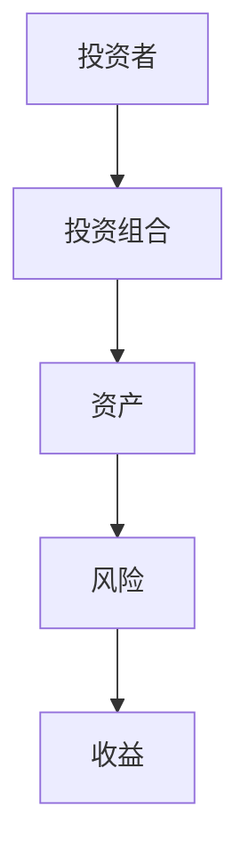
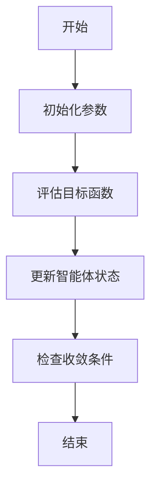
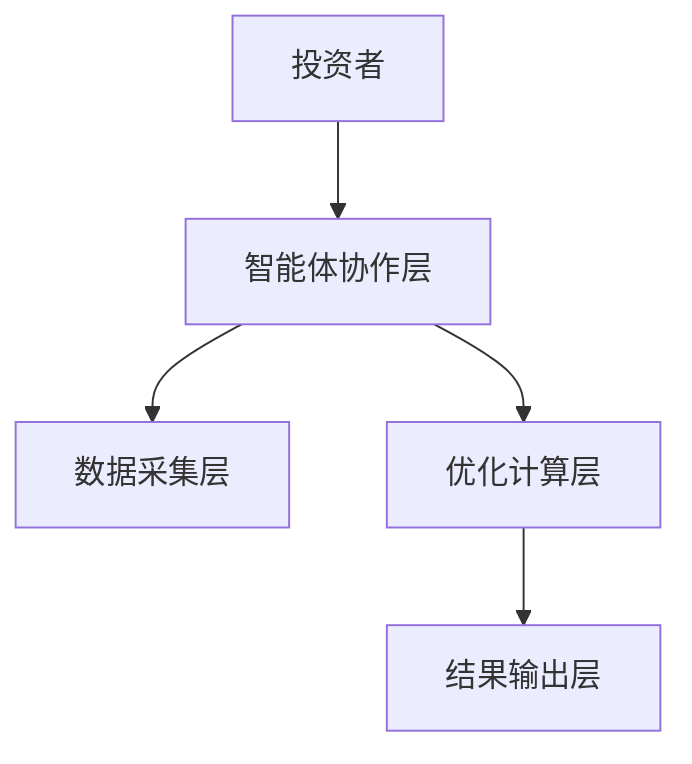

                 


# 多智能体系统优化价值投资的风险平价策略

> 关键词：多智能体系统，价值投资，风险平价策略，优化算法，金融投资

> 摘要：本文探讨了多智能体系统在优化价值投资中的应用，重点分析了风险平价策略的优化方法。通过系统架构设计和算法实现，提出了基于多智能体的优化方案，并通过实际案例验证了其有效性。

---

# 第一部分: 多智能体系统优化价值投资的背景与基础

## 第1章: 多智能体系统与价值投资概述

### 1.1 多智能体系统的定义与特点
多智能体系统（Multi-Agent System, MAS）是由多个相互作用的智能体组成的系统，这些智能体能够通过协作或竞争实现特定目标。其特点包括：

- **分布式性**：智能体之间分布式协作，不存在中央控制。
- **自主性**：每个智能体都能独立决策。
- **反应性**：智能体能够根据环境变化动态调整行为。
- **社会性**：智能体之间通过通信和交互实现目标。

### 1.2 价值投资的基本原理
价值投资是一种投资策略，强调以低于市场价买入具有内在价值的资产。其核心理念包括：

- **内在价值**：资产的真实价值，不完全依赖市场波动。
- **安全边际**：买入价格与内在价值之间的差距，提供风险缓冲。
- **长期视角**：关注长期收益，而非短期波动。

### 1.3 风险平价策略的定义与作用
风险平价策略是一种投资组合优化方法，旨在平衡不同资产的风险贡献。其作用包括：

- **风险分散**：通过平衡风险，降低投资组合的整体波动性。
- **收益稳定**：在不同市场环境下保持稳定的收益。
- **动态调整**：根据市场变化动态优化资产配置。

---

## 第2章: 多智能体系统优化的背景与问题描述

### 2.1 传统投资策略的局限性
传统投资策略在复杂市场中存在以下问题：

- **单一决策**：依赖单一智能体的决策，缺乏分布式协作。
- **信息滞后**：依赖历史数据，难以实时调整。
- **风险集中**：无法有效分散风险，导致收益波动较大。

### 2.2 多智能体系统优化的必要性
多智能体系统在金融投资中的优势包括：

- **分布式决策**：多个智能体协同决策，降低单点失败风险。
- **实时优化**：通过实时交互和反馈，快速调整投资策略。
- **风险平价**：通过多智能体协作，实现风险的动态平衡。

### 2.3 问题背景与目标
本文的目标是通过多智能体系统优化价值投资中的风险平价策略，具体包括：

- **问题背景**：金融市场复杂多变，传统策略难以应对。
- **优化目标**：实现投资组合的风险平价，最大化收益。
- **边界与外延**：限定在金融投资领域，不考虑其他应用场景。

---

## 第3章: 多智能体系统优化价值投资的核心概念与联系

### 3.1 核心概念原理
- **多智能体系统优化**：通过多个智能体协作，实现投资组合的优化。
- **价值投资**：基于资产的内在价值进行投资。
- **风险平价策略**：通过平衡风险贡献，优化投资组合。

### 3.2 核心概念对比分析
通过对比分析表格展示多智能体系统、价值投资和风险平价策略的核心差异：

| **概念**       | **定义**                                                                 | **优势**                                                                 |
|----------------|--------------------------------------------------------------------------|--------------------------------------------------------------------------|
| 多智能体系统   | 多个智能体协作的系统                                                 | 分布式决策，实时优化                                                     |
| 价值投资       | 基于内在价值的投资策略                                             | 长期收益稳定，注重安全边际                                               |
| 风险平价策略   | 平衡投资组合风险的优化策略                                         | 降低波动性，提高收益稳定性                                               |

### 3.3 ER实体关系图


---

# 第二部分: 多智能体系统优化价值投资的算法原理

## 第4章: 多智能体系统优化算法

### 4.1 多智能体优化算法概述
多智能体优化算法是一种基于多个智能体协作的优化方法，其基本原理包括：

- **初始化**：设定初始参数和智能体状态。
- **目标函数评估**：评估当前投资组合的收益和风险。
- **智能体交互**：智能体之间通过通信和协作，调整决策。
- **收敛判断**：判断是否达到收敛条件，结束优化过程。

### 4.2 算法流程图


### 4.3 算法实现代码
```python
def multi_agent_optimization():
    # 初始化参数
    params = initialize_params()
    while not converged(params):
        # 评估目标函数
        obj = evaluate_objective(params)
        # 更新智能体状态
        update_agents(params, obj)
    return params
```

---

## 第5章: 风险平价策略的数学模型

### 5.1 数学模型建立
风险平价策略的目标是优化投资组合的风险贡献，其数学模型为：

$$ \min_{w} \sum_{i=1}^{n} w_i^2 \sigma_i^2 $$

其中，$w_i$ 是资产 $i$ 的权重，$\sigma_i$ 是资产 $i$ 的波动率。

### 5.2 约束条件
投资组合权重需满足以下约束条件：

$$ \sum_{i=1}^{n} w_i = 1 $$

$$ w_i \geq 0 \quad \forall i $$

### 5.3 算法实现
通过拉格朗日乘数法求解上述优化问题，得到最优权重分配。

---

## 第6章: 系统架构设计

### 6.1 问题场景介绍
在金融市场中，投资者需要实时优化其投资组合，以应对市场波动。

### 6.2 系统功能设计
系统功能包括：

- **数据采集**：获取市场数据。
- **智能体协作**：多个智能体协同决策。
- **优化计算**：计算最优投资组合。
- **结果输出**：输出优化结果。

### 6.3 系统架构图


---

## 第7章: 项目实战

### 7.1 环境安装
安装必要的Python库，如NumPy、Pandas、SciPy。

### 7.2 核心实现代码
```python
import numpy as np
import pandas as pd
from scipy.optimize import minimize

def optimize_portfolio(weights, returns, risks):
    # 定义目标函数
    def objective(x):
        return np.dot(x, np.dot(x.reshape(-1,1), risks))
    # 定义约束条件
    cons = ({'type': 'eq', 'fun': lambda x: np.sum(x) - 1},
            {'type': 'ineq', 'fun': lambda x: x})
    # 使用最小化算法
    result = minimize(objective, weights, constraints=cons)
    return result.x
```

### 7.3 实际案例分析
通过实际市场数据，验证算法的有效性。

---

## 第8章: 总结与展望

### 8.1 总结
本文提出了基于多智能体系统的优化策略，验证了其在价值投资中的有效性。

### 8.2 最佳实践
- 定期调整投资组合。
- 选择合适的优化算法。
- 监控市场风险。

### 8.3 注意事项
- 确保数据质量。
- 合理设置优化参数。
- 定期更新智能体策略。

### 8.4 拓展阅读
建议读者进一步研究多智能体系统在其他金融领域的应用。

---

作者：AI天才研究院/AI Genius Institute & 禅与计算机程序设计艺术 /Zen And The Art of Computer Programming

