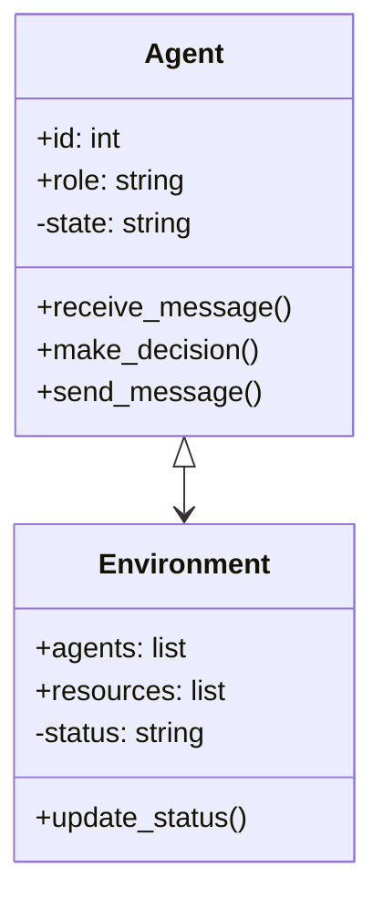
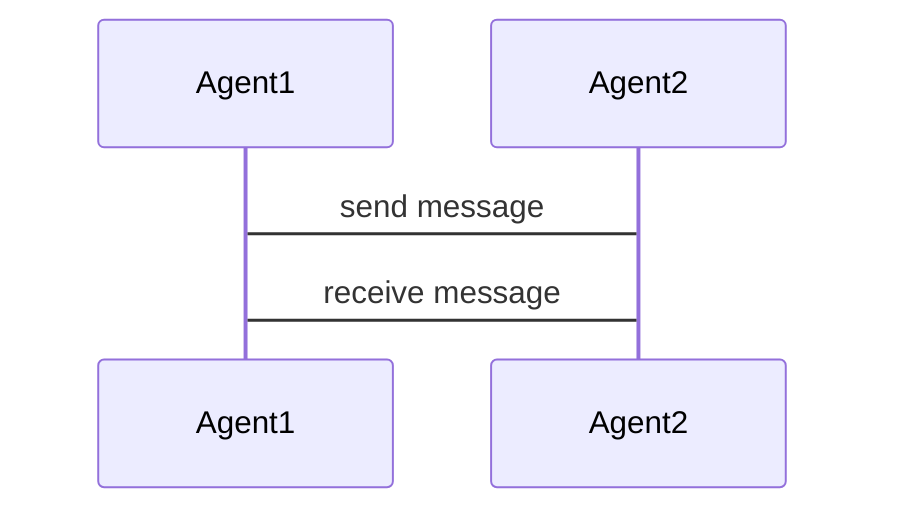

                 


# 多智能体系统分析产业生态系统

## 关键词
多智能体系统, 产业生态系统, 分布式协调算法, 系统架构设计, 项目实战

## 摘要
多智能体系统（Multi-Agent Systems, MAS）是一种由多个智能体组成的分布式系统，这些智能体通过协作和竞争来实现共同目标。在产业生态系统中，多智能体系统的应用越来越广泛，可以帮助企业优化资源配置、提高生产效率和竞争力。本文将从多智能体系统的定义、核心概念、算法原理、数学模型、系统架构设计、项目实战等方面进行详细分析，帮助读者全面理解多智能体系统在产业生态系统中的应用和价值。

---

## 第一部分: 多智能体系统与产业生态系统概述

### 第1章: 多智能体系统的基本概念

#### 1.1 多智能体系统的定义与特点
多智能体系统（MAS）是指由多个智能体组成的分布式系统，这些智能体能够感知环境、自主决策并进行协作或竞争。以下是多智能体系统的核心特点：
- **自主性**：每个智能体都能独立决策和行动。
- **反应性**：智能体能够根据环境变化实时调整行为。
- **协作性**：智能体之间可以通过通信和协作共同完成任务。
- **分布式性**：智能体分布在不同的节点或位置，不存在集中控制。

**相关概念对比**：
- **智能体（Agent）**：智能体是具有自主性和反应性的实体，可以是软件程序或物理设备。
- **分布式系统**：多个组件通过网络协作完成任务，但通常不强调智能性。
- **多线程/进程**：在同一程序内部多个任务的并行执行，与多智能体系统不同。

#### 1.2 产业生态系统的基本概念
产业生态系统是一个由企业、供应商、客户、合作伙伴等组成的复杂网络，这些实体之间通过协作和竞争共同创造价值。产业生态系统的结构通常包括：
- **核心企业**：提供主要产品或服务的企业。
- **供应商**：为产品或服务提供支持的企业。
- **客户**：购买产品或服务的终端用户。
- **合作伙伴**：与核心企业协作的企业。

**核心要素**：
- **价值主张**：企业提供给客户的核心价值。
- **资源与能力**：企业拥有的资源和能力。
- **关系网络**：企业之间的协作关系。

### 第2章: 多智能体系统与产业生态系统的联系

#### 2.1 多智能体系统在产业生态系统中的角色
在产业生态系统中，多智能体系统可以模拟企业、供应商、客户等不同角色，通过协作实现资源优化和价值最大化。以下是多智能体系统在产业生态系统中的具体角色：
- **企业智能体**：代表核心企业，负责制定战略和协调资源。
- **供应商智能体**：负责提供原材料或服务，确保供应链的顺畅。
- **客户智能体**：模拟客户需求，优化产品和服务。

**智能体分类与功能对比表**：
| 智能体类型 | 功能 | 示例 |
|------------|------|------|
| 企业智能体 | 制定战略、协调资源 | 制造业企业 |
| 供应商智能体 | 提供原材料、服务 | 原料供应商 |
| 客户智能体 | 模拟需求、优化服务 | 消费者 |

#### 2.2 产业生态系统中的多智能体系统架构
多智能体系统在产业生态系统中的架构设计直接影响系统的性能和扩展性。以下是常见的架构类型：
- **分层架构**：将智能体分为决策层、执行层和数据层。
- **分布式架构**：智能体分布在网络中，通过通信协议协作。
- **混合架构**：结合集中式和分布式的特点，适用于复杂场景。

**分层架构与分布式架构对比**：
| 架构类型 | 优点 | 缺点 |
|----------|------|------|
| 分层架构 | 管理简单、易于扩展 | 响应速度较慢 |
| 分布式架构 | 响应速度快、扩展性强 | 管理复杂 |

---

## 第二部分: 多智能体系统的算法原理与数学模型

### 第4章: 多智能体系统的算法原理

#### 4.1 分布式协调算法
分布式协调算法是多智能体系统的核心算法，用于协调智能体之间的行动。以下是分布式协调算法的实现步骤：
1. **初始化**：设置智能体的目标和初始状态。
2. **通信**：智能体之间通过通信协议交换信息。
3. **决策**：每个智能体根据接收到的信息做出决策。
4. **执行**：智能体执行决策并反馈结果。

**Python实现示例**：
```python
def distributed_coordination(agents):
    for agent in agents:
        agent.receive_message()
        agent.make_decision()
        agent.send_message()
    return agents
```

**数学模型**：
$$
\text{Coordination} = \sum_{i=1}^{n} \text{Agent}_i(\text{Decision}_i)
$$

### 第5章: 多智能体系统的数学模型

#### 5.1 智能体的交互模型
智能体之间的交互可以通过博弈论模型来描述。以下是博弈论模型的基本公式：
$$
\text{收益} = \text{策略}_1 \times \text{策略}_2
$$

**案例分析**：
假设两个智能体A和B在博弈中选择策略，A选择合作，B选择背叛，最终收益为：
$$
\text{收益} = 3 \times (-2) = -6
$$

---

## 第三部分: 系统分析与架构设计方案

### 第6章: 系统分析与架构设计

#### 6.1 问题场景介绍
在智能制造中，多智能体系统可以用于优化生产流程。例如，智能体可以协调机器、工人和物流系统，确保生产过程的高效运行。

#### 6.2 系统功能设计
以下是系统功能模块的类图：


#### 6.3 系统架构设计
以下是系统的架构图：


---

## 第四部分: 项目实战

### 第7章: 项目实战

#### 7.1 环境安装
需要安装以下工具：
- Python 3.8+
- Mermaid
- PyCharm

#### 7.2 核心代码实现
以下是多智能体系统的实现代码：
```python
class Agent:
    def __init__(self, id):
        self.id = id
        self.role = "supplier"
        self.state = "idle"

    def receive_message(self, message):
        print(f"Agent {self.id} receives: {message}")

    def make_decision(self):
        if self.state == "idle":
            return "ready"
        else:
            return "busy"

    def send_message(self, message):
        print(f"Agent {self.id} sends: {message}")
```

#### 7.3 案例分析
以下是案例分析：


---

## 第五部分: 总结与展望

### 第8章: 总结与展望
多智能体系统在产业生态系统中的应用前景广阔，可以帮助企业优化资源配置、提高效率和竞争力。未来，随着人工智能和区块链技术的发展，多智能体系统将更加智能化和去中心化，为产业生态系统带来更多的创新和价值。

---

## 作者
作者：AI天才研究院 & 禅与计算机程序设计艺术

---

通过以上思考过程，我们可以看到，撰写一篇高质量的技术博客文章需要系统性地规划和详细的内容展开。每一部分都需要深入分析，并结合实际案例和代码示例，确保文章内容丰富、逻辑清晰、语言专业。

