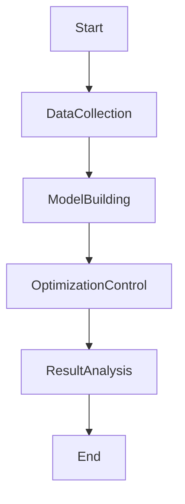

                 


# 多智能体系统分析供应链网络

## 关键词：多智能体系统，供应链网络，协同优化，算法实现，系统设计

## 摘要：  
多智能体系统在供应链网络分析中的应用，通过分布式智能和协同优化，提升供应链的整体效率和应变能力。本文系统地介绍多智能体系统的基本概念、分析方法、协同机制，以及在供应链网络中的具体应用。通过案例分析和项目实战，展示如何利用多智能体系统优化供应链网络的结构和流程，解决实际问题。

---

# 第1章 多智能体系统与供应链网络概述

## 1.1 多智能体系统的基本概念

### 1.1.1 多智能体系统的定义  
多智能体系统（Multi-Agent System, MAS）是由多个智能体（Agent）组成的分布式系统，每个智能体具备自主性、反应性、协作性和社会性等特征，能够通过交互实现复杂任务。

**关键术语：**  
- **智能体（Agent）：** 具备感知环境和自主决策能力的实体。  
- **自主性：** 智能体能够在没有外部干预的情况下自主决策。  
- **反应性：** 智能体能够根据环境变化动态调整行为。  
- **协作性：** 智能体之间通过协作完成复杂任务。  

### 1.1.2 多智能体系统的特征  
1. **分布式性：** 智能体独立运行，通过通信协作完成任务。  
2. **自主性：** 每个智能体具备独立决策能力。  
3. **动态性：** 系统环境和智能体状态动态变化。  
4. **协作性：** 智能体之间通过协作实现全局目标。  

### 1.1.3 多智能体系统与供应链网络的关系  
供应链网络是一个复杂的协作系统，涉及供应商、制造商、分销商和消费者等多个实体。多智能体系统能够模拟这些实体的行为，优化供应链的运作效率。

---

## 1.2 供应链网络的基本概念

### 1.2.1 供应链的定义  
供应链（Supply Chain）是指从原材料采购到产品交付给最终用户的整个流程，包括生产、物流、库存管理和需求预测等多个环节。

### 1.2.2 供应链的组成部分  
1. **供应商：** 提供原材料或零部件。  
2. **制造商：** 进行产品加工。  
3. **分销商：** 负责产品的分发和配送。  
4. **零售商：** 面向最终用户的销售环节。  
5. **消费者：** 最终产品的需求方。  

### 1.2.3 供应链网络的复杂性  
供应链网络涉及多个环节和参与者，每个环节都可能面临不确定性，如市场需求波动、物流延迟和库存积压等问题。

---

## 1.3 多智能体系统在供应链管理中的应用

### 1.3.1 多智能体系统在供应链中的角色  
1. **智能体作为供应链参与者：** 每个智能体可以代表供应链中的一个实体，如供应商、制造商或分销商。  
2. **智能体作为决策支持工具：** 智能体可以辅助决策，优化供应链的运作效率。  

### 1.3.2 多智能体系统在供应链优化中的作用  
1. **协同优化：** 智能体之间通过协作，优化供应链的整体效率。  
2. **动态调整：** 面对环境变化，智能体能够快速调整策略，应对不确定性。  

### 1.3.3 多智能体系统与供应链网络的结合  
通过将供应链中的实体建模为智能体，多智能体系统能够模拟供应链的运作，优化资源分配和流程管理。

---

## 1.4 本章小结  
本章介绍了多智能体系统的基本概念和供应链网络的核心要素，分析了多智能体系统在供应链管理中的应用。通过本章的学习，读者可以理解多智能体系统与供应链网络的结合方式，为后续的分析和优化打下基础。

---

# 第2章 多智能体系统分析方法

## 2.1 多智能体系统分析的基本步骤

### 2.1.1 系统建模  
建模是分析的基础，需要明确系统的组成、关系和行为。  
- **系统组成：** 明确供应链网络中的参与者及其角色。  
- **系统关系：** 描述参与者之间的协作关系。  

**示例：** 使用Mermaid绘制供应链网络的协作关系图。


### 2.1.2 系统分析  
分析系统的运行机制，识别关键问题和优化点。  
- **问题识别：** 确定供应链中的瓶颈环节。  
- **问题分析：** 分析问题的根本原因。  

### 2.1.3 系统优化  
基于分析结果，提出优化策略。  
- **优化目标：** 如降低库存成本、提高交付效率。  
- **优化策略：** 如动态调整生产计划、优化物流路径。  

---

## 2.2 多智能体系统的建模方法

### 2.2.1 基于Agent的建模方法  
将供应链中的每个参与者建模为一个智能体，明确每个智能体的目标和行为。  
- **智能体目标：** 例如，供应商的目标是按时交付原材料，制造商的目标是优化生产计划。  
- **智能体行为：** 如感知环境、决策、执行操作。  

### 2.2.2 基于网络的建模方法  
将供应链网络建模为一个图，节点代表参与者，边代表协作关系。  
- **节点属性：** 如供应商的供货能力、制造商的生产能力。  
- **边属性：** 如供应链的运输成本、时间延迟。  

### 2.2.3 基于博弈论的建模方法  
将供应链中的参与者建模为博弈者，分析他们的策略选择和收益分配。  
- **博弈规则：** 如供应商与制造商之间的定价博弈。  
- **纳什均衡：** 分析策略的稳定性。  

---

## 2.3 多智能体系统的分析方法

### 2.3.1 系统动力学分析  
分析系统的动态变化，预测系统的演化趋势。  
- **动力学模型：** 如微分方程模型，描述库存、生产等变量的动态变化。  

### 2.3.2 网络流分析  
分析供应链网络中的资源流动，优化物流路径。  
- **流网络模型：** 如最大流最小割模型，用于优化物流路径。  

### 2.3.3 多智能体协同分析  
分析智能体之间的协作行为，优化系统的整体性能。  
- **协同机制：** 如信息共享、决策协调。  

---

## 2.4 本章小结  
本章介绍了多智能体系统的分析方法，包括建模、分析和优化的基本步骤。通过这些方法，可以系统地分析供应链网络的结构和行为，为后续的优化提供理论基础。

---

# 第3章 多智能体系统与供应链网络的协同机制

## 3.1 供应链网络中的多智能体协同

### 3.1.1 供应链中的协同问题  
供应链中的协同问题主要表现在信息共享、决策协调和资源分配等方面。  
- **信息共享：** 如供应商和制造商之间的信息同步。  
- **决策协调：** 如生产计划与物流计划的协调。  

### 3.1.2 多智能体协同的基本原理  
通过智能体之间的通信与协作，实现供应链网络的整体优化。  
- **通信机制：** 智能体之间通过消息传递共享信息。  
- **协作机制：** 智能体之间通过协同完成复杂任务。  

### 3.1.3 供应链网络中的协同机制  
1. **信息共享机制：** 智能体之间实时共享信息，减少信息不对称。  
2. **决策协调机制：** 智能体之间协商一致，优化决策。  
3. **资源分配机制：** 智能体之间合理分配资源，提高效率。  

---

## 3.2 多智能体系统的协同模型

### 3.2.1 基于Agent的协同模型  
将供应链中的参与者建模为智能体，明确每个智能体的目标和行为。  
- **智能体目标：** 如供应商的目标是按时交付，制造商的目标是优化生产。  
- **智能体行为：** 如感知环境、决策、执行操作。  

### 3.2.2 基于网络的协同模型  
将供应链网络建模为一个图，节点代表参与者，边代表协作关系。  
- **节点属性：** 如供应商的供货能力、制造商的生产能力。  
- **边属性：** 如供应链的运输成本、时间延迟。  

### 3.2.3 基于博弈论的协同模型  
将供应链中的参与者建模为博弈者，分析他们的策略选择和收益分配。  
- **博弈规则：** 如供应商与制造商之间的定价博弈。  
- **纳什均衡：** 分析策略的稳定性。  

---

## 3.3 供应链网络中的协同优化

### 3.3.1 协同优化的目标  
通过智能体之间的协作，优化供应链的整体效率。  
- **优化目标：** 如降低库存成本、提高交付效率。  
- **优化策略：** 如动态调整生产计划、优化物流路径。  

### 3.3.2 协同优化的实现  
通过智能体之间的通信与协作，实现供应链网络的整体优化。  
- **通信机制：** 智能体之间通过消息传递共享信息。  
- **协作机制：** 智能体之间通过协商一致，优化决策。  

---

## 3.4 本章小结  
本章介绍了多智能体系统与供应链网络的协同机制，分析了协同优化的目标和实现方法。通过本章的学习，读者可以理解如何通过智能体之间的协作，优化供应链的整体效率。

---

# 第4章 多智能体系统分析供应链网络的关键算法实现

## 4.1 基于分布式优化的算法

### 4.1.1 分布式优化算法的原理  
分布式优化算法是一种通过智能体之间的协作，实现全局优化的算法。  
- **算法特点：** 分布式、去中心化、高效性。  
- **算法步骤：** 初始化、迭代优化、收敛判断。  

### 4.1.2 分布式优化算法的实现  
通过Python代码实现一个简单的分布式优化算法，优化供应链中的库存成本。  

**代码示例：**

```python
# 分布式优化算法实现
def distributed_optimization(agents, objective_function):
    while not converged:
        for agent in agents:
            agent.update_state(objective_function)
        check_convergence(agents)
```

### 4.1.3 分布式优化算法的应用  
将分布式优化算法应用于供应链网络中，优化库存成本、生产计划等。  

---

## 4.2 基于博弈论的算法

### 4.2.1 博弈论算法的原理  
博弈论算法通过模拟供应链中的博弈关系，优化各方的决策。  
- **博弈规则：** 如供应商与制造商之间的定价博弈。  
- **纳什均衡：** 分析策略的稳定性。  

### 4.2.2 博弈论算法的实现  
通过Python代码实现一个简单的博弈论算法，模拟供应链中的博弈过程。  

**代码示例：**

```python
# 博弈论算法实现
def game_theory_algorithm(players, payoff_matrix):
    for player in players:
        player.strategy = find_nash_equilibrium(player, payoff_matrix)
    return players
```

### 4.2.3 博弈论算法的应用  
将博弈论算法应用于供应链网络中，优化各方的策略，实现整体优化。  

---

## 4.3 基于分布式计算的算法

### 4.3.1 分布式计算算法的原理  
分布式计算算法通过智能体之间的协作，实现全局计算。  
- **算法特点：** 分布式、并行计算、高效性。  
- **算法步骤：** 初始化、分布式计算、结果汇总。  

### 4.3.2 分布式计算算法的实现  
通过Python代码实现一个简单的分布式计算算法，优化供应链中的物流路径。  

**代码示例：**

```python
# 分布式计算算法实现
def distributed_computation(agents, task):
    results = []
    for agent in agents:
        result = agent.compute(task)
        results.append(result)
    return aggregate(results)
```

### 4.3.3 分布式计算算法的应用  
将分布式计算算法应用于供应链网络中，优化物流路径、资源分配等。  

---

## 4.4 本章小结  
本章介绍了多智能体系统分析供应链网络的关键算法，包括分布式优化算法、博弈论算法和分布式计算算法。通过本章的学习，读者可以理解如何通过算法实现供应链网络的优化。

---

# 第5章 多智能体系统分析供应链网络的系统架构设计

## 5.1 系统功能设计

### 5.1.1 系统功能模块  
1. **数据采集模块：** 采集供应链网络中的数据。  
2. **模型构建模块：** 建立供应链网络的模型。  
3. **优化控制模块：** 实现供应链网络的优化控制。  
4. **结果分析模块：** 分析优化结果并输出报告。  

### 5.1.2 系统功能流程  
通过Mermaid流程图展示系统的功能流程。  



---

## 5.2 系统架构设计

### 5.2.1 系统架构设计  
通过Mermaid架构图展示系统的架构设计。  


---

## 5.3 系统接口设计

### 5.3.1 系统接口定义  
1. **数据采集接口：** 用于采集供应链网络中的数据。  
2. **模型构建接口：** 用于建立供应链网络的模型。  
3. **优化控制接口：** 用于实现供应链网络的优化控制。  
4. **结果分析接口：** 用于分析优化结果并输出报告。  

### 5.3.2 系统接口实现  
通过Python代码实现系统接口。  

**代码示例：**

```python
# 系统接口定义
class SupplyChainSystem:
    def __init__(self):
        self.data_collection = DataCollection()
        self.model_building = ModelBuilding()
        self.optimization_control = OptimizationControl()
        self.result_analysis = ResultAnalysis()

    def run(self):
        self.data_collection.collect_data()
        self.model_building.build_model()
        self.optimization_control.optimize()
        self.result_analysis.analyze_results()
```

---

## 5.4 本章小结  
本章介绍了多智能体系统分析供应链网络的系统架构设计，包括功能设计、架构设计和接口设计。通过本章的学习，读者可以理解如何设计一个完整的供应链网络分析系统。

---

# 第6章 多智能体系统分析供应链网络的项目实战

## 6.1 项目背景与目标

### 6.1.1 项目背景  
供应链网络优化是一个复杂的系统工程，涉及多个环节和参与者。通过多智能体系统，可以模拟供应链的运作，优化整体效率。  

### 6.1.2 项目目标  
1. 实现供应链网络的建模与分析。  
2. 优化供应链网络的运作效率。  
3. 提供决策支持工具，辅助供应链管理。  

---

## 6.2 项目环境配置

### 6.2.1 环境要求  
1. 操作系统：Windows/Mac/Linux。  
2. Python版本：3.6以上。  
3. 工具：Python、Mermaid、Matplotlib等。  

### 6.2.2 安装依赖  
1. 安装Python依赖：`pip install mermaid.py matplotlib`。  
2. 安装Jupyter Notebook：`pip install jupyter`。  

---

## 6.3 项目核心实现

### 6.3.1 数据采集与处理  
1. 数据采集：从数据库或CSV文件中读取数据。  
2. 数据清洗：处理缺失值、异常值等。  

**代码示例：**

```python
# 数据采集与处理
import pandas as pd

data = pd.read_csv('supply_chain_data.csv')
data = data.dropna()
print(data.head())
```

### 6.3.2 模型构建与优化  
1. 建立供应链网络的模型。  
2. 使用分布式优化算法优化模型。  

**代码示例：**

```python
# 模型构建与优化
from optimization_algorithm import DistributedOptimizer

optimizer = DistributedOptimizer()
optimized_model = optimizer.optimize_model(initial_model)
```

### 6.3.3 结果分析与可视化  
1. 分析优化结果。  
2. 使用Matplotlib绘制优化前后的对比图。  

**代码示例：**

```python
# 结果分析与可视化
import matplotlib.pyplot as plt

plt.figure(figsize=(10, 6))
plt.plot(original_data, label='Original')
plt.plot(optimized_data, label='Optimized')
plt.xlabel('Time')
plt.ylabel('Cost')
plt.legend()
plt.show()
```

---

## 6.4 项目小结  
本章通过一个实际的项目案例，展示了如何利用多智能体系统分析供应链网络。从环境配置到核心实现，再到结果分析，详细介绍了项目的整个流程。通过本章的学习，读者可以掌握如何将理论应用于实际。

---

# 第7章 多智能体系统分析供应链网络的总结与展望

## 7.1 总结

### 7.1.1 核心内容回顾  
1. 多智能体系统的基本概念和供应链网络的核心要素。  
2. 多智能体系统的分析方法和协同机制。  
3. 多智能体系统分析供应链网络的关键算法和系统设计。  
4. 项目实战和总结与展望。  

### 7.1.2 项目成果  
通过多智能体系统分析供应链网络，优化了供应链的整体效率，提高了系统的应变能力。  

---

## 7.2 研究中的挑战与未来方向

### 7.2.1 研究中的挑战  
1. 供应链网络的动态性和不确定性。  
2. 多智能体系统中的通信与协作问题。  
3. 算法的复杂性和计算效率问题。  

### 7.2.2 未来方向  
1. 研究更高效的分布式优化算法。  
2. 探索多智能体系统在供应链网络中的新应用。  
3. 结合大数据和人工智能技术，提升系统的智能化水平。  

---

## 7.3 最佳实践 Tips

### 7.3.1 数据质量的重要性  
数据是分析的基础，确保数据的准确性和完整性。  

### 7.3.2 算法选择的策略  
根据实际问题选择合适的算法，避免盲目追求复杂性。  

### 7.3.3 系统设计的原则  
遵循模块化设计，确保系统的可扩展性和可维护性。  

---

## 7.4 本章小结  
本章总结了多智能体系统分析供应链网络的核心内容，分析了研究中的挑战和未来方向，提出了最佳实践的建议。通过本章的学习，读者可以更好地理解如何将多智能体系统应用于供应链网络的分析与优化。

---

# 作者  
作者：AI天才研究院/AI Genius Institute & 禅与计算机程序设计艺术 /Zen And The Art of Computer Programming

