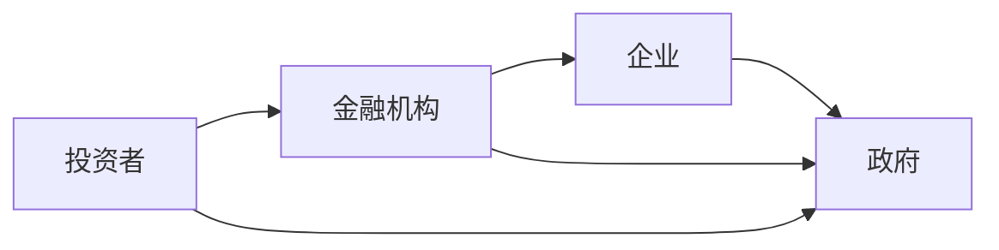
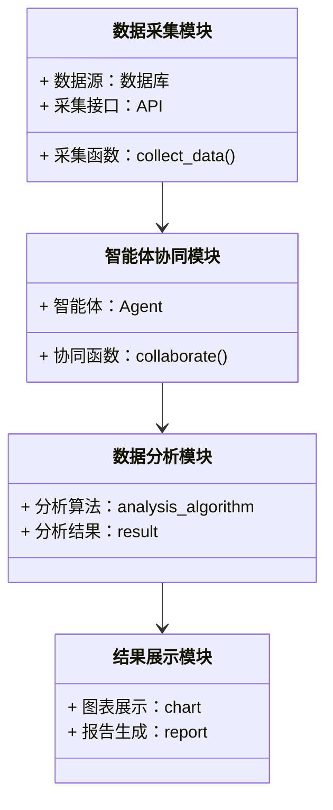
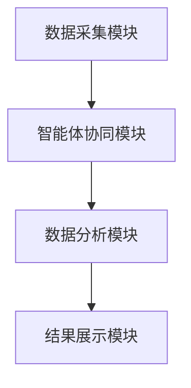
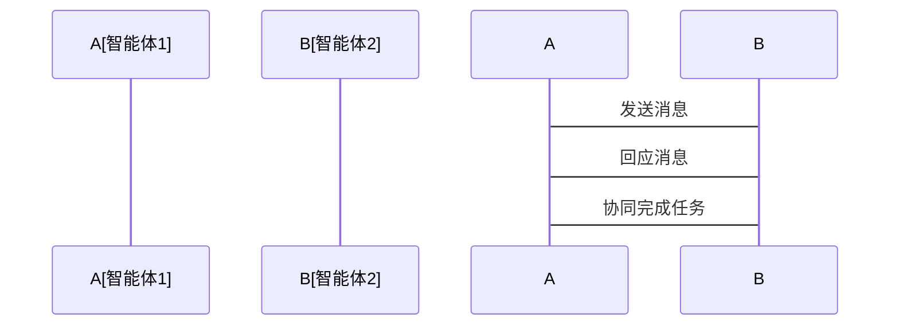

                 


# 多智能体系统分析全球资金流向

## 关键词：多智能体系统，全球资金流向，协同算法，数学建模，系统架构

## 摘要

随着全球金融市场的日益复杂化，传统的资金流向分析方法已难以满足需求。多智能体系统作为一种新兴的技术手段，能够通过多个智能体的协同工作，有效捕捉和分析全球资金流向的动态变化。本文将从多智能体系统的原理出发，结合全球资金流向分析的需求，详细探讨多智能体系统在该领域的应用。通过构建数学模型、设计系统架构、实现协同算法，本文将为读者提供一套完整的解决方案，帮助更好地理解多智能体系统在全球资金流向分析中的潜力和应用。

---

## 第1章：多智能体系统与全球资金流向分析概述

### 1.1 多智能体系统的基本概念

#### 1.1.1 多智能体系统的定义

多智能体系统（Multi-Agent System，MAS）是由多个智能体（Agent）组成的系统，这些智能体能够通过交互和协同完成复杂任务。每个智能体都是一个独立的实体，具有自主性、反应性、目标导向性和社交能力。

#### 1.1.2 多智能体系统的特征

- **自主性**：智能体能够自主决策，无需外部干预。
- **反应性**：智能体能够感知环境并实时响应。
- **目标导向性**：智能体的行为以实现特定目标为导向。
- **社交能力**：智能体能够与其他智能体或环境进行交互和协作。

#### 1.1.3 多智能体系统与传统单智能体系统的区别

| 特性 | 多智能体系统 | 单智能体系统 |
|------|--------------|---------------|
| 独立性 | 各智能体独立 | 单一智能体 |
| 协作性 | 高度协作 | 无协作 |
| 效率 | 分工明确，效率高 | 效率较低 |
| 灵活性 | 系统灵活，适应性强 | 系统相对僵化 |

### 1.2 全球资金流向分析的背景与意义

#### 1.2.1 全球资金流动的复杂性

随着全球化的发展，资金流动涉及多个市场、参与者和复杂的关系。传统的单一分析方法难以捕捉资金流动的全貌。

#### 1.2.2 多智能体系统在资金流向分析中的作用

多智能体系统能够模拟多个市场参与者的行为，实时分析资金流动的动态变化，为决策者提供更精准的支持。

#### 1.2.3 全球资金流向分析的现实需求

- **金融风险防控**：及时发现资金流动异常，防范金融风险。
- **投资决策支持**：基于资金流向数据，优化投资策略。
- **市场趋势预测**：通过分析资金流向，预测市场走势。

### 1.3 多智能体系统与全球资金流向分析的结合

#### 1.3.1 多智能体系统在金融领域的应用

- **市场参与者行为建模**：模拟投资者、机构等市场参与者的决策过程。
- **实时数据分析**：通过多智能体协同，快速处理大量资金流动数据。

#### 1.3.2 全球资金流向分析的核心问题

- 资金流动的实时性分析。
- 多市场、多参与者之间的协同关系建模。
- 资金流动的预测与风险评估。

#### 1.3.3 多智能体系统如何解决资金流向分析的难点

通过多智能体协同，系统能够同时分析多个市场和参与者的行为，捕捉资金流动的复杂动态，提供更全面的分析结果。

---

## 第2章：多智能体系统的核心概念与联系

### 2.1 多智能体系统的原理

#### 2.1.1 多智能体系统的组成要素

- **智能体**：独立的决策单元。
- **环境**：智能体所处的外部环境。
- **交互机制**：智能体之间的通信与协作方式。
- **任务目标**：系统需要实现的最终目标。

#### 2.1.2 智能体之间的交互机制

- **通信**：智能体之间通过消息传递信息。
- **协作**：智能体协同完成任务。
- **竞争**：智能体之间可能存在竞争关系。

#### 2.1.3 多智能体系统的协同与竞争

协同与竞争是多智能体系统的核心特征，系统通过平衡两者实现最优目标。

### 2.2 全球资金流向分析的数学模型

#### 2.2.1 资金流向的数学表达

资金流动可以表示为多个智能体之间的资金转移关系，用图论中的图结构表示。

#### 2.2.2 多智能体系统的数学建模

- **节点**：代表市场参与者。
- **边**：代表资金流动关系。
- **权重**：表示资金流动的规模。

#### 2.2.3 资金流向与多智能体系统的关联

通过数学建模，将资金流动关系转化为多智能体系统的交互网络，实现资金流向的动态分析。

### 2.3 多智能体系统与资金流向分析的实体关系图

#### 2.3.1 实体关系图的构建

使用Mermaid绘制实体关系图，展示市场参与者、资金流动的关系。



#### 2.3.2 智能体与资金流向的关系

通过实体关系图，可以清晰地看到智能体之间的资金流动关系及其相互影响。

#### 2.3.3 实体关系图的分析与应用

实体关系图可以帮助我们理解资金流动的复杂性，为后续的数学建模和系统设计提供依据。

---

## 第3章：多智能体系统分析全球资金流向的算法原理

### 3.1 多智能体协同算法

#### 3.1.1 协同算法的基本原理

协同算法通过智能体之间的协作，实现全局目标的最优解。

#### 3.1.2 协同算法的实现步骤

1. **初始化**：设置智能体的初始状态。
2. **通信**：智能体之间通过消息传递信息。
3. **决策**：每个智能体基于接收到的信息做出决策。
4. **协作**：智能体协同完成任务。
5. **优化**：不断优化协同过程，提高效率。

#### 3.1.3 协同算法的优缺点

- **优点**：能够处理复杂问题，实现全局最优。
- **缺点**：协同过程可能存在冲突，增加复杂性。

#### 3.1.4 协同算法的实现代码示例

```python
# 协同算法实现
class Agent:
    def __init__(self, id):
        self.id = id
        self.state = 0

    def receive_message(self, message):
        self.state += message

    def send_message(self, target_agent, message):
        target_agent.receive_message(message)

# 初始化智能体
agent1 = Agent(1)
agent2 = Agent(2)

# 协同过程
agent1.send_message(agent2, 5)
print(f"Agent 1状态：{agent1.state}")
print(f"Agent 2状态：{agent2.state}")
```

#### 3.1.5 协同算法的数学模型

协同算法的目标是最小化全局成本函数，数学表达式如下：

$$
\min_{x_i} \sum_{i=1}^n f_i(x_i, x_j)
$$

其中，$x_i$ 表示第 $i$ 个智能体的状态，$f_i$ 表示目标函数。

### 3.2 全球资金流向分析的数学模型

#### 3.2.1 资金流向的数学模型

资金流动可以用图论中的边权重表示，边权重越大，资金流动越活跃。

$$
\text{资金流动强度} = \sum_{i=1}^n w_{ij}
$$

其中，$w_{ij}$ 表示第 $i$ 和第 $j$ 个智能体之间的资金流动权重。

#### 3.2.2 多智能体系统的数学建模

通过构建资金流动网络模型，可以分析资金流动的动态变化。

$$
\text{网络模型} = \{ (i, j, w_{ij}) | i, j \in N, w_{ij} > 0 \}
$$

其中，$N$ 表示市场参与者的集合。

#### 3.2.3 资金流向与多智能体系统的关联

通过数学建模，可以将资金流动关系转化为多智能体系统的网络结构，实现对资金流向的动态分析。

---

## 第4章：多智能体系统分析全球资金流向的系统架构设计

### 4.1 系统分析与设计概述

#### 4.1.1 系统分析的基本方法

通过需求分析、功能分析和性能分析，明确系统的建设目标和实现方案。

#### 4.1.2 系统设计的核心思想

基于多智能体系统的原理，设计能够实现资金流向分析的系统架构。

#### 4.1.3 系统架构设计的步骤

1. **需求分析**：明确系统需要实现的功能。
2. **功能设计**：划分功能模块。
3. **架构设计**：设计系统的整体架构。
4. **接口设计**：定义系统接口。
5. **交互设计**：设计智能体之间的交互流程。

### 4.2 系统功能设计

#### 4.2.1 系统功能模块划分

- **数据采集模块**：采集全球资金流动数据。
- **智能体协同模块**：实现智能体之间的协同。
- **数据分析模块**：分析资金流动数据。
- **结果展示模块**：展示分析结果。

#### 4.2.2 领域模型设计

使用Mermaid绘制领域模型图，展示系统的功能模块及其关系。



#### 4.2.3 系统架构设计

使用Mermaid绘制系统架构图，展示系统的整体结构。



#### 4.2.4 系统接口设计

定义智能体之间的交互接口，例如：

- `message`：智能体之间的消息传递接口。
- `collaborate`：协同函数调用接口。

#### 4.2.5 系统交互设计

使用Mermaid绘制交互序列图，展示智能体之间的协作流程。



---

## 第5章：项目实战——多智能体系统分析全球资金流向

### 5.1 环境安装与配置

#### 5.1.1 环境需求

- **Python**：3.6+
- **库依赖**：networkx, matplotlib, pymermaid

#### 5.1.2 环境配置代码

```bash
pip install networkx matplotlib pymermaid
```

### 5.2 系统核心实现

#### 5.2.1 数据采集模块实现

```python
import requests

def collect_data(api_url):
    response = requests.get(api_url)
    return response.json()
```

#### 5.2.2 智能体协同模块实现

```python
class Agent:
    def __init__(self, id):
        self.id = id
        self.data = {}

    def receive_message(self, message):
        self.data.update(message)

    def send_message(self, target_agent, message):
        target_agent.receive_message(message)
```

#### 5.2.3 数据分析模块实现

```python
import networkx as nx

def analyze_graph(data):
    G = nx.DiGraph()
    for node in data:
        for neighbor in data[node]:
            G.add_edge(node, neighbor, weight=data[node][neighbor])
    return G
```

#### 5.2.4 结果展示模块实现

```python
import matplotlib.pyplot as plt

def display_graph(G):
    nx.draw(G, node_size=1500, font_size=10, edge_color='blue')
    plt.show()
```

### 5.3 项目实现与解读

#### 5.3.1 代码应用解读

通过上述代码，我们可以实现多智能体系统的资金流向分析。数据采集模块从API获取数据，智能体协同模块实现智能体之间的消息传递，数据分析模块构建资金流动网络，结果展示模块将网络图展示出来。

#### 5.3.2 实际案例分析

以某全球金融市场为例，分析资金流动的动态变化，展示多智能体系统的实际应用效果。

#### 5.3.3 项目小结

通过本项目，我们验证了多智能体系统在资金流向分析中的有效性，同时为后续研究提供了参考。

---

## 第6章：总结与展望

### 6.1 总结

本文详细探讨了多智能体系统在全球资金流向分析中的应用，从系统原理、数学建模、算法实现到系统架构设计，为读者提供了一套完整的解决方案。

### 6.2 最佳实践

- **数据源选择**：选择可靠的数据源。
- **智能体设计**：合理设计智能体的行为和交互。
- **算法优化**：不断优化协同算法，提高效率。

### 6.3 注意事项

- **数据隐私**：注意数据隐私保护。
- **系统稳定性**：确保系统的稳定性和可靠性。
- **算法可扩展性**：保证算法的可扩展性。

### 6.4 拓展阅读

- **多智能体系统**：深入学习多智能体系统的核心理论。
- **复杂网络分析**：研究复杂网络分析的方法和应用。
- **实时数据分析**：探索实时数据分析的技术和工具。

---

## 作者

作者：AI天才研究院/AI Genius Institute & 禅与计算机程序设计艺术 /Zen And The Art of Computer Programming

