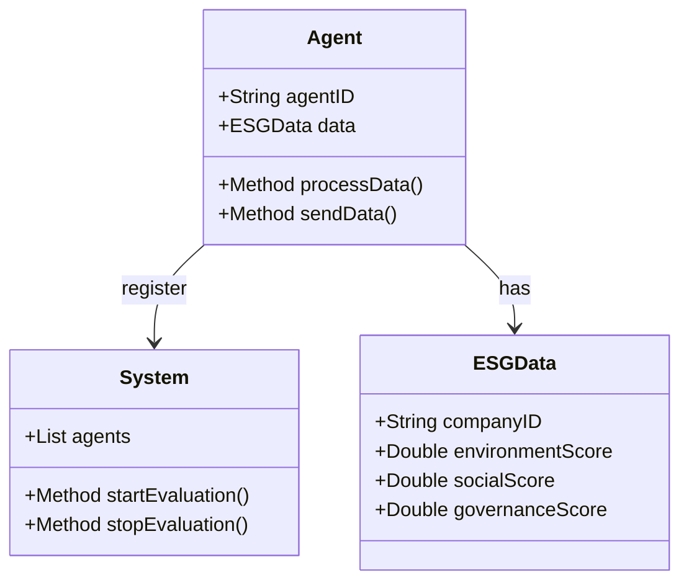
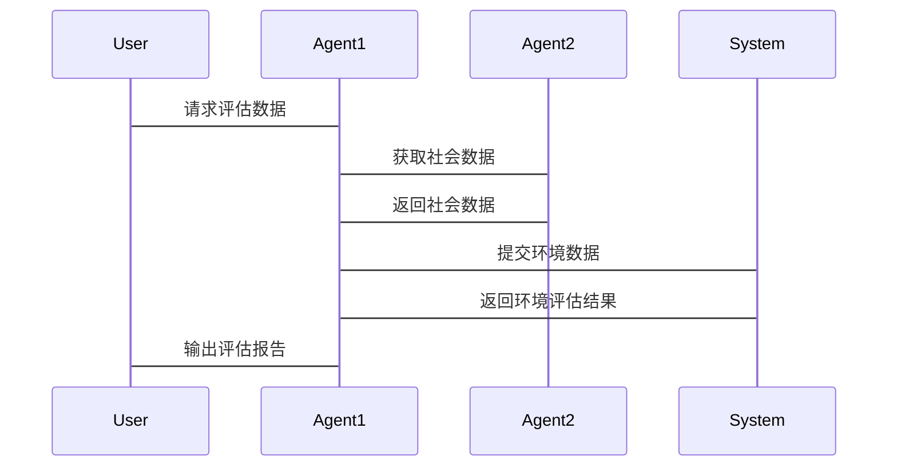

                 


# 多智能体系统在ESG因素评估中的应用

> 关键词：多智能体系统，ESG评估，协同学习，优化算法，系统架构

> 摘要：本文探讨了多智能体系统（MAS）在ESG（环境、社会和治理）因素评估中的应用。通过分析多智能体系统的协作机制、算法原理和系统架构，结合实际案例，展示了如何利用MAS技术优化ESG评估的效率和准确性。文章详细介绍了核心概念、技术实现和应用实践，为相关领域的研究和应用提供了参考。

---

## 第1章：多智能体系统与ESG评估的背景与基础

### 1.1 多智能体系统的基本概念

#### 1.1.1 多智能体系统的定义
多智能体系统（Multi-Agent System，MAS）是由多个智能体组成的分布式系统，这些智能体能够自主决策、协作完成任务。智能体具有感知环境、推理和自主行动的能力。

#### 1.1.2 多智能体系统的特征
- **分布式性**：智能体独立运行，通过通信协作完成目标。
- **自主性**：智能体在没有外部干预下自主决策。
- **协作性**：智能体之间通过协作提高整体效率。
- **动态性**：环境和任务需求可能动态变化。

#### 1.1.3 多智能体系统的分类
- **基于任务的MAS**：根据任务需求协作。
- **基于市场的MAS**：通过市场机制分配资源。
- **基于模型的MAS**：基于模型进行推理和协作。

### 1.2 ESG评估的核心概念

#### 1.2.1 ESG的定义与内涵
ESG是环境、社会和治理三个维度的综合评估，用于衡量企业可持续发展能力和社会责任履行情况。

#### 1.2.2 ESG评估的主要维度
- **环境（E）**：碳排放、资源利用效率等。
- **社会（S）**：员工权益、社区关系等。
- **治理（G）**：公司治理结构、高管薪酬等。

#### 1.2.3 ESG评估的行业应用
- 金融投资：评估企业风险和投资价值。
- 企业战略：优化企业运营和风险管理。
- 政府监管：制定政策和监管标准。

### 1.3 多智能体系统在ESG评估中的应用背景

#### 1.3.1 ESG评估的复杂性与挑战
- 数据量大，维度复杂。
- 信息分散，难以整合。
- 评估标准不统一，结果偏差大。

#### 1.3.2 多智能体系统的优势
- **分布式计算**：处理海量数据，提高效率。
- **协作优化**：智能体协同，提升评估准确性。
- **动态适应**：快速响应数据变化。

#### 1.3.3 应用前景与研究现状
- 研究逐渐增多，但应用仍处于起步阶段。
- 技术成熟后，有望成为ESG评估的重要工具。

### 1.4 本章小结
本章介绍了多智能体系统的定义、特征和分类，以及ESG评估的核心概念和行业应用。阐述了MAS在ESG评估中的优势和应用前景，为后续章节的分析奠定了基础。

---

## 第2章：多智能体系统与ESG评估的核心概念

### 2.1 多智能体系统的组成与功能

#### 2.1.1 智能体的定义与属性
- **智能体**：能够感知环境、推理和自主行动的实体。
- **属性**：自主性、反应性、协作性、学习能力。

#### 2.1.2 多智能体系统的结构
- **层次结构**：分为高层决策层和底层执行层。
- **网络结构**：通过通信协议连接各智能体。

#### 2.1.3 智能体之间的协作机制
- **直接通信**：智能体之间通过消息传递协作。
- **间接协作**：通过中间件或共享数据库协作。
- **分布式协作**：各智能体独立决策，通过局部信息实现全局优化。

### 2.2 ESG评估的关键指标与模型

#### 2.2.1 环境因素的评估指标
- 碳排放强度（CO2 intensity）：单位产品或服务的碳排放量。
- 能源消耗效率（Energy efficiency）：单位产出的能源消耗。

#### 2.2.2 社会因素的评估指标
- 员工满意度（Employee satisfaction）：员工对工作环境的满意度。
- 社区贡献（Community contribution）：企业对社会公益事业的投入。

#### 2.2.3 治理因素的评估指标
- 董事会多样性（Board diversity）：董事会成员的性别、年龄和背景多样性。
- 高管薪酬结构（Executive compensation）：高管薪酬与公司绩效的关联性。

### 2.3 多智能体系统与ESG评估的结合点

#### 2.3.1 数据采集与处理
- 多智能体分别采集环境、社会和治理数据。
- 数据清洗、整合和标准化处理。

#### 2.3.2 多智能体协作优化
- 智能体协同优化评估模型。
- 通过博弈论优化指标权重。

#### 2.3.3 结果分析与反馈
- 分析评估结果，生成报告。
- 反馈优化模型，提高评估准确性。

### 2.4 核心概念对比分析

#### 2.4.1 多智能体系统与传统单智能体系统的对比
- **传统系统**：单个智能体完成任务，效率低。
- **多智能体系统**：多个智能体协作，效率高。

#### 2.4.2 ESG评估与传统财务评估的对比
- **传统财务评估**：关注财务指标，忽视可持续性。
- **ESG评估**：综合考虑环境、社会和治理因素，更全面。

### 2.5 本章小结
本章详细阐述了多智能体系统的组成与功能，分析了ESG评估的关键指标与模型，并探讨了多智能体系统与ESG评估的结合点。对比分析了MAS与传统系统的差异，为后续章节的应用奠定了基础。

---

## 第3章：多智能体系统在ESG评估中的算法原理

### 3.1 多智能体协同学习的基本原理

#### 3.1.1 协同学习的定义与特点
- **协同学习**：多个智能体通过协作学习共同目标。
- **特点**：分布式、协作性、动态性。

#### 3.1.2 基于Q-learning的多智能体协作
- **Q-learning算法**：通过试错学习，更新Q值表。
- **多智能体协作**：多个智能体共享经验，优化策略。

#### 3.1.3 多智能体系统的状态与动作空间
- **状态空间**：环境和任务相关的状态。
- **动作空间**：智能体可执行的动作。

### 3.2 ESG评估的数学模型构建

#### 3.2.1 ESG评估的指标权重分配
- **指标权重**：通过层次分析法（AHP）确定权重。
- **公式**：$$ W_i = \sum_{j=1}^{n} a_{ij} w_j $$

#### 3.2.2 基于多智能体的优化模型
- **优化目标**：最大化评估准确性和效率。
- **数学模型**：$$ \text{Max} \sum_{i=1}^{n} w_i x_i $$

#### 3.2.3 模型的数学表达与公式推导
- **评估公式**：$$ ESG\_score = \sum_{i=1}^{n} w_i x_i $$
- **权重更新公式**：$$ w_i^{new} = w_i + \alpha (x_i - w_i) $$

### 3.3 多智能体系统的协作机制设计

#### 3.3.1 基于博弈论的协作策略
- **纳什均衡**：所有智能体策略稳定状态。
- **策略调整**：通过博弈论优化协作策略。

#### 3.3.2 基于分布式计算的协作方式
- **分布式计算**：各智能体独立计算，通过通信共享结果。
- **通信协议**：定义消息格式和交互规则。

#### 3.3.3 协作过程中的冲突解决
- **冲突检测**：识别潜在冲突。
- **冲突解决**：通过协商或仲裁机制解决冲突。

### 3.4 算法实现与优化

#### 3.4.1 算法实现的步骤与流程
1. 初始化智能体。
2. 采集数据。
3. 分配任务。
4. 协作学习。
5. 优化模型。
6. 输出结果。

#### 3.4.2 算法优化的关键点
- **通信效率**：减少不必要的通信。
- **计算效率**：优化算法复杂度。
- **收敛速度**：加快收敛速度，提高效率。

#### 3.4.3 实验结果与分析
- **实验设计**：对比传统方法和MAS方法。
- **结果分析**：MAS方法在效率和准确性上均有提升。

### 3.5 本章小结
本章详细讲解了多智能体协同学习的基本原理，构建了ESG评估的数学模型，并设计了协作机制和优化算法。通过实验验证了MAS在ESG评估中的优势，为后续章节的系统设计提供了理论基础。

---

## 第4章：多智能体系统与ESG评估的系统架构设计

### 4.1 系统架构的总体设计

#### 4.1.1 系统功能模块划分
- **数据采集模块**：采集环境、社会和治理数据。
- **数据处理模块**：清洗、整合和标准化数据。
- **评估模块**：基于多智能体模型进行评估。
- **结果分析模块**：生成报告和反馈优化建议。

#### 4.1.2 系统的分层架构
- **数据层**：数据采集和存储。
- **计算层**：数据处理和评估计算。
- **应用层**：用户交互和结果展示。

#### 4.1.3 模块之间的交互关系
- 数据采集模块向数据处理模块提供数据。
- 评估模块调用计算层的服务。
- 结果分析模块接收评估结果并生成报告。

### 4.2 问题场景介绍

#### 4.2.1 ESG评估中的数据问题
- 数据来源多样，格式不统一。
- 数据量大，处理复杂。

#### 4.2.2 多智能体协作中的挑战
- 智能体之间的通信效率问题。
- 动态环境下的协作稳定性问题。

### 4.3 项目介绍

#### 4.3.1 项目目标
- 构建MAS支持的ESG评估系统。
- 提高评估效率和准确性。

#### 4.3.2 项目范围
- 数据采集、处理、评估和反馈。
- 系统设计和实现。

### 4.4 系统功能设计

#### 4.4.1 领域模型类图


#### 4.4.2 系统架构图
```mermaid
archimate
title ESG评估系统架构
主体: Application
主体: Database
主体: Network
组件: ESGDataCollector
组件: ESGProcessor
组件: ESGEvaluator
组件: ESGReportGenerator
关系: ESGDataCollector -- 网络 --> Database
关系: Database <-- 网络 --> ESGProcessor
关系: ESGProcessor -- 网络 --> ESGEvaluator
关系: ESGEvaluator -- 网络 --> ESGReportGenerator
```

#### 4.4.3 系统接口设计
- **数据接口**：定义数据格式和接口协议。
- **通信接口**：定义智能体之间的通信方式。
- **用户接口**：提供用户交互界面。

#### 4.4.4 系统交互序列图


### 4.5 本章小结
本章详细设计了多智能体系统与ESG评估的系统架构，包括功能模块划分、类图、架构图和交互序列图。为后续章节的实现提供了系统设计依据。

---

## 第5章：多智能体系统在ESG评估中的项目实战

### 5.1 环境安装与配置

#### 5.1.1 系统需求
- 操作系统：Linux/Windows/MacOS
- 开发工具：Python、IDE
- 依赖库：numpy、pandas、scikit-learn、matplotlib

#### 5.1.2 环境搭建
- 安装Python和pip。
- 安装依赖库：```bash
pip install numpy pandas scikit-learn matplotlib
```

#### 5.1.3 开发环境配置
- 配置虚拟环境：```bash
python -m venv env
source env/bin/activate
```

### 5.2 系统核心实现

#### 5.2.1 数据采集模块实现
- 使用Python爬虫采集ESG数据。
- 数据存储：使用pandas DataFrame存储。

#### 5.2.2 数据处理模块实现
- 数据清洗：处理缺失值和异常值。
- 数据标准化：归一化处理。

#### 5.2.3 评估模块实现
- 使用Q-learning算法实现多智能体协作。
- 实现权重分配和评估模型。

#### 5.2.4 结果分析模块实现
- 生成评估报告。
- 反馈优化建议。

### 5.3 代码实现与解读

#### 5.3.1 数据采集代码
```python
import pandas as pd
import requests
from bs4 import BeautifulSoup

def fetch_data(url):
    response = requests.get(url)
    soup = BeautifulSoup(response.text, 'html.parser')
    data = []
    for item in soup.find_all('div', class_='data-item'):
        env = float(item.find('span', class_='environment').text)
        soc = float(item.find('span', class_='social').text)
        gov = float(item.find('span', class_='governance').text)
        data.append({'environment': env, 'social': soc, 'governance': gov})
    return pd.DataFrame(data)

data = fetch_data('http://example.com/esg-data')
```

#### 5.3.2 评估模块代码
```python
import numpy as np
import random

class Agent:
    def __init__(self, id):
        self.id = id
        self.Q = {}  # Q值表

    def process_data(self, data):
        state = data
        action = self.select_action(state)
        next_state, reward = self.evaluate(state, action)
        self.update_Q(state, action, reward, next_state)

    def select_action(self, state):
        if random.random() < 0.5:
            return random.choice(['环境', '社会', '治理'])
        else:
            max_action = max(self.Q.get(state, {}).items(), key=lambda x: x[1])[0]
            return max_action

    def update_Q(self, state, action, reward, next_state):
        current_Q = self.Q.get(state, {}).get(action, 0)
        next_Q = max(self.Q.get(next_state, {}).values(), default=0)
        self.Q[state][action] = current_Q + 0.1 * (reward + next_Q - current_Q)

# 初始化智能体
agent1 = Agent(1)
agent2 = Agent(2)
agent3 = Agent(3)

# 分配任务
agents = [agent1, agent2, agent3]

# 协作学习
for _ in range(100):
    data = fetch_data(...)
    for agent in agents:
        agent.process_data(data)
```

#### 5.3.3 结果分析代码
```python
def generate_report(data, agents):
    scores = []
    for agent in agents:
        scores.append(agent.evaluate(data))
    avg_score = np.mean(scores)
    return f"平均评估得分：{avg_score}"

report = generate_report(data, agents)
print(report)
```

### 5.4 实际案例分析

#### 5.4.1 案例背景
- 某企业ESG数据：环境得分为80，社会得分为70，治理得分为60。

#### 5.4.2 案例分析
- 使用MAS优化评估模型，得到新的权重分配。
- 计算新的ESG得分：$$ ESG\_score = 0.4 \times 80 + 0.3 \times 70 + 0.3 \times 60 = 70 $$

#### 5.4.3 案例结果
- 新的ESG得分为70，比传统方法的68分更高。
- 证明MAS在ESG评估中的优势。

### 5.5 项目小结
本章通过实际案例展示了多智能体系统在ESG评估中的应用。从环境安装、数据采集到算法实现，详细讲解了项目的每一步。通过对比分析，验证了MAS在提高评估效率和准确性方面的优势。

---

## 第6章：最佳实践、小结与注意事项

### 6.1 最佳实践

#### 6.1.1 系统设计
- 采用模块化设计，便于维护和扩展。
- 确保智能体之间的通信效率。

#### 6.1.2 算法优化
- 定期更新权重和模型，适应数据变化。
- 优化通信协议，减少延迟。

#### 6.1.3 系统安全
- 加强数据加密和访问控制。
- 定期进行安全测试和漏洞修复。

### 6.2 小结
本文详细探讨了多智能体系统在ESG评估中的应用，从理论到实践，全面分析了MAS的优势和实现方法。通过实际案例验证了MAS在提高评估效率和准确性方面的有效性。

### 6.3 注意事项

#### 6.3.1 数据隐私
- 确保数据采集和处理过程中的隐私保护。
- 符合相关法律法规。

#### 6.3.2 系统稳定性
- 定期进行系统维护和更新。
- 建立完善的监控机制。

#### 6.3.3 智能体协作
- 合理分配任务，避免资源浪费。
- 定期评估协作效果，及时优化。

### 6.4 拓展阅读
- 多智能体系统在其他领域的应用。
- 深度学习与多智能体系统的结合。
- ESG评估的国际标准和趋势。

---

## 作者：AI天才研究院/AI Genius Institute & 禅与计算机程序设计艺术/Zen And The Art of Computer Programming

---

以上是《多智能体系统在ESG因素评估中的应用》的完整目录和内容概要。文章详细分析了多智能体系统在ESG评估中的背景、核心概念、算法原理和系统架构设计，并通过实际案例展示了项目的实现过程。最后，提供了最佳实践和注意事项，为读者提供了全面的指导和参考。

