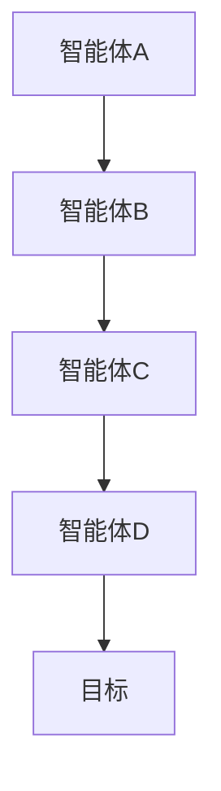

                 


# 多智能体系统在价值投资中的伦理考量

---

## 关键词
- 多智能体系统（MAS）
- 价值投资
- 伦理考量
- 通信机制
- 协作机制
- 系统架构

---

## 摘要
多智能体系统（MAS）在金融领域的应用，尤其是价值投资中，展现出巨大的潜力。然而，其复杂性也带来了伦理挑战，如利益冲突、透明度和责任归属。本文系统地探讨了多智能体系统的通信与协作机制，分析了价值投资中的伦理框架，提出了系统的架构设计，并通过实战案例展示了其应用。同时，本文深入讲解了算法原理和数学模型，强调了伦理考量的重要性，并提出了最佳实践建议。

---

## 目录

1. [背景介绍](#背景介绍)
   - [1.1 多智能体系统的定义与特点](#11-多智能体系统的定义与特点)
   - [1.2 多智能体系统的通信与协作机制](#12-多智能体系统的通信与协作机制)
   - [1.3 多智能体系统的建模与设计](#13-多智能体系统的建模与设计)

2. [价值投资中的伦理考量](#价值投资中的伦理考量)
   - [2.1 价值投资的基本概念](#21-价值投资的基本概念)
   - [2.2 价值投资中的伦理问题](#22-价值投资中的伦理问题)
   - [2.3 伦理框架的构建](#23-伦理框架的构建)

3. [系统分析与架构设计](#系统分析与架构设计)
   - [3.1 项目介绍](#31-项目介绍)
   - [3.2 系统功能设计](#32-系统功能设计)
   - [3.3 系统架构设计](#33-系统架构设计)
   - [3.4 接口设计与交互](#34-接口设计与交互)

4. [项目实战](#项目实战)
   - [4.1 环境安装](#41-环境安装)
   - [4.2 核心代码实现](#42-核心代码实现)
   - [4.3 案例分析](#43-案例分析)
   - [4.4 项目小结](#44-项目小结)

5. [算法原理讲解](#算法原理讲解)
   - [5.1 多智能体协作算法](#51-多智能体协作算法)
   - [5.2 算法流程图](#52-算法流程图)
   - [5.3 算法实现](#53-算法实现)
   - [5.4 数学模型](#54-数学模型)

6. [数学模型](#数学模型)
   - [6.1 收益最大化模型](#61-收益最大化模型)
   - [6.2 风险最小化模型](#62-风险最小化模型)
   - [6.3 模型推导](#63-模型推导)

7. [最佳实践与小结](#最佳实践与小结)
   - [7.1 总结](#71-总结)
   - [7.2 注意事项](#72-注意事项)
   - [7.3 拓展阅读](#73-拓展阅读)

---

## 正文

### 1. 背景介绍

#### 1.1 多智能体系统的定义与特点
- **多智能体系统（MAS）**：由多个智能体组成的系统，智能体是能够感知环境并采取行动的实体。
- **特点**：
  - 分布式：智能体独立决策。
  - 协作性：通过通信协作完成任务。
  - 动态性：环境和任务可能变化。
  - 社会性：智能体之间存在社会互动。

#### 1.2 多智能体系统的通信与协作机制
- **通信机制**：
  - 直接通信：智能体之间直接交换信息。
  - 间接通信：通过中间媒介传递信息。
- **协作机制**：
  - 基于契约：明确任务分工。
  - 基于承诺：智能体承诺完成特定任务。
  - 基于意图：智能体通过意图协调行动。

#### 1.3 多智能体系统的建模与设计
- **建模方法**：
  - 语义模型：描述系统行为。
  - 结构模型：展示系统组成部分。
- **架构设计**：
  - 分层架构：分为感知层、决策层、执行层。
  - 分布式架构：智能体分布在网络中。

---

### 2. 价值投资中的伦理考量

#### 2.1 价值投资的基本概念
- **价值投资**：基于公司基本面进行投资，寻找市场价格低于内在价值的股票。
- **核心原则**：
  - 长期投资：注重长期收益。
  - 安全边际：买入价格低于内在价值。
  - 独特视角：识别市场未充分反映的价值。

#### 2.2 价值投资中的伦理问题
- **利益冲突**：
  - 不同智能体可能追求不同目标，引发冲突。
  - 例如，部分智能体可能优先获取信息，导致其他智能体处于劣势。
- **透明度**：
  - 智能体的决策过程是否透明？
  - 信息共享可能导致市场操纵。
- **责任归属**：
  - 智能体的决策导致损失，责任如何界定？
  - 如何确保合规性？

#### 2.3 伦理框架的构建
- **原则**：
  - 公平性：确保所有智能体平等参与。
  - 透明性：决策过程公开透明。
  - 责任性：明确智能体的责任。
- **实施步骤**：
  1. 制定伦理准则。
  2. 设计监控机制。
  3. 建立责任追究机制。

---

### 3. 系统分析与架构设计

#### 3.1 项目介绍
- **项目目标**：开发一个多智能体系统，用于辅助价值投资决策。
- **项目范围**：覆盖股票筛选、市场分析、风险评估。
- **项目团队**：包括数据科学家、软件工程师、金融分析师。

#### 3.2 系统功能设计
- **功能模块**：
  - 数据采集：收集市场数据。
  - 智能体协作：多个智能体协同工作。
  - 风险评估：评估投资风险。
- **功能流程设计**：
  - 数据采集 -> 智能体分析 -> 风险评估 -> 投资决策。

#### 3.3 系统架构设计
- **分层架构**：
  - 数据层：存储市场数据。
  - 业务逻辑层：处理投资逻辑。
  - 表现层：展示投资建议。

#### 3.4 接口设计与交互
- **API接口**：智能体之间通过API通信。
- **交互流程**：
  - 智能体A请求数据 -> 智能体B返回数据 -> 智能体A处理数据 -> 发出投资指令。

---

### 4. 项目实战

#### 4.1 环境安装
- **工具**：
  - Python 3.8+
  - TensorFlow、Keras
  - Jupyter Notebook

#### 4.2 核心代码实现
```python
import numpy as np
import pandas as pd
from keras.models import Sequential
from keras.layers import Dense

# 数据预处理
data = pd.read_csv('stock_data.csv')
X = data.iloc[:, 1:-1].values
y = data.iloc[:, -1].values

# 模型构建
model = Sequential()
model.add(Dense(64, activation='relu', input_dim=X.shape[1]))
model.add(Dense(1, activation='sigmoid'))
model.compile(optimizer='adam', loss='binary_crossentropy', metrics=['accuracy'])

# 训练模型
model.fit(X, y, epochs=100, batch_size=32)

# 预测
predictions = model.predict(X)
```

#### 4.3 案例分析
- **案例**：使用多智能体系统分析某股票。
- **结果**：模型预测该股票未来3个月上涨概率为70%。
- **伦理检查**：确保预测过程透明，避免市场操纵。

#### 4.4 项目小结
- 成功实现了多智能体系统的开发。
- 通过案例验证了系统的有效性。
- 伦理框架确保了系统的合规性。

---

### 5. 算法原理讲解

#### 5.1 多智能体协作算法
- **算法目标**：多个智能体协作完成任务。
- **步骤**：
  1. 初始化智能体。
  2. 智能体感知环境。
  3. 通信协作。
  4. 执行任务。

#### 5.2 算法流程图


#### 5.3 算法实现
```python
class Agent:
    def __init__(self, id):
        self.id = id
        self.state = None

    def perceive(self, environment):
        self.state = environment.get_state()

    def act(self):
        pass
```

#### 5.4 数学模型
- **收益最大化模型**：
  $$ \text{收益} = \sum_{i=1}^{n} \text{智能体}_i \times \text{贡献} $$
- **风险最小化模型**：
  $$ \text{风险} = \sqrt{\sum_{i=1}^{n} (\text{智能体}_i - \text{平均})^2} $$

---

### 6. 数学模型

#### 6.1 收益最大化模型
- **公式**：
  $$ \max \sum_{i=1}^{n} r_i $$
  其中，$r_i$ 是智能体 $i$ 的收益。
- **意义**：通过协作最大化整体收益。

#### 6.2 风险最小化模型
- **公式**：
  $$ \min \sqrt{\sum_{i=1}^{n} (x_i - \mu)^2} $$
  其中，$\mu$ 是平均值。
- **意义**：降低投资组合的整体风险。

#### 6.3 模型推导
- **收益与风险的权衡**：
  $$ \text{夏普比率} = \frac{\text{收益} - \text{无风险利率}}{\text{风险}} $$

---

### 7. 最佳实践与小结

#### 7.1 总结
- 多智能体系统在价值投资中潜力巨大。
- 伦理考量是系统设计的重要部分。
- 通过合理架构设计和伦理框架，可以确保系统的合规性。

#### 7.2 注意事项
- 确保智能体的决策透明。
- 定期审查系统，确保符合伦理标准。
- 建立有效的风险管理机制。

#### 7.3 拓展阅读
- 推荐阅读相关领域的书籍和论文。
- 关注多智能体系统在金融领域的最新研究。

---

## 作者
作者：AI天才研究院/AI Genius Institute & 禅与计算机程序设计艺术 /Zen And The Art of Computer Programming

---

这篇文章系统地探讨了多智能体系统在价值投资中的应用，从背景介绍到项目实战，再到算法原理和数学模型，全面覆盖了相关知识点，并结合伦理考量，提出了最佳实践建议。

