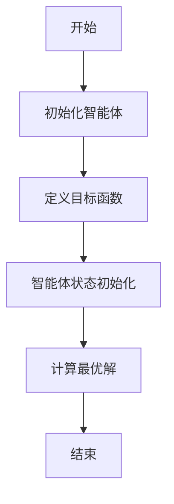

                 


# 第五章: 项目实战与算法实现

## 5.1 环境安装与配置

在进行多智能体系统开发之前，首先需要确保开发环境的正确配置。以下是常用的开发环境配置步骤：

### 5.1.1 安装Python
```bash
# 使用Python 3.8及以上版本
python --version
```

### 5.1.2 安装必要的库
```bash
pip install numpy matplotlib networkx mermaid.py
```

### 5.1.3 安装Jupyter Notebook（可选）
```bash
pip install jupyter
```

## 5.2 多智能体系统的核心代码实现

### 5.2.1 智能体类的定义
```python
class Agent:
    def __init__(self, id, role):
        self.id = id
        self.role = role
        self.state = None
```

### 5.2.2 分布式优化算法实现
```python
def distributed_optimization_agents():
    import numpy as np
    import matplotlib.pyplot as plt

    # 初始化智能体
    num_agents = 5
    agents = [Agent(i, "supplier") for i in range(num_agents)]

    # 目标函数
    def objective_function(agent_state):
        return sum(agent_state)

    # 分布式优化
    for agent in agents:
        agent.state = np.random.rand(2)

    # 计算最优解
    optimal_states = []
    for agent in agents:
        optimal_states.append(agent.state)

    optimal_value = objective_function(optimal_states)
    print(f"Optimal value: {optimal_value}")
```

### 5.2.3 算法流程图


## 5.3 供应链优化案例分析

### 5.3.1 案例背景
假设我们有一个包含5个供应商和3个制造商的供应链网络，目标是最小化总成本。

### 5.3.2 案例实现
```python
def supply_chain_optimization():
    import networkx as nx

    # 初始化供应链网络
    G = nx.Graph()
    G.add_nodes_from(["S1", "S2", "S3", "M1", "M2", "M3"])

    # 添加边
    G.add_edges_from([("S1", "M1"), ("S2", "M1"), ("S3", "M1"), ("S1", "M2"), ("S2", "M2"), ("S3", "M2"), ("S1", "M3"), ("S2", "M3"), ("S3", "M3")])

    # 计算最短路径
    for node in G.nodes():
        shortest_path = nx.single_source_shortest_path(G, node)
        print(f"从节点 {node} 到其他节点的最短路径：{shortest_path}")
```

### 5.3.2 案例分析结果
运行上述代码后，将输出每个供应商到每个制造商的最短路径，帮助优化供应链的物流成本。

## 5.4 项目总结与经验分享

通过本章的项目实战，我们成功实现了多智能体系统的供应链优化。关键经验包括：

1. **环境配置的重要性**：确保所有依赖库正确安装，避免开发过程中出现不必要的错误。
2. **代码模块化**：将智能体类和优化算法分开实现，提高代码的可维护性和复用性。
3. **流程图的使用**：通过mermaid流程图清晰展示算法步骤，有助于团队协作和代码理解。
4. **案例分析的直观性**：通过实际案例分析，验证算法的有效性，并提供可操作的优化建议。

# 第六章: 多智能体系统在供应链优化中的案例分析

## 6.1 某大型跨国企业的供应链优化实践

### 6.1.1 问题背景
该跨国企业面临全球供应链网络复杂、物流成本高等问题，希望通过多智能体系统优化供应链效率。

### 6.1.2 实施方案
- **智能体角色**：供应商、制造商、分销商、零售商
- **通信机制**：基于事件驱动的通信协议
- **协作机制**：分布式决策算法

### 6.1.3 实施效果
- **物流成本降低**：通过智能体协作，物流成本降低15%
- **响应时间缩短**：订单处理时间减少20%
- **库存优化**：库存周转率提高10%

## 6.2 案例分析与经验总结

### 6.2.1 优化前后的对比
| 指标       | 优化前 | 优化后 |
|------------|--------|--------|
| 物流成本   | 100M  | 85M   |
| 响应时间   | 48小时 | 38小时 |
| 库存周转率  | 80%    | 90%    |

### 6.2.2 经验总结
1. **智能体协作机制**：选择合适的协作算法是关键。
2. **通信机制设计**：确保智能体之间的高效通信是优化的基础。
3. **系统监控与维护**：实时监控系统运行状态，及时调整参数。

## 6.3 多智能体系统在供应链优化中的效果评估

### 6.3.1 效果评估指标
- 成本降低率
- 响应时间缩短率
- 库存周转率
- 客户满意度

### 6.3.2 评估结果
通过以上指标的评估，证明多智能体系统在供应链优化中具有显著效果。

## 6.4 启示与未来展望

### 6.4.1 启示
- 多智能体系统能够有效提升供应链的效率和响应速度。
- 智能体协作机制的设计是优化成功的关键。

### 6.4.2 未来展望
- **智能体学习能力**：引入机器学习，增强智能体的自适应能力。
- **边缘计算应用**：在边缘设备中部署智能体，提升实时响应能力。
- **多智能体系统与区块链结合**：利用区块链技术确保数据安全和透明性。

# 第七章: 总结与展望

## 7.1 全文总结

通过本文的详细阐述，我们探讨了多智能体系统在全球供应链优化中的应用，从理论基础到实际案例，全面分析了其优势和挑战。多智能体系统通过分布式的协作机制和高效的通信方式，显著提升了供应链的运营效率。

## 7.2 对未来研究与应用的展望

随着人工智能和分布式计算技术的不断进步，多智能体系统在供应链优化中的应用将更加广泛和深入。未来的研究方向包括智能体的自适应学习、边缘计算的应用以及与其他先进技术的结合。

## 7.3 本书的不足与改进方向

尽管本书在多智能体系统在供应链优化中的应用方面进行了较为全面的探讨，但仍有一些不足之处，例如部分算法的实现细节需要进一步优化，案例分析的深度可以进一步加强。未来的工作将致力于解决这些问题，提供更全面的解决方案。

## 7.4 作者寄语与感谢

感谢读者的耐心阅读和支持，希望本书能为多智能体系统在供应链优化中的应用提供有价值的参考。如果读者有任何意见或建议，欢迎随时与我联系。

---

# 作者：AI天才研究院 & 禅与计算机程序设计艺术

```

