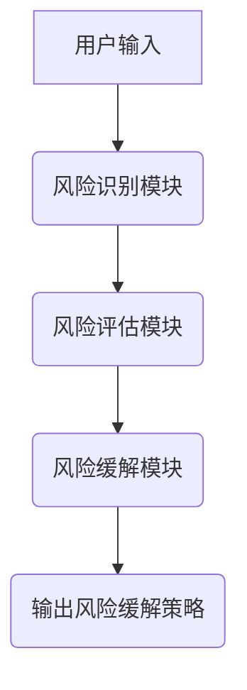

                 


# 多智能体系统在全球供应链风险评估中的应用

## 关键词：多智能体系统（MAS）、供应链风险评估、分布式计算、协同优化、系统架构设计

## 摘要：  
本文探讨了多智能体系统（MAS）在全球供应链风险评估中的应用。通过分析MAS的基本概念、算法原理和系统架构设计，本文详细阐述了MAS如何在复杂的全球供应链环境中实现风险识别、评估和缓解。文章还通过实际案例分析，展示了MAS在供应链风险管理中的优势和挑战。  

---

# 第一部分: 多智能体系统与全球供应链风险评估概述

---

# 第1章: 多智能体系统概述

## 1.1 多智能体系统的基本概念

### 1.1.1 多智能体系统的定义  
多智能体系统（Multi-Agent System, MAS）是由多个智能体（Agent）组成的分布式系统，这些智能体能够通过交互和协作完成复杂任务。  

### 1.1.2 多智能体系统的特征  
- **自主性**：每个智能体都能独立决策。  
- **反应性**：智能体能够感知环境并实时响应。  
- **协作性**：智能体之间通过通信和协调完成共同目标。  
- **分布性**：智能体分布在网络中，不存在单一的控制中心。  

### 1.1.3 多智能体系统与单智能体系统的区别  
| 特性                | 单智能体系统         | 多智能体系统         |  
|---------------------|--------------------|--------------------|  
| 系统结构            | 集中式             | 分布式             |  
| 决策中心            | 单一决策者         | 多个决策者         |  
| 任务处理            | 由单个智能体完成     | 由多个智能体协作完成 |  
| 灵活性               | 较低               | 较高               |  

---

## 1.2 全球供应链的基本概念

### 1.2.1 供应链的定义与组成  
供应链是指从原材料采购、生产、分销到最终消费者的整个过程。其主要组成部分包括：  
1. 供应商  
2. 制造商  
3. 分销商  
4. 零售商  
5. 消费者  

### 1.2.2 全球供应链的特点  
- **全球化**：供应链跨越多个国家和地区。  
- **复杂性**：涉及众多参与者和环节。  
- **动态性**：受市场波动、政策变化等因素影响。  
- **风险性**：存在多种潜在风险，如自然灾害、疫情等。  

### 1.2.3 供应链风险的来源  
- **外部风险**：如自然灾害、疫情、地缘政治冲突等。  
- **内部风险**：如供应链中断、库存积压、生产延迟等。  
- **市场风险**：如需求波动、价格波动等。  

---

## 1.3 多智能体系统在供应链管理中的应用前景

### 1.3.1 多智能体系统在供应链管理中的优势  
- **分布式计算能力**：MAS能够同时处理多个任务。  
- **协作优化**：通过智能体的协作，实现供应链的最优配置。  
- **动态适应性**：MAS能够快速响应环境变化。  

### 1.3.2 多智能体系统在供应链风险管理中的潜力  
- **实时监控**：MAS可以实时监控供应链中的风险点。  
- **智能决策**：通过多智能体的协作，实现风险的快速识别和缓解。  
- **预测与预警**：MAS可以基于历史数据和实时信息，预测潜在风险并发出预警。  

### 1.3.3 当前研究现状与挑战  
- **研究现状**：目前，MAS在供应链管理中的研究主要集中在协同优化和风险评估方面。  
- **挑战**：  
  1. 多智能体系统的设计复杂性。  
  2. 智能体之间的通信与协调问题。  
  3. 系统的安全性和隐私保护问题。  

---

## 1.4 本章小结  
本章介绍了多智能体系统的基本概念和全球供应链的基本组成，并分析了MAS在供应链管理中的应用前景。通过对比MAS和单智能体系统的区别，本文为后续章节奠定了理论基础。

---

# 第2章: 全球供应链风险评估的核心概念

## 2.1 供应链风险的定义与分类

### 2.1.1 供应链风险的定义  
供应链风险是指在供应链的各个环节中，由于内外部因素的影响，可能导致供应链中断或效率下降的风险。  

### 2.1.2 供应链风险的主要类型  
| 风险类型        | 描述                           |  
|-----------------|--------------------------------|  
| 供应风险        | 供应商无法按时交付原材料       |  
| 生产风险        | 生产过程中的设备故障或人员不足   |  
| 分销风险        | 产品无法及时送达分销渠道        |  
| 市场风险        | 市场需求变化导致的库存积压或短缺  |  
| 政治风险        | 政治动荡或贸易政策变化影响供应链 |  

### 2.1.3 供应链风险的评估指标  
- **风险概率**：风险发生的可能性。  
- **风险影响**：风险发生后对供应链的影响程度。  
- **风险敞口**：供应链在特定风险下的暴露程度。  

---

## 2.2 多智能体系统在供应链风险评估中的作用

### 2.2.1 多智能体系统的协同优势  
- **分布式计算**：MAS能够同时处理多个风险点。  
- **信息共享**：智能体之间可以实时共享信息，提高风险识别能力。  
- **决策协调**：通过协作，智能体可以共同制定风险缓解策略。  

### 2.2.2 多智能体系统在风险识别中的应用  
- **实时监控**：MAS可以实时监控供应链中的风险点。  
- **数据融合**：通过多个智能体的数据融合，提高风险识别的准确性。  

### 2.2.3 多智能体系统在风险缓解中的应用  
- **动态调整**：MAS可以根据实时信息，动态调整供应链的运作策略。  
- **协同优化**：通过智能体的协作，实现供应链的最优配置。  

---

## 2.3 本章小结  
本章分析了供应链风险的定义与分类，并探讨了MAS在供应链风险评估中的作用。通过MAS的协同优势，可以实现供应链风险的实时监控和动态调整。

---

# 第3章: 多智能体系统在全球供应链中的建模与实现

## 3.1 多智能体系统的建模方法

### 3.1.1 基于MAS的建模框架  
- **智能体表示**：用类或对象表示智能体。  
- **状态表示**：用状态变量表示智能体的当前状态。  
- **交互规则**：定义智能体之间的通信和协作规则。  

### 3.1.2 多智能体系统的状态表示  
| 状态变量         | 描述                   |  
|------------------|------------------------|  
| 位置             | 智能体在供应链中的位置   |  
| 状态             | 智能体的当前状态（空闲、忙碌等） |  
| 资源             | 智能体拥有的资源（如原材料） |  

### 3.1.3 多智能体系统的交互规则  
- **通信规则**：定义智能体之间的通信方式和内容。  
- **协作规则**：定义智能体之间的协作任务和目标。  
- **冲突解决规则**：定义智能体之间的冲突处理机制。  

---

## 3.2 全球供应链风险评估的 MAS 建模

### 3.2.1 供应链节点的 MAS 表示  
- **供应商**：负责提供原材料的智能体。  
- **制造商**：负责生产产品的智能体。  
- **分销商**：负责产品分销的智能体。  
- **零售商**：负责产品销售的智能体。  

### 3.2.2 供应链风险的 MAS 模型构建  
- **风险识别模块**：负责识别供应链中的潜在风险。  
- **风险评估模块**：负责评估风险的影响程度。  
- **风险缓解模块**：负责制定风险缓解策略。  

### 3.2.3 模型的验证与优化  
- **验证方法**：通过仿真测试验证模型的准确性。  
- **优化方法**：通过参数调整优化模型的性能。  

---

## 3.3 本章小结  
本章详细介绍了多智能体系统的建模方法，并构建了基于MAS的供应链风险评估模型。通过模型的验证与优化，可以提高供应链风险评估的准确性和效率。

---

# 第4章: 多智能体系统在全球供应链风险评估中的算法原理

## 4.1 多智能体系统的核心算法

### 4.1.1 分布式计算与协同算法  
- **分布式计算**：通过多智能体的协同完成任务。  
- **协同优化**：通过智能体的协作实现资源的最优分配。  

### 4.1.2 多智能体系统的通信协议  
- **通信方式**：智能体之间通过消息传递进行通信。  
- **协议设计**：定义消息的格式和内容。  

### 4.1.3 多智能体系统的决策算法  
- **决策规则**：定义智能体的决策逻辑。  
- **决策优化**：通过算法优化智能体的决策过程。  

---

## 4.2 全球供应链风险评估的算法实现

### 4.2.1 风险识别算法  
- **输入**：供应链中的相关信息（如供应商状态、库存水平）。  
- **输出**：潜在风险的识别结果。  
- **算法步骤**：  
  1. 收集供应链中的相关信息。  
  2. 分析信息，识别潜在风险。  
  3. 输出风险识别结果。  

### 4.2.2 风险评估算法  
- **输入**：潜在风险的识别结果。  
- **输出**：风险的影响程度。  
- **算法步骤**：  
  1. 评估每个风险的影响程度。  
  2. 综合评估结果，确定风险的优先级。  

### 4.2.3 风险缓解算法  
- **输入**：风险的优先级和影响程度。  
- **输出**：风险缓解策略。  
- **算法步骤**：  
  1. 根据风险的优先级和影响程度，制定风险缓解策略。  
  2. 实施策略，降低风险的影响。  

---

## 4.3 算法的数学模型与公式

### 4.3.1 风险评估的数学模型  
$$ R = \sum_{i=1}^{n} w_i \cdot r_i $$  
其中，\( R \) 表示风险值，\( w_i \) 表示第 \( i \) 个风险的权重，\( r_i \) 表示第 \( i \) 个风险的影响程度。  

### 4.3.2 风险缓解的数学模型  
$$ M = \min_{x} \sum_{i=1}^{m} c_i \cdot x_i $$  
其中，\( M \) 表示风险缓解成本，\( c_i \) 表示第 \( i \) 个风险缓解策略的成本，\( x_i \) 表示第 \( i \) 个风险缓解策略的实施程度。  

---

## 4.4 本章小结  
本章介绍了多智能体系统的核心算法，并详细阐述了供应链风险评估的算法实现。通过数学模型和公式，可以量化风险的影响程度，并制定最优的风险缓解策略。

---

# 第5章: 全球供应链风险评估的系统架构设计

## 5.1 系统功能设计

### 5.1.1 系统功能模块划分  
- **风险识别模块**：负责识别供应链中的潜在风险。  
- **风险评估模块**：负责评估风险的影响程度。  
- **风险缓解模块**：负责制定风险缓解策略。  

### 5.1.2 系统功能流程图  


### 5.1.3 系统功能的实现方式  
- **风险识别模块**：通过传感器和数据采集系统获取供应链中的相关信息。  
- **风险评估模块**：基于数学模型和算法，评估风险的影响程度。  
- **风险缓解模块**：根据评估结果，制定最优的风险缓解策略。  

---

## 5.2 系统架构设计

### 5.2.1 分层架构设计  
- **数据层**：负责数据的存储和管理。  
- **业务逻辑层**：负责业务逻辑的实现。  
- **用户界面层**：负责与用户的交互。  

### 5.2.2 模块化设计  
- **风险识别模块**：实现风险的识别和预警。  
- **风险评估模块**：实现风险的评估和量化。  
- **风险缓解模块**：实现风险的缓解和优化。  

### 5.2.3 系统的可扩展性设计  
- **模块化设计**：通过模块化设计，提高系统的可扩展性。  
- **插件化设计**：通过插件化设计，支持系统的功能扩展。  

---

## 5.3 系统接口设计

### 5.3.1 系统内部接口  
- **风险识别模块与风险评估模块的接口**：传递风险识别结果。  
- **风险评估模块与风险缓解模块的接口**：传递风险评估结果。  

### 5.3.2 系统外部接口  
- **用户接口**：用户通过界面输入相关信息并获取结果。  
- **第三方接口**：与供应链中的其他系统进行数据交互。  

---

## 5.4 系统的实现与测试

### 5.4.1 系统实现步骤  
1. **需求分析**：明确系统的需求和功能。  
2. **系统设计**：设计系统的架构和模块。  
3. **系统实现**：根据设计实现系统的功能。  
4. **系统测试**：对系统进行功能测试和性能测试。  

### 5.4.2 系统测试方法  
- **单元测试**：测试每个模块的功能。  
- **集成测试**：测试模块之间的接口和协作。  
- **性能测试**：测试系统的响应时间和处理能力。  

---

## 5.5 本章小结  
本章详细设计了全球供应链风险评估系统的架构，并通过模块化设计和接口设计，确保系统的可扩展性和可维护性。通过系统的实现与测试，可以验证系统的功能和性能。

---

# 第6章: 项目实战——基于MAS的全球供应链风险评估系统

## 6.1 项目背景与目标

### 6.1.1 项目背景  
随着全球化的发展，供应链的风险日益增加。为了提高供应链的抗风险能力，本文设计了一个基于MAS的全球供应链风险评估系统。  

### 6.1.2 项目目标  
- 实现供应链风险的实时监控。  
- 提供风险评估和风险缓解的最优策略。  

---

## 6.2 项目实现

### 6.2.1 环境安装  
- **开发工具**：Python、Java、C++  
- **开发框架**：ROS（Robot Operating System）  
- **数据库**：MySQL、MongoDB  

### 6.2.2 核心实现代码  

#### 6.2.2.1 风险识别模块  
```python
class RiskIdentifier:
    def __init__(self):
        self.suppliers = []
        self.manufacturers = []
        self.distributors = []
    
    def identify_risk(self):
        # 检查供应商的状态
        for supplier in self.suppliers:
            if not supplier.available:
                return "供应风险"
        # 检查制造商的状态
        for manufacturer in self.manufacturers:
            if not manufacturer.available:
                return "生产风险"
        # 检查分销商的状态
        for distributor in self.distributors:
            if not distributor.available:
                return "分销风险"
        return "无风险"
```

#### 6.2.2.2 风险评估模块  
```python
class RiskAssessor:
    def __init__(self):
        self.risk_types = ["供应风险", "生产风险", "分销风险", "市场风险", "政治风险"]
    
    def assess_risk(self, risk_type):
        # 评估每个风险的影响程度
        impact = {
            "供应风险": 0.8,
            "生产风险": 0.9,
            "分销风险": 0.7,
            "市场风险": 0.6,
            "政治风险": 0.9
        }
        return impact[risk_type]
```

#### 6.2.2.3 风险缓解模块  
```python
class RiskMitigator:
    def __init__(self):
        self.risk_types = ["供应风险", "生产风险", "分销风险", "市场风险", "政治风险"]
    
    def mitigate_risk(self, risk_type):
        # 制定风险缓解策略
        strategies = {
            "供应风险": "寻找备用供应商",
            "生产风险": "增加备用生产线",
            "分销风险": "优化物流网络",
            "市场风险": "调整市场策略",
            "政治风险": "多元化供应链布局"
        }
        return strategies[risk_type]
```

---

## 6.3 项目实战分析

### 6.3.1 系统功能分析  
- **风险识别**：系统能够实时识别供应链中的潜在风险。  
- **风险评估**：系统能够量化每个风险的影响程度。  
- **风险缓解**：系统能够制定最优的风险缓解策略。  

### 6.3.2 系统优势  
- **实时性**：系统能够实时监控供应链中的风险点。  
- **准确性**：通过数学模型和算法，提高风险评估的准确性。  
- **可扩展性**：系统支持模块化设计，便于功能扩展。  

---

## 6.4 本章小结  
本章通过实际案例分析，展示了基于MAS的全球供应链风险评估系统的实现过程。通过系统的功能分析和优势分析，可以验证系统的可行性和有效性。

---

# 第7章: 总结与展望

## 7.1 本章总结  
本文探讨了多智能体系统在全球供应链风险评估中的应用。通过MAS的协同优势，可以实现供应链风险的实时监控和动态调整。本文还通过实际案例分析，展示了MAS在供应链风险管理中的优势和挑战。

## 7.2 未来展望  
未来，MAS在全球供应链风险评估中的应用将更加广泛。随着人工智能和大数据技术的发展，MAS将能够更好地应对供应链中的复杂问题。此外，MAS在供应链风险管理中的应用也将更加智能化和自动化。

---

# 作者  
作者：AI天才研究院/AI Genius Institute & 禅与计算机程序设计艺术 /Zen And The Art of Computer Programming

