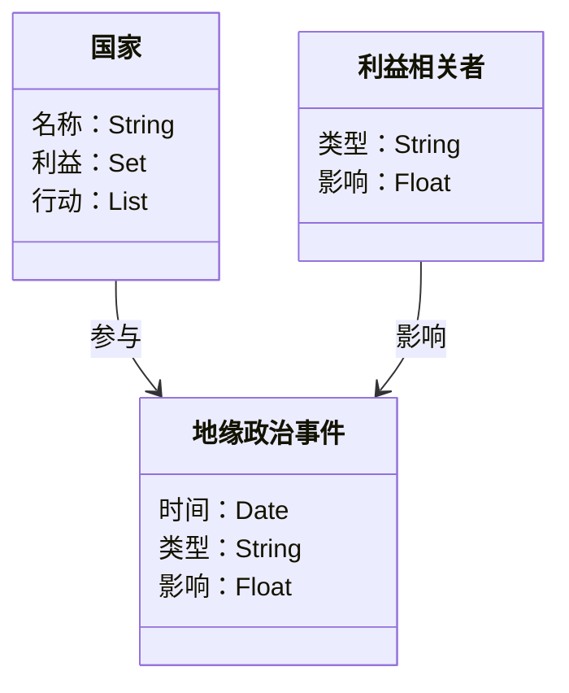
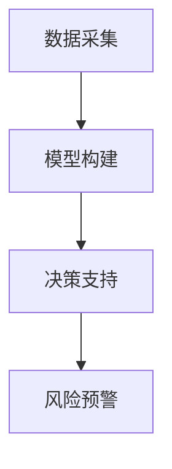
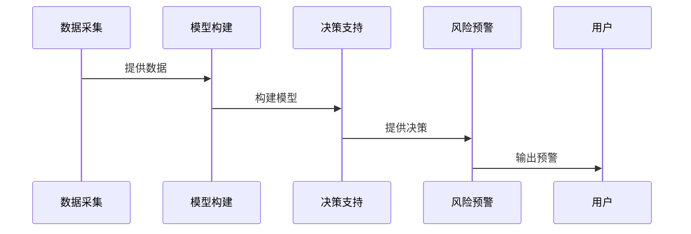
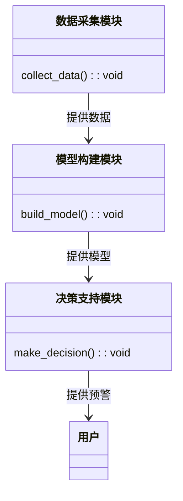
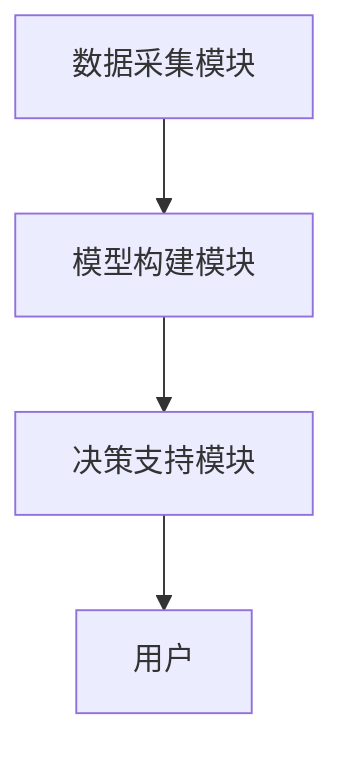
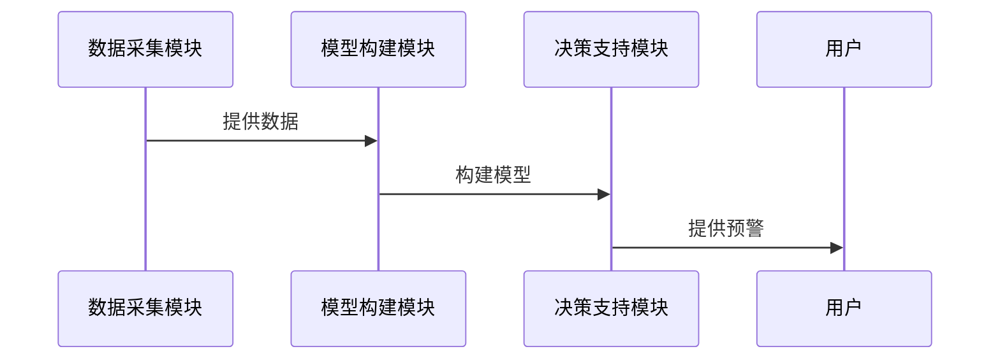

                 


# 多智能体系统在全球地缘政治风险分析中的角色

## 关键词：多智能体系统、地缘政治风险、全球安全、博弈论、智能体协作、风险预警

## 摘要：
本文探讨了多智能体系统在全球地缘政治风险分析中的角色，分析了多智能体系统的分布式特性、协作机制及其在地缘政治风险分析中的应用。通过构建多智能体系统的地缘政治风险分析模型，本文详细讲解了多智能体系统的数据收集、模型构建与模拟、决策支持与风险预警功能。文章还结合实际案例，展示了多智能体系统在地缘政治风险分析中的实际应用效果，并提出了相关系统的架构设计与实现方案。

---

# 第1章: 多智能体系统概述

## 1.1 多智能体系统的基本概念

### 1.1.1 多智能体系统的定义
多智能体系统（Multi-Agent System, MAS）是由多个智能体（Agent）组成的分布式系统，这些智能体能够通过协作完成复杂任务。智能体是具有感知、推理、规划和执行能力的实体，能够独立决策并与其他智能体或环境进行交互。

### 1.1.2 多智能体系统的特征
- **分布式性**：多个智能体协同工作，没有集中控制中心。
- **自主性**：每个智能体都能独立决策和行动。
- **协作性**：智能体之间通过通信和协作完成共同目标。
- **动态性**：系统能够在动态变化的环境中适应和调整。

### 1.1.3 多智能体系统的分类
- **基于任务的多智能体系统**：智能体协作完成特定任务。
- **基于市场的多智能体系统**：智能体通过市场机制进行资源分配。
- **基于网络的多智能体系统**：智能体通过网络进行通信和协作。

## 1.2 地缘政治风险分析的背景

### 1.2.1 地缘政治风险的定义
地缘政治风险是指因国家间的政治、经济、军事等互动而产生的潜在风险，包括战争、贸易摩擦、资源争夺等。

### 1.2.2 全球化背景下的地缘政治挑战
全球化使得国家间的依赖性增强，但也带来了更多的复杂性和不确定性。地缘政治风险的全球化特征使得传统的单一国家分析方法难以应对。

### 1.2.3 地缘政治风险分析的重要性
准确的地缘政治风险分析能够帮助政府、企业和组织做出更明智的决策，避免潜在的冲突和损失。

---

# 第2章: 多智能体系统在地缘政治风险分析中的应用

## 2.1 多智能体系统与地缘政治风险的关系

### 2.1.1 多智能体系统的分布式特性与地缘政治的多维度性
地缘政治风险分析涉及多个维度，包括政治、经济、军事、文化等。多智能体系统的分布式特性能够很好地捕捉这些多维度的复杂性。

### 2.1.2 多智能体系统的协作机制与地缘政治风险的复杂性
地缘政治风险的复杂性要求分析系统能够处理多个因素之间的相互作用。多智能体系统的协作机制能够模拟这些相互作用。

### 2.1.3 多智能体系统的动态适应性与地缘政治风险的不确定性
地缘政治风险往往具有高度的不确定性，多智能体系统的动态适应性使其能够实时调整分析模型，应对突发情况。

## 2.2 多智能体系统在全球地缘政治风险分析中的角色

### 2.2.1 多智能体系统的数据收集与整合
多智能体系统能够从多个来源（如新闻、社交媒体、政府报告）收集数据，并通过协作机制整合这些数据，形成全面的地缘政治风险分析。

### 2.2.2 多智能体系统的模型构建与模拟
通过构建多智能体模型，可以模拟不同国家之间的互动，预测可能的地缘政治事件，并评估其风险。

### 2.2.3 多智能体系统的决策支持与风险预警
多智能体系统能够为决策者提供实时的风险预警和多种决策方案，帮助其做出最优选择。

---

# 第3章: 多智能体系统的地缘政治风险分析模型

## 3.1 多智能体系统的地缘政治风险分析模型原理

### 3.1.1 智能体的定义与属性
- **智能体**：具有感知、推理、规划和执行能力的实体。
- **属性**：包括目标、知识、信念、意图等。

### 3.1.2 智能体之间的交互与协作
智能体之间通过通信和协作完成任务，实现信息共享和决策协调。

### 3.1.3 智能体的决策机制与策略
智能体根据自身的目标和环境信息，采用博弈论等方法制定决策策略。

## 3.2 多智能体系统与地缘政治风险分析的核心概念对比

### 3.2.1 智能体的属性与地缘政治风险的特征
| 智能体属性 | 地缘政治风险特征 |
|------------|------------------|
| 目标       | 国家利益         |
| 知识       | 政治、经济信息   |
| 信念       | 对未来的预测     |
| 意图       | 行动动机         |

### 3.2.2 多智能体系统的协作机制与地缘政治风险的复杂性
多智能体系统的协作机制能够模拟国家间的互动，捕捉复杂的地缘政治关系。

### 3.2.3 多智能体系统的动态适应性与地缘政治风险的不确定性
多智能体系统的动态适应性使其能够实时调整模型，应对地缘政治风险的不确定性。

---

## 3.3 多智能体系统的地缘政治风险分析模型的架构

### 3.3.1 实体关系图的定义
实体关系图（ER图）用于描述系统中的实体及其关系。

### 3.3.2 实体关系图的构建方法
1. **识别实体**：地缘政治事件、国家、利益相关者等。
2. **定义关系**：实体之间的关联，如“参与”、“影响”等。

### 3.3.3 实体关系图的示例

```mermaid
erd
    国家(A)
    地缘政治事件(B)
    利益相关者(C)
    A -> B: 参与
    C -> B: 影响
```

---

# 第4章: 多智能体系统的地缘政治风险分析模型的架构

## 4.1 多智能体系统的地缘政治风险分析模型的实体关系图

### 4.1.1 实体关系图的定义
实体关系图用于描述系统中的实体及其关系。

### 4.1.2 实体关系图的构建方法
1. **识别实体**：地缘政治事件、国家、利益相关者等。
2. **定义关系**：实体之间的关联，如“参与”、“影响”等。

### 4.1.3 实体关系图的示例

```mermaid
erd
    国家(A)
    地缘政治事件(B)
    利益相关者(C)
    A -> B: 参与
    C -> B: 影响
```

---

## 4.2 多智能体系统的地缘政治风险分析模型的类图

### 4.2.1 类图的定义
类图用于描述系统的类及其关系。

### 4.2.2 类图的构建方法
1. **识别类**：国家、事件、利益相关者等。
2. **定义关系**：关联、依赖等。

### 4.2.3 类图的示例



---

## 4.3 多智能体系统的地缘政治风险分析模型的架构图

### 4.3.1 架构图的定义
架构图用于描述系统的整体架构。

### 4.3.2 架构图的构建方法
1. **识别模块**：数据采集、模型构建、决策支持等。
2. **定义交互**：模块之间的调用关系。

### 4.3.3 架构图的示例



---

## 4.4 多智能体系统的地缘政治风险分析模型的接口设计

### 4.4.1 接口定义
- 数据接口：数据采集模块的输入接口。
- 模型接口：模型构建模块的调用接口。
- 决策接口：决策支持模块的输出接口。

### 4.4.2 接口示例

```python
# 数据接口
class DataCollector:
    def collect_data(self):
        pass

# 模型接口
class ModelBuilder:
    def build_model(self):
        pass

# 决策接口
class DecisionSupport:
    def make_decision(self):
        pass
```

---

## 4.5 多智能体系统的地缘政治风险分析模型的交互图

### 4.5.1 交互图的定义
交互图用于描述系统的交互过程。

### 4.5.2 交互图的构建方法
1. **识别参与者**：数据采集、模型构建、决策支持。
2. **定义交互**：参与者之间的调用关系。

### 4.5.3 交互图的示例



---

# 第5章: 多智能体系统的地缘政治风险分析模型的算法原理

## 5.1 多智能体系统的地缘政治风险分析算法

### 5.1.1 算法原理
多智能体系统的地缘政治风险分析算法基于博弈论，模拟国家间的互动和决策过程。

### 5.1.2 算法步骤
1. **初始化**：定义智能体、目标和环境。
2. **感知**：智能体收集环境信息。
3. **推理**：智能体根据信息进行推理和决策。
4. **行动**：智能体执行决策并更新环境。
5. **评估**：评估结果并调整模型。

### 5.1.3 算法的数学模型
$$ 纳什均衡：在博弈论中，纳什均衡是指在其他参与者策略不变的情况下，每个参与者都无法通过单方面改变策略而提高自身收益的策略组合。 $$

---

## 5.2 多智能体系统的地缘政治风险分析算法的实现

### 5.2.1 算法实现的代码示例

```python
class Agent:
    def __init__(self, name):
        self.name = name
        self.strategy = None

    def感知(self, environment):
        # 根据环境信息更新策略
        pass

    def 推理(self):
        # 根据策略进行推理和决策
        pass

    def 行动(self):
        # 执行决策并更新环境
        pass
```

### 5.2.2 算法实现的数学模型
$$ 纳什均衡：在博弈论中，纳什均衡是指在其他参与者策略不变的情况下，每个参与者都无法通过单方面改变策略而提高自身收益的策略组合。 $$

---

## 5.3 多智能体系统的地缘政治风险分析算法的优化

### 5.3.1 算法优化的方法
1. **强化学习**：通过强化学习优化智能体的决策策略。
2. **分布式计算**：利用分布式计算提高系统的计算效率。
3. **动态调整**：根据环境变化动态调整模型参数。

### 5.3.2 算法优化的效果
优化后的算法能够更准确地预测地缘政治风险，并提供更有效的决策支持。

---

# 第6章: 多智能体系统的地缘政治风险分析模型的系统分析与架构设计

## 6.1 问题场景介绍

### 6.1.1 地缘政治风险分析的复杂性
地缘政治风险分析涉及多个维度，包括政治、经济、军事、文化等。

### 6.1.2 多智能体系统的应用优势
多智能体系统的分布式特性能够很好地捕捉地缘政治风险的多维度性。

---

## 6.2 系统功能设计

### 6.2.1 系统功能模块
- 数据采集模块：收集地缘政治事件的数据。
- 模型构建模块：构建多智能体模型。
- 决策支持模块：提供决策支持和风险预警。

### 6.2.2 系统功能模块的类图



---

## 6.3 系统架构设计

### 6.3.1 系统架构设计的总体思路
采用微服务架构，将系统划分为多个功能模块，每个模块独立运行。

### 6.3.2 系统架构设计的详细步骤
1. **功能模块划分**：数据采集、模型构建、决策支持。
2. **模块交互设计**：模块之间的调用关系。
3. **通信机制设计**：模块之间的通信方式。

### 6.3.3 系统架构设计的架构图



---

## 6.4 系统接口设计

### 6.4.1 系统接口的定义
- 数据接口：数据采集模块的输入接口。
- 模型接口：模型构建模块的调用接口。
- 决策接口：决策支持模块的输出接口。

### 6.4.2 系统接口的实现

```python
# 数据接口
class DataCollector:
    def collect_data(self):
        pass

# 模型接口
class ModelBuilder:
    def build_model(self):
        pass

# 决策接口
class DecisionSupport:
    def make_decision(self):
        pass
```

---

## 6.5 系统交互设计

### 6.5.1 系统交互的流程
1. 数据采集模块收集数据。
2. 模型构建模块构建模型。
3. 决策支持模块提供决策支持。
4. 用户接收风险预警。

### 6.5.2 系统交互的交互图



---

# 第7章: 多智能体系统的地缘政治风险分析模型的项目实战

## 7.1 项目环境安装

### 7.1.1 系统环境要求
- 操作系统：Linux/Windows/MacOS
- Python版本：Python 3.x
- 依赖库：numpy, pandas, matplotlib, networkx, scikit-learn

### 7.1.2 系统环境的安装步骤
```bash
pip install numpy pandas matplotlib networkx scikit-learn
```

---

## 7.2 项目核心实现

### 7.2.1 核心代码实现

```python
class Agent:
    def __init__(self, name):
        self.name = name
        self.strategy = None

    def感知(self, environment):
        # 根据环境信息更新策略
        pass

    def 推理(self):
        # 根据策略进行推理和决策
        pass

    def 行动(self):
        # 执行决策并更新环境
        pass
```

### 7.2.2 核心代码实现的解读
- **Agent类**：定义智能体的基本属性和方法。
- **感知方法**：智能体根据环境信息更新策略。
- **推理方法**：智能体根据策略进行推理和决策。
- **行动方法**：智能体执行决策并更新环境。

---

## 7.3 项目实现的详细解读

### 7.3.1 数据采集模块的实现
```python
class DataCollector:
    def collect_data(self):
        # 收集地缘政治事件的数据
        pass
```

### 7.3.2 模型构建模块的实现
```python
class ModelBuilder:
    def build_model(self):
        # 构建多智能体模型
        pass
```

### 7.3.3 决策支持模块的实现
```python
class DecisionSupport:
    def make_decision(self):
        # 提供决策支持和风险预警
        pass
```

---

## 7.4 项目实现的案例分析

### 7.4.1 案例分析的背景
以中美贸易摩擦为例，分析多智能体系统在地缘政治风险分析中的应用。

### 7.4.2 案例分析的实现
```python
# 数据采集模块
data_collector = DataCollector()
data_collector.collect_data()

# 模型构建模块
model_builder = ModelBuilder()
model_builder.build_model()

# 决策支持模块
decision_support = DecisionSupport()
decision_support.make_decision()
```

---

## 7.5 项目实现的小结

### 7.5.1 项目实现的关键点
- 数据采集的准确性
- 模型构建的合理性
- 决策支持的及时性

### 7.5.2 项目实现的总结
通过多智能体系统的地缘政治风险分析模型，可以有效地预测和预警地缘政治风险，为决策者提供有力支持。

---

# 第8章: 多智能体系统的地缘政治风险分析模型的最佳实践

## 8.1 小结

### 8.1.1 多智能体系统的地缘政治风险分析模型的优势
- 分布式特性能够捕捉地缘政治风险的多维度性
- 协作机制能够模拟国家间的互动
- 动态适应性能够应对地缘政治风险的不确定性

### 8.1.2 多智能体系统的地缘政治风险分析模型的挑战
- 数据隐私和安全问题
- 模型的复杂性和计算成本
- 系统的实时性和可扩展性

---

## 8.2 注意事项

### 8.2.1 数据隐私和安全
在数据采集和分析过程中，需要注意数据隐私和安全问题，避免数据泄露和滥用。

### 8.2.2 模型的复杂性和计算成本
多智能体系统的地缘政治风险分析模型较为复杂，需要考虑计算成本和资源分配问题。

### 8.2.3 系统的实时性和可扩展性
为了应对地缘政治风险的实时性和不确定性，系统需要具备较高的实时性和可扩展性。

---

## 8.3 拓展阅读

### 8.3.1 多智能体系统在其他领域的应用
- 经济学中的博弈论模型
- 计算机科学中的分布式系统
- 社会学中的社会网络分析

### 8.3.2 地缘政治风险分析的其他方法
- 统计分析方法
- 数据挖掘方法
- 机器学习方法

---

# 结语

多智能体系统在全球地缘政治风险分析中的角色不可忽视。通过构建多智能体系统的地缘政治风险分析模型，可以有效地预测和预警地缘政治风险，为决策者提供有力支持。未来，随着技术的不断发展，多智能体系统在地缘政治风险分析中的应用将更加广泛和深入。

---

# 作者：AI天才研究院/AI Genius Institute & 禅与计算机程序设计艺术 /Zen And The Art of Computer Programming

