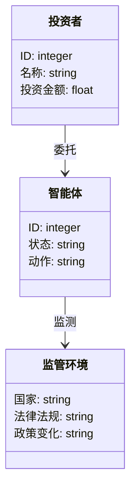
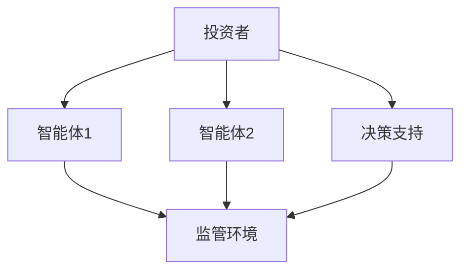
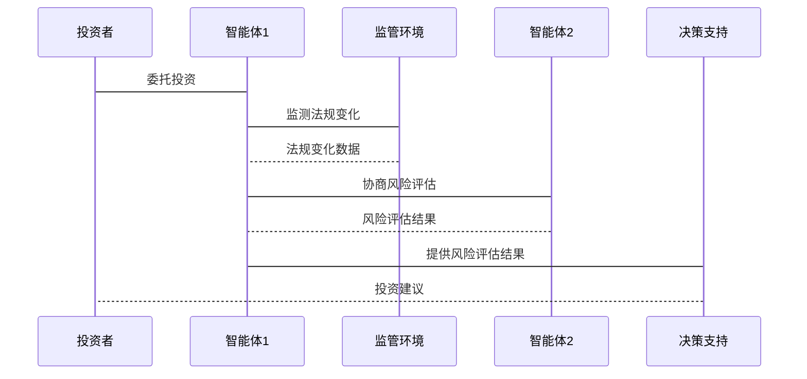

                 


# 多智能体系统在全球监管环境分析中的应用：跨国投资风险评估

> 关键词：多智能体系统、监管环境分析、跨国投资、风险评估、数学模型、算法原理、系统架构

> 摘要：本文探讨了多智能体系统在全球监管环境分析中的应用，特别是跨国投资风险评估中的潜在价值。通过分析多智能体系统的核心概念、算法原理、数学模型和系统架构，本文为跨国投资中的风险评估提供了一种新的技术解决方案。文章内容涵盖背景介绍、核心概念、算法原理、系统设计、项目实战和最佳实践等多个方面，旨在为读者提供全面的技术指导。

---

## 第1章: 多智能体系统与全球监管环境分析概述

### 1.1 多智能体系统的定义与特点

#### 1.1.1 多智能体系统的定义
多智能体系统（Multi-Agent System, 简称 MAS）是由多个智能体（Agent）组成的分布式系统，这些智能体通过协作和竞争完成特定任务。每个智能体都是一个独立的实体，具有感知环境、自主决策和行动的能力。

#### 1.1.2 多智能体系统的核心特点
- **分布式性**：智能体独立运行，不依赖中心节点。
- **自主性**：每个智能体都能自主决策。
- **协作性**：智能体之间通过通信和协调完成复杂任务。
- **动态性**：环境和任务可能随时变化，智能体需动态调整策略。

#### 1.1.3 多智能体系统与传统单智能体系统的区别
| 特性 | 单智能体系统 | 多智能体系统 |
|------|--------------|--------------|
| 结构  | 集中式       | 分布式       |
| 决策  | 中央控制     | 去中心化     |
| 灵活性 | 较低         | 较高         |
| 应用场景 | 单任务       | 多任务协作    |

### 1.2 全球监管环境分析的背景与挑战

#### 1.2.1 全球化背景下的监管环境复杂性
跨国投资涉及多个国家和地区的法律法规，监管环境复杂多变，传统单智能体系统难以应对。

#### 1.2.2 跨国投资中的风险类型
- **法律风险**：不同国家的法律法规差异。
- **政策风险**：政策变化对投资的影响。
- **合规风险**：跨国经营中的合规要求。
- **经济风险**：经济波动对投资的影响。

#### 1.2.3 监管环境分析的重要性
准确的监管环境分析是跨国投资决策的关键，能够帮助投资者规避风险、优化投资策略。

### 1.3 多智能体系统在监管环境分析中的应用前景

#### 1.3.1 多智能体系统的潜在应用场景
- **风险评估**：通过多智能体系统的协作，实时分析投资风险。
- **合规监控**：智能体实时监控政策变化，确保合规性。
- **决策支持**：基于多智能体系统的分析结果，辅助投资决策。

#### 1.3.2 多智能体系统在跨国投资中的优势
- **分布式计算**：提高系统的并行处理能力。
- **动态适应**：智能体能够快速响应环境变化。
- **协作性**：多个智能体协同工作，提高分析的全面性。

#### 1.3.3 应用中的挑战与机遇
- **挑战**：智能体之间的通信与协调难度大。
- **机遇**：通过技术创新提升系统的智能化水平。

### 1.4 本章小结
本章介绍了多智能体系统的基本概念、特点以及在监管环境分析中的应用前景，为后续章节的深入分析奠定了基础。

---

## 第2章: 多智能体系统的理论基础

### 2.1 多智能体系统的核心概念

#### 2.1.1 智能体的定义与特征
智能体是一个能够感知环境、自主决策并采取行动的实体。其核心特征包括：
- **自主性**：无需外部干预。
- **反应性**：能实时感知环境变化。
- **主动性**：主动采取行动以实现目标。

#### 2.1.2 多智能体系统中的交互与协作
智能体之间的交互与协作是多智能体系统的核心，主要通过以下方式实现：
- **通信**：智能体之间通过消息传递进行信息交流。
- **协调**：通过协商和协议实现协作。
- **共享知识库**：所有智能体共享一个知识库，确保信息一致性。

#### 2.1.3 多智能体系统的体系结构
多智能体系统的体系结构包括：
- **反应式体系结构**：基于当前感知做出反应。
- **基于模型的体系结构**：依赖内部知识库进行决策。
- **混合式体系结构**：结合反应式和基于模型的特征。

#### 2.1.4 多智能体系统的通信协议
- **同步通信**：智能体之间同步消息传递。
- **异步通信**：智能体之间异步消息传递。
- **发布-订阅模式**：智能体发布信息，其他智能体订阅。

#### 2.1.5 多智能体系统的协调机制
- **协商机制**：智能体通过协商达成一致。
- **拍卖机制**：智能体通过拍卖分配任务。
- **领导-成员机制**：指定一个领导者协调任务。

### 2.2 多智能体系统的通信与协调机制

#### 2.2.1 智能体之间的通信方式
智能体之间的通信方式包括：
- **直接通信**：智能体之间直接交换消息。
- **间接通信**：通过中间媒介传递消息。

#### 2.2.2 协调机制的分类与特点
- **基于规则的协调**：通过预定义规则实现协调。
- **基于市场的协调**：通过市场机制实现资源分配。
- **基于博弈论的协调**：通过博弈论模型实现决策优化。

#### 2.2.3 共识算法在多智能体系统中的应用
共识算法是多智能体系统中的关键技术，常用的共识算法包括：
- **Paxos算法**：用于分布式系统中的共识达成。
- **Raft算法**：用于分布式系统中的领导者选举。
- **拜占庭容错（BFT）**：用于容错环境中的共识达成。

### 2.3 多智能体系统的分布式计算原理

#### 2.3.1 分布式计算的基本概念
分布式计算是指在多台计算机之间分配计算任务，通过协作完成特定目标。

#### 2.3.2 分布式计算在多智能体系统中的实现
- **任务分解**：将问题分解为多个子任务，分配给不同的智能体。
- **任务协调**：通过通信和协调机制确保任务顺利完成。
- **任务分配**：根据智能体的能力和负载情况动态分配任务。

#### 2.3.3 分布式计算的优缺点
- **优点**：提高系统的并行处理能力，增强系统的容错性。
- **缺点**：通信开销大，协调复杂。

### 2.4 本章小结
本章详细介绍了多智能体系统的核心概念、通信与协调机制以及分布式计算原理，为后续章节的算法设计奠定了理论基础。

---

## 第3章: 多智能体系统的算法原理

### 3.1 多智能体系统的算法概述

#### 3.1.1 分布式算法的基本概念
分布式算法是指在分布式系统中运行的算法，用于实现特定目标。

#### 3.1.2 多智能体系统中的典型算法
- **分布式一致性算法**：用于确保系统中数据的一致性。
- **分布式优化算法**：用于在分布式系统中优化目标函数。
- **分布式搜索算法**：用于在分布式系统中进行搜索。

#### 3.1.3 算法选择的依据
- **系统规模**：算法的复杂度和系统的规模相匹配。
- **任务需求**：算法需要满足任务的具体需求。
- **系统约束**：算法需要适应系统的硬件和软件约束。

### 3.2 多智能体系统的通信协议设计

#### 3.2.1 通信协议的基本原理
通信协议是智能体之间进行信息交换的规则，包括消息格式、通信频率和错误处理机制。

#### 3.2.2 常见的通信协议类型
- **基于HTTP的通信协议**：通过HTTP协议进行消息传递。
- **基于WebSocket的通信协议**：通过WebSocket协议实现实时通信。
- **基于消息队列的通信协议**：通过消息队列实现异步通信。

#### 3.2.3 通信协议的实现步骤
1. **定义消息格式**：确定消息的结构和内容。
2. **实现发送功能**：编写发送消息的代码。
3. **实现接收功能**：编写接收消息的代码。
4. **处理错误情况**：实现错误处理机制。

### 3.3 多智能体系统的博弈论模型

#### 3.3.1 博弈论的基本概念
博弈论是研究多个主体在竞争与合作中的行为和策略的数学理论。

#### 3.3.2 博弈论在多智能体系统中的应用
- **纳什均衡**：用于分析智能体的策略选择。
- **极大极小算法**：用于智能体的决策优化。
- **孟特卡洛树搜索**：用于智能体的博弈决策。

#### 3.3.3 博弈论模型的构建与分析
1. **定义博弈环境**：确定博弈的参与者、策略和收益。
2. **构建博弈树**：用树状图表示博弈的过程。
3. **计算纳什均衡**：分析智能体的最优策略。

### 3.4 本章小结
本章详细介绍了多智能体系统的算法原理，包括分布式算法、通信协议和博弈论模型，为后续章节的系统设计和项目实战提供了理论支持。

---

## 第4章: 多智能体系统的数学模型与公式

### 4.1 多智能体系统的数学模型

#### 4.1.1 系统模型的构建
多智能体系统的数学模型通常包括智能体的状态、动作和环境的交互。

#### 4.1.2 智能体行为模型的数学表示
智能体的行为可以通过状态转移方程和动作选择函数来描述。

#### 4.1.3 多智能体系统中的状态转移方程
$$ S_{t+1} = f(S_t, A_t) $$
其中，\( S_t \) 是智能体在时间 \( t \) 的状态，\( A_t \) 是智能体在时间 \( t \) 的动作。

### 4.2 多智能体系统的优化算法

#### 4.2.1 常见优化算法的数学公式
- **梯度下降算法**：
$$ \theta_{t+1} = \theta_t - \eta \cdot \nabla J(\theta_t) $$
其中，\( \theta_t \) 是参数，\( \eta \) 是学习率，\( \nabla J(\theta_t) \) 是目标函数的梯度。

- **Adam优化算法**：
$$ \theta_{t+1} = \theta_t - \eta \cdot \frac{m_t}{v_t} $$
其中，\( m_t \) 是动量项，\( v_t \) 是方差项。

#### 4.2.2 优化算法的收敛性分析
优化算法的收敛性分析是通过数学证明来确定算法在迭代过程中是否收敛到最优解。

### 4.3 多智能体系统的博弈论模型

#### 4.3.1 博弈论模型的数学表示
博弈论模型可以用矩阵或树状图来表示，其中每个节点代表一个决策点，边代表可能的决策结果。

#### 4.3.2 纳什均衡的数学定义
纳什均衡是指在一个博弈中，所有智能体都选择最优策略，且没有任何智能体可以通过单方面改变策略来提高自己的收益。

$$ \text{纳什均衡} \iff \forall i, u_i(a_i, a_{-i}) \geq u_i(a'_i, a_{-i}) $$

### 4.4 本章小结
本章通过数学模型和公式详细阐述了多智能体系统的优化算法和博弈论模型，为后续章节的系统设计和项目实战提供了数学基础。

---

## 第5章: 多智能体系统的系统分析与架构设计

### 5.1 问题场景介绍

#### 5.1.1 项目背景
跨国投资中的监管环境分析是一个复杂的任务，需要实时分析多个国家和地区的法律法规和政策变化。

#### 5.1.2 项目目标
通过多智能体系统的协作，实现跨国投资中的监管环境实时分析和风险评估。

### 5.2 系统功能设计

#### 5.2.1 领域模型
领域模型是系统功能设计的核心，用于描述系统的业务流程和功能模块。

#### 5.2.2 功能模块
- **数据采集模块**：采集跨国投资相关的法律法规和政策数据。
- **风险评估模块**：通过多智能体系统的协作，评估投资风险。
- **决策支持模块**：为投资者提供决策支持。

#### 5.2.3 领域模型的Mermaid类图


### 5.3 系统架构设计

#### 5.3.1 系统架构图


#### 5.3.2 系统架构的实现
系统架构包括投资者、智能体、监管环境和决策支持四个模块，通过通信和协调机制实现协作。

### 5.4 系统接口设计

#### 5.4.1 接口定义
- **智能体接口**：定义智能体之间的通信接口。
- **监管环境接口**：定义监管环境的数据接口。
- **决策支持接口**：定义决策支持模块的接口。

#### 5.4.2 接口实现
通过RESTful API实现智能体之间的通信和数据交互。

### 5.5 系统交互流程

#### 5.5.1 交互流程的Mermaid序列图


### 5.6 本章小结
本章通过系统分析与架构设计，详细阐述了多智能体系统的实现方案，为后续章节的项目实战提供了系统设计依据。

---

## 第6章: 多智能体系统的项目实战

### 6.1 环境安装

#### 6.1.1 安装Python
安装Python 3.8或更高版本。

#### 6.1.2 安装依赖库
安装以下依赖库：
```bash
pip install numpy matplotlib requests
```

### 6.2 系统核心实现源代码

#### 6.2.1 智能体类
```python
class Agent:
    def __init__(self, id):
        self.id = id
        self.state = "idle"
        self.actions = []

    def perceive(self, environment):
        # 获取环境信息
        pass

    def decide(self):
        # 根据状态和动作选择最优动作
        pass

    def act(self):
        # 执行动作
        pass
```

#### 6.2.2 监管环境类
```python
class RegulatoryEnvironment:
    def __init__(self, country):
        self.country = country
        self.regulations = {}
        self.policy_changes = []

    def update_regulations(self):
        # 更新法规数据
        pass
```

#### 6.2.3 通信协议实现
```python
import requests

def send_message(agent_id, message):
    response = requests.post(f"http://localhost:5000/agent/{agent_id}", json=message)
    return response.json()
```

### 6.3 代码应用解读与分析

#### 6.3.1 智能体的感知与决策
智能体通过`perceive`方法获取环境信息，通过`decide`方法选择最优动作，通过`act`方法执行动作。

#### 6.3.2 监管环境的更新与查询
监管环境类通过`update_regulations`方法更新法规数据，通过其他方法查询法规信息。

### 6.4 实际案例分析

#### 6.4.1 案例背景
假设投资者计划在多个国家进行投资，需要实时监测这些国家的法规变化。

#### 6.4.2 系统实现
通过多智能体系统的协作，实现跨国投资中的法规监测和风险评估。

#### 6.4.3 案例分析
分析系统的实现过程和实际效果，总结经验教训。

### 6.5 项目总结
通过项目实战，验证了多智能体系统在跨国投资风险评估中的应用价值，为后续研究提供了实践经验。

### 6.6 本章小结
本章通过项目实战，详细展示了多智能体系统的实现过程，为读者提供了实际操作的参考。

---

## 第7章: 多智能体系统的最佳实践与小结

### 7.1 最佳实践

#### 7.1.1 系统设计
- **模块化设计**：确保系统模块化，便于维护和扩展。
- **容错设计**：设计容错机制，提高系统的可靠性。
- **性能优化**：通过优化算法和通信机制提高系统的性能。

#### 7.1.2 代码实现
- **代码规范**：遵循代码规范，确保代码可读性和可维护性。
- **单元测试**：编写单元测试用例，确保代码质量。
- **性能测试**：通过性能测试优化系统性能。

### 7.2 小结

#### 7.2.1 全文总结
本文详细探讨了多智能体系统在全球监管环境分析中的应用，特别是跨国投资风险评估中的潜在价值。通过理论分析、系统设计和项目实战，展示了多智能体系统在实际应用中的巨大潜力。

#### 7.2.2 注意事项
- **系统安全性**：确保系统的安全性，防止数据泄露和攻击。
- **系统可扩展性**：设计可扩展的系统架构，适应未来的业务需求。
- **系统维护**：定期维护系统，确保系统的稳定性和可靠性。

#### 7.2.3 拓展阅读
- **多智能体系统的最新研究**：关注多智能体系统的最新研究成果。
- **分布式计算的前沿技术**：深入学习分布式计算的前沿技术。
- **博弈论在人工智能中的应用**：研究博弈论在人工智能中的应用。

### 7.3 本章小结
本章总结了全文内容，提出了系统设计和代码实现的最佳实践，并为读者提供了拓展阅读的方向。

---

## 作者：AI天才研究院/AI Genius Institute & 禅与计算机程序设计艺术/Zen And The Art of Computer Programming

---

以上是完整的文章大纲和部分正文内容。如果需要完整的正文内容，请告诉我！

