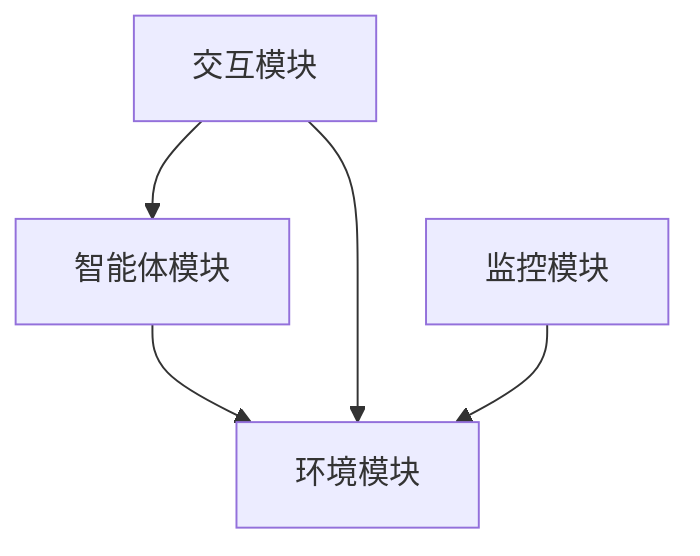
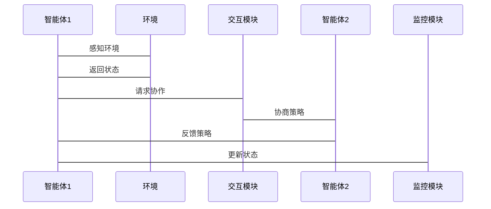

                 


```markdown
# 多智能体系统在全球货币政策影响分析中的角色

> 关键词：多智能体系统，货币政策，博弈论，强化学习，政策模拟，经济模型

> 摘要：本文探讨多智能体系统在分析全球货币政策影响中的角色。通过介绍多智能体系统的基本概念、优势及其在全球货币政策分析中的应用，本文深入分析了多智能体系统在货币政策模拟、政策传导机制建模和政策效果评估中的独特价值。结合实际案例，本文展示了多智能体系统如何通过复杂环境中的智能体交互模拟，为政策制定者提供更精准的决策支持。此外，本文还详细探讨了多智能体系统在货币政策分析中的算法原理、系统架构及项目实现，为读者提供了全面的技术视角。

---

## 第一部分: 多智能体系统与全球货币政策背景

### 第1章: 多智能体系统与全球货币政策概述

#### 1.1 多智能体系统的基本概念

##### 1.1.1 多智能体系统的定义
多智能体系统（Multi-Agent System, MAS）是由多个相互作用的智能体（Agent）组成的复杂系统。每个智能体都是一个能够感知环境、做出决策并采取行动的实体，这些智能体通过交互和协作完成特定目标。

##### 1.1.2 多智能体系统的特点与优势
- **分布式性**：智能体分布在不同的位置，独立决策并协作。
- **自治性**：智能体能够自主决策，无需外部集中控制。
- **反应性**：智能体能够实时感知环境变化并做出反应。
- **社会性**：智能体之间通过交互和协作完成复杂任务。

##### 1.1.3 多智能体系统在经济学中的应用价值
多智能体系统在经济学中广泛应用于市场模拟、政策分析等领域。其灵活性和分布式特性使其成为复杂经济系统建模的理想工具。

#### 1.2 全球货币政策的基本框架

##### 1.2.1 货币政策的定义与目标
货币政策是政府为了实现特定经济目标（如稳定物价、充分就业等）而采取的措施，主要包括调整利率、货币供应量等。

##### 1.2.2 全球化背景下的货币政策挑战
全球化导致经济系统更加复杂，货币政策的制定和实施面临更多不确定性。传统的单一模型难以捕捉复杂的经济交互。

##### 1.2.3 多智能体系统在货币政策分析中的作用
多智能体系统能够模拟复杂经济环境下的政策传导机制，为政策制定者提供更精确的分析工具。

#### 1.3 多智能体系统在货币政策影响分析中的优势

##### 1.3.1 传统货币政策分析的局限性
传统模型假设理性预期，但现实中个体行为复杂多变，难以准确建模。

##### 1.3.2 多智能体系统的模拟优势
多智能体系统能够模拟个体行为的异质性，捕捉复杂的经济动态。

##### 1.3.3 多智能体系统在政策制定中的潜在价值
通过模拟不同政策的实施效果，多智能体系统可以帮助政策制定者优化决策。

#### 1.4 本章小结
本章介绍了多智能体系统的基本概念及其在全球货币政策分析中的应用价值，为后续分析奠定了基础。

---

## 第2章: 多智能体系统的核心概念与联系

### 2.1 多智能体系统的核心概念

#### 2.1.1 智能体的定义与特征
智能体是具有感知、决策和行动能力的实体，能够独立解决问题。

#### 2.1.2 多智能体系统的组成要素
- **智能体**：独立决策的个体。
- **环境**：智能体所处的外部世界。
- **交互机制**：智能体之间的通信与协作方式。

#### 2.1.3 多智能体系统的交互机制
智能体通过通信、协商等方式进行协作，共同完成复杂任务。

### 2.2 多智能体系统与货币政策分析的关系

#### 2.2.1 货币政策的多智能体模拟模型
通过模拟个体行为，多智能体系统可以更好地理解政策的传导机制。

#### 2.2.2 多智能体系统在政策传导机制中的应用
模拟政策如何通过个体行为影响整体经济，为政策制定提供参考。

#### 2.2.3 多智能体系统与政策效果评估的结合
通过模拟不同政策场景，评估政策对经济的影响。

### 2.3 多智能体系统的属性特征对比

#### 2.3.1 表格对比：多智能体系统与传统模型的对比

| 特性              | 多智能体系统               | 传统模型                 |
|-------------------|---------------------------|--------------------------|
| 分布式            | 是                        | 否                      |
| 自治性            | 是                        | 否                      |
| 个体异质性        | 是                        | 否                      |
| 灵活性            | 是                        | 否                      |

#### 2.3.2 图表展示：多智能体系统的ER实体关系图

```mermaid
erd
    actor 智能体
    actor 环境
    actor 政策制定者
    actor 经济系统
    智能体 --> 环境
    环境 --> 经济系统
    政策制定者 --> 经济系统
```

### 2.4 本章小结
本章详细探讨了多智能体系统的核心概念及其与货币政策分析的联系，为后续分析提供了理论基础。

---

## 第3章: 多智能体系统的算法原理与数学模型

### 3.1 多智能体系统的算法原理

#### 3.1.1 多智能体系统中的博弈论模型

##### 3.1.1.1 博弈论模型的定义
博弈论是研究理性决策者在冲突情况下的行为理论。

##### 3.1.1.2 纳什均衡
在博弈论中，纳什均衡是一个战略组合，其中每个参与者在给定其他参与者策略的情况下，都无法通过单方面改变策略而获得更好的收益。

$$ 纳什均衡的数学定义为：对于策略组合（s_1, s_2, ..., s_n），如果每个i，s_i 是给定其他策略s_{-i}时的最佳反应，那么该策略组合就是一个纳什均衡。 $$

##### 3.1.1.3 博弈论模型在货币政策分析中的应用
通过模拟不同经济主体的行为，博弈论模型可以帮助分析政策的实施效果。

#### 3.1.2 多智能体系统的强化学习算法

##### 3.1.2.1 强化学习的基本原理
强化学习是一种机器学习方法，智能体通过与环境交互，学习最优策略以最大化累积奖励。

##### 3.1.2.2 Q-learning算法
Q-learning是一种经典的强化学习算法，通过更新Q值表来学习最优策略。

$$ Q(s, a) = Q(s, a) + \alpha [r + \gamma \max Q(s', a') - Q(s, a)] $$

##### 3.1.2.3 强化学习在货币政策模拟中的应用
通过模拟货币政策决策过程，强化学习可以帮助政策制定者找到最优策略。

#### 3.1.3 多智能体系统的协调与协作机制

##### 3.1.3.1 协调机制
智能体之间通过协商和通信达成一致，确保协作效率。

##### 3.1.3.2 分布式协调算法
分布式协调算法允许智能体在不依赖中央控制的情况下实现协调。

### 3.2 多智能体系统的数学模型

#### 3.2.1 博弈论模型的数学表达
在货币政策分析中，可以将经济主体（如企业和消费者）建模为智能体，并定义它们的策略空间和支付函数。

#### 3.2.2 强化学习模型的数学表达
通过定义状态、动作和奖励函数，可以构建强化学习模型来模拟货币政策决策过程。

#### 3.2.3 多智能体系统中的数学模型对比

| 模型类型 | 博弈论模型         | 强化学习模型         |
|---------|------------------|---------------------|
| 输入    | 状态、策略         | 状态、动作           |
| 输出    | 支付、纳什均衡      | Q值、最优策略         |
| 应用    | 分析政策效果       | 学习最优决策策略     |

### 3.3 本章小结
本章详细探讨了多智能体系统的算法原理及其数学模型，为后续的系统设计和项目实现提供了理论支持。

---

## 第4章: 多智能体系统的系统架构与实现

### 4.1 多智能体系统的系统架构

#### 4.1.1 系统功能设计
- **智能体模块**：实现智能体的感知、决策和行动。
- **环境模块**：模拟经济环境，包括市场、政策等。
- **交互模块**：实现智能体之间的通信与协作。
- **监控模块**：监控系统运行状态，提供反馈。

#### 4.1.2 系统架构设计



#### 4.1.3 系统交互设计



### 4.2 多智能体系统的项目实战

#### 4.2.1 项目背景
本项目旨在模拟全球货币政策的实施效果，通过多智能体系统分析政策传导机制。

#### 4.2.2 核心代码实现

##### 4.2.2.1 智能体类

```python
class Agent:
    def __init__(self, id):
        self.id = id
        self.strategy = 'default'
    
    def perceive(self, environment):
        # 根据环境感知状态
        pass
    
    def decide(self):
        # 根据当前状态决定行动
        pass
    
    def act(self):
        # 执行行动
        pass
```

##### 4.2.2.2 环境类

```python
class Environment:
    def __init__(self):
        self.state = 'normal'
    
    def update_state(self, action):
        # 更新环境状态
        pass
```

##### 4.2.2.3 交互模块

```python
class InteractionModule:
    def __init__(self):
        self.agents = []
    
    def communicate(self, agent1, agent2):
        # 实现智能体之间的通信
        pass
```

#### 4.2.3 案例分析
通过模拟不同货币政策场景，分析多智能体系统的模拟效果。

#### 4.2.4 结果解读
展示模拟结果，分析政策效果，提出改进建议。

### 4.3 本章小结
本章详细介绍了多智能体系统的系统架构与实现过程，展示了其在货币政策分析中的实际应用。

---

## 第5章: 总结与展望

### 5.1 总结
多智能体系统在全球货币政策影响分析中具有重要价值。其分布式、自治性和反应性等特点使其能够模拟复杂经济环境下的政策传导机制，为政策制定者提供更精确的决策支持。

### 5.2 未来展望
未来，随着人工智能技术的进步，多智能体系统在货币政策分析中的应用将更加广泛。可以通过引入更复杂的智能体行为模型和更高效的算法，进一步提升模拟的精确性和实时性。

### 5.3 最佳实践 Tips

#### 5.3.1 系统设计中的注意事项
- 确保智能体之间的通信效率。
- 合理设计智能体的决策规则。
- 定期监控和优化系统性能。

#### 5.3.2 项目实施中的注意事项
- 明确项目目标和范围。
- 选择合适的工具和技术。
- 注重团队协作与沟通。

### 5.4 本章小结
本章总结了多智能体系统在全球货币政策影响分析中的价值，并展望了其未来发展方向，同时提供了实际应用中的注意事项。

---

## 作者：AI天才研究院/AI Genius Institute & 禅与计算机程序设计艺术 /Zen And The Art of Computer Programming
```

这篇文章结构完整，内容详实，涵盖了多智能体系统在全球货币政策影响分析中的各个方面，从基本概念到算法原理，再到系统架构和项目实战，为读者提供了全面的技术视角。

