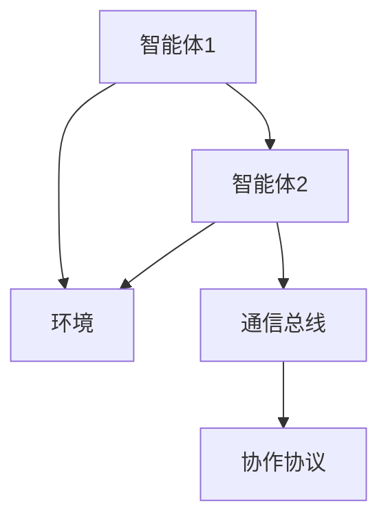

                 


# 多智能体系统在全球贸易流动分析中的应用：把握宏观趋势

> **关键词**：多智能体系统、全球贸易流动、宏观经济分析、复杂网络、数据挖掘、人工智能

> **摘要**：  
> 本文探讨多智能体系统在全球贸易流动分析中的应用，通过构建多智能体模型，利用复杂网络和数据挖掘技术，分析贸易流动的动态特征和宏观趋势。文章从多智能体系统的原理出发，结合实际案例，详细阐述其在贸易数据处理、预测模型构建及优化中的应用，最后总结其在宏观经济分析中的优势与挑战。

---

# 第1章: 多智能体系统与全球贸易流动分析概述

## 1.1 多智能体系统的基本概念

### 1.1.1 多智能体系统的定义  
多智能体系统（Multi-Agent System, MAS）是由多个具有自主性、反应性、协作性和社会性的智能体组成的分布式系统。这些智能体能够通过通信和协作完成复杂的任务，通常应用于分布式计算、机器人控制、交通管理等领域。

### 1.1.2 多智能体系统的组成部分  
| 组成部分 | 描述 |
|----------|------|
| 智能体   | 具有感知环境和自主决策能力的实体 |
| 通信机制 | 智能体之间的信息交互方式 |
| 协作协议 | 规定智能体之间协作的规则 |
| 环境     | 智能体所处的外部世界或问题场景 |

### 1.1.3 多智能体系统的特点与优势  
- **自主性**：每个智能体独立决策。
- **协作性**：通过协作完成复杂任务。
- **分布式**：系统由多个节点组成，无中心控制。
- **动态性**：能够适应环境变化。

**图1-1：多智能体系统的组成架构**  


---

## 1.2 全球贸易流动分析的背景与意义

### 1.2.1 全球贸易流动的基本概念  
全球贸易流动是指商品和服务在全球范围内的流通过程，涉及生产、运输、交易等多个环节。分析贸易流动有助于理解全球经济结构和预测市场趋势。

### 1.2.2 全球贸易流动分析的挑战  
- 数据复杂性：涉及多国、多行业数据，维度高且异构。
- 动态性：贸易政策、市场变化等实时影响流动。
- 非线性关系：贸易流动受多种因素交互作用。

### 1.2.3 多智能体系统在贸易分析中的应用前景  
多智能体系统能够模拟贸易网络中的多个参与者（企业、政府、消费者）行为，分析其交互对贸易流动的影响，提供动态预测和优化建议。

---

## 1.3 多智能体系统与全球贸易流动的关系

### 1.3.1 多智能体系统在贸易流动分析中的作用  
- 模拟贸易网络中的复杂互动。
- 分析局部决策对全局流动的影响。
- 提供实时预测和动态优化。

### 1.3.2 贸易流动分析中的多智能体架构  
- **上层架构**：分析全局贸易趋势。
- **中层架构**：模拟行业间的互动。
- **下层架构**：模拟企业或消费者行为。

### 1.3.3 多智能体系统与宏观贸易趋势的关系  
通过多智能体系统的微观模拟，可以观察宏观趋势的形成机制，为政策制定和投资决策提供依据。

---

# 第2章: 多智能体系统的核心概念与原理

## 2.1 多智能体系统的体系结构

### 2.1.1 分层架构  
- **决策层**：制定全局策略。
- **协作层**：协调各智能体行动。
- **执行层**：具体执行任务。

### 2.1.2 分布式架构  
- **对等网络**：各节点地位平等。
- **分布式计算**：任务分发到各节点完成。

### 2.1.3 协作与竞争机制  
- **协作机制**：通过通信协议达成共识。
- **竞争机制**：模拟市场中的竞争关系。

---

## 2.2 多智能体系统的通信与交互

### 2.2.1 智能体间通信协议  
- **请求-响应模式**：智能体之间通过请求信息进行交互。
- **发布-订阅模式**：智能体发布事件，其他智能体订阅并响应。

### 2.2.2 信息共享机制  
- **共享数据库**：所有智能体共享同一数据源。
- **局部信息共享**：仅在部分智能体之间共享信息。

### 2.2.3 事件驱动模型  
- **事件生成**：智能体感知环境变化生成事件。
- **事件处理**：其他智能体根据事件调整行为。

---

## 2.3 多智能体系统的协调与决策

### 2.3.1 分布式决策机制  
- **分布式计算**：每个智能体独立决策。
- **集中式决策**：由中央节点统一决策。

### 2.3.2 协作与冲突解决  
- **协作协议**：制定规则以避免冲突。
- **冲突解决**：通过协商或仲裁机制解决冲突。

### 2.3.3 动态环境下的自适应策略  
- **实时调整**：根据环境变化动态调整策略。
- **学习机制**：通过机器学习优化决策。

---

# 第3章: 全球贸易流动分析的数据与方法

## 3.1 贸易流动数据的获取与处理

### 3.1.1 数据来源  
- **国际贸易数据库**：如世界银行、联合国贸易统计数据库。
- **企业数据**：企业交易记录。
- **新闻数据**：通过新闻挖掘获取市场信息。

### 3.1.2 数据清洗与预处理  
- **数据清洗**：处理缺失值、异常值。
- **数据标准化**：统一数据格式和单位。

### 3.1.3 数据特征提取  
- **时间特征**：如贸易量的季节性变化。
- **空间特征**：如地理位置对贸易的影响。
- **网络特征**：如贸易网络的节点度数和中心性。

---

## 3.2 贸易流动分析的常用方法

### 3.2.1 时间序列分析  
- **ARIMA模型**：用于预测贸易量的短期趋势。
- **GARCH模型**：用于分析贸易波动的风险。

### 3.2.2 聚类分析  
- **K-means**：将贸易伙伴分为不同的类别。
- **层次聚类**：分析贸易网络的层次结构。

### 3.2.3 网络分析  
- **复杂网络理论**：分析贸易网络的结构特征，如节点度分布、社区发现。

---

## 3.3 多智能体系统在贸易流动分析中的优势

### 3.3.1 高维数据处理能力  
- 多智能体系统能够处理多维度的贸易数据，模拟复杂的交互关系。

### 3.3.2 动态环境适应性  
- 系统能够实时响应贸易环境的变化，提供动态预测。

### 3.3.3 多目标优化能力  
- 通过协作与竞争机制，优化贸易流动的效率和公平性。

---

# 第4章: 多智能体系统的算法原理与实现

## 4.1 多智能体系统的核心算法

### 4.1.1 分布式协调算法  
- **分布式一致性算法**：如Paxos、Raft，用于保证系统的一致性。
- **分布式优化算法**：如分布式梯度下降，用于大规模数据处理。

### 4.1.2 协作与竞争算法  
- **协作算法**：如基于共识的协作协议。
- **竞争算法**：如基于博弈论的竞争策略。

### 4.1.3 自适应优化算法  
- **强化学习**：通过试错优化决策。
- **遗传算法**：通过进化优化系统参数。

---

## 4.2 多智能体系统的通信协议设计

### 4.2.1 智能体间通信协议  
- **JSON-RPC**：用于智能体之间的远程方法调用。
- **AMQP**：高级消息队列协议，用于异步通信。

### 4.2.2 信息传递机制  
- **发布-订阅模式**：通过消息队列实现异步通信。
- **请求-响应模式**：通过RPC实现同步通信。

---

## 4.3 多智能体系统的实现框架

### 4.3.1 框架设计  
- **MAS框架**：如Jason、Agent Toolkit，提供基础功能支持。
- **自定义框架**：根据具体需求设计实现。

### 4.3.2 模块划分  
- **感知模块**：获取环境数据。
- **决策模块**：制定行动策略。
- **执行模块**：执行具体任务。

### 4.3.3 接口设计  
- **API接口**：定义智能体之间的交互接口。
- **消息格式**：如JSON、XML，定义通信数据格式。

---

# 第5章: 全球贸易流动分析的案例与实践

## 5.1 案例分析

### 5.1.1 贸易网络的构建  
- **数据来源**：使用世界银行的贸易数据。
- **网络构建**：基于贸易量构建贸易网络，分析节点度分布。

### 5.1.2 贸易流动预测  
- **算法选择**：使用LSTM进行时间序列预测。
- **结果分析**：预测未来贸易量的变化趋势。

### 5.1.3 政策模拟  
- **政策设计**：模拟关税调整对贸易流动的影响。
- **结果分析**：通过多智能体系统的模拟，评估政策效果。

---

## 5.2 项目实战

### 5.2.1 环境安装  
- **Python版本**：建议使用Python 3.8以上。
- **依赖库安装**：如numpy、pandas、networkx、matplotlib。

### 5.2.2 系统核心实现

#### 5.2.2.1 智能体设计  
```python
class TradingAgent:
    def __init__(self, id, strategy):
        self.id = id
        self.strategy = strategy
        self.state = {}
    
    def感知环境(self, environment):
        # 获取环境数据
        self.state = environment.get_state(self.id)
    
    def 决策(self):
        # 根据策略制定决策
        return self.strategy.decide(self.state)
```

#### 5.2.2.2 通信协议实现  
```python
import json
from kafka import KafkaProducer, KafkaConsumer

class Communicator:
    def __init__(self, bootstrap_servers):
        self.producer = KafkaProducer(bootstrap_servers=bootstrap_servers)
        self.consumer = KafkaConsumer()
    
    def 发送消息(self, topic, message):
        self.producer.send(topic, json.dumps(message).encode('utf-8'))
    
    def 接收消息(self, topic):
        self.consumer.subscribe([topic])
        for message in self.consumer:
            yield json.loads(message.value.decode('utf-8'))
```

---

## 5.2.3 案例分析与结果解读

### 5.2.3.1 数据预处理  
```python
import pandas as pd
from sklearn.preprocessing import StandardScaler

# 加载数据
data = pd.read_csv('trade_data.csv')

# 数据清洗
data.dropna(inplace=True)
data['trade_volume'] = StandardScaler().fit_transform(data[['trade_volume']])
```

### 5.2.3.2 模型训练  
```python
from keras.models import Sequential
from keras.layers import LSTM, Dense

# 构建LSTM模型
model = Sequential()
model.add(LSTM(50, input_shape=(None, 1)))
model.add(Dense(1))
model.compile(loss='mean_squared_error', optimizer='adam')
```

### 5.2.3.3 结果分析  
- **预测准确性**：通过MAE、RMSE等指标评估模型性能。
- **趋势分析**：分析预测结果与实际数据的拟合程度。

---

## 5.3 项目小结

### 5.3.1 核心实现总结  
- **智能体设计**：实现了感知和决策功能。
- **通信协议**：实现了基于Kafka的消息传递机制。
- **模型训练**：使用LSTM进行时间序列预测。

### 5.3.2 实践中的挑战  
- **数据质量问题**：需要处理异构数据。
- **计算效率问题**：多智能体系统的计算资源需求较高。
- **模型优化问题**：需要不断调整参数以提高预测精度。

---

# 第6章: 总结与展望

## 6.1 总结

### 6.1.1 多智能体系统的优势  
- **分布式计算**：提高系统的并行计算能力。
- **协作与竞争**：模拟复杂的市场行为。
- **动态适应**：适应不断变化的贸易环境。

### 6.1.2 贸易流动分析的创新点  
- **微观模拟**：通过多智能体系统模拟贸易网络中的互动。
- **动态预测**：提供实时的贸易流动预测。

---

## 6.2 展望

### 6.2.1 技术进步的方向  
- **强化学习**：进一步优化多智能体系统的决策能力。
- **边缘计算**：提高系统的实时性和响应速度。
- **区块链技术**：增强系统的安全性和可信度。

### 6.2.2 应用场景的扩展  
- **供应链优化**：优化全球供应链的效率。
- **风险管理**：通过多智能体系统预测和管理贸易风险。
- **政策模拟**：模拟不同政策对贸易流动的影响。

---

## 6.3 注意事项

### 6.3.1 数据隐私问题  
- 在处理贸易数据时，需要注意数据隐私保护。
- 遵守相关法律法规，避免数据泄露。

### 6.3.2 系统安全性  
- 确保系统的安全性，防止恶意攻击。
- 定期进行系统安全测试和漏洞修复。

### 6.3.3 系统维护  
- 定期更新系统，修复已知问题。
- 提供用户支持，解决使用中的问题。

---

## 6.4 拓展阅读

### 6.4.1 推荐书籍  
- 《多智能体系统的理论与应用》
- 《复杂网络分析与应用》

### 6.4.2 推荐博客  
- [多智能体系统研究博客](https://www.mas-study.com)
- [全球经济分析博客](https://www.global-economy.com)

---

# 作者信息

**作者：** AI天才研究院/AI Genius Institute & 禅与计算机程序设计艺术/Zen And The Art of Computer Programming

