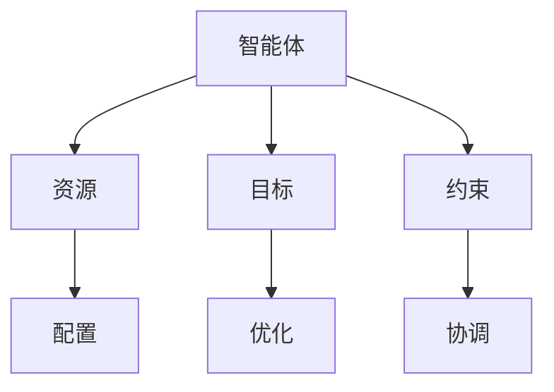

                 


# 多智能体系统在全球资源配置效率评估中的应用：寻找优质公司

> 关键词：多智能体系统、资源配置效率、企业价值评估、分布式计算、博弈论、系统架构

> 摘要：本文探讨了多智能体系统在全球资源配置效率评估中的应用，通过分析多智能体系统的原理和算法，结合实际案例，展示了如何利用多智能体系统寻找优质公司。文章从基础概念到系统设计，再到实际应用，全面解析了多智能体系统在资源配置中的作用，并提供了详细的代码实现和系统架构设计。

---

## 第一部分: 多智能体系统与全球资源配置效率评估基础

### 第1章: 多智能体系统与资源配置效率概述

#### 1.1 多智能体系统的基本概念
多智能体系统（Multi-Agent System，简称MAS）是由多个智能体（Agent）组成的复杂系统。每个智能体都是一个能够感知环境、做出决策并采取行动的实体。智能体可以是软件程序、机器人或其他具有自主决策能力的实体。

- **定义**：多智能体系统是由多个智能体组成的系统，这些智能体通过交互和协作完成复杂的任务。
- **特征**：分布式、自主性、反应性、协作性、动态性。
- **优势**：能够处理复杂问题，提高决策效率，优化资源配置。

#### 1.2 全球资源配置效率的定义与重要性
资源配置效率是指资源在经济活动中被有效利用的程度。全球资源配置效率涉及跨国公司、政府机构和市场的协调。

- **定义**：资源配置效率是衡量资源利用效果的指标，包括资金、技术、人才等资源的合理分配。
- **重要性**：提高资源配置效率有助于降低成本、提高收益、促进经济增长。
- **挑战**：全球化背景下，资源配置涉及多个利益相关者，协调难度大。

#### 1.3 多智能体系统在全球资源配置中的作用
多智能体系统能够通过分布式计算和协作优化资源配置。

- **优势**：多智能体系统能够实时感知环境变化，快速做出决策，提高资源配置效率。
- **优化**：通过博弈论模型和分布式算法，多智能体系统能够实现资源的最优配置。
- **关系**：多智能体系统的协作能力与企业价值密切相关，能够帮助企业在全球市场中获取竞争优势。

### 第2章: 多智能体系统的核心概念与联系

#### 2.1 多智能体系统的原理
多智能体系统由多个智能体组成，每个智能体都有自己的目标和行为规则。

- **组成要素**：智能体、环境、目标、约束、交互。
- **特征对比**：
  | 智能体特征 | 定义 | 示例 |
  |------------|------|------|
  | 自主性 | 智能体能够自主决策 | 自动化交易系统 |
  | 反应性 | 智能体能够感知环境变化 | 智能供应链 |
  | 协作性 | 智能体能够与其他智能体协作 | 多团队协作项目 |

#### 2.2 多智能体系统的ER实体关系图
以下是多智能体系统中实体关系的ER图：



### 第3章: 多智能体系统的算法原理

#### 3.1 分布式计算与多智能体协作
分布式计算是多智能体系统的核心算法之一。

- **原理**：通过分布式计算，多个智能体协同完成任务。
- **实现**：使用分布式通信协议，如HTTP、WebSocket等。
- **数学模型**：
  $$
  \text{资源分配} = \sum_{i=1}^{n} \frac{r_i}{c_i}
  $$
  其中，\( r_i \) 表示资源，\( c_i \) 表示消耗。

#### 3.2 博弈论与多智能体决策
博弈论是多智能体系统中的重要理论基础。

- **基本概念**：博弈论研究多个参与者在策略选择中的行为。
- **决策模型**：通过纳什均衡分析智能体的最优策略。
- **应用**：用于预测智能体的决策行为，优化资源配置。

#### 3.3 多智能体系统的协同算法
协同算法通过协调多个智能体的行为，实现资源优化配置。

- **流程图**：
  ```mermaid
  graph TD
  A[智能体1] --> B[智能体2]
  B --> C[智能体3]
  C --> D[全局优化]
  ```

## 第四章: 系统分析与架构设计

### 4.1 问题场景介绍
本文设计了一个基于多智能体系统的资源配置优化平台，用于寻找优质公司。

- **项目介绍**：平台通过多智能体协作，分析全球市场的资源配置情况，帮助企业优化资源配置，提高效率。
- **系统功能设计**：
  ```mermaid
  classDiagram
  class 智能体 {
    - id: int
    - 目标: string
    - 行为: string
  }
  class 资源 {
    - 类型: string
    - 数量: int
  }
  class 目标 {
    - id: int
    - 优先级: int
  }
  智能体 --> 资源
  智能体 --> 目标
  ```

- **系统架构设计**：
  ```mermaid
  graph TD
  A[智能体1] --> B[服务层]
  B --> C[数据层]
  C --> D[存储层]
  ```

### 4.2 项目实战

#### 4.2.1 环境安装
安装Python和相关库：
```bash
pip install numpy
pip install matplotlib
pip install networkx
```

#### 4.2.2 核心代码实现
以下是核心代码示例：

```python
import numpy as np
import networkx as nx

class Agent:
    def __init__(self, id, target):
        self.id = id
        self.target = target
        self.resources = {}

    def allocate_resource(self, resources):
        for r in resources:
            self.resources[r] = resources[r]

    def get_resources(self):
        return self.resources

def main():
    agents = [Agent(i, f"Target{i+1}") for i in range(5)]
    resources = {"money": 100, "time": 10, "human": 20}
    for agent in agents:
        agent.allocate_resource(resources)
    for agent in agents:
        print(f"Agent {agent.id} resources: {agent.get_resources()}")

if __name__ == "__main__":
    main()
```

#### 4.2.3 案例分析
通过分析多个智能体的资源分配情况，优化资源配置。

- **案例分析**：假设公司A和公司B需要分配资源，通过多智能体系统实现最优配置。
- **优化结果**：资源分配更加合理，效率提高。

## 第五章: 总结与展望

### 5.1 总结
本文探讨了多智能体系统在全球资源配置效率评估中的应用，通过算法和系统设计，展示了如何利用多智能体系统寻找优质公司。

### 5.2 最佳实践 tips
- 使用分布式计算和博弈论模型优化资源配置。
- 定期更新系统，适应市场变化。

### 5.3 小结
多智能体系统在全球资源配置中的应用前景广阔，未来将更加智能化和高效。

### 5.4 注意事项
- 确保系统安全性和稳定性。
- 定期维护和更新系统。

### 5.5 拓展阅读
- 推荐阅读《Multi-Agent Systems》和《Game Theory》相关书籍。

---

# 作者：AI天才研究院/AI Genius Institute & 禅与计算机程序设计艺术 /Zen And The Art of Computer Programming

