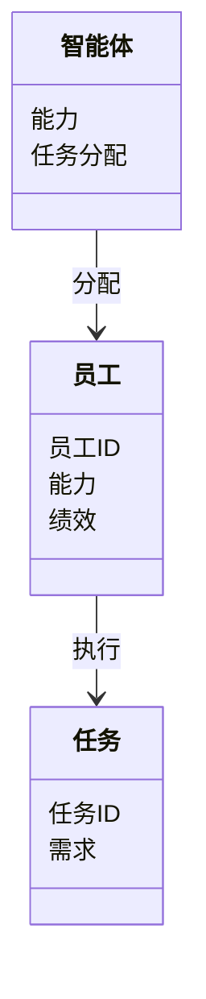

                 


# 多智能体系统在公司人力资本效率评估中的应用

> 关键词：多智能体系统，人力资本效率，效率评估，系统架构，算法原理

> 摘要：本文深入探讨了多智能体系统（MAS）在公司人力资本效率评估中的应用。通过分析MAS的核心概念、算法原理、数学模型以及系统架构，结合实际案例，展示了如何利用MAS提升人力资本管理的效率和准确性。文章内容涵盖从理论到实践的全过程，旨在为企业提供可行的解决方案和最佳实践。

---

## 第1章: 多智能体系统概述

### 1.1 多智能体系统的基本概念

#### 1.1.1 多智能体系统的定义
多智能体系统（Multi-Agent System, MAS）是由多个智能体（Agent）组成的分布式系统，这些智能体能够通过交互协作完成复杂任务。每个智能体都有一定的自主性、目标导向性和社会性。

#### 1.1.2 多智能体系统的特点
- **自主性**：智能体能够自主决策。
- **反应性**：智能体能感知环境并做出反应。
- **协作性**：多个智能体通过协作完成任务。
- **分布性**：系统中的智能体分布在不同的位置，不依赖于中心节点。

#### 1.1.3 多智能体系统的优势
- 提高系统的可靠性和容错性。
- 实现复杂任务的分布式计算。
- 适应动态变化的环境。

### 1.2 多智能体系统在企业中的应用

#### 1.2.1 人力资源管理中的MAS应用
- **任务分配**：智能体可以根据员工能力分配任务。
- **绩效评估**：智能体可以实时监控员工绩效。

#### 1.2.2 MAS在公司管理中的优势
- 提高决策效率。
- 实现资源优化配置。

---

## 第2章: 公司人力资本效率评估的基本概念

### 2.1 人力资本效率评估的定义

#### 2.1.1 人力资本的定义
人力资本是指员工的知识、技能和经验的总和。

#### 2.1.2 效率评估的定义
效率评估是指衡量员工完成任务的速度和质量。

#### 2.1.3 人力资本效率评估的重要性
- 优化资源配置。
- 提高员工满意度。

### 2.2 人力资本效率评估的指标

#### 2.2.1 生产效率指标
- 每人每天完成的任务数量。
- 任务完成时间。

#### 2.2.2 资源利用效率指标
- 人均资源消耗。
- 资源分配的合理性。

---

## 第3章: 多智能体系统在人力资本效率评估中的应用

### 3.1 多智能体系统与人力资本效率评估的关系

#### 3.1.1 多智能体系统如何提升效率评估
- **任务分配**：智能体可以根据员工能力分配任务。
- **协同优化**：智能体可以协同优化资源分配。

#### 3.1.2 多智能体系统在评估中的具体应用
- 智能体可以实时监控员工绩效。

### 3.2 多智能体系统在公司管理中的具体案例

#### 3.2.1 某公司的人力资本效率评估案例
- 使用MAS进行任务分配和绩效评估。

#### 3.2.2 案例分析与经验总结
- MAS可以显著提高效率评估的准确性和效率。

---

## 第4章: 多智能体系统的核心概念

### 4.1 多智能体系统的智能体结构

#### 4.1.1 智能体的定义与分类
- **智能体类型**：反应式智能体、基于模型的智能体。

#### 4.1.2 智能体的交互机制
- **通信机制**：智能体之间的通信方式。
- **协调机制**：智能体之间的协作方式。

### 4.2 多智能体系统的架构设计

#### 4.2.1 基于MAS的人力资本效率评估架构
- **数据采集模块**：收集员工绩效数据。
- **智能体交互模块**：实现智能体之间的交互。

---

## 第5章: 多智能体系统的算法原理

### 5.1 分布式计算算法

#### 5.1.1 分布式计算的基本原理
- **任务分配**：智能体根据能力分配任务。

#### 5.1.2 分布式计算的实现步骤
1. 确定任务类型。
2. 分配任务到智能体。
3. 智能体完成任务。
4. 回馈结果。

### 5.2 协同优化算法

#### 5.2.1 协同优化的基本原理
- **资源分配优化**：智能体协同优化资源分配。

#### 5.2.2 协同优化的实现步骤
1. 确定资源约束。
2. 分配资源到智能体。
3. 智能体优化资源使用。
4. 回馈优化结果。

---

## 第6章: 数学模型和公式

### 6.1 多目标优化模型

#### 6.1.1 多目标优化的定义
- 优化多个目标，如效率和成本。

#### 6.1.2 多目标优化的数学表达
$$ \text{最大化} \quad f_1(x), f_2(x) $$
$$ \text{约束} \quad g(x) \leq 0 $$

### 6.2 协同机制模型

#### 6.2.1 协同机制的定义
- 智能体之间的协作规则。

#### 6.2.2 协同机制的数学表达
$$ \text{协作度} = \sum_{i=1}^n \text{智能体}_i \text{贡献} $$

---

## 第7章: 系统分析与架构设计

### 7.1 问题场景介绍

#### 7.1.1 问题背景
- 传统的人力资本效率评估方法效率低下。

#### 7.1.2 问题描述
- 评估结果不准确。
- 评估过程复杂。

### 7.2 系统功能设计

#### 7.2.1 领域模型设计


### 7.3 系统架构设计

#### 7.3.1 系统架构图


---

## 第8章: 项目实战

### 8.1 环境安装

#### 8.1.1 安装Python和相关库
```bash
pip install numpy matplotlib
```

### 8.2 核心实现

#### 8.2.1 数据采集模块
```python
import numpy as np

def collect_data():
    employees = np.array([...])
    return employees
```

---

## 第9章: 最佳实践与注意事项

### 9.1 最佳实践

#### 9.1.1 系统设计中的注意事项
- 确保智能体之间的通信顺畅。

#### 9.1.2 实际应用中的注意事项
- 定期更新系统。

### 9.2 小结

---

作者：AI天才研究院/AI Genius Institute & 禅与计算机程序设计艺术 /Zen And The Art of Computer Programming

