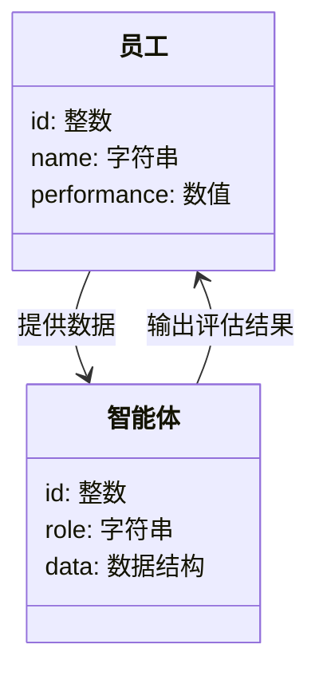
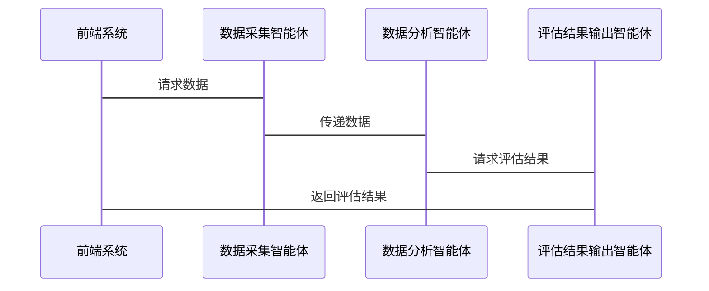

                 


# 《多智能体系统在公司人力资本评估中的应用》

> 关键词：多智能体系统，人力资本评估，协作算法，系统架构，项目实战

> 摘要：本文探讨了多智能体系统（Multi-Agent System，MAS）在公司人力资本评估中的应用。首先介绍了多智能体系统的概念及其在人力资本评估中的优势，接着分析了MAS的核心原理与算法，详细阐述了MAS在人力资本评估中的数学模型与系统架构设计。最后，通过实际项目案例展示了MAS在人力资本评估中的具体应用，并总结了MAS在该领域的优势与未来发展方向。

---

# 第一部分: 多智能体系统与人力资本评估基础

## 第1章: 多智能体系统与人力资本评估概述

### 1.1 多智能体系统的基本概念

#### 1.1.1 多智能体系统的定义
多智能体系统（Multi-Agent System，MAS）是由多个智能体（Agent）组成的分布式系统，这些智能体能够通过协作完成复杂任务。智能体是具有感知、决策、执行和学习能力的实体，可以是软件程序、机器人或其他智能设备。

#### 1.1.2 多智能体系统的特征
- **分布式性**：智能体分布在网络中，独立运行。
- **协作性**：智能体之间通过通信和协作完成任务。
- **自主性**：每个智能体都有自主决策能力。
- **反应性**：智能体能够实时感知环境并做出反应。
- **动态性**：系统中智能体和环境可能动态变化。

#### 1.1.3 多智能体系统与传统单智能体系统的区别
| 特性 | 多智能体系统（MAS） | 单智能体系统 |
|------|------------------|--------------|
| 结构  | 分布式、协作式    | 集中式、单一式 |
| 智能体数量 | 多个             | 单个         |
| 通信  | 智能体之间通信     | 无           |
| 灵活性 | 高               | 低           |

### 1.2 人力资本评估的核心概念

#### 1.2.1 人力资本的定义与内涵
人力资本是指员工的知识、技能、经验和能力的总和，是企业核心竞争力的重要组成部分。人力资本评估旨在通过量化手段，评估员工对企业的贡献和价值。

#### 1.2.2 人力资本评估的目的与意义
- **目的**：识别高潜力员工，优化人力资源配置，提升员工绩效。
- **意义**：帮助企业做出更科学的人力资源管理决策，如招聘、培训、晋升等。

#### 1.2.3 人力资本评估的关键指标
- **绩效指标**：员工的工作成果、效率。
- **能力指标**：员工的专业技能、学习能力。
- **潜力指标**：员工的未来发展潜力。

### 1.3 多智能体系统在人力资本评估中的应用背景

#### 1.3.1 传统人力资本评估的局限性
- **数据孤岛**：各部门数据分散，难以整合。
- **主观性**：评估结果受评估者主观因素影响较大。
- **动态性**：员工能力和绩效会随时间变化，需要动态评估。

#### 1.3.2 多智能体系统的优势与潜力
- **分布式协作**：多个智能体协同工作，实时更新员工数据。
- **数据整合**：通过智能体之间的通信，整合分散的数据。
- **动态评估**：智能体能够实时感知变化，动态调整评估结果。

#### 1.3.3 当前应用现状与发展趋势
- **现状**：多智能体系统在人力资本评估中的应用尚处于起步阶段，主要用于数据整合和初步分析。
- **趋势**：随着AI技术的发展，MAS在人力资本评估中的应用将更加广泛，评估结果将更加精准和动态。

## 第2章: 多智能体系统的核心概念与联系

### 2.1 多智能体系统的原理与机制

#### 2.1.1 智能体的定义与属性
智能体是一种能够感知环境、做出决策并执行动作的实体。智能体的属性包括：
- **感知**：通过传感器或其他方式获取环境信息。
- **决策**：基于感知信息做出决策。
- **执行**：根据决策执行动作。
- **学习**：通过经验改进自身能力。

#### 2.1.2 多智能体系统的协作机制
多智能体系统的协作机制包括：
- **分布式协作**：智能体之间通过通信协议协作完成任务。
- **局部决策**：每个智能体基于局部信息做出决策。
- **全局优化**：通过智能体的协作实现全局最优。

#### 2.1.3 多智能体系统的通信协议
通信协议是智能体之间进行信息交换的规则，主要包括：
- **信息格式**：如JSON、XML等。
- **通信频率**：智能体之间通信的频率。
- **信息内容**：智能体需要交换的信息类型。

### 2.2 多智能体系统与人力资本评估的关系

#### 2.2.1 多智能体系统如何支持人力资本评估
多智能体系统通过以下方式支持人力资本评估：
- **数据整合**：智能体整合来自不同部门的数据，提供全面的员工信息。
- **动态评估**：智能体实时更新员工数据，动态调整评估结果。
- **协作决策**：多个智能体协作完成复杂的评估任务。

#### 2.2.2 多智能体系统在人力资本评估中的角色定位
- **数据采集智能体**：负责采集员工的绩效数据。
- **评估智能体**：负责根据数据进行评估。
- **决策智能体**：负责根据评估结果做出决策。

#### 2.2.3 多智能体系统与人力资本评估的协同效应
多智能体系统的协同效应体现在：
- **高效性**：多个智能体协同工作，提高评估效率。
- **准确性**：通过协作实现更准确的评估结果。
- **动态性**：智能体能够实时调整评估策略。

### 2.3 多智能体系统与传统评估方法的对比

#### 2.3.1 传统评估方法的优缺点
- **优点**：简单易行，易于操作。
- **缺点**：主观性较强，难以动态调整。

#### 2.3.2 多智能体系统的优缺点
- **优点**：能够实现数据整合、动态评估和协作决策。
- **缺点**：系统复杂，实施成本较高。

#### 2.3.3 两种方法的对比分析
通过对比分析可以发现，多智能体系统在人力资本评估中具有明显优势，尤其是在数据整合和动态评估方面。

## 第3章: 多智能体系统在人力资本评估中的算法原理

### 3.1 多智能体系统的协作算法

#### 3.1.1 分布式协作算法
分布式协作算法通过智能体之间的通信实现协作，主要包括以下几个步骤：
1. 智能体感知环境。
2. 智能体做出决策。
3. 智能体与其他智能体通信。
4. 智能体执行决策。

#### 3.1.2 基于规则的协作算法
基于规则的协作算法通过预定义的规则实现智能体之间的协作，主要包括以下步骤：
1. 确定协作规则。
2. 智能体根据规则进行协作。
3. 确保协作结果符合规则要求。

#### 3.1.3 基于学习的协作算法
基于学习的协作算法通过机器学习技术实现智能体之间的协作，主要包括以下步骤：
1. 收集协作数据。
2. 建立协作模型。
3. 训练协作模型。
4. 应用协作模型进行协作。

### 3.2 多智能体系统在人力资本评估中的具体算法实现

#### 3.2.1 智能体行为决策算法
智能体行为决策算法通过以下步骤实现：
1. 智能体感知环境。
2. 智能体分析环境信息。
3. 智能体做出决策。
4. 智能体执行决策。

#### 3.2.2 智能体信息共享算法
智能体信息共享算法通过以下步骤实现：
1. 智能体生成信息。
2. 智能体与其他智能体通信。
3. 智能体共享信息。

#### 3.2.3 智能体协同优化算法
智能体协同优化算法通过以下步骤实现：
1. 确定优化目标。
2. 智能体协同优化。
3. 输出优化结果。

### 3.3 算法的数学模型与公式

#### 3.3.1 协作优化算法的数学模型
协作优化算法的数学模型可以用以下公式表示：
$$
\text{Maximize} \quad f(x_1, x_2, \ldots, x_n)
$$
$$
\text{Subject to} \quad g_i(x_1, x_2, \ldots, x_n) \leq 0, \quad i=1,2,\ldots,m
$$

#### 3.3.2 协作优化算法的公式推导
协作优化算法的公式推导过程如下：
1. 确定优化目标。
2. 建立优化模型。
3. 对模型进行优化求解。

---

# 第二部分: 多智能体系统在人力资本评估中的系统设计与实现

## 第4章: 系统分析与架构设计方案

### 4.1 问题场景介绍
人力资本评估系统需要实现以下功能：
- 数据采集：采集员工的绩效数据。
- 数据分析：分析员工的绩效数据。
- 评估结果输出：输出员工的评估结果。

### 4.2 项目介绍
本项目旨在开发一个多智能体系统，用于公司的人力资本评估。系统包括以下几个模块：
- 数据采集模块：负责采集员工的绩效数据。
- 数据分析模块：负责分析员工的绩效数据。
- 评估结果输出模块：负责输出员工的评估结果。

### 4.3 系统功能设计
系统功能设计包括以下几个方面：
- 数据采集功能：通过智能体采集员工的绩效数据。
- 数据分析功能：通过智能体分析员工的绩效数据。
- 评估结果输出功能：通过智能体输出员工的评估结果。

### 4.4 系统架构设计

#### 4.4.1 领域模型 mermaid 类图


#### 4.4.2 系统架构 mermaid 架构图


### 4.5 系统接口设计
系统接口设计包括以下几个方面：
- 智能体之间的接口：智能体之间通过通信协议进行信息交换。
- 前端系统与智能体之间的接口：前端系统通过接口调用智能体的功能。

### 4.6 系统交互 mermaid 序列图


## 第5章: 项目实战

### 5.1 环境安装
为了运行本项目，需要安装以下环境：
- Python 3.8 或更高版本
- pip
- 以下库：
  - `networkx`
  - `numpy`
  - `scipy`

### 5.2 系统核心实现源代码

#### 5.2.1 数据采集智能体
```python
import json

class EmployeeDataCollector:
    def __init__(self):
        self.data = {}

    def collect_data(self, employee_id):
        # 模拟数据采集
        self.data[employee_id] = {
            'name': '员工' + str(employee_id),
            'performance': 85,
            'potential': 90
        }
        return self.data[employee_id]
```

#### 5.2.2 数据分析智能体
```python
import json

class EmployeeAnalyzer:
    def __init__(self):
        self.data = {}

    def analyze(self, employee_data):
        # 简单的评估算法
        performance_score = employee_data['performance']
        potential_score = employee_data['potential']
        total_score = (performance_score + potential_score) / 2
        return {
            'total_score': total_score,
            'feedback': '表现优秀，潜力较大'
        }
```

#### 5.2.3 评估结果输出智能体
```python
import json

class EmployeeEvaluator:
    def __init__(self):
        self.results = {}

    def evaluate(self, employee_id, analysis_result):
        self.results[employee_id] = analysis_result
        return self.results[employee_id]
```

### 5.3 代码应用解读与分析
- **数据采集智能体**：负责采集员工的绩效数据。
- **数据分析智能体**：负责分析员工的绩效数据，并生成评估结果。
- **评估结果输出智能体**：负责输出员工的评估结果。

### 5.4 实际案例分析与详细讲解
以一个员工为例，假设员工ID为1：
1. 数据采集智能体采集员工ID为1的数据。
2. 数据分析智能体分析员工ID为1的数据，并生成评估结果。
3. 评估结果输出智能体输出员工ID为1的评估结果。

### 5.5 项目小结
通过本项目，我们可以看到多智能体系统在人力资本评估中的应用潜力。每个智能体负责不同的任务，通过协作实现整体目标。

## 第6章: 最佳实践、小结与注意事项

### 6.1 最佳实践 tips
- **数据安全**：确保员工数据的安全性。
- **系统维护**：定期维护和更新系统。
- **用户培训**：对员工进行系统使用培训。

### 6.2 小结
本文详细探讨了多智能体系统在公司人力资本评估中的应用，通过理论分析和实际案例展示了MAS在该领域的优势。

### 6.3 注意事项
- **系统复杂性**：MAS系统的复杂性较高，需要专业的技术人员进行维护。
- **数据隐私**：员工数据的隐私保护是系统设计中的重要考虑因素。
- **系统扩展性**：MAS系统具有良好的扩展性，可以根据需要增加或减少智能体。

### 6.4 拓展阅读
- **推荐书籍**：《Multi-Agent Systems: Complexity, Decentralization, and Adaptation》
- **推荐文章**：《Applying Multi-Agent Systems in Human Resource Management》

---

# 作者：AI天才研究院/AI Genius Institute & 禅与计算机程序设计艺术/Zen And The Art of Computer Programming

---

通过以上目录和内容安排，我们可以清晰地看到《多智能体系统在公司人力资本评估中的应用》一书的完整结构和详细内容。这本书不仅涵盖了MAS的基本概念和算法原理，还通过实际案例展示了MAS在人力资本评估中的具体应用，为读者提供了丰富的理论和实践知识。

