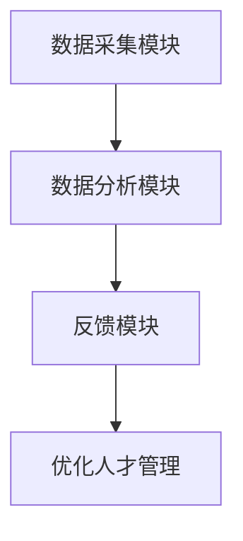
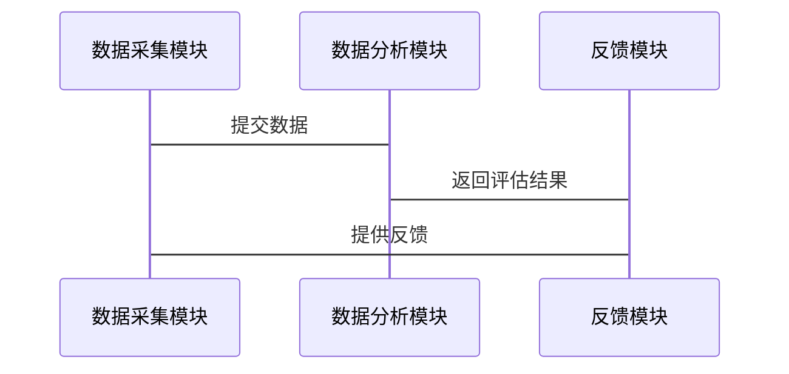

                 


# 多智能体系统在公司人力资本评估中的应用：量化人才价值

**关键词**：多智能体系统、人力资本评估、人才价值量化、分布式计算、协作机制、共识算法

**摘要**：随着企业对人才管理的需求日益增长，传统的单智能体系统已难以满足复杂的人力资本评估需求。多智能体系统（Multi-Agent System, MAS）凭借其分布式计算、协作机制和决策优势，为量化人才价值提供了新的解决方案。本文将从背景介绍、核心概念、算法原理、系统架构、项目实战等多方面详细探讨多智能体系统在人力资本评估中的应用，帮助读者理解其技术优势和实际价值。

---

## 第1章：多智能体系统与人力资本评估背景

### 1.1 多智能体系统的基本概念

#### 1.1.1 多智能体系统的定义与特点
多智能体系统（Multi-Agent System, MAS）是由多个智能体（Agent）组成的分布式系统，这些智能体能够自主决策、协作完成任务。MAS的特点包括：
- **自主性**：智能体能够独立决策。
- **反应性**：能够感知环境并实时调整行为。
- **协作性**：智能体之间通过通信协作完成共同目标。
- **分布式性**：计算资源分散，避免单点故障。

#### 1.1.2 多智能体系统的核心要素
- **智能体**：具备感知、决策、执行能力的实体。
- **通信机制**：智能体之间交换信息的方式。
- **协作协议**：规范智能体协作的规则。
- **环境模型**：智能体对环境的认知框架。

#### 1.1.3 多智能体系统与传统单智能体系统的区别
| **对比维度** | **单智能体系统** | **多智能体系统** |
|--------------|-----------------|------------------|
| 结构         | 单一中心化      | 分布式           |
| 冗余性       | 低              | 高              |
| 可扩展性     | 有限            | 高              |
| 故障容错性   | 低              | 高              |

### 1.2 人力资本评估的背景与意义

#### 1.2.1 人力资本的概念与内涵
人力资本是指企业员工的知识、技能和经验的总和，是企业核心竞争力的重要来源。人力资本评估旨在量化员工对企业的贡献，优化人才管理。

#### 1.2.2 传统人力资本评估的局限性
- **主观性**：依赖人工评估，存在主观偏差。
- **复杂性**：难以量化多维度的人才价值。
- **实时性**：难以快速响应动态变化。

#### 1.2.3 多智能体系统在人力资本评估中的优势
- **分布式计算**：多智能体系统能够并行处理大量数据。
- **协作机制**：智能体之间协作，提供全面的评估结果。
- **实时性**：快速响应数据变化，提升评估效率。

---

## 第2章：多智能体系统的核心原理

### 2.1 多智能体系统的原理与机制

#### 2.1.1 多智能体系统的通信机制
智能体之间通过消息传递进行通信，消息格式包括：
- **动作（Action）**：具体操作指令。
- **状态（State）**：当前智能体的状态信息。
- **目标（Goal）**：协作的目标。

#### 2.1.2 多智能体系统的协作机制
协作机制确保智能体之间协同工作，避免冲突。常见的协作机制包括：
- **协商（Negotiation）**：智能体通过协商达成一致。
- **协调（Coordination）**：通过中间协调器统一行动。
- **规划（Planning）**：智能体共同制定协作计划。

#### 2.1.3 多智能体系统的决策机制
决策机制基于环境信息和智能体状态，通过分布式决策算法（如分布式A*算法）进行决策。

### 2.2 多智能体系统与人力资本评估的关联

#### 2.2.1 多智能体系统如何支持人才评估
- **数据采集**：智能体收集员工绩效、技能数据。
- **数据分析**：智能体协作分析数据，生成评估结果。

#### 2.2.2 多智能体系统如何优化人才管理
- **动态调整**：根据评估结果动态优化人才配置。
- **反馈机制**：提供实时反馈，提升员工绩效。

#### 2.2.3 多智能体系统如何提升组织绩效
- **高效协作**：智能体协作提升组织效率。
- **风险控制**：通过协作机制降低管理风险。

### 2.3 多智能体系统的核心概念对比

#### 2.3.1 不同智能体系统的对比分析
| **对比维度** | **单智能体系统** | **多智能体系统** |
|--------------|-----------------|------------------|
| 复杂性       | 低              | 高              |
| 可扩展性     | 低              | 高              |
| 故障容错性   | 低              | 高              |

#### 2.3.2 多智能体系统与其他技术的对比
- **与分布式系统对比**：MAS不仅分布计算，还具备智能协作能力。
- **与人工智能对比**：MAS强调多智能体协作，而AI注重单点智能。

---

## 第3章：多智能体系统的算法原理

### 3.1 多智能体系统的算法概述

#### 3.1.1 分布式计算算法
分布式计算算法确保多智能体系统高效协作，常见的算法包括：
- **分布式一致性算法**：如Raft共识算法。
- **分布式任务分配算法**：如负载均衡算法。

#### 3.1.2 协作与协调算法
协作与协调算法确保智能体之间高效协作，常见的算法包括：
- **协商算法**：如分布式协商算法。
- **协调算法**：如同步算法。

#### 3.1.3 共识算法
共识算法用于多智能体系统中达成一致，常见的算法包括：
- **RAFT算法**：用于分布式系统中达成一致性。
- **PAXOS算法**：用于分布式系统中的共识达成。

### 3.2 多智能体系统的数学模型

#### 3.2.1 分布式计算模型
分布式计算模型可以用图论表示，节点表示智能体，边表示通信关系。

#### 3.2.2 协作模型
协作模型可以用博弈论中的纳什均衡模型表示，公式为：
$$
\text{Nash Equilibrium} = \{i, j\} \text{ 使得 } u_i(a_i) \geq u_i(a_i') \text{ 且 } u_j(a_j) \geq u_j(a_j')
$$

#### 3.2.3 决策模型
决策模型可以用马尔可夫决策过程表示，公式为：
$$
V(a) = \max_{a'} E[V(a'|a)]
$$

---

## 第4章：多智能体系统的系统分析与架构设计

### 4.1 系统功能设计

#### 4.1.1 功能模块划分
- **数据采集模块**：收集员工数据。
- **数据分析模块**：分析数据，生成评估结果。
- **反馈模块**：提供反馈，优化人才管理。

#### 4.1.2 功能流程图


### 4.2 系统架构设计

#### 4.2.1 系统架构图


#### 4.2.2 接口设计
- **数据采集接口**：提供API接口，接收员工数据。
- **分析接口**：提供API接口，处理数据并返回结果。

#### 4.2.3 交互流程图


---

## 第5章：项目实战

### 5.1 环境安装

#### 5.1.1 环境要求
- **操作系统**：Linux/Windows/MacOS
- **编程语言**：Python 3.8+
- **依赖库**：numpy, pandas, matplotlib

### 5.2 核心代码实现

#### 5.2.1 数据采集模块
```python
import requests

def collect_data():
    response = requests.get('http://localhost:8000/api/employees')
    return response.json()
```

#### 5.2.2 数据分析模块
```python
import pandas as pd

def analyze_data(data):
    df = pd.DataFrame(data)
    return df.describe()
```

#### 5.2.3 反馈模块
```python
import matplotlib.pyplot as plt

def generate_feedback(data):
    plt.figure(figsize=(10,6))
    data.plot.hist(bins=10)
    plt.title('Employee Performance Distribution')
    plt.show()
```

### 5.3 案例分析

#### 5.3.1 案例背景
某公司希望量化员工绩效，使用多智能体系统进行评估。

#### 5.3.2 数据分析结果
数据分析模块生成的统计描述显示，员工绩效分布不均，部分员工表现优秀，部分员工需要改进。

#### 5.3.3 反馈与优化
反馈模块生成可视化图表，帮助管理者识别问题员工，优化人才配置。

---

## 第6章：最佳实践、小结与注意事项

### 6.1 最佳实践
- **模块化设计**：确保系统可扩展性和可维护性。
- **实时监控**：及时发现系统异常，确保协作顺畅。
- **数据安全**：保护员工数据隐私，确保系统安全性。

### 6.2 小结
多智能体系统通过分布式计算、协作机制和决策优势，为人力资本评估提供了新的解决方案。本文详细探讨了其技术原理和实际应用，帮助读者理解其价值。

### 6.3 注意事项
- **系统复杂性**：MAS的复杂性可能增加系统维护成本。
- **数据一致性**：需确保数据同步，避免冲突。
- **安全风险**：需加强数据安全措施，防止信息泄露。

### 6.4 拓展阅读
- **推荐书籍**：《Multi-Agent Systems: Algorithmic, Complexity, and Economic Theory》
- **推荐博客**：[AI Genius Institute](https://aiguru.org)

---

**作者：AI天才研究院/AI Genius Institute & 禅与计算机程序设计艺术/Zen And The Art of Computer Programming**

