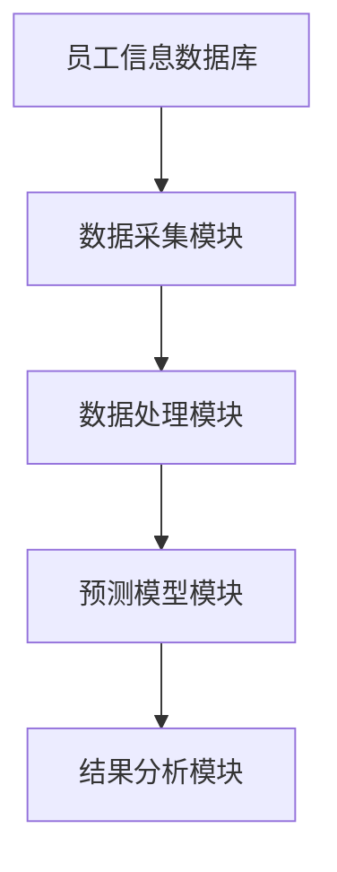
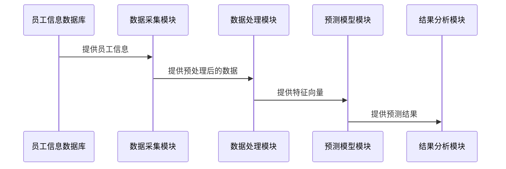

                 


# 多智能体系统在公司人才流失风险评估中的应用

## 关键词：多智能体系统，人才流失，风险评估，预测模型，机器学习

## 摘要：本文探讨了多智能体系统在公司人才流失风险评估中的应用，通过背景分析、算法原理、系统架构和项目实战等多维度，深入阐述了如何利用多智能体系统的优势，结合机器学习和数据挖掘技术，构建高效的人才流失风险预测模型，为企业制定科学合理的人力资源管理策略提供支持。

---

## 第1章: 人才流失风险评估的背景与挑战

### 1.1 人才流失问题的背景

#### 1.1.1 企业人才流失的现状
在当今竞争激烈的商业环境中，人才流失已成为企业面临的主要挑战之一。员工的离职不仅会导致企业损失人力成本，还可能影响团队的稳定性和工作效率。据统计，每年企业因员工离职而产生的损失平均为该员工年薪的1.5倍至2.5倍。

#### 1.1.2 人才流失对企业的影响
人才流失对企业的影响是多方面的，包括：
- **经济损失**：招聘、培训新员工的成本。
- **团队稳定性下降**：核心员工的离职可能导致团队士气低落。
- **知识流失**：资深员工的离职可能带走关键的知识和经验。

#### 1.1.3 传统人才流失评估方法的局限性
传统的评估方法主要依赖于员工满意度调查和离职面谈，存在以下问题：
- 数据采集范围有限，难以覆盖全体员工。
- 数据分析方法单一，难以发现潜在的风险。
- 缺乏动态性，无法实时监测员工状态。

### 1.2 多智能体系统的核心概念

#### 1.2.1 多智能体系统的定义
多智能体系统（Multi-Agent System，MAS）是由多个智能体（Agent）组成的分布式系统，智能体能够通过感知环境、自主决策和协作完成任务。

#### 1.2.2 多智能体系统的特征
- **分布式**：多个智能体协同工作，没有中心化的控制节点。
- **自主性**：每个智能体都能独立感知环境并做出决策。
- **协作性**：智能体之间通过通信和协作完成共同目标。
- **动态性**：系统能够适应环境的变化。

#### 1.2.3 多智能体系统与传统单智能体系统的区别
| 特性 | 多智能体系统 | 单智能体系统 |
|------|--------------|--------------|
| 结构  | 分布式       | 集中式       |
| 决策  | 去中心化     | 中心化       |
| 灵活性 | 高           | 较低         |
| 可扩展性 | 高           | 较低         |

### 1.3 问题背景与问题描述

#### 1.3.1 人才流失风险评估的定义
人才流失风险评估是指通过分析员工的行为、态度和外部环境，预测员工离职的可能性。

#### 1.3.2 人才流失风险评估的核心要素
- **员工特征**：年龄、性别、工作年限等。
- **工作满意度**：对工作的满意度、薪酬满意度等。
- **职业发展机会**：晋升机会、培训机会等。
- **外部环境**：行业竞争、经济状况等。

#### 1.3.3 多智能体系统在人才流失评估中的应用价值
- **实时监测**：通过智能体实时收集和分析员工数据。
- **动态预测**：根据员工行为变化动态调整预测模型。
- **协作决策**：多个智能体协作，提供更准确的预测结果。

## 第2章: 多智能体系统的基本原理

### 2.1 多智能体系统的组成与结构

#### 2.1.1 智能体的定义与分类
- **定义**：智能体是能够感知环境、自主决策并执行任务的实体。
- **分类**：基于智能体的智能水平，可分为反应式智能体、基于模型的智能体和实用推理智能体。

#### 2.1.2 多智能体系统的层次结构
- **物理层**：智能体的硬件实现。
- **逻辑层**：智能体的行为规则和决策逻辑。
- **通信层**：智能体之间的通信协议和数据交换。

#### 2.1.3 多智能体系统的核心要素
- **智能体**：系统的最基本单元。
- **通信协议**：智能体之间交互的规则。
- **协作机制**：智能体协作完成任务的方式。

### 2.2 多智能体系统的通信与协作

#### 2.2.1 智能体之间的通信机制
- **通信模型**：基于消息传递的通信机制。
- **数据格式**：JSON、XML等常用的格式。

#### 2.2.2 多智能体系统的协作模型
- **分布式协作**：智能体之间通过分布式计算协作。
- **集中式协作**：通过一个中心节点协调各智能体的协作。

#### 2.2.3 通信协议与数据交换格式
- **通信协议**：HTTP、WebSocket等。
- **数据交换格式**：JSON、XML等。

### 2.3 多智能体系统的决策机制

#### 2.3.1 分布式决策的基本概念
- **分布式决策**：智能体基于本地信息做出决策。

#### 2.3.2 多智能体系统的决策模型
- **基于规则的决策模型**：通过预定义的规则进行决策。
- **基于学习的决策模型**：通过机器学习算法进行决策。

#### 2.3.3 决策机制的实现方法
- **基于规则的实现**：通过IF-ELSE语句实现。
- **基于学习的实现**：通过训练好的模型进行预测。

## 第3章: 多智能体系统在人才流失评估中的应用价值

### 3.1 人才流失风险评估的复杂性

#### 3.1.1 人才流失的影响因素
- **内部因素**：薪酬、福利、工作环境等。
- **外部因素**：行业竞争、经济状况等。

#### 3.1.2 人才流失评估的难点
- **数据复杂性**：涉及多个维度的数据。
- **动态变化**：员工状态会随着时间和环境变化。

#### 3.1.3 传统方法的局限性
- **数据采集难度**：难以实时获取员工数据。
- **分析方法单一**：缺乏动态性和预测性。

### 3.2 多智能体系统的优势

#### 3.2.1 分布式计算的优势
- **实时性**：能够实时采集和分析数据。
- **高效性**：多个智能体同时处理数据，提高效率。

#### 3.2.2 多智能体系统的灵活性
- **适应性**：能够快速适应环境变化。
- **可扩展性**：可以根据需要扩展系统规模。

#### 3.2.3 高效协作的能力
- **协作性**：多个智能体协作，提高预测准确性。
- **智能化**：通过智能体的自主决策，提高预测的准确性。

### 3.3 应用场景与边界

#### 3.3.1 人才流失风险评估的主要场景
- **员工离职预测**：通过分析员工的行为和态度，预测员工离职的可能性。
- **离职原因分析**：通过分析离职员工的原因，找出问题所在。

#### 3.3.2 多智能体系统的应用边界
- **数据范围**：仅限于内部员工数据，不涉及外部数据。
- **预测范围**：仅限于预测员工离职的可能性，不涉及其他方面。

#### 3.3.3 与其他方法的对比分析
- **传统方法**：依赖于员工满意度调查和离职面谈，数据采集范围有限，分析方法单一。
- **多智能体系统**：通过实时数据采集和分布式计算，提高预测的准确性和实时性。

## 第4章: 人才流失风险评估的多智能体系统架构

### 4.1 问题场景介绍

#### 4.1.1 人才流失风险评估的系统目标
- **实时监测**：实时监测员工的行为和态度。
- **动态预测**：动态预测员工离职的可能性。
- **协作决策**：通过多个智能体协作，提供准确的预测结果。

#### 4.1.2 系统的输入与输出
- **输入**：员工的基本信息、工作表现、离职记录等。
- **输出**：员工的离职概率、离职原因分析等。

### 4.2 系统功能设计

#### 4.2.1 领域模型设计
- **员工信息**：员工的基本信息，包括年龄、性别、工作年限等。
- **工作表现**：员工的工作绩效、出勤率等。
- **离职记录**：员工的离职记录和离职原因。

#### 4.2.2 系统功能模块
- **数据采集模块**：实时采集员工的行为数据。
- **数据处理模块**：对采集的数据进行清洗和预处理。
- **预测模型模块**：基于机器学习算法，构建离职概率预测模型。
- **结果分析模块**：对预测结果进行分析，找出离职的主要原因。

### 4.3 系统架构设计

#### 4.3.1 系统架构图


#### 4.3.2 系统接口设计
- **数据采集接口**：从员工信息数据库中获取数据。
- **数据处理接口**：对数据进行清洗和预处理。
- **预测模型接口**：调用机器学习模型进行预测。
- **结果分析接口**：对预测结果进行分析，生成报告。

### 4.4 系统交互流程

#### 4.4.1 交互流程图


## 第5章: 人才流失风险评估的多智能体系统实现

### 5.1 项目实战

#### 5.1.1 环境安装
- **Python**：安装Python 3.8及以上版本。
- **机器学习库**：安装scikit-learn、pandas、numpy等。
- **数据可视化库**：安装Matplotlib、Seaborn等。

#### 5.1.2 核心代码实现

##### 数据预处理代码
```python
import pandas as pd
import numpy as np

# 读取数据
data = pd.read_csv('employee_data.csv')

# 删除缺失值
data = data.dropna()

# 标准化处理
from sklearn.preprocessing import StandardScaler
scaler = StandardScaler()
scaled_data = scaler.fit_transform(data)
```

##### 特征提取代码
```python
from sklearn.decomposition import PCA
pca = PCA(n_components=2)
principal_components = pca.fit_transform(scaled_data)
```

##### 离职概率预测模型
```python
from sklearn.ensemble import RandomForestClassifier
model = RandomForestClassifier(n_estimators=100, max_depth=2, random_state=42)
model.fit(principal_components, target)
```

#### 5.1.3 案例分析
假设我们有一个员工的数据，通过上述模型可以预测该员工的离职概率。

##### 代码实现
```python
import joblib
from sklearn.ensemble import RandomForestClassifier

# 加载模型
model = joblib.load('model.pkl')

# 预测离职概率
new_employee = np.array([[3.5, 2.8]])
predicted_prob = model.predict_proba(new_employee)[:,1]
print(predicted_prob)
```

#### 5.1.4 项目总结
通过上述代码，我们可以实现一个简单的人才流失风险评估系统。通过不断的优化和调整模型参数，可以提高预测的准确性。

## 第6章: 最佳实践与总结

### 6.1 最佳实践

#### 6.1.1 数据隐私保护
在实际应用中，需要注意员工数据的隐私保护，避免数据泄露。

#### 6.1.2 模型维护
定期更新模型，确保模型的有效性和准确性。

#### 6.1.3 持续优化
根据实际应用效果，不断优化模型和系统架构。

### 6.2 小结
本文通过多智能体系统的理论和实践，详细阐述了如何构建一个高效的人才流失风险评估系统。通过实时监测、动态预测和协作决策，可以有效降低人才流失的风险，为企业的人力资源管理提供科学依据。

### 6.3 注意事项
- **数据隐私**：在处理员工数据时，必须遵守相关法律法规。
- **模型维护**：定期更新模型，确保模型的有效性。
- **系统稳定性**：确保系统的稳定运行，避免因系统故障导致数据丢失。

### 6.4 拓展阅读
- **多智能体系统**：深入学习多智能体系统的理论和应用。
- **机器学习**：学习更多的机器学习算法和模型优化方法。

## 作者：AI天才研究院/AI Genius Institute & 禅与计算机程序设计艺术 /Zen And The Art of Computer Programming

