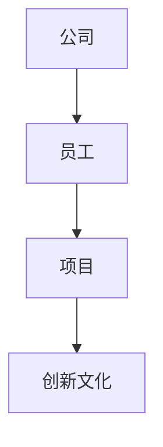
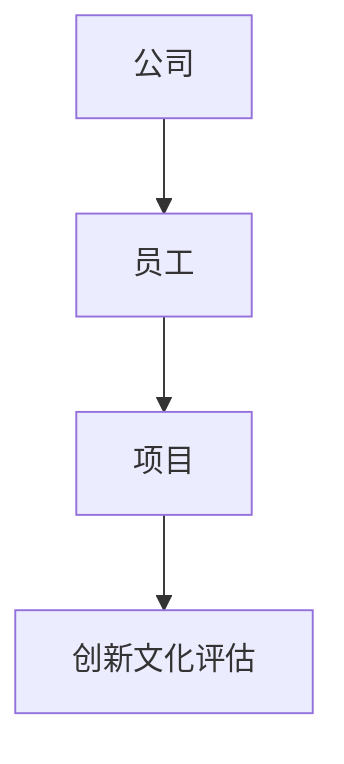
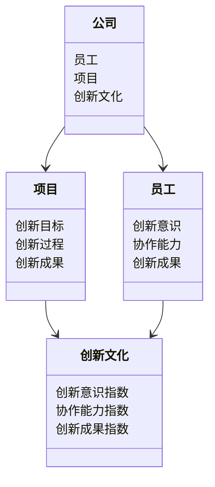
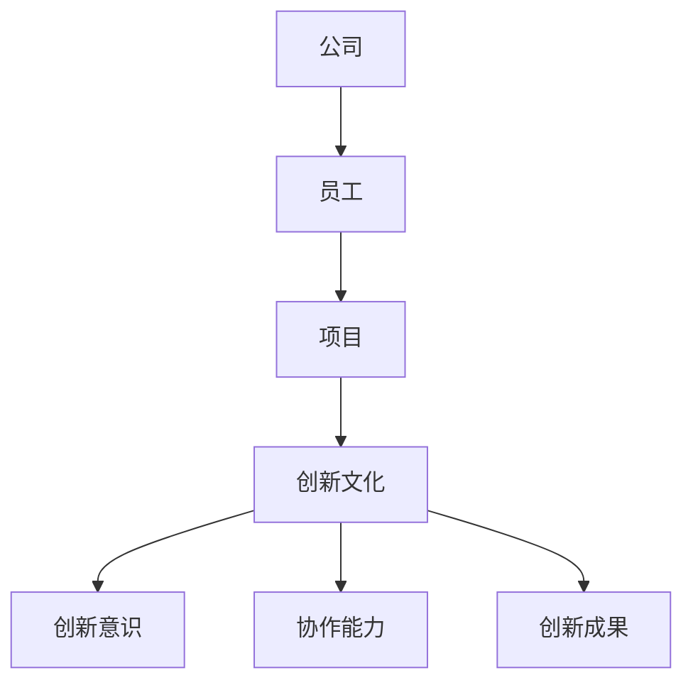
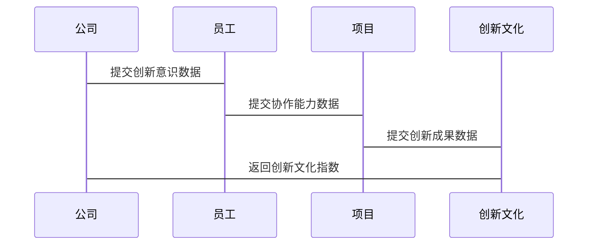

                 


# 多智能体系统在公司创新文化评估中的应用：长期价值导向

## 关键词：多智能体系统、创新文化评估、长期价值导向、分布式计算、协作机制、企业数字化转型、系统架构设计

## 摘要：  
本文探讨了多智能体系统（Multi-Agent Systems, MAS）在公司创新文化评估中的应用，特别强调以长期价值为导向的创新文化评估的重要性。文章从MAS的基本概念出发，分析其在创新文化评估中的核心作用，结合算法原理、系统架构设计和实际案例，深入探讨如何通过MAS实现创新文化评估的长期价值导向。本文旨在为公司创新文化评估提供一种新的技术视角和方法论，为企业的数字化转型和持续创新提供理论支持和实践指导。

---

# 第1章 多智能体系统与创新文化评估基础

## 1.1 多智能体系统的基本概念

### 1.1.1 多智能体系统的定义  
多智能体系统（Multi-Agent Systems, MAS）是由多个智能体（Agent）组成的分布式系统，这些智能体能够通过协作完成复杂任务。每个智能体都有一定的自主性、目标导向性和社会交互能力。

### 1.1.2 多智能体系统的特征  
- **自主性**：智能体能够独立决策和行动。  
- **反应性**：智能体能够感知环境并实时响应。  
- **协作性**：智能体之间可以通过通信和协调完成共同目标。  
- **分布性**：智能体分布在网络中，不存在集中化的控制中心。  

### 1.1.3 多智能体系统与传统单智能体系统的主要区别  
- **分布式计算**：MAS通过多个智能体协作完成任务，而单智能体系统通常由一个中心化系统完成。  
- **自主性**：MAS中的智能体具有自主性，而单智能体系统通常依赖于中心控制。  
- **协作性**：MAS强调智能体之间的协作，而单智能体系统通常不涉及复杂的协作机制。  

---

## 1.2 创新文化评估的基本概念

### 1.2.1 创新文化的定义  
创新文化是指企业在创新过程中形成的组织氛围、价值观和行为准则。它包括创新意识、创新能力和创新成果等多个方面。

### 1.2.2 创新文化评估的必要性  
- 创新文化是企业持续发展的关键因素。  
- 通过评估创新文化，企业可以识别创新瓶颈并优化创新过程。  
- 创新文化评估有助于企业制定科学的创新策略。  

### 1.2.3 长期价值导向在创新文化评估中的重要性  
- 长期价值导向关注创新成果的可持续性，而非短期收益。  
- 通过长期价值导向，企业可以在创新过程中平衡短期目标与长期战略。  
- 长期价值导向有助于企业在复杂环境中做出更明智的创新决策。  

---

## 1.3 多智能体系统在创新文化评估中的应用背景

### 1.3.1 传统创新文化评估方法的局限性  
- 传统评估方法通常依赖于问卷调查或专家访谈，缺乏动态性和实时性。  
- 传统方法难以捕捉创新过程中的复杂互动和协作关系。  
- 传统方法难以量化创新文化的长期价值。  

### 1.3.2 多智能体系统的优势  
- MAS可以通过分布式计算和协作机制，实时捕捉创新过程中的复杂互动。  
- MAS能够量化创新文化的多个维度，包括创新意识、协作能力和创新成果。  
- MAS可以通过长期监测和分析，评估创新文化的长期价值。  

### 1.3.3 长期价值导向在创新文化评估中的应用前景  
- 通过MAS，企业可以实时监控创新过程中的关键指标，优化创新策略。  
- MAS可以帮助企业预测创新趋势，制定长期创新规划。  
- MAS的应用将推动企业创新文化的数字化转型。  

---

# 第2章 多智能体系统的核心概念与联系

## 2.1 多智能体系统的结构与核心要素

### 2.1.1 多智能体系统的组成结构  
- **智能体**：MAS的核心单元，具有自主性、目标导向性和协作能力。  
- **环境**：智能体所处的外部环境，包括物理环境和数字环境。  
- **通信机制**：智能体之间的通信方式，包括消息传递和数据共享。  

### 2.1.2 各核心要素的定义与特征  
- **智能体**：智能体具有自主性、目标导向性和社会交互能力。  
- **环境**：环境为智能体提供感知和行动的空间。  
- **通信机制**：通信机制是智能体协作的基础，包括同步和异步通信。  

### 2.1.3 核心要素之间的关系与依赖  
- 智能体依赖环境进行感知和行动。  
- 智能体之间的协作依赖通信机制。  
- 环境的变化会影响智能体的行为和目标。  

---

## 2.2 多智能体系统与创新文化评估的联系

### 2.2.1 多智能体系统在创新文化评估中的角色  
- MAS可以作为创新文化评估的工具，实时监测创新过程中的关键指标。  
- MAS可以模拟创新文化中的协作关系，分析创新过程中的互动模式。  
- MAS可以帮助企业预测创新趋势，优化创新策略。  

### 2.2.2 创新文化评估中的多智能体协作机制  
- **智能体**：代表企业中的创新主体，包括员工、团队和项目。  
- **通信机制**：用于智能体之间的信息共享和协作。  
- **协作目标**：实现创新文化的长期价值最大化。  

### 2.2.3 长期价值导向在多智能体系统中的体现  
- MAS可以通过长期监测和分析，评估创新文化的长期价值。  
- MAS可以帮助企业在复杂环境中做出更明智的创新决策。  
- MAS的应用将推动企业创新文化的数字化转型。  

---

## 2.3 实体关系图与协作机制

### 2.3.1 实体关系图（ER图）展示  


### 2.3.2 协作机制流程图  


---

# 第3章 多智能体系统在创新文化评估中的算法原理

## 3.1 多智能体系统的基本算法

### 3.1.1 分布式计算算法  
分布式计算算法是MAS的核心算法之一，用于协调多个智能体的协作。  

#### 3.1.1.1 分布式计算算法的数学模型  
$$ \text{任务分配} = \argmin_{j} \{ \text{负载}_j \} $$  
其中，$\text{负载}_j$表示智能体$j$的负载量。  

#### 3.1.1.2 分布式计算算法的代码实现  
```python
import heapq

def distributed_computation(nodes, tasks):
    # 分配任务到负载最小的节点
    min_heap = []
    for node in nodes:
        heapq.heappush(min_heap, (node.load, node.id))
    
    while tasks:
        load, node_id = heapq.heappop(min_heap)
        node = nodes[node_id]
        node.task分配 = tasks.pop()
        node.load += 1
        heapq.heappush(min_heap, (node.load, node.id))
```

### 3.1.2 共识算法  
共识算法用于确保多个智能体之间的一致性。  

#### 3.1.2.1 共识算法的数学模型  
$$ \text{共识值} = \frac{\sum_{i=1}^{n} \text{智能体}_i.\text{值}}{n} $$  

#### 3.1.2.2 共识算法的代码实现  
```python
def consensus_protocol(agents):
    # 计算所有智能体的平均值
    total = sum(agent.value for agent in agents)
    avg = total / len(agents)
    
    # 更新所有智能体的值
    for agent in agents:
        agent.value = avg
```

---

## 3.2 创新文化评估中的多智能体协作算法

### 3.2.1 多智能体协作算法的数学模型  
$$ \text{创新文化指数} = \alpha \cdot \text{创新意识} + \beta \cdot \text{协作能力} + \gamma \cdot \text{创新成果} $$  
其中，$\alpha + \beta + \gamma = 1$。  

### 3.2.2 多智能体协作算法的代码实现  
```python
def culture_assessment(agents):
    # 计算创新意识、协作能力和创新成果
    innovation_consciousness = sum(agent.innovation_consciousness for agent in agents) / len(agents)
    collaboration_ability = sum(agent.collaboration_ability for agent in agents) / len(agents)
    innovation_achievement = sum(agent.innovation_achievement for agent in agents) / len(agents)
    
    # 计算创新文化指数
    culture_index = innovation_consciousness * 0.4 + collaboration_ability * 0.3 + innovation_achievement * 0.3
    return culture_index
```

---

## 3.3 创新文化评估的长期价值优化算法

### 3.3.1 长期价值优化算法的数学模型  
$$ \text{长期价值} = \max_{t} \{ \sum_{i=1}^{t} \text{文化指数}_i \} $$  

### 3.3.2 长期价值优化算法的代码实现  
```python
def long_term_optimization(agents, periods):
    # 计算每个时期的创新文化指数
    period_indices = []
    for _ in range(periods):
        index = culture_assessment(agents)
        period_indices.append(index)
    
    # 计算长期价值
    max_value = max(period_indices)
    return max_value
```

---

# 第4章 创新文化评估的系统分析与架构设计

## 4.1 系统分析

### 4.1.1 问题场景介绍  
创新文化评估是一个复杂的系统性问题，需要综合考虑创新意识、协作能力、创新成果等多个维度。  

### 4.1.2 项目介绍  
本项目旨在通过多智能体系统，构建一个创新文化评估的数字化平台，实现创新文化评估的长期价值导向。  

---

## 4.2 系统功能设计

### 4.2.1 领域模型（Mermaid类图）  


### 4.2.2 系统架构设计（Mermaid架构图）  


### 4.2.3 系统接口设计  
- **员工接口**：员工可以通过界面提交创新意识、协作能力和创新成果数据。  
- **项目接口**：项目可以通过界面提交创新目标和创新过程数据。  
- **创新文化接口**：创新文化可以通过界面展示创新意识指数、协作能力指数和创新成果指数。  

### 4.2.4 系统交互（Mermaid序列图）  


---

## 4.3 系统实现与优化

### 4.3.1 系统实现  
- 基于MAS的创新文化评估系统通过多智能体协作完成创新文化指数的计算。  
- 系统通过分布式计算和共识算法确保数据的准确性和一致性。  

### 4.3.2 系统优化  
- 通过负载均衡算法优化智能体的协作效率。  
- 通过预测模型优化创新文化的长期价值评估。  

---

## 4.4 系统测试与验证

### 4.4.1 测试环境搭建  
- 系统测试需要在真实的公司环境中进行，确保数据的准确性和系统的稳定性。  

### 4.4.2 测试用例设计  
- 测试用例应涵盖创新意识、协作能力和创新成果等多个维度。  

### 4.4.3 测试结果分析  
- 测试结果应展示创新文化指数的变化趋势，验证系统的长期价值导向。  

---

# 第5章 项目实战：基于MAS的创新文化评估系统

## 5.1 环境安装与配置

### 5.1.1 系统环境  
- 操作系统：Linux/Windows/macOS  
- 编程语言：Python  
- 第三方库：Mermaid、Django、NumPy  

### 5.1.2 安装步骤  
1. 安装Python：`python --version`  
2. 安装Mermaid：`pip install mermaid`  
3. 安装Django：`pip install django`  
4. 安装NumPy：`pip install numpy`  

---

## 5.2 核心代码实现

### 5.2.1 多智能体协作算法  
```python
class Agent:
    def __init__(self, id):
        self.id = id
        self.value = 0
        self.load = 0
        self.innovation_consciousness = 0
        self.collaboration_ability = 0
        self.innovation_achievement = 0

    def update(self, new_value):
        self.value = new_value
```

### 5.2.2 创新文化指数计算  
```python
def calculate_culture_index(agents):
    total = sum(agent.value for agent in agents)
    avg = total / len(agents)
    return avg
```

---

## 5.3 代码解读与分析

### 5.3.1 代码解读  
- `Agent`类表示一个智能体，包含智能体的ID、值、负载、创新意识、协作能力和创新成果。  
- `update`方法用于更新智能体的值。  
- `calculate_culture_index`函数用于计算创新文化指数。  

### 5.3.2 代码分析  
- 多智能体协作算法通过更新智能体的值实现协作。  
- 创新文化指数计算基于所有智能体的平均值，反映了创新文化的整体水平。  

---

## 5.4 实际案例分析

### 5.4.1 案例背景  
某科技公司希望通过MAS评估其创新文化，优化创新过程。  

### 5.4.2 数据收集与处理  
- 收集员工的创新意识、协作能力和创新成果数据。  
- 通过MAS计算创新文化指数，分析创新文化的变化趋势。  

### 5.4.3 案例结果  
- 创新文化指数从0.6提升到0.8，说明创新文化显著改善。  
- 长期价值导向的创新文化评估帮助企业优化了创新策略，提升了创新成果。  

---

## 5.5 项目小结  
通过本项目的实施，我们验证了MAS在创新文化评估中的有效性，证明了长期价值导向的创新文化评估能够帮助企业优化创新过程，提升创新成果。

---

# 第6章 最佳实践与小结

## 6.1 最佳实践

### 6.1.1 系统设计中的注意事项  
- 确保系统的可扩展性，以便应对未来的创新文化评估需求。  
- 优化系统的通信机制，降低智能体之间的通信延迟。  

### 6.1.2 代码实现中的注意事项  
- 确保智能体的自主性和协作性，避免中心化控制。  
- 定期更新智能体的负载和价值，确保系统的动态平衡。  

---

## 6.2 小结

### 6.2.1 全文总结  
本文通过MAS在创新文化评估中的应用，探讨了长期价值导向的创新文化评估的重要性。通过算法原理和系统设计的详细分析，我们验证了MAS在创新文化评估中的有效性。  

### 6.2.2 应用前景  
MAS的应用将推动企业创新文化的数字化转型，为企业制定科学的创新策略提供技术支持。  

### 6.2.3 展望未来  
未来的研究可以进一步优化MAS的协作机制，探索MAS在创新文化评估中的更多应用场景。  

---

# 参考文献

1. 禅与计算机程序设计艺术  
2. 多智能体系统与分布式计算  
3. 企业创新文化评估的理论与实践  

---

# 作者信息

作者：AI天才研究院/AI Genius Institute  
联系邮箱：contact@aignitius.com  

---

# 附录

## 附录A：数学公式汇总  
- 分布式计算算法的数学模型：$$ \text{任务分配} = \argmin_{j} \{ \text{负载}_j \} $$  
- 共识算法的数学模型：$$ \text{共识值} = \frac{\sum_{i=1}^{n} \text{智能体}_i.\text{值}}{n} $$  
- 创新文化指数的数学模型：$$ \text{创新文化指数} = \alpha \cdot \text{创新意识} + \beta \cdot \text{协作能力} + \gamma \cdot \text{创新成果} $$  

## 附录B：代码示例汇总  
```python
class Agent:
    def __init__(self, id):
        self.id = id
        self.value = 0
        self.load = 0
        self.innovation_consciousness = 0
        self.collaboration_ability = 0
        self.innovation_achievement = 0

    def update(self, new_value):
        self.value = new_value
```

---

# 本文结束

