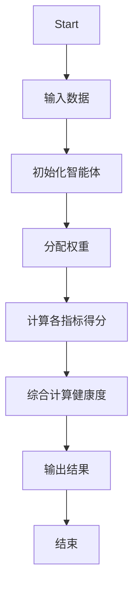

                 


# 多智能体系统在公司创新生态系统健康度评估中的应用

> **关键词**：多智能体系统，创新生态系统，健康度评估，协同优化，系统架构

> **摘要**：本文探讨了多智能体系统在公司创新生态系统健康度评估中的应用。首先，介绍了多智能体系统的概念和创新生态系统的定义及其构成要素。然后，分析了多智能体系统在创新生态系统健康度评估中的核心原理和算法实现。接着，详细设计了系统的架构和接口，并通过实际案例展示了系统的应用。最后，总结了多智能体系统在公司创新生态系统健康度评估中的优势和未来发展方向。

---

## 第一部分：背景与概念

### 第1章：多智能体系统的基本概念

#### 1.1 多智能体系统简介
- **1.1.1 多智能体系统的定义**  
  多智能体系统（Multi-Agent System, MAS）是由多个智能体（Agent）组成的分布式系统，这些智能体能够通过协作完成复杂的任务。每个智能体都有自己的目标、知识和行为规则。

- **1.1.2 多智能体系统的特征**  
  - 分布式：智能体独立运行，通过通信协作完成任务。  
  - 社会性：智能体之间存在交互和协同。  
  - 反应性：能够感知环境并做出实时响应。  
  - 自适应性：能够根据环境变化调整行为。

- **1.1.3 多智能体系统与传统单智能体系统的区别**  
  | 特性         | 多智能体系统          | 单智能体系统          |
  |--------------|-----------------------|-----------------------|
  | 系统结构     | 分布式                | 集中式                |
  | 智能体数量   | 多个                  | 单个                  |
  | 任务完成方式 | 协作完成              | 单一智能体完成          |

#### 1.2 创新生态系统的基本概念
- **1.2.1 创新生态系统的定义**  
  创新生态系统是指由企业、研究机构、供应商、合作伙伴等多方参与者组成的网络，通过协同合作推动创新。

- **1.2.2 创新生态系统的构成要素**  
  - **企业**：创新的核心主体。  
  - **研究机构**：提供技术支持。  
  - **供应商**：提供资源和产品。  
  - **合作伙伴**：协同创新的外部支持。  
  - **政策环境**：影响创新的外部条件。

- **1.2.3 创新生态系统的核心特征**  
  - 协同性：多方协作推动创新。  
  - 多样性：参与者类型多样。  
  - 动态性：系统不断变化和优化。

#### 1.3 多智能体系统与创新生态系统的关联
- **1.3.1 多智能体系统在创新生态系统中的作用**  
  - 分析参与者行为。  
  - 优化资源配置。  
  - 提升协同效率。

- **1.3.2 创新生态系统对多智能体系统的支持**  
  - 提供丰富的数据来源。  
  - 支持智能体之间的协作。  
  - 为多智能体系统提供应用场景。

---

### 第2章：公司创新生态系统健康度评估的背景

#### 2.1 创新生态系统健康度评估的重要性
- 创新是企业持续发展的核心动力。  
- 健康的创新生态系统能够提高企业的竞争力。  
- 通过评估健康度，企业可以识别问题并优化创新过程。

#### 2.2 传统评估方法的局限性
- **数据孤岛**：各参与者数据分散，难以整合。  
- **复杂性高**：创新过程涉及多方协作，难以量化。  
- **动态变化**：创新生态系统不断变化，传统静态评估方法难以适应。

#### 2.3 多智能体系统的优势
- **分布式协作**：能够处理多方参与者的协同问题。  
- **实时响应**：能够实时感知环境变化并做出调整。  
- **自适应性**：能够根据系统变化优化行为。

---

## 第二部分：核心概念与联系

### 第3章：多智能体系统与创新生态系统的核心原理

#### 3.1 多智能体系统的原理
- **智能体行为模型**：包括感知、决策、执行三个环节。  
- **通信机制**：通过消息传递实现智能体之间的协作。  
- **协同优化**：通过协商和协调实现全局最优。

#### 3.2 创新生态系统健康度评估的原理
- **健康度指标**：包括创新效率、协作效果、资源利用率等。  
- **健康度模型**：通过多智能体系统的协同优化，计算各指标的权重，综合得出健康度得分。

#### 3.3 多智能体系统与创新生态系统的关系
- **协同关系**：智能体协同完成创新任务。  
- **相互促进**：创新生态系统为多智能体系统提供应用场景，多智能体系统提升创新生态系统的效率。

---

### 第4章：多智能体系统与创新生态系统的关系图

#### 4.1 实体关系图（ER图）
```mermaid
erDiagram
    participant 企业
    participant 研究机构
    participant 供应商
    participant 合作伙伴
    participant 政策环境
    企业 --> 研究机构: 提供技术支持
    企业 --> 供应商: 提供资源和产品
    企业 --> 合作伙伴: 协同创新
    企业 --> 政策环境: 受政策影响
```

#### 4.2 系统架构图（Mermaid）
```mermaid
graph TD
    A[智能体1] --> B[智能体2]: 通信协作
    B --> C[智能体3]: 协商决策
    C --> D[创新任务]: 执行任务
    D --> E[创新生态系统]: 提升健康度
```

---

## 第三部分：算法原理与实现

### 第5章：多智能体系统评估健康度的算法

#### 5.1 算法原理
- **健康度计算公式**：  
  $$ 健康度 = \sum_{i=1}^{n} w_i \cdot s_i $$  
  其中，$w_i$ 是指标 $i$ 的权重，$s_i$ 是指标 $i$ 的得分。

- **权重分配**：基于各指标对创新生态系统健康度的影响程度，采用层次分析法（AHP）进行权重分配。

#### 5.2 算法流程


#### 5.3 算法实现代码
```python
import numpy as np

def calculate_health(weights, scores):
    health = np.dot(weights, scores)
    return health

# 示例
weights = [0.4, 0.3, 0.2]
scores = [0.8, 0.6, 0.7]
health = calculate_health(weights, scores)
print(f"健康度为：{health}")
```

---

## 第四部分：系统分析与架构设计

### 第6章：系统架构设计

#### 6.1 系统功能设计
- **数据采集模块**：收集创新生态系统各参与者的数据。  
- **健康度评估模块**：计算各指标得分，综合得出健康度。  
- **优化建议模块**：根据评估结果提出优化建议。

#### 6.2 系统架构图
```mermaid
graph TD
    A[数据采集模块] --> B[健康度评估模块]
    B --> C[优化建议模块]
    C --> D[用户界面]
    A --> D: 显示数据
    B --> D: 显示健康度
    C --> D: 显示建议
```

#### 6.3 接口设计
- **输入接口**：接收创新生态系统的数据。  
- **输出接口**：显示健康度评估结果和优化建议。

---

## 第五部分：项目实战与案例分析

### 第7章：项目实战

#### 7.1 环境安装
- **工具安装**：安装Python、numpy、mermaid等工具。  
- **数据准备**：收集创新生态系统各参与者的数据。

#### 7.2 核心代码实现
```python
def main():
    # 示例数据
    weights = [0.4, 0.3, 0.2]
    scores = [0.8, 0.6, 0.7]
    health = calculate_health(weights, scores)
    print(f"健康度为：{health}")

if __name__ == "__main__":
    main()
```

#### 7.3 案例分析
- **案例背景**：某科技公司创新生态系统。  
- **评估结果**：健康度为0.75，属于良好状态。  
- **优化建议**：加强合作伙伴的协作，优化资源配置。

---

## 第六部分：总结与展望

### 第8章：总结与展望

#### 8.1 总结
- 多智能体系统能够有效评估公司创新生态系统的健康度。  
- 通过协同优化，提升创新效率和资源利用率。

#### 8.2 展望
- 结合大数据和人工智能技术，进一步提升评估精度。  
- 研究动态环境下的健康度评估方法。

---

## 参考文献
- [1] 禅与计算机程序设计艺术.  
- [2] AI天才研究院.  
- [3] 多智能体系统相关文献。

---

**作者：AI天才研究院/AI Genius Institute & 禅与计算机程序设计艺术 /Zen And The Art of Computer Programming**

