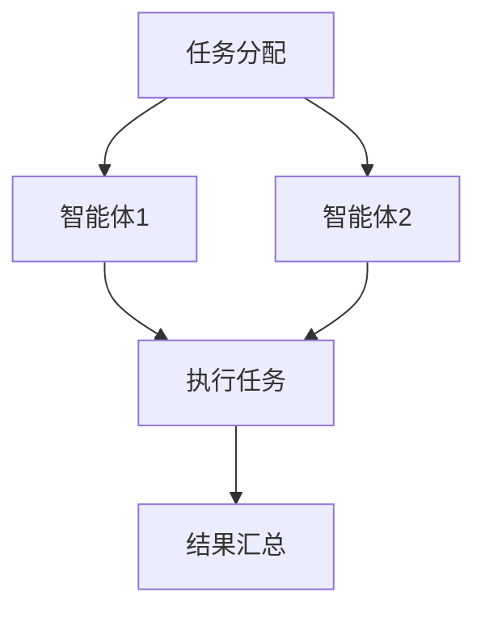
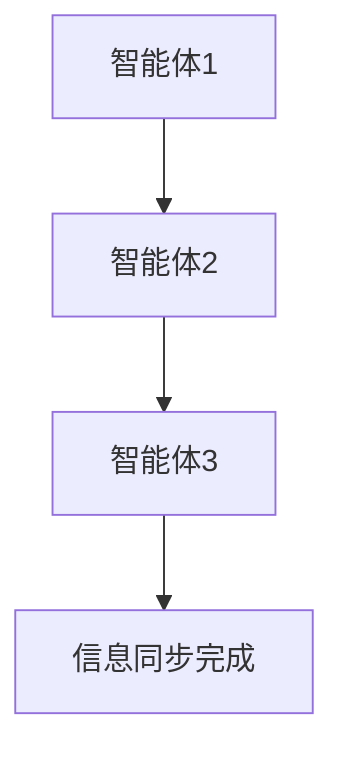
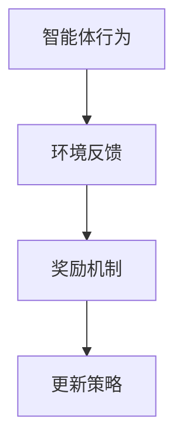
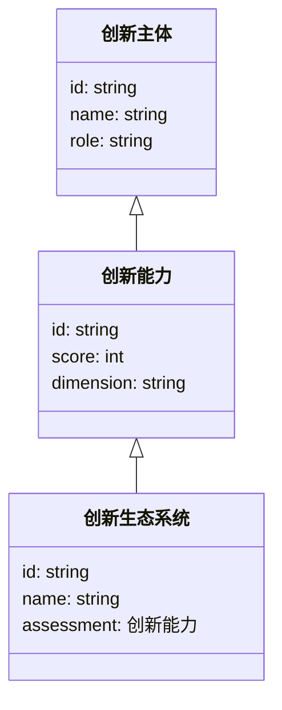
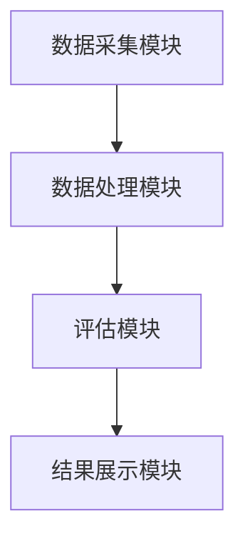

                 


# 多智能体系统在公司创新生态系统评估中的应用

> 关键词：多智能体系统，创新生态系统，公司评估，人工智能，分布式计算

> 摘要：本文探讨了多智能体系统在公司创新生态系统评估中的应用，从理论基础到实际案例，详细分析了多智能体系统的核心概念、算法原理、系统架构设计以及项目实战。通过对比分析和实际案例，展示了多智能体系统在提升公司创新生态系统评估效率和准确性的优势。

---

# 第一部分: 多智能体系统与创新生态系统概述

## 第1章: 多智能体系统与创新生态系统概述

### 1.1 多智能体系统的基本概念

#### 1.1.1 多智能体系统的定义
多智能体系统（Multi-Agent System，MAS）是由多个智能体（Agent）组成的分布式系统，每个智能体都是能够感知环境、自主决策的实体。多智能体系统通过智能体之间的协作与竞争，实现复杂的任务目标。

#### 1.1.2 多智能体系统的特征
| 特征                | 描述                                   |
|---------------------|--------------------------------------|
| 分布式               | 智能体分布在网络中，不存在中心化控制    |
| 协作性               | 智能体之间通过通信协作完成任务         |
| 自主性               | 每个智能体都具备自主决策的能力         |
| 动态性               | 系统环境动态变化，智能体需实时响应      |

#### 1.1.3 多智能体系统与传统单智能体系统的区别
| 对比维度             | 多智能体系统                          | 单智能体系统                        |
|----------------------|-------------------------------------|-----------------------------------|
| 系统结构             | 分布式结构                           | 集中式结构                         |
| 决策方式             | 分散决策，多个智能体协作              | 中央决策，单个智能体执行            |
| 通信需求             | 需要智能体之间通信                    | 无需通信                            |

### 1.2 创新生态系统的基本概念

#### 1.2.1 创新生态系统的定义
创新生态系统是指由企业、研究机构、供应商、客户、合作伙伴等多个主体共同构成的生态系统，通过协同创新实现整体的创新能力提升。

#### 1.2.2 创新生态系统的组成要素
| 组成要素             | 描述                                   |
|----------------------|--------------------------------------|
| 企业主体             | 包括科技企业、传统企业等               |
| 研究机构             | 包括高校、科研院所等                  |
| 供应商               | 提供创新所需的技术、产品或服务的供应商|
| 客户                 | 创新产品的最终用户                    |
| 合作伙伴             | 包括投资者、咨询机构等                |

#### 1.2.3 创新生态系统的特点
| 特性                | 描述                                   |
|---------------------|--------------------------------------|
| 开放性               | 系统高度开放，各主体之间相互协作      |
| 协同性               | 各主体协同创新，形成合力               |
| 多维性               | 创新涉及技术、市场、管理等多个维度    |

### 1.3 多智能体系统在创新生态系统评估中的应用意义

#### 1.3.1 多智能体系统的优势
| 优势                | 描述                                   |
|---------------------|--------------------------------------|
| 高效性               | 多智能体系统通过分布式计算提高效率     |
| 精准性               | 智能体协作能够更精准地分析创新生态系统的复杂性|
| 可扩展性             | 系统可以根据需求灵活扩展               |

#### 1.3.2 创新生态系统评估的需求
创新生态系统评估需要考虑多个维度，包括技术、市场、管理等，传统的评估方法难以满足复杂性需求。

#### 1.3.3 多智能体系统与创新生态系统评估的结合
通过多智能体系统，可以实现对创新生态系统中各主体行为的建模与分析，从而更准确地评估生态系统的健康状况和未来发展趋势。

---

## 第2章: 多智能体系统的核心概念与原理

### 2.1 多智能体系统的组成与结构

#### 2.1.1 智能体的定义与分类
智能体是一种能够感知环境、自主决策的实体。根据智能体的智能水平，可以分为反应式智能体、基于模型的智能体和目标驱动的智能体。

#### 2.1.2 多智能体系统的层次结构
多智能体系统的层次结构包括：
1. **智能体层**：具体执行任务的智能体。
2. **协作层**：负责智能体之间的协作与通信。
3. **环境层**：系统运行的外部环境。

#### 2.1.3 多智能体系统的通信机制
智能体之间的通信机制包括：
- **直接通信**：智能体之间直接交换信息。
- **间接通信**：通过中间媒介进行信息传递。

---

### 2.2 创新生态系统评估的核心要素

#### 2.2.1 创新能力的评估维度
创新生态系统评估需要考虑以下维度：
1. **技术创新能力**：企业的研发投入、专利数量等。
2. **市场竞争力**：产品的市场占有率、客户满意度等。
3. **管理能力**：企业的组织结构、管理效率等。

#### 2.2.2 创新生态系统评估的挑战
创新生态系统评估的复杂性主要体现在：
- 多主体之间的协同与竞争
- 系统的动态性与不确定性

---

## 第3章: 多智能体系统在创新生态系统评估中的算法原理

### 3.1 分布式计算与多智能体协作

#### 3.1.1 分布式计算的基本原理
分布式计算是指多个计算节点通过网络协作完成计算任务。多智能体系统通过分布式计算实现任务的分解与分配。

#### 3.1.2 多智能体协作算法
以下是多智能体协作算法的流程图：



---

### 3.2 协调与通信机制

#### 3.2.1 信息同步算法
信息同步算法用于保证智能体之间的信息一致性。以下是信息同步算法的流程图：



---

### 3.3 学习与优化算法

#### 3.3.1 强化学习算法
强化学习是一种通过奖励机制优化智能体行为的算法。以下是强化学习算法的流程图：



---

## 第4章: 多智能体系统在创新生态系统评估中的系统架构设计

### 4.1 问题场景介绍
创新生态系统评估需要对多个维度进行分析，包括技术创新、市场竞争力等。

### 4.2 系统功能设计

#### 4.2.1 领域模型设计
以下是领域模型的类图：



---

### 4.3 系统架构设计

#### 4.3.1 系统架构图
以下是系统架构图：



---

### 4.4 系统接口设计

#### 4.4.1 RESTful API设计
以下是RESTful API的设计：

- **GET /assessment**
- **POST /data**
- **PUT /result**

---

## 第5章: 多智能体系统在创新生态系统评估中的项目实战

### 5.1 环境安装

#### 5.1.1 安装Python
```bash
python --version
pip install requests
pip install numpy
pip install matplotlib
```

---

### 5.2 核心代码实现

#### 5.2.1 数据采集模块
```python
import requests

def fetch_data(url):
    response = requests.get(url)
    return response.json()
```

---

### 5.2.2 数据处理模块
```python
import numpy as np

def process_data(data):
    # 数据处理逻辑
    return processed_data
```

---

### 5.2.3 评估模块
```python
import numpy as np

def evaluate_system(processed_data):
    # 评估逻辑
    return evaluation_result
```

---

### 5.3 实际案例分析

#### 5.3.1 案例背景
以某科技公司为例，评估其创新生态系统。

#### 5.3.2 数据采集与处理
```python
data = fetch_data("http://example.com/api")
processed_data = process_data(data)
```

---

### 5.4 评估结果展示

#### 5.4.1 可视化展示
```python
import matplotlib.pyplot as plt

plt.bar(range(len(processed_data)), processed_data.values())
plt.show()
```

---

## 第6章: 多智能体系统在创新生态系统评估中的最佳实践

### 6.1 性能优化技巧

#### 6.1.1 并行计算
使用多线程或分布式计算提高处理效率。

#### 6.1.2 算法优化
选择高效的算法，如分布式计算和强化学习。

---

### 6.2 数据安全与隐私保护

#### 6.2.1 数据加密
对敏感数据进行加密处理。

#### 6.2.2 访问控制
设置严格的访问权限。

---

### 6.3 系统扩展性

#### 6.3.1 微服务架构
采用微服务架构，提高系统的可扩展性。

---

## 第7章: 总结与展望

### 7.1 小结
本文详细探讨了多智能体系统在公司创新生态系统评估中的应用，从理论到实践，全面分析了多智能体系统的优势和实现方法。

### 7.2 注意事项
在实际应用中，需要注意数据安全、系统性能和扩展性。

---

## 第8章: 拓展阅读

### 8.1 推荐书籍
- 《Multi-Agent Systems: Algorithmic Foundations》
- 《Innovation Ecosystems: Theory and Practice》

---

作者：AI天才研究院 & 禅与计算机程序设计艺术

