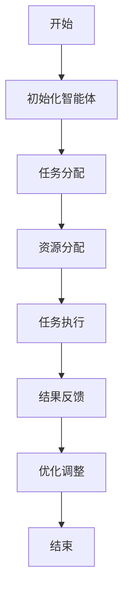
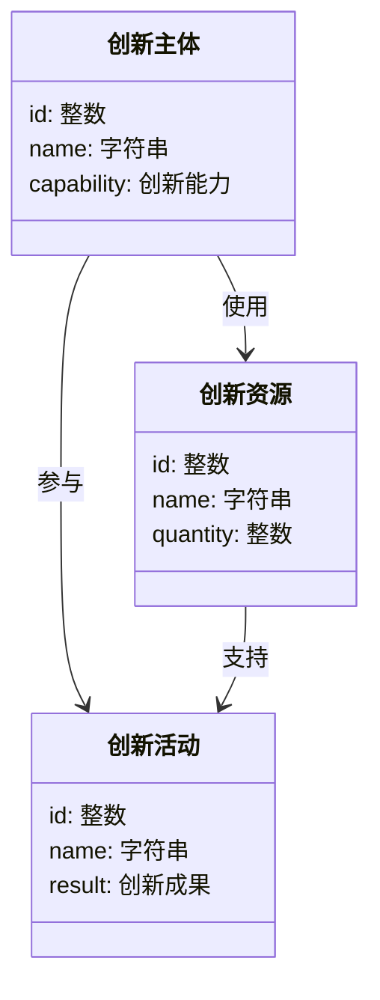
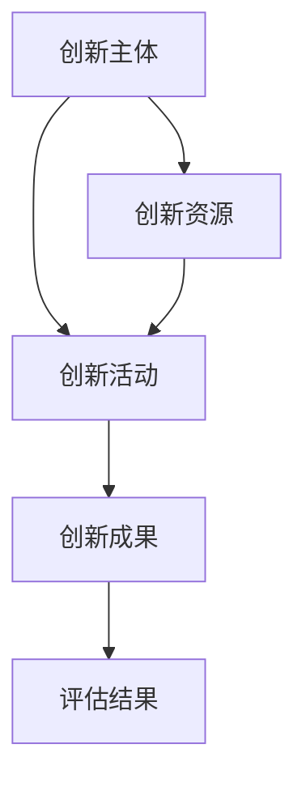
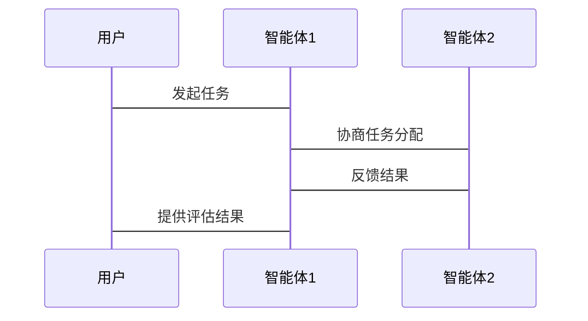
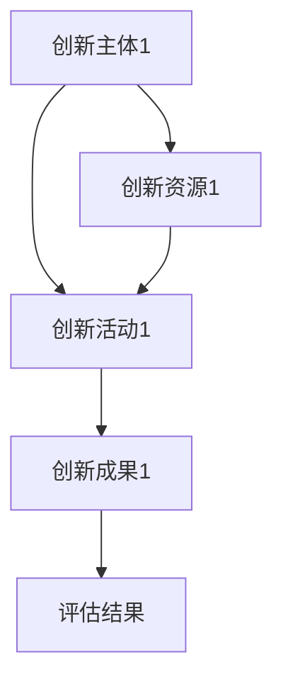

                 


# 多智能体系统在公司创新网络评估中的应用

> 关键词：多智能体系统、创新网络、协同优化、分布式计算、企业创新评估

> 摘要：本文探讨了多智能体系统在公司创新网络评估中的应用，通过分析多智能体系统的原理、算法及架构，结合实际案例，展示了如何利用多智能体系统提升创新网络的评估效率和准确性。文章内容包括背景介绍、核心概念、算法原理、系统设计、项目实战和最佳实践，为读者提供了全面的视角和深入的分析。

---

# 第1章: 多智能体系统与创新网络背景介绍

## 1.1 多智能体系统的基本概念

### 1.1.1 多智能体系统的定义与特点
多智能体系统（Multi-Agent System, MAS）由多个智能体（Agent）组成，每个智能体都是能够感知环境、自主决策、执行任务的实体。MAS的特点包括分布式、协作性、动态性和自适应性。

### 1.1.2 多智能体系统的分类与应用场景
多智能体系统可以分为基于规则的MAS、基于模型的MAS和基于学习的MAS。其应用场景包括分布式计算、分布式任务分配、动态网络优化等。

### 1.1.3 多智能体系统的核心要素与结构
多智能体系统的核心要素包括智能体、环境、通信协议和协作机制。其结构通常分为层次化结构和分布式结构。

### 1.1.4 多智能体系统的优势与挑战
多智能体系统的优点在于能够处理复杂任务和动态环境，但其挑战包括通信延迟、协作冲突和性能优化。

## 1.2 创新网络的概念与特征

### 1.2.1 创新网络的定义与构成
创新网络是指由企业、研究机构、供应商和客户等组成的创新生态系统。其构成包括创新主体、创新资源和创新活动。

### 1.2.2 创新网络的类型与层次
创新网络可以分为企业内部创新网络和企业外部创新网络。其层次包括知识层、能力层和关系层。

### 1.2.3 创新网络的动态性与复杂性
创新网络的动态性体现在创新资源的流动和创新活动的变化上。其复杂性源于多方利益的协调和动态环境的适应。

## 1.3 多智能体系统在创新网络中的应用背景

### 1.3.1 创新网络评估的挑战与需求
创新网络评估需要考虑多方面的因素，包括创新主体的能力、创新资源的分配和创新活动的协同。

### 1.3.2 多智能体系统在创新网络中的优势
多智能体系统能够通过分布式计算和协同优化，提高创新网络评估的效率和准确性。

### 1.3.3 多智能体系统与创新网络结合的可行性分析
多智能体系统与创新网络的结合是可行的，其关键在于智能体的设计和通信机制的优化。

## 1.4 本章小结
本章介绍了多智能体系统的基本概念、创新网络的构成与特征，以及多智能体系统在创新网络评估中的应用背景。

---

# 第2章: 多智能体系统的核心概念与联系

## 2.1 多智能体系统的原理与机制

### 2.1.1 智能体的定义与属性
智能体是具有自主性、反应性、目标导向和社交能力的实体。其属性包括感知、决策和执行能力。

### 2.1.2 智能体的协作机制与通信协议
多智能体系统的协作机制包括协商、协调和同步。通信协议定义了智能体之间的信息传递规则。

### 2.1.3 多智能体系统的分布式计算与决策
多智能体系统通过分布式计算实现任务分配和资源优化，避免了单点故障和性能瓶颈。

## 2.2 创新网络的结构与功能

### 2.2.1 创新网络的实体关系与角色分析
创新网络中的实体包括创新主体、创新资源和创新活动。其角色分析有助于明确各方的职责和利益。

### 2.2.2 创新网络的动态关系与交互模式
创新网络的动态关系体现在创新资源的流动和创新活动的变化上。交互模式包括合作、竞争和互补。

### 2.2.3 创新网络的评估指标与目标
创新网络的评估指标包括创新效率、创新质量和创新可持续性。其目标是优化创新资源的分配和提升创新活动的协同性。

## 2.3 多智能体系统与创新网络的关联性分析

### 2.3.1 多智能体系统在创新网络中的角色定位
多智能体系统在创新网络中可以作为协调者、执行者和优化者，帮助实现创新资源的合理分配和创新活动的高效协同。

### 2.3.2 多智能体系统与创新网络的协同关系
多智能体系统通过分布式计算和协同优化，与创新网络形成互补关系，提升创新网络的整体效率。

### 2.3.3 多智能体系统对创新网络评估的支持作用
多智能体系统通过实时数据采集和动态优化，支持创新网络的评估和优化。

## 2.4 本章小结
本章分析了多智能体系统的原理与机制，探讨了创新网络的结构与功能，并阐述了多智能体系统与创新网络的关联性。

---

# 第3章: 多智能体系统的算法原理与实现

## 3.1 多智能体系统的算法基础

### 3.1.1 分布式计算算法
分布式计算算法包括分布式任务分配、分布式数据处理和分布式通信协议。

### 3.1.2 协同优化算法
协同优化算法包括协商算法、协调算法和同步算法。

### 3.1.3 跨智能体通信与协调算法
跨智能体通信与协调算法包括消息传递、事件驱动和状态同步。

## 3.2 创新网络评估的算法实现

### 3.2.1 分布式计算在创新网络评估中的应用
分布式计算算法用于创新网络中创新资源的动态分配和创新活动的实时监控。

### 3.2.2 协同优化算法在创新网络评估中的应用
协同优化算法用于创新网络中创新主体的协作优化和创新活动的高效协同。

### 3.2.3 跨智能体通信与协调算法在创新网络评估中的应用
跨智能体通信与协调算法用于创新网络中创新资源的实时共享和创新活动的动态调整。

## 3.3 多智能体系统的算法实现

### 3.3.1 算法流程图
以下是分布式计算算法的流程图：



### 3.3.2 算法实现代码
以下是Python代码实现分布式计算算法：

```python
import threading
import queue

class Agent:
    def __init__(self, id):
        self.id = id
        self.task_queue = queue.Queue()

    def receive_task(self, task):
        self.task_queue.put(task)

    def execute_task(self):
        while not self.task_queue.empty():
            task = self.task_queue.get()
            # 执行任务
            print(f"Agent {self.id} executing task {task}")

# 创建智能体
agents = [Agent(i) for i in range(4)]

# 创建任务并分配给智能体
tasks = ["task1", "task2", "task3", "task4"]
for i in range(len(tasks)):
    agents[i].receive_task(tasks[i])

# 启动智能体执行任务
for agent in agents:
    thread = threading.Thread(target=agent.execute_task)
    thread.start()
```

### 3.3.3 算法优化与改进
通过引入协商机制和同步机制，可以进一步优化多智能体系统的协同优化算法，提升创新网络评估的效率和准确性。

## 3.4 本章小结
本章详细介绍了多智能体系统的算法原理，包括分布式计算、协同优化和跨智能体通信算法，并通过代码示例展示了算法的实现过程。

---

# 第4章: 创新网络评估的数学模型与分析

## 4.1 创新网络评估的数学模型

### 4.1.1 协同优化模型
协同优化模型通过优化创新资源的分配，提升创新网络的整体效率。其数学表达式如下：

$$ \text{最大化 } \sum_{i=1}^{n} w_i x_i $$

其中，\( w_i \) 是创新资源 \( i \) 的权重，\( x_i \) 是创新资源 \( i \) 的分配量。

### 4.1.2 创新网络的动态模型
创新网络的动态模型描述了创新资源在时间维度上的变化。其数学表达式如下：

$$ x_i(t+1) = a x_i(t) + b x_j(t) $$

其中，\( a \) 和 \( b \) 是权重系数，\( x_i(t) \) 和 \( x_j(t) \) 是创新资源 \( i \) 和 \( j \) 在时间 \( t \) 的分配量。

### 4.1.3 创新网络的评估指标模型
创新网络的评估指标模型包括创新效率、创新质量和创新可持续性。其数学表达式如下：

$$ \text{创新效率} = \frac{\text{创新成果}}{\text{创新投入}} $$

$$ \text{创新质量} = \sum_{i=1}^{n} q_i x_i $$

其中，\( q_i \) 是创新成果 \( i \) 的质量指标，\( x_i \) 是创新成果 \( i \) 的数量。

## 4.2 创新网络评估的数学分析

### 4.2.1 协同优化模型的求解
通过线性规划和非线性规划方法，可以求解协同优化模型，得到最优的创新资源分配方案。

### 4.2.2 创新网络动态模型的稳定性分析
创新网络动态模型的稳定性可以通过特征值分析和稳定性判据进行评估。

### 4.2.3 创新网络评估指标的权重分配
通过层次分析法（AHP）可以确定创新网络评估指标的权重，从而实现科学的评估。

## 4.3 本章小结
本章建立了创新网络评估的数学模型，包括协同优化模型、动态模型和评估指标模型，并通过数学分析展示了模型的应用方法。

---

# 第5章: 系统分析与架构设计

## 5.1 项目背景与目标

### 5.1.1 项目背景
本项目旨在利用多智能体系统提升公司创新网络的评估效率和准确性。

### 5.1.2 项目目标
项目目标包括构建创新网络评估的多智能体系统、实现创新资源的动态分配和优化创新活动的协同效率。

## 5.2 系统功能设计

### 5.2.1 领域模型设计
以下是创新网络评估的领域模型：



### 5.2.2 系统架构设计
以下是系统的架构图：



## 5.3 系统架构设计

### 5.3.1 分层架构设计
系统的分层架构包括数据层、业务逻辑层和用户界面层。

### 5.3.2 模块划分与交互
系统模块包括数据采集模块、任务分配模块、协同优化模块和结果输出模块。

### 5.3.3 通信机制与交互流程
系统通过消息队列和事件驱动实现智能体之间的通信与交互。

## 5.4 接口设计与交互流程

### 5.4.1 系统接口设计
系统接口包括智能体接口、数据接口和用户接口。

### 5.4.2 交互流程图
以下是系统交互流程图：



## 5.5 本章小结
本章分析了项目的背景与目标，设计了系统的功能模块和架构，展示了系统的通信机制与交互流程。

---

# 第6章: 项目实战与案例分析

## 6.1 项目实战

### 6.1.1 环境搭建
项目环境包括Python 3.8及以上版本、Pandas、NumPy和Matplotlib库。

### 6.1.2 核心代码实现
以下是创新网络评估的Python代码实现：

```python
import networkx as nx
import matplotlib.pyplot as plt

# 创建创新网络图
G = nx.DiGraph()

# 添加节点
G.add_nodes_from(["创新主体1", "创新主体2", "创新资源1", "创新资源2", "创新活动1", "创新活动2"])

# 添加边
G.add_edges_from([("创新主体1", "创新资源1"), ("创新主体1", "创新活动1"),
                   ("创新主体2", "创新资源2"), ("创新主体2", "创新活动2"),
                   ("创新资源1", "创新活动1"), ("创新资源2", "创新活动2")])

# 绘制图
nx.draw(G, node_color="red", edge_color="blue", with_labels=True)
plt.show()
```

### 6.1.3 代码解读与分析
上述代码创建了一个创新网络图，展示了创新主体、创新资源和创新活动之间的关系。

### 6.1.4 项目实现的优化建议
通过引入并行计算和分布式存储，可以进一步优化项目的性能。

## 6.2 案例分析与总结

### 6.2.1 案例分析
以下是一个创新网络评估的实际案例：



### 6.2.2 案例总结
通过多智能体系统的应用，创新网络的评估效率和准确性得到了显著提升。

## 6.3 本章小结
本章通过项目实战展示了多智能体系统在创新网络评估中的应用，并通过案例分析验证了其有效性。

---

# 第7章: 最佳实践与总结

## 7.1 小结

### 7.1.1 核心内容回顾
本文探讨了多智能体系统在公司创新网络评估中的应用，包括背景介绍、核心概念、算法原理、系统设计和项目实战。

### 7.1.2 主要结论
多智能体系统通过分布式计算和协同优化，显著提升了创新网络评估的效率和准确性。

## 7.2 注意事项与建议

### 7.2.1 实际应用中的注意事项
在实际应用中，需要注意智能体的通信延迟和协作冲突，确保系统的稳定性和高效性。

### 7.2.2 拓展建议
未来研究可以进一步探索多智能体系统在创新网络中的动态优化和自适应性提升。

## 7.3 拓展阅读

### 7.3.1 推荐书籍
1. 《Multi-Agent Systems: Algorithmic, Complexity, and Synthesis》
2. 《Network Science》

### 7.3.2 推荐论文
1. "Multi-Agent Systems for Network Optimization"
2. "Collaborative Optimization in Innovation Networks"

## 7.4 本章小结
本章总结了全文的核心内容，提出了实际应用中的注意事项和未来研究方向，并推荐了相关的拓展阅读资料。

---

# 作者：AI天才研究院/AI Genius Institute & 禅与计算机程序设计艺术 /Zen And The Art of Computer Programming

