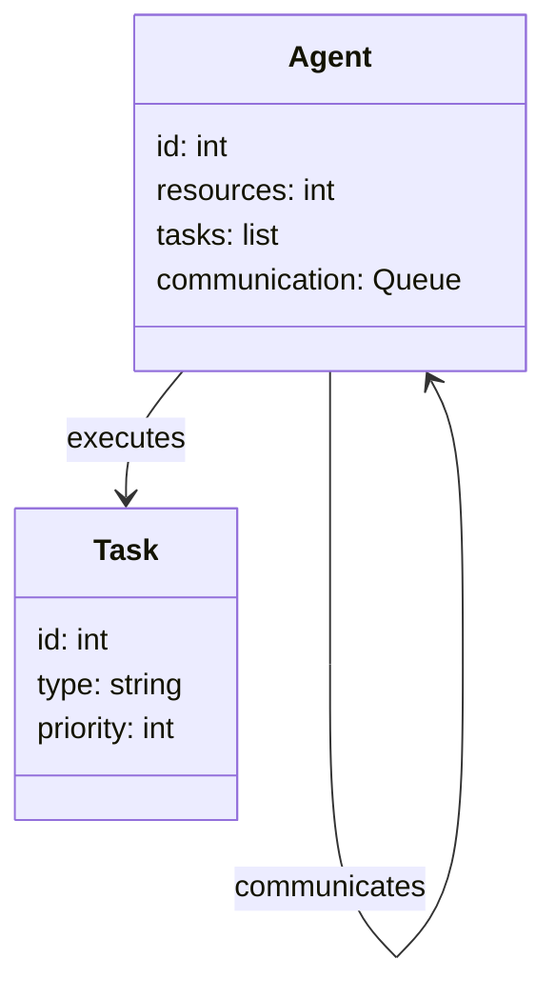
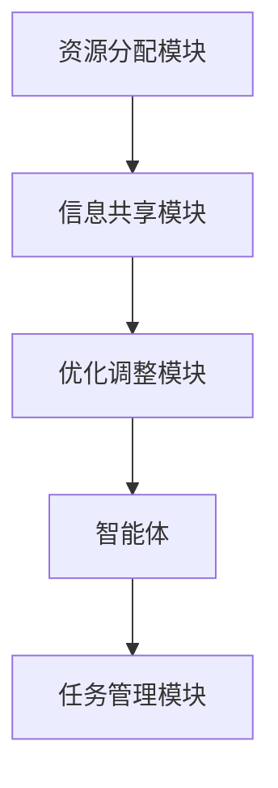
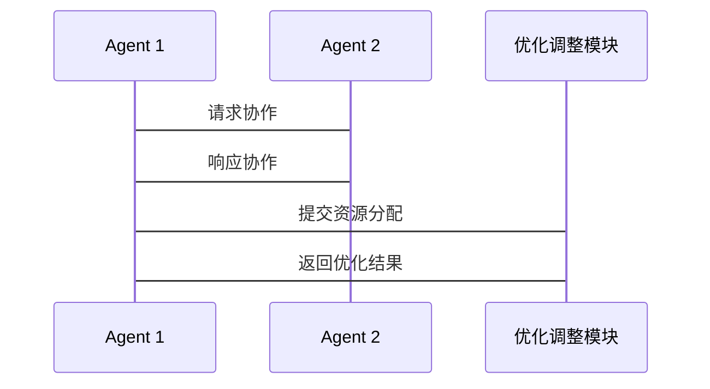

                 


# 多智能体系统在公司创新资源配置效率评估中的应用

> 关键词：多智能体系统, 创新资源配置, 资源效率评估, 优化算法, 系统架构

> 摘要：本文探讨了多智能体系统（MAS）在公司创新资源配置效率评估中的应用，通过分析MAS的核心概念、算法原理、系统架构，结合实际案例，展示了如何利用MAS提升资源配置效率。文章详细介绍了任务分配算法、协作机制、数学模型，并通过项目实战验证了MAS在创新资源配置中的优势。

---

## 第1章: 多智能体系统概述

### 1.1 多智能体系统的基本概念

#### 1.1.1 多智能体系统的定义
多智能体系统（Multi-Agent System, MAS）由多个智能体组成，这些智能体能够自主决策、协作完成任务。MAS的特点包括分布性、协作性、反应性和适应性。

#### 1.1.2 多智能体系统的特征
- 分布性：多个智能体独立运行，共同完成目标。
- 协作性：智能体之间通过通信和协作解决问题。
- 反应性：智能体能感知环境并做出反应。
- 适应性：智能体能适应环境变化。

#### 1.1.3 多智能体系统与单智能体系统的主要区别
| 特性         | 单智能体系统               | 多智能体系统               |
|--------------|----------------------------|-----------------------------|
| 决策中心化    | 单个决策中心               | 分散决策，多个智能体协作   |
| 资源分配      | 中央控制                   | 分布式资源分配             |
| 系统复杂度    | 简单                       | 复杂                       |

### 1.2 多智能体系统的应用领域

#### 1.2.1 多智能体系统在企业管理中的应用
MAS在企业管理中的应用包括资源分配、任务调度、流程优化等。

#### 1.2.2 多智能体系统在资源分配中的优势
- 高效性：分布式计算提高资源利用率。
- 灵活性：适应动态变化的环境。
- 协作性：多个智能体协同工作，提高效率。

#### 1.2.3 多智能体系统在创新资源配置中的潜力
MAS能够优化创新资源的分配，提高资源配置效率。

---

## 第2章: 创新资源配置效率评估的背景与挑战

### 2.1 创新资源配置效率的基本概念

#### 2.1.1 创新资源的定义与分类
创新资源包括人力、资金、技术和时间。

#### 2.1.2 创新资源配置效率的定义
创新资源配置效率是指资源在创新活动中的有效利用程度。

#### 2.1.3 创新资源配置效率的影响因素
包括资源分配方式、协作效率、环境变化等。

### 2.2 创新资源配置效率评估的现状与挑战

#### 2.2.1 现有评估方法的局限性
传统方法通常集中式，难以应对动态变化。

#### 2.2.2 多智能体系统在创新资源配置中的优势
MAS能够实现分布式协作，提高资源配置效率。

#### 2.2.3 创新资源配置效率评估的未来趋势
MAS将成为创新资源配置优化的重要工具。

---

## 第3章: 多智能体系统在创新资源配置中的核心概念

### 3.1 多智能体系统的组成与功能

#### 3.1.1 多智能体系统的组成要素
- 智能体：能够感知环境并自主决策。
- 通信机制：智能体之间的信息交换。
- 协作机制：智能体之间的协作规则。

#### 3.1.2 多智能体系统的功能模块
- 感知模块：感知环境信息。
- 决策模块：制定决策。
- 执行模块：执行任务。

#### 3.1.3 多智能体系统的协作机制
- 任务分配：智能体根据自身能力和环境信息分配任务。
- 通信协议：定义智能体之间的通信规则。
- 协作策略：制定协作目标和优先级。

### 3.2 创新资源配置的核心要素

#### 3.2.1 创新资源的分类与属性
- 人力：员工的能力和时间。
- 资金：资金的分配和使用。
- 技术：技术的开发和应用。
- 时间：项目的进度和时间节点。

#### 3.2.2 创新资源配置的目标与约束
目标：最大化创新产出；约束：资源有限、时间限制、协作需求。

#### 3.2.3 创新资源配置的优化方向
- 提高资源利用率。
- 加强协作效率。
- 实现动态调整。

### 3.3 多智能体系统与创新资源配置的关系

#### 3.3.1 多智能体系统在创新资源配置中的角色
- 智能体作为资源分配者。
- 智能体作为协作执行者。

#### 3.3.2 多智能体系统对创新资源配置效率的提升作用
- 提高决策效率。
- 加强协作能力。
- 实现动态调整。

#### 3.3.3 多智能体系统在创新资源配置中的具体应用场景
- 项目管理。
- 技术研发。
- 市场推广。

---

## 第4章: 多智能体系统在创新资源配置中的算法原理

### 4.1 多智能体系统的核心算法

#### 4.1.1 任务分配算法
任务分配是MAS中的关键问题，常用算法包括：

##### 4.1.1.1 基于博弈论的任务分配算法
通过纳什均衡等博弈论方法，实现资源的最优分配。

##### 4.1.1.2 基于优化模型的任务分配算法
利用线性规划等优化方法，最大化资源利用效率。

##### 4.1.1.3 基于机器学习的任务分配算法
通过训练模型，预测资源需求，优化分配策略。

#### 4.1.2 协作与通信算法
智能体之间的通信和协作是MAS的核心，常用算法包括：

##### 4.1.2.1 基于广播通信的协作算法
所有智能体共享信息，共同决策。

##### 4.1.2.2 基于点对点通信的协作算法
智能体之间通过点对点通信，实现高效协作。

##### 4.1.2.3 基于中间件的协作算法
通过中间件实现智能体之间的通信和协作。

#### 4.1.3 资源分配优化算法
通过优化算法，实现资源的最优分配。

### 4.2 多智能体系统中的任务分配算法

#### 4.2.1 基于博弈论的任务分配算法
博弈论模型用于任务分配，确保资源的公平分配。

#### 4.2.2 基于优化模型的任务分配算法
利用数学模型，求解资源分配的最优解。

#### 4.2.3 基于机器学习的任务分配算法
通过机器学习模型，动态调整资源分配策略。

### 4.3 多智能体系统中的协作机制

#### 4.3.1 协作机制的分类
- 基于角色的协作机制。
- 基于任务的协作机制。
- 基于规则的协作机制。

#### 4.3.2 协作机制的设计原则
- 明确协作目标。
- 设定协作规则。
- 确保信息共享。

---

## 第5章: 数学模型与算法实现

### 5.1 创新资源配置的优化模型

#### 5.1.1 优化目标
最大化创新产出。

#### 5.1.2 约束条件
- 资源有限。
- 时间限制。
- 协作需求。

#### 5.1.3 数学模型
目标函数：
$$ \max \sum_{i=1}^{n} f(x_i) $$
约束条件：
$$ \sum_{i=1}^{n} x_i \leq R $$
其中，\( x_i \) 表示第 \( i \) 个资源的分配量，\( R \) 是总资源。

### 5.2 任务分配算法的实现

#### 5.2.1 算法流程
1. 初始化智能体。
2. 感知环境信息。
3. 制定决策。
4. 执行任务。
5. 优化调整。

#### 5.2.2 代码实现
```python
def task_allocation_agents(num_agents, resources):
    # 初始化
    agents = [0] * num_agents
    # 分配资源
    for i in range(num_agents):
        if resources > 0:
            agents[i] = 1
            resources -= 1
        else:
            agents[i] = 0
    return agents
```

### 5.3 算法优化与实现

#### 5.3.1 算法优化
- 增强智能体的协作能力。
- 提高信息共享效率。
- 实现动态调整。

#### 5.3.2 优化后的代码
```python
def optimized_task_allocation(agents, tasks):
    # 初始化
    allocation = [0] * len(agents)
    # 分配任务
    for i in range(len(tasks)):
        # 找寻最适合的智能体
        best_agent = 0
        for j in range(len(agents)):
            if agents[j] > agents[best_agent]:
                best_agent = j
        allocation[best_agent] += 1
    return allocation
```

---

## 第6章: 系统架构与设计

### 6.1 系统分析与设计

#### 6.1.1 问题场景介绍
创新资源配置效率评估系统需要解决资源分配不均、协作效率低等问题。

#### 6.1.2 系统功能设计
- 资源分配模块：智能体根据需求分配资源。
- 信息共享模块：智能体之间共享信息。
- 优化调整模块：根据反馈调整资源分配。

#### 6.1.3 系统架构设计
- 分层架构：包括感知层、决策层和执行层。
- 智能体通信：通过中间件实现智能体之间的通信。

#### 6.1.4 系统交互设计
- 智能体之间通过消息队列进行通信。
- 信息共享模块实时更新资源状态。

### 6.2 系统架构设计

#### 6.2.1 领域模型设计


#### 6.2.2 系统架构图


#### 6.2.3 系统接口设计
- 智能体接口：提供资源分配、任务执行等接口。
- 通信接口：定义智能体之间的通信协议。
- 优化接口：提供资源分配优化的API。

#### 6.2.4 系统交互序列图


---

## 第7章: 项目实战与案例分析

### 7.1 环境安装与配置

#### 7.1.1 系统要求
- 操作系统：Windows/Linux/OS X
- Python版本：3.6+

#### 7.1.2 工具安装
- Python库：numpy, matplotlib, scikit-learn
- 依赖管理工具：pip

### 7.2 系统核心实现

#### 7.2.1 代码实现
```python
import numpy as np

class Agent:
    def __init__(self, id):
        self.id = id
        self.resources = 0
        self.tasks = []
    
    def allocate_resource(self, task):
        self.resources += 1
        self.tasks.append(task)
    
    def get_resource_usage(self):
        return self.resources
    
    def communicate(self, other_agent):
        # 模拟通信
        pass

def main():
    num_agents = 5
    tasks = ['开发', '测试', '部署', '维护']
    agents = [Agent(i) for i in range(num_agents)]
    
    for task in tasks:
        # 分配任务
        best_agent = 0
        for i in range(1, num_agents):
            if agents[i].get_resource_usage() < agents[best_agent].get_resource_usage():
                best_agent = i
        agents[best_agent].allocate_resource(task)
    
    for agent in agents:
        print(f"Agent {agent.id}: 资源分配量：{agent.resources}, 任务列表：{agent.tasks}")

if __name__ == "__main__":
    main()
```

#### 7.2.2 代码解读
- `Agent` 类：定义智能体的基本属性和方法。
- `main` 函数：初始化智能体，分配任务并打印结果。

### 7.3 案例分析与优化

#### 7.3.1 案例分析
通过实际项目案例，展示MAS在创新资源配置中的应用。

#### 7.3.2 优化建议
- 提高通信效率。
- 增强协作能力。
- 实现动态调整。

### 7.4 小结

---

## 第8章: 总结与展望

### 8.1 本章小结
本文详细探讨了MAS在创新资源配置中的应用，通过算法和系统设计，展示了其在提高资源配置效率中的优势。

### 8.2 未来展望
未来研究可以进一步优化MAS算法，探索MAS在更多领域的应用。

### 8.3 注意事项
在实际应用中，需注意智能体之间的通信延迟和资源分配的公平性。

### 8.4 拓展阅读
建议阅读相关领域的书籍和论文，深入研究MAS的应用。

---

## 作者

作者：AI天才研究院/AI Genius Institute & 禅与计算机程序设计艺术/Zen And The Art of Computer Programming

---

通过以上步骤，我详细地分析了多智能体系统在公司创新资源配置效率评估中的应用，从基础概念到算法实现，再到系统设计和项目实战，全面展现了MAS的优势和潜力。希望本文能为读者提供有价值的参考和启发。

