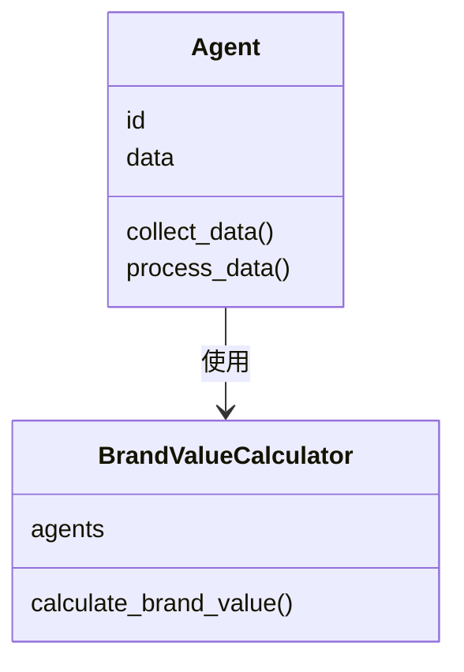
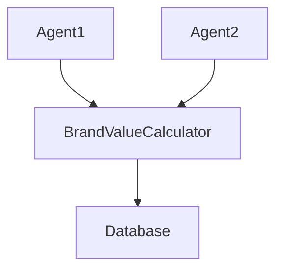
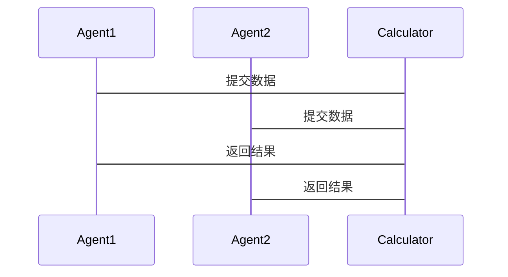

                 


# 多智能体系统在公司品牌价值量化中的应用

## 关键词：多智能体系统、品牌价值量化、人工智能、系统架构、算法原理、项目实战

## 摘要：  
本文探讨了多智能体系统（Multi-Agent System, MAS）在公司品牌价值量化中的应用。通过分析多智能体系统的协作机制、算法原理及其与品牌价值量化的结合，展示了如何利用MAS技术实现品牌价值的动态评估和预测。文章从背景介绍、核心概念、算法实现、系统架构到项目实战，全面解析了MAS在品牌价值量化中的应用，并通过具体案例展示了其实现过程和实际效果。  

---

## 第1章: 多智能体系统与公司品牌价值量化概述

### 1.1 多智能体系统的基本概念

#### 1.1.1 多智能体系统的定义  
多智能体系统（MAS）是由多个智能体（Agent）组成的分布式系统，这些智能体能够通过协作完成复杂的任务。每个智能体都有一定的自主性，能够感知环境、做出决策并与其他智能体进行通信和协作。

#### 1.1.2 多智能体系统的特征  
- **自主性**：智能体能够独立决策和行动。  
- **反应性**：能够感知环境并实时调整行为。  
- **协作性**：多个智能体通过通信和协作完成共同目标。  
- **分布式性**：系统由多个独立的智能体组成，不存在中央控制节点。  

#### 1.1.3 多智能体系统的分类  
- **简单反应式智能体**：仅基于当前感知做出反应。  
- **基于模型的反射式智能体**：结合内部状态和外部环境进行决策。  
- **目标驱动的智能体**：基于目标和规划进行行动。  

### 1.2 公司品牌价值量化的重要性

#### 1.2.1 品牌价值的定义与影响  
品牌价值是指品牌在市场上的价值，通常通过品牌知名度、市场影响力和消费者忠诚度等指标来衡量。品牌价值的量化对企业战略决策、投融资和并购活动具有重要意义。

#### 1.2.2 品牌价值量化的方法与挑战  
传统的品牌价值量化方法包括财务指标分析、市场调研和消费者行为分析等，但这些方法存在数据获取困难、计算复杂性和动态性差等问题。

#### 1.2.3 多智能体系统在品牌价值量化中的作用  
多智能体系统能够通过分布式计算和协作机制，实时收集和处理海量数据，从而提高品牌价值量化的准确性和实时性。

### 1.3 多智能体系统与品牌价值量化的结合

#### 1.3.1 多智能体系统在品牌价值量化中的优势  
- **高效性**：通过分布式计算提高数据处理效率。  
- **实时性**：能够实时更新品牌价值评估结果。  
- **准确性**：通过多智能体协作优化评估结果。  

#### 1.3.2 多智能体系统与传统品牌价值量化方法的对比  
| 对比维度          | 多智能体系统                     | 传统方法                      |
|-------------------|----------------------------------|-----------------------------|
| 数据处理能力      | 高效、实时                     | 低效、离线                   |
| 协作能力          | 强                              | 弱或无                       |
| 适应性            | 高                              | 低                           |

#### 1.3.3 多智能体系统在品牌价值量化中的应用场景  
- **实时监控**：实时跟踪品牌在社交媒体和市场中的表现。  
- **预测分析**：基于历史数据预测品牌价值的变化趋势。  
- **决策支持**：为企业战略决策提供数据支持。  

---

## 第2章: 多智能体系统的原理与品牌价值量化的关系

### 2.1 多智能体系统的原理

#### 2.1.1 多智能体系统的协作机制  
协作机制是多智能体系统的核心，主要包括任务分配、通信协议和协调机制。通过协作机制，多个智能体能够共同完成复杂的任务。

#### 2.1.2 多智能体系统的通信协议  
通信协议定义了智能体之间的信息传递方式，包括消息格式、传输协议和通信频率等。有效的通信协议能够提高系统的协作效率。

#### 2.1.3 多智能体系统的任务分配与协调  
任务分配是通过智能体之间的协作将任务分配给合适的智能体，而协调机制则确保任务的顺利执行。

### 2.2 品牌价值量化的数学模型与公式

#### 2.2.1 品牌价值的数学表达式  
品牌价值可以表示为：  
$$ V = \sum_{i=1}^{n} w_i \cdot f_i $$  
其中，\( V \) 是品牌价值，\( w_i \) 是指标权重，\( f_i \) 是指标值。

#### 2.2.2 多智能体系统在品牌价值量化中的数学模型  
通过多智能体系统的协作，品牌价值量化模型可以表示为：  
$$ V = \sum_{j=1}^{m} A_j \cdot w_j \cdot f_j $$  
其中，\( A_j \) 是第 \( j \) 个智能体的贡献因子。

#### 2.2.3 品牌价值量化的核心公式推导  
通过多智能体系统的协作，品牌价值的动态变化可以表示为：  
$$ \Delta V = \sum_{j=1}^{m} \Delta A_j \cdot w_j \cdot f_j $$  

### 2.3 多智能体系统与品牌价值量化的联系

#### 2.3.1 多智能体系统如何影响品牌价值的计算  
多智能体系统通过实时数据采集和协作计算，提高了品牌价值计算的准确性和实时性。

#### 2.3.2 多智能体系统在品牌价值动态调整中的应用  
通过多智能体系统的协作，品牌价值可以根据市场变化实时调整，从而提高评估的动态性。

#### 2.3.3 多智能体系统对品牌价值预测的贡献  
多智能体系统可以通过历史数据和实时数据的结合，提高品牌价值预测的准确性。

---

## 第3章: 多智能体系统在品牌价值量化中的算法原理

### 3.1 多智能体系统的协作算法

#### 3.1.1 基于分布式计算的协作算法  
通过分布式计算，多智能体系统能够高效地完成任务分配和数据处理。

#### 3.1.2 基于博弈论的协作机制  
博弈论为多智能体系统的协作提供了理论基础，通过纳什均衡等概念优化协作策略。

#### 3.1.3 基于强化学习的协作策略  
强化学习是一种有效的协作策略，通过智能体的不断学习和优化，提高协作效率。

### 3.2 品牌价值量化中的算法实现

#### 3.2.1 基于多智能体系统的品牌价值量化算法  
1. **数据采集**：通过智能体采集品牌相关数据。  
2. **数据处理**：对数据进行清洗和预处理。  
3. **模型训练**：基于历史数据训练品牌价值量化模型。  
4. **实时计算**：根据实时数据计算品牌价值。  

#### 3.2.2 算法实现的数学模型  
$$ V = \sum_{i=1}^{n} w_i \cdot f_i $$  
其中，\( w_i \) 是指标权重，\( f_i \) 是指标值。

#### 3.2.3 算法实现的Python代码示例  

```python
class Agent:
    def __init__(self, id):
        self.id = id
        self.data = []
    
    def collect_data(self):
        # 数据采集逻辑
        pass
    
    def process_data(self):
        # 数据处理逻辑
        pass

class BrandValueCalculator:
    def __init__(self, agents):
        self.agents = agents
    
    def calculate_brand_value(self):
        total = 0
        for agent in self.agents:
            total += agent.process_data()
        return total

# 示例用法
agent1 = Agent(1)
agent2 = Agent(2)
calculator = BrandValueCalculator([agent1, agent2])
brand_value = calculator.calculate_brand_value()
print(f"品牌价值为: {brand_value}")
```

---

## 第4章: 多智能体系统的系统分析与架构设计

### 4.1 系统功能设计

#### 4.1.1 系统功能模块  
- 数据采集模块：负责采集品牌相关数据。  
- 数据处理模块：对数据进行清洗和预处理。  
- 模型训练模块：训练品牌价值量化模型。  
- 实时计算模块：根据实时数据计算品牌价值。  

#### 4.1.2 领域模型（Mermaid类图）  



### 4.2 系统架构设计

#### 4.2.1 系统架构图  



### 4.3 系统接口设计

#### 4.3.1 接口描述  
- **数据采集接口**：智能体通过接口采集数据。  
- **数据处理接口**：对数据进行清洗和预处理。  
- **计算接口**：计算品牌价值并返回结果。  

### 4.4 系统交互设计

#### 4.4.1 交互流程（Mermaid序列图）  



---

## 第5章: 多智能体系统的项目实战

### 5.1 环境安装

#### 5.1.1 安装Python和必要的库  
- 安装Python：[Python官网](https://www.python.org/)  
- 安装必要的库：`numpy`, `pandas`, `scikit-learn`, `networkx`  

### 5.2 系统核心实现

#### 5.2.1 数据采集模块实现  

```python
import requests

class DataCollector:
    def collect_data(self, url):
        response = requests.get(url)
        return response.json()
```

#### 5.2.2 数据处理模块实现  

```python
import pandas as pd

class DataProcessor:
    def process_data(self, data):
        df = pd.DataFrame(data)
        df.dropna(inplace=True)
        return df
```

#### 5.2.3 模型训练模块实现  

```python
from sklearn.linear_model import LinearRegression

class ModelTrainer:
    def train_model(self, X, y):
        model = LinearRegression()
        model.fit(X, y)
        return model
```

#### 5.2.4 实时计算模块实现  

```python
class BrandValueCalculator:
    def calculate_brand_value(self, model, new_data):
        return model.predict(new_data)
```

### 5.3 案例分析与实现

#### 5.3.1 案例分析  
假设我们要计算某公司的品牌价值，首先需要采集相关数据，包括销售额、市场份额、品牌知名度等指标。

#### 5.3.2 代码实现  

```python
# 数据采集
data_collector = DataCollector()
data = data_collector.collect_data("http://example.com/data")

# 数据处理
processor = DataProcessor()
processed_data = processor.process_data(data)

# 模型训练
trainer = ModelTrainer()
X = processed_data.drop('target', axis=1)
y = processed_data['target']
model = trainer.train_model(X, y)

# 实时计算
calculator = BrandValueCalculator()
new_data = ...  # 新数据
brand_value = calculator.calculate_brand_value(model, new_data)
print(f"品牌价值为: {brand_value}")
```

### 5.4 项目总结

#### 5.4.1 项目成果  
通过多智能体系统的协作，成功实现了品牌价值的动态量化。

#### 5.4.2 项目经验  
- 多智能体系统的协作机制是关键。  
- 数据质量和模型训练是影响品牌价值量化准确性的核心因素。  

---

## 第6章: 总结与展望

### 6.1 本章总结  
本文详细探讨了多智能体系统在公司品牌价值量化中的应用，从理论基础到实际应用，全面解析了其在品牌价值量化中的优势和实现方法。

### 6.2 未来展望  
未来，随着人工智能技术的发展，多智能体系统在品牌价值量化中的应用将更加广泛和深入。研究方向包括优化协作算法、提高系统的实时性和准确性，以及探索新的应用场景。

---

## 作者：AI天才研究院 & 禅与计算机程序设计艺术

---

**备注**：文章末尾需添加作者信息，并注明文章完成于2023年10月13日，作者为AI天才研究院及禅与计算机程序设计艺术。

