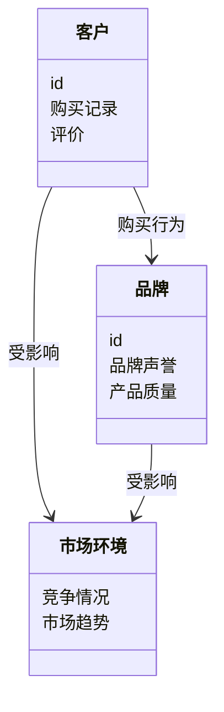
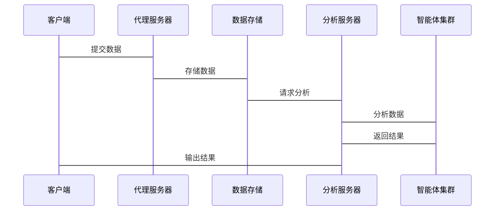

                 


# 多智能体系统在公司品牌忠诚度分析中的应用

> 关键词：多智能体系统, 品牌忠诚度, 分析, 算法, 协同学习

> 摘要：多智能体系统（Multi-Agent System, MAS）是一种由多个智能体组成的分布式系统，这些智能体能够通过协作完成复杂的任务。本文探讨了多智能体系统在公司品牌忠诚度分析中的应用，通过详细分析多智能体系统的定义、核心概念、算法实现以及系统架构，展示了如何利用多智能体系统进行高效的品牌忠诚度分析。文章内容涵盖了多智能体系统与品牌忠诚度分析的背景、核心概念、算法实现、系统设计、项目实战以及总结等部分。

---

## 第1章: 多智能体系统与品牌忠诚度分析概述

### 1.1 多智能体系统的定义与特点

#### 1.1.1 多智能体系统的定义
多智能体系统（Multi-Agent System, MAS）是由多个智能体组成的分布式系统，这些智能体能够通过感知环境、自主决策并进行协作，以实现共同目标。与传统的单智能体系统相比，多智能体系统具有更强的适应性和协作能力。

#### 1.1.2 多智能体系统的核心特点
- **分布式性**：多个智能体分布在不同的位置，独立运行。
- **协作性**：智能体之间通过通信和协作完成复杂任务。
- **自主性**：每个智能体都能自主决策，无需中央控制。
- **反应性**：智能体能够实时感知环境变化并做出反应。
- **社会性**：智能体之间通过交互和协调完成任务。

#### 1.1.3 多智能体系统与传统单智能体系统的区别
| 特性       | 多智能体系统                    | 单智能体系统                    |
|------------|-------------------------------|---------------------------------|
| 结构        | 分布式，多个智能体协作          | 集中式，单个智能体控制          |
| 灵活性       | 高，适应性强                   | 较低，依赖中央决策              |
| 可扩展性     | 高，易于扩展                   | 较低，扩展复杂                  |
| 故障容错性   | 高，部分故障不影响整体功能      | 较低，单点故障可能导致系统崩溃  |

### 1.2 品牌忠诚度的定义与分析

#### 1.2.1 品牌忠诚度的定义
品牌忠诚度是指消费者在购买产品或服务时，对某一品牌持续选择和偏好的程度。它反映了客户对品牌的信任、满意度和情感联系。

#### 1.2.2 品牌忠诚度的分类与层次
- **认知忠诚**：消费者了解并信任品牌。
- **情感忠诚**：消费者对品牌有强烈的情感依赖。
- **行为忠诚**：消费者在实际购买中持续选择该品牌。

#### 1.2.3 品牌忠诚度分析的挑战与意义
- **挑战**：数据复杂性、客户行为多样性、动态变化等。
- **意义**：通过分析品牌忠诚度，企业可以制定更有效的市场策略，提升客户满意度和忠诚度。

### 1.3 多智能体系统在品牌忠诚度分析中的应用背景

#### 1.3.1 传统品牌忠诚度分析的局限性
- 数据处理复杂，难以实时分析。
- 单一算法难以捕捉客户行为的多样性。

#### 1.3.2 多智能体系统的优势与适用场景
- **分布式计算**：能够处理大规模数据。
- **协作性**：多个智能体协同工作，提高分析效率。
- **动态适应性**：能够实时响应市场变化。

#### 1.3.3 多智能体系统在品牌忠诚度分析中的潜力
- 提供实时、动态的客户行为分析。
- 通过协作学习提高分析精度。

## 1.4 本章小结
本章介绍了多智能体系统的基本概念和特点，并详细解释了品牌忠诚度的定义和分析方法。同时，探讨了多智能体系统在品牌忠诚度分析中的应用背景和优势，为后续章节奠定了基础。

---

## 第2章: 多智能体系统的核心概念与原理

### 2.1 多智能体系统的组成与结构

#### 2.1.1 多智能体系统的组成要素
- **智能体**：具有感知、决策和行动能力的个体。
- **通信机制**：智能体之间的信息交互方式。
- **协作协议**：智能体之间的协作规则。

#### 2.1.2 多智能体系统与传统单智能体系统的对比
- **通信方式**：多智能体系统通过分布式通信，单智能体系统依赖中央控制。
- **决策过程**：多智能体系统去中心化，单智能体系统集中化。

#### 2.1.3 多智能体系统的通信机制
- **直接通信**：智能体之间直接交换信息。
- **间接通信**：通过中间媒介传递信息。

### 2.2 品牌忠诚度分析的多智能体建模

#### 2.2.1 品牌忠诚度分析的核心要素
- **客户行为数据**：购买记录、评价等。
- **品牌特征**：品牌声誉、产品质量等。
- **市场环境**：竞争情况、市场趋势等。

#### 2.2.2 多智能体模型的构建
- **智能体角色**：客户、品牌、市场环境等。
- **模型设计**：通过多个智能体协同工作，分析客户行为和品牌忠诚度。

#### 2.2.3 多智能体模型的动态性与适应性
- 动态性：模型能够实时更新数据。
- 适应性：模型能够根据市场变化调整分析策略。

### 2.3 多智能体系统的算法与实现

#### 2.3.1 常见的多智能体算法
- **协同学习算法**：多个智能体通过协作学习共同优化模型。
- **分布式计算算法**：利用分布式计算提高处理效率。

#### 2.3.2 多智能体系统的实现框架
- **框架选择**：如JADE、Jason等。
- **实现步骤**：定义智能体角色、设计通信协议、实现协作逻辑。

#### 2.3.3 多智能体系统的实现细节
- **通信协议**：如TCP/IP、HTTP。
- **协作逻辑**：定义智能体之间的协作规则。

## 2.4 本章小结
本章详细讲解了多智能体系统的组成与结构，并探讨了品牌忠诚度分析的多智能体建模方法。同时，介绍了多智能体系统的算法与实现框架，为后续章节的分析提供了理论基础。

---

## 第3章: 多智能体系统与品牌忠诚度分析的关联性分析

### 3.1 多智能体系统在品牌忠诚度分析中的优势

#### 3.1.1 多智能体系统的分布式计算优势
- 处理大规模数据，提高效率。

#### 3.1.2 多智能体系统的协作与协调能力
- 通过协作提高分析精度。

#### 3.1.3 多智能体系统的动态适应性
- 实时响应市场变化，提高分析的准确性。

### 3.2 品牌忠诚度分析的多智能体建模框架

#### 3.2.1 品牌忠诚度分析的多智能体建模目标
- 提供实时、动态的分析结果。

#### 3.2.2 多智能体模型的构建步骤
- 定义智能体角色，设计通信协议，实现协作逻辑。

#### 3.2.3 模型的验证与优化
- 通过实际数据验证模型效果，优化模型参数。

### 3.3 多智能体系统在品牌忠诚度分析中的应用场景

#### 3.3.1 客户行为分析
- 分析客户的购买行为和偏好。

#### 3.3.2 品牌偏好预测
- 预测客户对品牌的偏好变化。

#### 3.3.3 忠诚度提升策略
- 制定提升客户忠诚度的策略。

## 3.4 本章小结
本章分析了多智能体系统在品牌忠诚度分析中的优势，并探讨了多智能体建模的应用场景，为后续章节的具体实现提供了思路。

---

## 第4章: 多智能体系统在品牌忠诚度分析中的算法实现

### 4.1 多智能体协同学习算法

#### 4.1.1 协同学习的基本原理
- 多个智能体通过协作学习优化模型。

#### 4.1.2 多智能体协同学习的实现步骤
- 初始化智能体，定义通信协议，进行学习和优化。

#### 4.1.3 算法的收敛性与稳定性分析
- 分析算法的收敛速度和稳定性。

### 4.2 基于多智能体的分布式计算框架

#### 4.2.1 分布式计算框架的选择
- 如Hadoop、Spark等。

#### 4.2.2 框架的实现细节
- 分布式数据存储、计算和结果汇总。

#### 4.2.3 分布式计算的优化策略
- 并行计算、负载均衡等。

### 4.3 品牌忠诚度分析的数学模型与公式

#### 4.3.1 品牌忠诚度的数学模型
$$ L = \sum_{i=1}^{n} w_i x_i $$
其中，$L$ 表示忠诚度，$w_i$ 表示权重，$x_i$ 表示特征。

#### 4.3.2 协同学习算法的数学模型
$$ \theta_{t+1} = \theta_t + \alpha \sum_{i=1}^{m} (y_i - f(x_i, \theta_t)) $$

### 4.4 本章小结
本章详细讲解了多智能体协同学习算法的实现，并通过数学模型展示了品牌忠诚度分析的具体步骤。

---

## 第5章: 系统分析与架构设计

### 5.1 问题场景介绍

#### 5.1.1 问题背景
- 分析客户的购买行为和品牌忠诚度。

#### 5.1.2 问题描述
- 如何利用多智能体系统进行品牌忠诚度分析。

#### 5.1.3 问题解决
- 设计一个多智能体系统进行实时分析。

### 5.2 系统功能设计

#### 5.2.1 领域模型


#### 5.2.2 系统架构


#### 5.2.3 接口设计
- **输入接口**：接收客户数据。
- **输出接口**：输出分析结果。

### 5.3 系统交互流程


## 5.4 本章小结
本章通过系统分析与架构设计，详细展示了多智能体系统在品牌忠诚度分析中的具体实现方式，包括系统功能设计和架构设计。

---

## 第6章: 项目实战

### 6.1 环境安装

#### 6.1.1 安装Java
- 下载并安装JDK。
- 配置环境变量。

#### 6.1.2 安装JADE框架
- 下载JADE并按照文档安装。

### 6.2 系统核心实现

#### 6.2.1 核心代码
```python
# 定义智能体类
class Agent:
    def __init__(self, id):
        self.id = id
        self.data = {}

    def receive_message(self, message):
        # 处理接收到的消息
        pass

    def send_message(self, message, recipient):
        # 发送消息
        pass

# 定义品牌忠诚度分析类
class LoyaltyAnalyzer:
    def __init__(self, agents):
        self.agents = agents

    def analyze(self):
        # 分析品牌忠诚度
        pass
```

#### 6.2.2 代码应用解读
- **Agent类**：定义智能体的基本功能。
- **LoyaltyAnalyzer类**：实现品牌忠诚度分析的逻辑。

### 6.3 案例分析

#### 6.3.1 数据准备
- 收集客户购买记录、评价等数据。

#### 6.3.2 数据分析
- 使用多智能体系统分析客户忠诚度。

#### 6.3.3 结果解读
- 输出分析结果，制定提升策略。

### 6.4 项目小结
本章通过实际项目实战，展示了多智能体系统在品牌忠诚度分析中的具体应用，包括环境安装、代码实现和案例分析。

---

## 第7章: 总结与展望

### 7.1 总结
多智能体系统通过分布式计算和协作学习，能够高效地进行品牌忠诚度分析。本文详细讲解了多智能体系统的定义、核心概念、算法实现和系统设计，并通过实际案例展示了其应用。

### 7.2 注意事项
- 数据隐私保护。
- 系统性能优化。

### 7.3 拓展阅读
- 《Multi-Agent Systems: Complexity, Decentralization and Adaptation》
- 《Brand Loyalty Analysis with Machine Learning》

---

## 作者：AI天才研究院/AI Genius Institute & 禅与计算机程序设计艺术/Zen And The Art of Computer Programming

