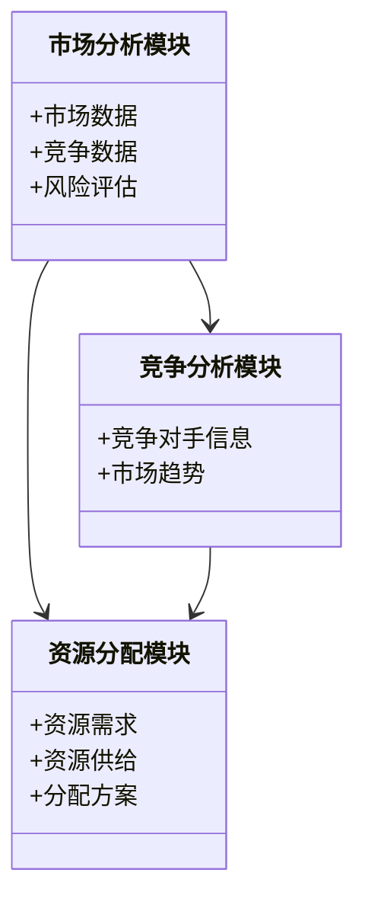

                 


# 多智能体系统在公司国际化战略评估中的应用

> 关键词：多智能体系统, 国际化战略评估, 系统架构设计, 分布式决策, 人工智能

> 摘要：随着全球化的深入，公司国际化战略评估变得越来越复杂。本文探讨了多智能体系统（MAS）在公司国际化战略评估中的应用，分析了MAS的核心概念、算法原理、系统架构设计，并通过实际案例展示了MAS在战略评估中的优势。

---

# 第1章: 多智能体系统概述

## 1.1 多智能体系统的定义与特点

### 1.1.1 多智能体系统的定义
多智能体系统（Multi-Agent Systems, MAS）是由多个智能体（Agent）组成的分布式系统，这些智能体能够通过自主决策和协同工作来完成复杂任务。

### 1.1.2 多智能体系统的特征
- **自主性**：每个智能体都具有自主决策的能力。
- **反应性**：能够实时感知环境并做出响应。
- **协作性**：智能体之间可以通过通信和协调共同完成任务。
- **分布性**：系统中的智能体分布在不同的位置，具有分布式计算的特点。

### 1.1.3 多智能体系统与传统单智能体系统的区别
| 特性               | 多智能体系统（MAS）             | 单智能体系统           |
|--------------------|-------------------------------|-----------------------|
| 系统结构           | 分布式结构，多个智能体协作     | 集中式结构，单一决策中心 |
| 决策过程           | 去中心化决策，多个智能体协同   | 中心化决策             |
| 适应性             | 高，能够应对动态环境           | 较低，依赖中心决策     |
| 应用场景           | 复杂任务，如资源分配、协同决策 | 简单任务，如单一决策问题 |

## 1.2 多智能体系统的背景与应用领域

### 1.2.1 多智能体系统的起源与发展
多智能体系统起源于人工智能领域，随着分布式计算和通信技术的发展，MAS逐渐成熟并广泛应用于各个领域。

### 1.2.2 多智能体系统的典型应用领域
- **分布式计算**：如分布式数据库、分布式系统管理。
- **机器人协作**：如工业机器人协作、无人机编队。
- **经济与金融**：如股票交易、资源分配。
- **游戏开发**：如多人在线游戏中的AI角色。

### 1.2.3 多智能体系统在企业战略中的潜在价值
多智能体系统能够通过分布式决策和协作，帮助企业优化资源分配、提高决策效率、增强应对复杂环境的能力。

---

# 第2章: 公司国际化战略评估的核心问题

## 2.1 国际化战略的核心要素

### 2.1.1 市场分析与竞争分析
- **市场分析**：分析目标市场的规模、增长潜力、竞争格局等。
- **竞争分析**：研究竞争对手的策略、优势和劣势。

### 2.1.2 风险评估与机会识别
- **风险评估**：识别国际化过程中可能遇到的市场风险、政策风险等。
- **机会识别**：发现潜在的市场机会和竞争优势。

### 2.1.3 资源分配与协同效应
- **资源分配**：合理分配公司资源，如资金、人力、技术等。
- **协同效应**：通过部门间的协作实现资源的最优利用。

## 2.2 多智能体系统在战略评估中的优势

### 2.2.1 多智能体系统在复杂决策中的优势
- **分布式决策**：通过多个智能体分别处理不同方面的问题，提高决策的全面性。
- **协作与协调**：智能体之间的协作能够优化整体决策效果。

### 2.2.2 多智能体系统在动态环境中的适应性
- **实时响应**：智能体能够实时感知环境变化并做出调整。
- **灵活性**：系统可以根据环境变化动态调整策略。

### 2.2.3 多智能体系统在协同决策中的应用
- **信息共享**：智能体之间可以通过通信共享信息，提高决策的准确性。
- **协同优化**：通过协作实现资源的最优分配和任务的高效完成。

---

# 第3章: 多智能体系统的核心概念与联系

## 3.1 多智能体系统的核心概念

### 3.1.1 智能体的属性
- **智能体类型**：反应式智能体、认知式智能体。
- **智能体行为**：目标导向行为、反应式行为。

### 3.1.2 智能体之间的交互
- **通信协议**：智能体之间通过特定协议进行信息交换。
- **协同机制**：通过协作协议实现任务分配和协调。

## 3.2 多智能体系统中的核心概念联系

### 3.2.1 智能体与环境的关系
- **智能体感知环境**：通过传感器或信息源获取环境信息。
- **智能体与环境交互**：智能体通过动作改变环境状态。

### 3.2.2 智能体与智能体之间的关系
- **协作关系**：智能体之间通过协作完成共同目标。
- **竞争关系**：智能体之间可能存在竞争关系，如资源分配中的博弈。

---

# 第4章: 多智能体系统的算法原理

## 4.1 多智能体系统的算法原理

### 4.1.1 分布式计算算法
- **分布式计算**：通过多个智能体协同完成计算任务。
- **并行计算**：多个智能体同时处理不同的子任务。

### 4.1.2 协作与协调算法
- **任务分配算法**：通过协商机制将任务分配给不同的智能体。
- **同步与协调算法**：确保智能体之间的动作协调一致。

## 4.2 多智能体系统的数学模型

### 4.2.1 智能体行为模型
$$
\text{行为} = f(\text{感知}, \text{目标})
$$

### 4.2.2 智能体协作模型
$$
\text{协作效果} = \sum_{i=1}^{n} \text{智能体}_i \text{的贡献}
$$

---

# 第5章: 多智能体系统的系统架构设计

## 5.1 问题场景介绍

### 5.1.1 国际化战略评估的复杂性
- **多目标优化**：在国际化过程中需要同时考虑市场、资源、风险等多个目标。
- **动态变化**：国际市场环境复杂多变，需要系统具有较强的适应性。

## 5.2 系统功能设计

### 5.2.1 系统功能模块
- **市场分析模块**：分析目标市场的潜力和风险。
- **竞争分析模块**：分析竞争对手的策略。
- **资源分配模块**：优化公司资源的分配。

### 5.2.2 领域模型类图


## 5.3 系统架构设计

### 5.3.1 系统架构图


---

# 第6章: 多智能体系统的项目实战

## 6.1 环境安装与配置

### 6.1.1 环境需求
- **操作系统**：Windows 10 或更高版本，或 Linux 系统。
- **编程语言**：Python 3.8 或更高版本。
- **依赖库**：安装 `numpy`, `pandas`, `networkx`, `matplotlib` 等。

## 6.2 核心代码实现

### 6.2.1 智能体类的实现
```python
class Agent:
    def __init__(self, id):
        self.id = id
        self.goal = None
        self.state = None

    def感知(self, 环境):
        # 获取环境信息
        return 环境获取()

    def 行动(self, 决策):
        # 执行动作
        return 动作执行()
```

### 6.2.2 协作协议的实现
```python
class CollaborationProtocol:
    def协商任务(self, 任务列表):
        # 任务分配逻辑
        return 任务分配方案
```

## 6.3 案例分析与结果解读

### 6.3.1 案例背景
某公司计划进入新兴市场，需要评估市场风险、竞争对手情况，并制定资源分配方案。

### 6.3.2 实施步骤
1. **市场分析模块**：分析目标市场的规模和竞争格局。
2. **竞争分析模块**：识别主要竞争对手的策略。
3. **资源分配模块**：根据分析结果优化资源配置。

## 6.4 项目总结与优化

### 6.4.1 项目成果
- 成功实现了多智能体系统在国际化战略评估中的应用。
- 提高了决策的准确性和效率。

### 6.4.2 优化建议
- 进一步完善协作协议，提高系统的适应性。
- 增加更多的智能体类型，以应对更复杂的环境。

---

# 第7章: 结论与展望

## 7.1 研究结论
多智能体系统在公司国际化战略评估中具有显著的优势，能够提高决策的准确性和效率。

## 7.2 未来展望
未来，随着人工智能和分布式计算技术的发展，多智能体系统在国际化战略评估中的应用将更加广泛和深入。

---

作者：AI天才研究院/AI Genius Institute & 禅与计算机程序设计艺术 /Zen And The Art of Computer Programming

