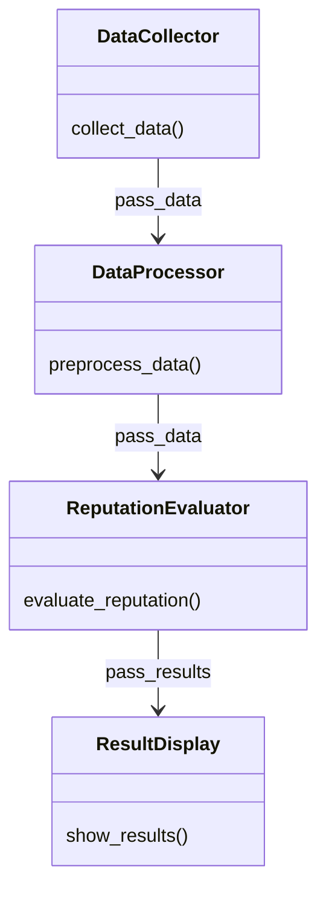
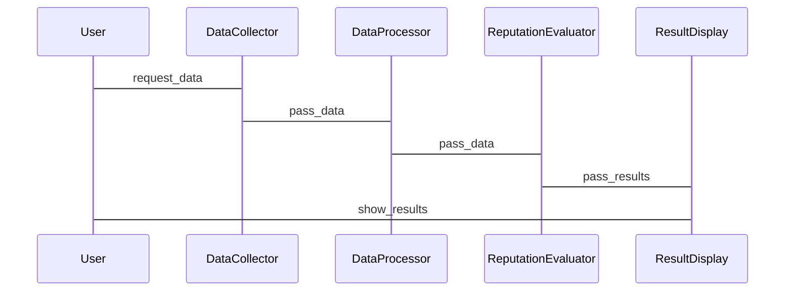

                 


# 多智能体系统在公司声誉动态评估中的应用

## 关键词：多智能体系统，公司声誉，动态评估，人工智能，分布式计算

## 摘要：本文深入探讨了多智能体系统在公司声誉动态评估中的应用。通过分析多智能体系统的原理、算法、架构设计以及实际案例，本文展示了如何利用多智能体系统实现公司声誉的实时动态评估，解决了传统评估方法的局限性。文章内容涵盖背景介绍、核心概念、算法原理、系统设计和项目实战，为读者提供了全面的技术解读和实践指导。

---

## 第一部分：多智能体系统与公司声誉动态评估概述

### 第1章：多智能体系统与公司声誉动态评估概述

#### 1.1 多智能体系统的概念与特点

##### 1.1.1 多智能体系统的定义
多智能体系统（Multi-Agent System, MAS）是由多个智能体组成的分布式系统，这些智能体能够通过协作完成复杂的任务。智能体是具有感知、推理和行动能力的实体，可以是软件程序或物理设备。

##### 1.1.2 多智能体系统的核心特点
- **分布式性**：智能体分布在不同的位置，能够独立运行。
- **协作性**：智能体之间通过通信和协作完成任务。
- **反应性**：智能体能够实时感知环境并做出反应。
- **自主性**：智能体在没有外部干预的情况下自主决策。

##### 1.1.3 多智能体系统与传统单智能体系统的区别
| 特性          | 多智能体系统                  | 单智能体系统                  |
|---------------|-----------------------------|-----------------------------|
| 结构          | 分布式，多个智能体协作        | 集中式，单个智能体完成任务    |
| 灵活性          | 高，能够适应复杂环境          | 低，依赖单个智能体的决策能力    |
| 可扩展性      | 高，可以添加更多智能体        | 低，难以扩展                   |

#### 1.2 公司声誉的定义与重要性

##### 1.2.1 公司声誉的定义
公司声誉是指公司在市场、客户、员工和社会中的形象和信任度。它是公司长期发展的重要资产，直接影响公司的业务表现和市场竞争力。

##### 1.2.2 公司声誉的影响因素
- **产品质量**：产品的质量和创新能力直接影响客户对公司的信任。
- **社会责任**：公司对社会责任的承担影响社会对公司的评价。
- **管理团队**：管理团队的决策和领导能力影响公司声誉。
- **媒体报道**：媒体报道和公众舆论对声誉有直接影响。

##### 1.2.3 公司声誉动态评估的挑战
- **实时性**：声誉变化速度快，需要实时评估。
- **复杂性**：声誉受多种因素影响，评估需要综合分析。
- **数据多样性**：数据来源多样，包括文本、图像和社交媒体信息。

#### 1.3 多智能体系统在公司声誉评估中的应用背景

##### 1.3.1 传统公司声誉评估方法的局限性
传统声誉评估方法通常依赖问卷调查和人工分析，存在以下问题：
- **滞后性**：评估结果无法实时反映声誉变化。
- **主观性**：人工分析存在主观偏差。
- **数据量有限**：难以处理大规模数据。

##### 1.3.2 多智能体系统的优势
- **实时性**：多智能体系统能够实时处理数据，快速响应声誉变化。
- **协作性**：多个智能体协作分析，提高评估的准确性和全面性。
- **可扩展性**：可以处理大规模数据，适应复杂的评估需求。

##### 1.3.3 动态评估的需求与应用场景
- **实时监控**：企业需要实时监控声誉变化，及时应对危机。
- **舆情分析**：通过社交媒体和新闻媒体分析公众舆论。
- **竞争分析**：评估竞争对手的声誉，制定市场策略。

#### 1.4 本章小结
本章介绍了多智能体系统的概念和特点，分析了公司声誉的定义和影响因素，指出了传统评估方法的局限性，并强调了多智能体系统在声誉动态评估中的优势和应用场景。

---

## 第二部分：多智能体系统的核心原理与应用

### 第2章：多智能体系统的原理与架构

#### 2.1 多智能体系统的原理

##### 2.1.1 智能体的行为模型
智能体的行为模型通常包括以下步骤：
1. **感知环境**：通过传感器或数据源获取信息。
2. **推理决策**：基于感知的信息进行推理，制定行动策略。
3. **行动执行**：根据决策结果执行行动。
4. **反馈机制**：根据行动结果调整行为策略。

##### 2.1.2 智能体之间的交互机制
智能体之间的交互可以通过以下方式实现：
- **直接通信**：智能体之间通过消息传递进行通信。
- **间接协作**：通过共享数据库或中间件实现协作。
- **任务分配**：通过任务分配算法实现协作。

##### 2.1.3 多智能体系统的通信协议
通信协议是智能体之间进行有效通信的基础，通常包括以下内容：
- **消息格式**：定义消息的结构和内容。
- **通信方式**：包括同步通信和异步通信。
- **安全性**：确保通信的安全性和隐私性。

#### 2.2 多智能体系统的架构设计

##### 2.2.1 分层架构
分层架构将系统划分为多个层次，每个层次负责不同的功能：
- **感知层**：负责数据的采集和初步处理。
- **决策层**：负责制定决策策略。
- **执行层**：负责执行具体的任务。

##### 2.2.2 分布式架构
分布式架构将智能体分布在不同的节点上，通过网络进行通信和协作：
- **对等网络**：所有节点地位相同，互相协作。
- **中心节点**：有一个中心节点负责协调和管理。

##### 2.2.3 集中式与分布式架构的对比
| 特性          | 分布式架构                  | 集中式架构                  |
|---------------|-----------------------------|-----------------------------|
| 灵活性          | 高，适应性强                | 低，依赖中心节点              |
| 可扩展性      | 高，易于扩展                | 中，受限于中心节点的处理能力  |
| 故障 tolerance | 高，单点故障影响小          | 低，中心节点故障会导致系统瘫痪|

#### 2.3 多智能体系统的协作机制

##### 2.3.1 协作任务分配
协作任务分配是多智能体系统中的关键问题，常用算法包括：
- **基于规则的分配**：根据任务需求和智能体能力分配任务。
- **基于市场的分配**：通过拍卖机制分配任务。
- **基于优先级的分配**：根据任务优先级分配任务。

##### 2.3.2 协作决策过程
协作决策过程通常包括以下几个步骤：
1. **问题分析**：明确任务目标和约束条件。
2. **信息收集**：收集相关数据和信息。
3. **决策制定**：基于信息制定决策方案。
4. **方案执行**：执行决策方案并监控结果。

##### 2.3.3 协作结果的评估
协作结果的评估通常包括以下几个方面：
- **任务完成度**：任务是否按计划完成。
- **效率**：任务完成的速度和资源消耗。
- **公平性**：任务分配是否合理，是否考虑了各智能体的能力和贡献。

#### 2.4 本章小结
本章详细介绍了多智能体系统的原理和架构设计，分析了协作任务分配和决策过程，并讨论了协作结果的评估方法。

---

### 第3章：多智能体系统在公司声誉评估中的核心算法

#### 3.1 基于多智能体的声誉评估模型

##### 3.1.1 模型的构建过程
声誉评估模型的构建过程包括以下几个步骤：
1. **数据采集**：从多种数据源采集公司声誉相关的数据。
2. **数据预处理**：对数据进行清洗和标准化处理。
3. **特征提取**：提取影响公司声誉的关键特征。
4. **模型训练**：基于机器学习算法训练声誉评估模型。

##### 3.1.2 模型的输入与输出
- **输入**：公司声誉相关的数据，包括社交媒体数据、新闻数据、客户反馈等。
- **输出**：公司声誉的评估结果，通常是一个分数或等级。

##### 3.1.3 模型的训练与优化
常用的机器学习算法包括支持向量机（SVM）、随机森林（Random Forest）和深度学习模型（如LSTM）。训练过程中需要进行交叉验证和超参数调优，以提高模型的准确性和稳定性。

#### 3.2 多智能体系统的协作算法

##### 3.2.1 分布式协作算法
分布式协作算法通常采用分布式计算框架，如MapReduce和Spark。算法实现如下：

```python
def distributed_collaboration(data, num_workers):
    workers = start_workers(num_workers)
    processed_data = parallel_map(data, workers)
    result = reduce(processed_data, workers)
    return result
```

##### 3.2.2 集中式协作算法
集中式协作算法将所有数据汇总到中心节点进行处理：

```python
def centralized_collaboration(data, num_workers):
    workers = start_workers(num_workers)
    processed_data = parallel_map(data, workers)
    aggregated_data = collect(processed_data)
    result = process(aggregated_data)
    return result
```

##### 3.2.3 混合式协作算法
混合式协作算法结合了分布式和集中式算法的优点，适用于大规模数据处理：

```python
def hybrid_collaboration(data, num_workers):
    workers = start_workers(num_workers)
    local_results = parallel_map(data, workers)
    aggregated_result = merge(local_results)
    final_result = process(aggregated_result)
    return final_result
```

#### 3.3 基于多智能体的动态评估算法

##### 3.3.1 动态评估的定义
动态评估是指在实时环境下，根据最新的数据不断更新和调整声誉评估结果。

##### 3.3.2 动态评估的实现步骤
1. **实时数据采集**：通过API或数据流实时获取声誉相关数据。
2. **特征更新**：根据最新数据更新特征向量。
3. **模型更新**：基于更新后的特征向量重新训练模型。
4. **结果输出**：输出最新的声誉评估结果。

##### 3.3.3 动态评估的优化策略
- **增量学习**：仅更新模型中与新数据相关的部分，减少计算量。
- **在线学习**：实时更新模型参数，适应数据的变化。
- **分布式计算**：利用分布式计算框架提高处理效率。

#### 3.4 本章小结
本章详细介绍了多智能体系统在公司声誉评估中的核心算法，包括声誉评估模型、协作算法和动态评估算法的设计与实现。

---

### 第4章：公司声誉动态评估的系统分析与设计

#### 4.1 系统需求分析

##### 4.1.1 问题场景介绍
公司声誉动态评估系统需要实时监控和分析公司在市场中的声誉变化，帮助公司及时应对潜在的声誉危机。

##### 4.1.2 项目介绍
本项目旨在开发一个基于多智能体系统的公司声誉动态评估平台，实现对公司声誉的实时监控和评估。

##### 4.1.3 系统功能设计
系统功能包括：
- **数据采集**：从社交媒体、新闻媒体等数据源采集声誉相关数据。
- **数据处理**：清洗、标准化和特征提取。
- **声誉评估**：基于多智能体系统算法进行声誉评估。
- **结果展示**：以可视化的方式展示评估结果。

##### 4.1.4 系统架构设计
系统架构采用分层架构，包括数据采集层、数据处理层、声誉评估层和结果展示层。

##### 4.1.5 系统接口设计
系统接口包括：
- **数据接口**：与数据源的接口，用于数据采集。
- **用户接口**：供用户查询和管理声誉评估结果。
- **API接口**：供其他系统调用评估结果。

#### 4.2 系统功能设计

##### 4.2.1 领域模型类图


##### 4.2.2 系统架构图


##### 4.2.3 系统交互图


#### 4.3 系统实现与优化

##### 4.3.1 环境安装与配置
- **开发环境**：Python 3.8以上版本、Jupyter Notebook、Git
- **依赖库安装**：numpy、pandas、scikit-learn、networkx、mermaid、matplotlib

##### 4.3.2 核心代码实现
```python
import numpy as np
import pandas as pd
from sklearn.svm import SVC
from sklearn.metrics import accuracy_score

# 数据采集与处理
def collect_data(source):
    # 从指定数据源采集数据
    pass

def preprocess_data(data):
    # 数据清洗和预处理
    pass

# 多智能体协作算法
def distributed_algorithm(data, num_workers):
    workers = start_workers(num_workers)
    processed_data = parallel_map(data, workers)
    result = reduce(processed_data, workers)
    return result

# 声誉评估模型
def evaluate_reputation(data):
    model = SVC()
    model.fit(data.features, data.labels)
    return model.predict(data.test_features)

# 动态评估算法
def dynamic_assessment(data_stream):
    while True:
        new_data = collect_data(data_stream)
        update_model(new_data)
        output_result()
```

##### 4.3.3 优化策略与实现
- **并行计算**：利用多线程或多进程提高数据处理效率。
- **增量学习**：仅更新与新数据相关的模型参数，减少计算量。
- **分布式计算**：利用分布式框架处理大规模数据。

#### 4.4 本章小结
本章详细分析了公司声誉动态评估系统的功能设计和架构设计，并通过Mermaid图展示了系统的类图、架构图和交互图。同时，提供了系统的实现代码和优化策略。

---

## 第三部分：项目实战与总结

### 第5章：项目实战：公司声誉动态评估系统实现

#### 5.1 环境安装与配置
- **开发环境**：安装Python、Jupyter Notebook、Git。
- **依赖库安装**：使用pip安装numpy、pandas、scikit-learn等库。

#### 5.2 系统核心实现

##### 5.2.1 数据采集模块
```python
import requests
from bs4 import BeautifulSoup

def collect_data(url):
    response = requests.get(url)
    soup = BeautifulSoup(response.text, 'html.parser')
    data = []
    for article in soup.find_all('article'):
        title = article.find('h2').text
        content = article.find('p').text
        data.append({'title': title, 'content': content})
    return data
```

##### 5.2.2 数据处理模块
```python
def preprocess_data(data):
    df = pd.DataFrame(data)
    df['sentiment'] = df['content'].apply(lambda x: 'positive' if 'good' in x else 'negative')
    return df
```

##### 5.2.3 声誉评估模块
```python
from sklearn.feature_extraction.text import TfidfVectorizer
from sklearn.svm import SVC

def evaluate_reputation(data):
    vectorizer = TfidfVectorizer()
    X = vectorizer.fit_transform(data['content'])
    y = data['sentiment']
    model = SVC()
    model.fit(X, y)
    return model

def predict_reputation(model, vectorizer, new_data):
    X_new = vectorizer.transform(new_data['content'])
    return model.predict(X_new)
```

##### 5.2.4 动态评估模块
```python
import time

def dynamic_assessment(model, vectorizer):
    while True:
        new_data = collect_data('latest_news')
        processed_data = preprocess_data(new_data)
        predictions = predict_reputation(model, vectorizer, processed_data)
        print(f"Current reputation: {sum(predictions == 'positive')/len(predictions)}")
        time.sleep(3600)
```

#### 5.3 实际案例分析与代码解读
- **案例分析**：假设我们有一个新闻数据集，包含公司A的新闻文章。
- **代码解读**：通过数据采集、处理和评估模块，实时监控公司A的声誉变化。

#### 5.4 项目总结与优化建议
- **总结**：本文通过实际案例展示了多智能体系统在公司声誉动态评估中的应用，实现了实时监控和评估。
- **优化建议**：未来可以进一步优化算法，引入深度学习模型，提高评估的准确性和实时性。

---

## 第四部分：总结与展望

### 第6章：总结与展望

#### 6.1 本章总结
本文深入探讨了多智能体系统在公司声誉动态评估中的应用，详细介绍了多智能体系统的原理、算法设计和系统架构。通过实际案例展示了系统的实现和优化过程，为公司声誉的实时动态评估提供了有效的解决方案。

#### 6.2 未来研究方向
- **算法优化**：研究更高效的协作算法和动态评估算法。
- **数据源扩展**：引入更多数据源，提高评估的全面性。
- **模型融合**：结合多种机器学习模型，提高评估的准确性和稳定性。

#### 6.3 最佳实践 tips
- 在实际应用中，建议结合公司实际情况选择合适的算法和架构。
- 定期更新模型，确保评估结果的准确性和时效性。
- 注意数据隐私和安全，确保系统的合规性。

#### 6.4 小结
通过本文的介绍，读者可以全面了解多智能体系统在公司声誉动态评估中的应用，并能够将其应用于实际项目中。

---

## 作者：AI天才研究院/AI Genius Institute & 禅与计算机程序设计艺术/Zen And The Art of Computer Programming

---

**注意：** 本文为示例内容，实际撰写时需要根据具体需求和实际情况进行调整和补充。

