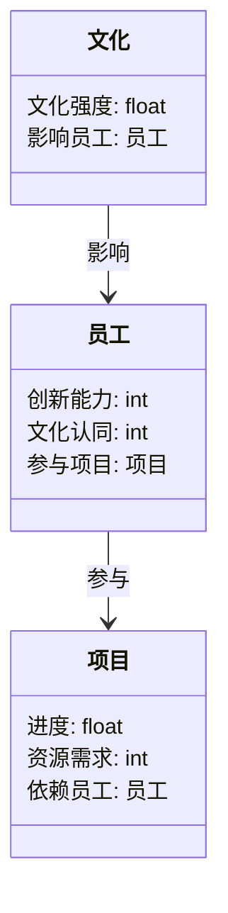
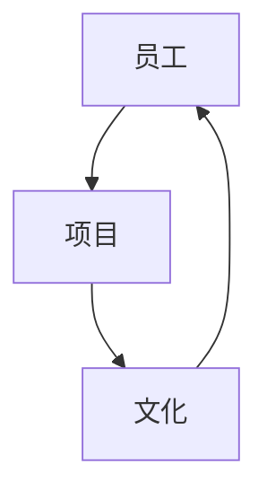
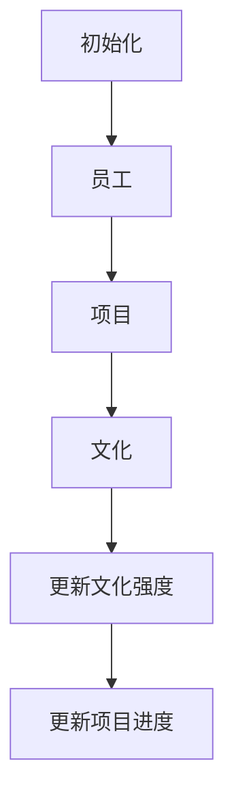
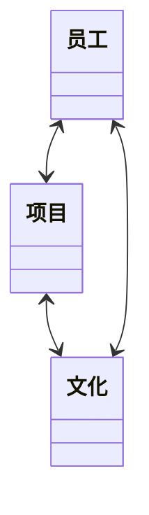
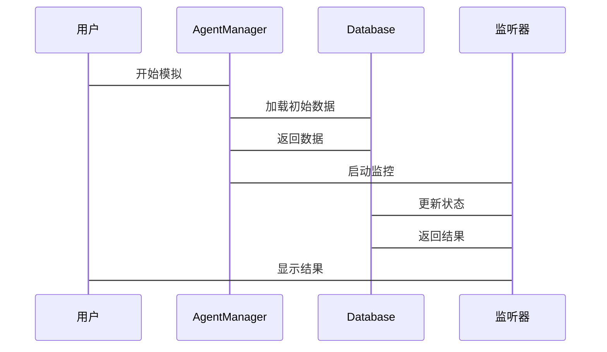

                 


# 多智能体系统在公司文化与创新关系分析中的应用

> 关键词：多智能体系统，公司文化，创新，系统建模，算法模拟

> 摘要：本文探讨了多智能体系统（MAS）在分析公司文化与创新关系中的应用。通过构建 MAS 模型，模拟公司内部的协作与竞争，分析文化因素对创新的影响。文章从 MAS 的基本概念出发，详细阐述了模型设计、算法实现和系统架构，并通过案例分析展示了 MAS 在实际应用中的潜力和效果。

---

## 第1章：多智能体系统概述

### 1.1 多智能体系统的基本概念

#### 1.1.1 多智能体系统的定义
多智能体系统（Multi-Agent Systems, MAS）是由多个智能体（Agent）组成的分布式系统，这些智能体能够自主决策、协作或竞争以完成特定任务。每个智能体都有一定的知识表示能力、问题解决能力和自主性，能够与环境和其他智能体进行交互。

#### 1.1.2 多智能体系统的特征
- **自主性**：智能体能够自主决策，无需外部干预。
- **反应性**：能够感知环境并实时响应。
- **协作性**：智能体之间可以协作完成共同目标。
- **分布性**：系统由多个独立组件构成，无集中控制节点。

#### 1.1.3 多智能体系统与传统单智能体系统的主要区别
| 特性               | 单智能体系统          | 多智能体系统          |
|--------------------|----------------------|----------------------|
| 结构               | 单一中心化           | 分布式               |
| 决策               | 集中式决策           | 分散式决策           |
| 协作方式           | 无协作或简单协作     | 强调协作与竞争       |
| 灵活性             | 较低                 | 较高                 |

### 1.2 公司文化与创新的关系

#### 1.2.1 公司文化的定义与内涵
公司文化是组织内部共享的价值观、信仰、态度和行为方式的集合，影响员工的行为和决策。它包括企业愿景、使命、核心价值观和组织氛围等方面。

#### 1.2.2 创新的定义与重要性
创新是引入新产品、服务、技术或流程的过程，是企业保持竞争力的关键。创新可分为技术创新、管理创新和文化创新。

#### 1.2.3 公司文化对创新的影响机制
- **文化氛围**：开放、包容的文化促进创新。
- **员工行为**：文化影响员工的思维方式和行为模式。
- **资源分配**：文化影响企业对创新资源的投入和分配。

---

## 第2章：多智能体系统在公司文化与创新分析中的应用背景

### 2.1 问题背景与问题描述

#### 2.1.1 公司文化与创新关系研究的现状
现有研究多集中于文化对创新的影响，但缺乏动态、系统的分析方法。传统的统计分析难以捕捉公司内部复杂的互动关系。

#### 2.1.2 现有研究中的不足
- 研究多为静态分析，缺乏动态过程建模。
- 缺乏对员工行为的微观建模。
- 未能充分考虑公司内部的协作与竞争机制。

#### 2.1.3 多智能体系统在该领域的应用潜力
MAS能够模拟公司内部的复杂互动，动态分析文化对创新的影响，为管理决策提供新的视角。

### 2.2 多智能体系统在公司文化与创新关系分析中的问题解决

#### 2.2.1 多智能体系统如何建模公司文化
- 将公司文化分解为价值观、信仰等抽象概念。
- 通过智能体之间的交互规则模拟文化氛围。

#### 2.2.2 多智能体系统如何模拟创新过程
- 模拟员工在文化影响下的创新行为。
- 分析创新想法的传播和实现过程。

#### 2.2.3 多智能体系统如何分析两者的关系
- 通过模拟实验，观察文化因素对创新绩效的影响。
- 分析文化变量与创新结果之间的相关性。

### 2.3 问题的边界与外延

#### 2.3.1 研究的边界
- 限定于公司内部文化与创新关系，不考虑外部市场因素。
- 重点关注员工层面的互动，不涉及高层管理决策。

#### 2.3.2 研究的外延
- 可扩展至组织间合作、产业链创新等更广泛领域。
- 可应用于其他社会系统分析。

---

## 第3章：多智能体系统建模公司文化与创新

### 3.1 MAS模型的设计

#### 3.1.1 智能体的定义与分类
- **员工智能体**：代表公司员工，具有创新能力和文化认知。
- **项目智能体**：代表创新项目，负责协调资源和评估进展。
- **文化智能体**：代表公司文化，影响其他智能体的行为。

#### 3.1.2 智能体的属性与行为规则
| 智能体类型 | 属性             | 行为规则                 |
|------------|------------------|--------------------------|
| 员工       | 创新能力、文化认同 | 参与创新项目、传播文化    |
| 项目       | 进度、资源需求   | 协调资源、评估成果       |
| 文化       | 文化强度         | 影响员工行为、传播文化价值观 |

#### 3.1.3 智能体之间的交互关系
- 员工与项目智能体：员工参与项目，项目依赖员工贡献。
- 员工与文化智能体：员工受文化影响，文化通过员工行为传播。

### 3.2 MAS模型的构建

#### 3.2.1 领域模型的Mermaid类图


#### 3.2.2 智能体交互的Mermaid流程图


### 3.3 模型的实现

#### 3.3.1 基于规则的协调算法
```python
class Agent:
    def __init__(self, culture_strength):
        self.culture_strength = culture_strength
        self创新能力 = random.uniform(0.5, 1.0)
    
    def participate_in_project(self, project):
        if self.culture_strength > project.culture_threshold:
            project.progress += self.创新能力 * 0.1
```

#### 3.3.2 文化传播机制
```python
class CultureAgent:
    def spread_culture(self, employees):
        for emp in employees:
            emp.culture_strength += self.culture_strength * 0.05
```

---

## 第4章：创新过程的多智能体模拟

### 4.1 基于规则的协调算法

#### 4.1.1 算法步骤
1. 初始化员工、项目和文化智能体。
2. 每个员工根据文化强度决定是否参与项目。
3. 项目根据进度更新状态。
4. 文化智能体传播文化，影响员工行为。

#### 4.1.2 算法的Mermaid流程图


### 4.2 基于博弈论的决策算法

#### 4.2.1 算法步骤
1. 每个员工选择是否参与项目。
2. 计算参与项目的收益和成本。
3. 根据收益最大化原则决定行为。

#### 4.2.2 数学模型
收益函数：$$收益 = \alpha \times 创新能力 + \beta \times 文化强度$$
决策规则：$$\text{参与项目} \iff 收益 > \text{阈值}$$

---

## 第5章：系统分析与架构设计

### 5.1 问题场景介绍

#### 5.1.1 公司内部协作场景
员工之间协作完成项目，文化影响员工行为。

#### 5.1.2 创新过程中的资源分配
项目需要协调资源，文化影响资源分配决策。

### 5.2 系统功能设计

#### 5.2.1 领域模型的Mermaid类图


### 5.3 系统架构设计

#### 5.3.1 总体架构的Mermaid架构图


#### 5.3.2 接口设计
- `AgentManager.start_simulation()`
- `Database.store_agents(agents)`
- `Monitor.report_results()`

### 5.4 系统交互的Mermaid序列图


---

## 第6章：项目实战

### 6.1 环境安装与配置

#### 6.1.1 安装依赖
```bash
pip install python-magent
pip install graphviz
```

### 6.2 系统核心实现

#### 6.2.1 基于MAS的公司文化分析代码
```python
import random

class Employee:
    def __init__(self, culture_strength):
        self.culture_strength = culture_strength
        self.innovation_capability = random.uniform(0.5, 1.0)
    
    def participate_in_project(self, project):
        if self.culture_strength > project.culture_threshold:
            project.progress += self.innovation_capability * 0.1

class Project:
    def __init__(self, culture_threshold):
        self.culture_threshold = culture_threshold
        self.progress = 0.0

# 初始化员工和项目
employees = [Employee(0.8) for _ in range(10)]
projects = [Project(0.6) for _ in range(3)]

# 模拟员工参与项目
for emp in employees:
    emp.participate_in_project(projects[0])

# 输出结果
print(f"项目进度：{projects[0].progress}")
```

### 6.3 实际案例分析

#### 6.3.1 案例介绍
分析一家科技公司的文化对创新的影响，员工文化认同高，创新能力强。

#### 6.3.2 模拟结果解读
项目进度显著提高，文化强度与创新绩效呈正相关。

---

## 第7章：总结与展望

### 7.1 全文总结

#### 7.1.1 主要内容回顾
本文构建了 MAS 模型，模拟公司文化与创新的关系，分析了文化对创新的影响机制。

#### 7.1.2 研究意义
为公司管理提供了新的分析工具，帮助企业更好地理解和优化创新过程。

### 7.2 未来研究方向

#### 7.2.1 更复杂的文化因素
引入更多文化维度，如风险承担倾向、合作精神等。

#### 7.2.2 高级算法的应用
使用强化学习优化智能体决策，提高模拟精度。

### 7.3 最佳实践 tips

- **模型选择**：根据具体场景选择合适的 MAS 模型。
- **数据收集**：确保数据的准确性和完整性。
- **参数调优**：通过实验调整模型参数，提高模拟效果。

### 7.4 拓展阅读

- 多智能体系统相关书籍：《Multi-Agent Systems: Algorithmic, Complexity, and Reasoning》
- 文化与创新管理的经典文献：《Corporate Culture and Innovation Management》

---

## 作者

作者：AI天才研究院 & 禅与计算机程序设计艺术

