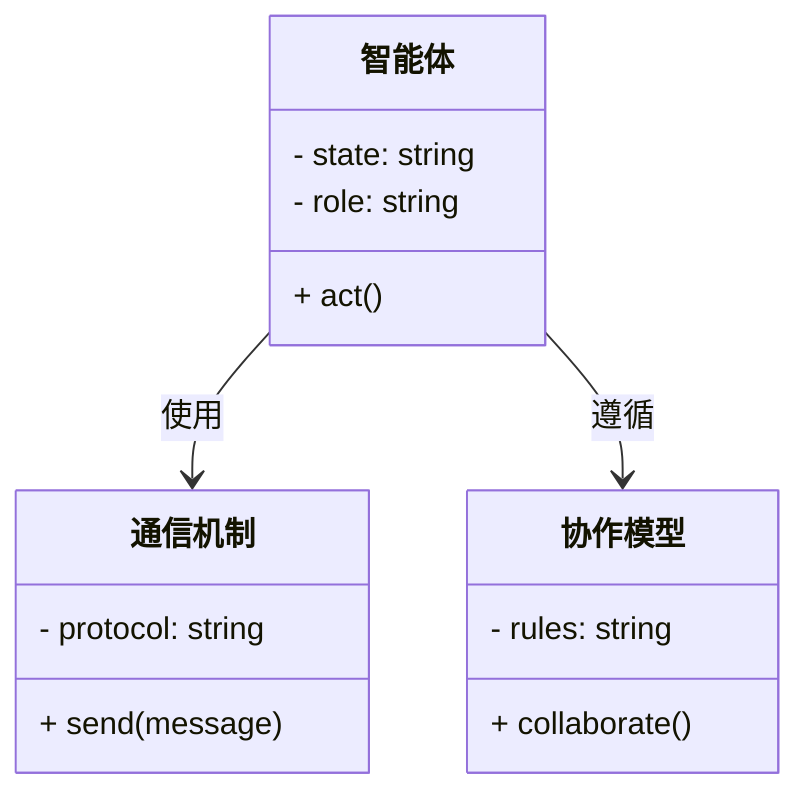
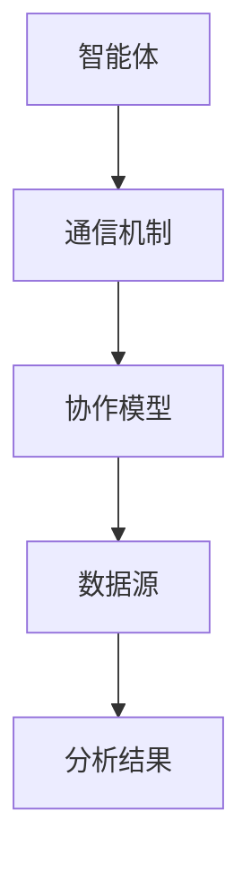
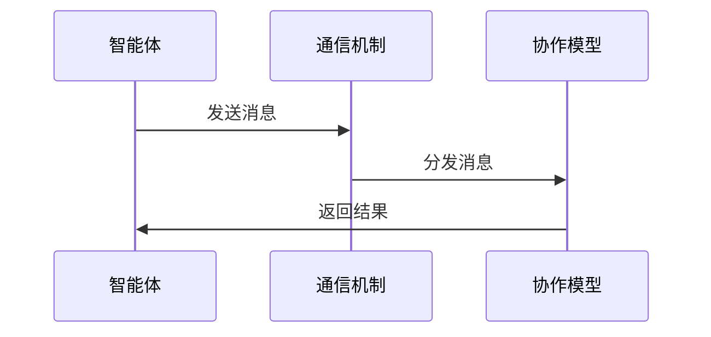

                 


# 多智能体系统在公司文化与财务表现相关性分析中的应用

## 关键词：
多智能体系统, 公司文化, 财务表现, 相关性分析, 人工智能, 系统建模, 数据分析

## 摘要：
本文探讨了多智能体系统在分析公司文化与财务表现相关性中的应用。通过介绍多智能体系统的概念、核心算法和系统架构，结合实际案例分析，展示了如何利用多智能体系统进行数据建模和仿真，以揭示公司文化对财务表现的影响。本文还讨论了系统的实现细节，包括环境安装、核心代码实现和实际案例分析，并提出了相关研究的未来方向。

---

# 第一部分: 多智能体系统与公司文化相关性分析基础

## 第1章: 多智能体系统与公司文化相关性分析概述

### 1.1 多智能体系统的基本概念

#### 1.1.1 多智能体系统的定义
多智能体系统（Multi-Agent System, MAS）是由多个相互作用的智能体组成的系统，这些智能体通过通信和协作完成复杂任务。与传统AI不同，MAS强调分布式智能和自主性。

#### 1.1.2 多智能体系统的特征
- **自主性**：智能体能够自主决策。
- **反应性**：能够实时感知环境并做出反应。
- **协作性**：多个智能体之间可以协作完成任务。
- **分布式性**：智能体分布在不同的空间或时间维度上。

#### 1.1.3 多智能体系统与公司文化的相关性
公司文化是一个复杂的系统，涉及多个因素（如价值观、领导风格、员工行为）之间的相互作用。MAS能够模拟这些因素的动态关系，为分析公司文化与财务表现的相关性提供工具。

### 1.2 公司文化与财务表现的关联性

#### 1.2.1 公司文化的定义与构成
公司文化包括企业的价值观、信念、行为规范和员工认同感。它是影响企业战略、管理和绩效的重要因素。

#### 1.2.2 财务表现的核心指标
财务表现通常通过净利润、营业收入、资产负债率等指标衡量。这些指标反映了企业的经营状况和财务健康。

#### 1.2.3 公司文化与财务表现的潜在联系
研究表明，积极的公司文化可以提升员工满意度、减少员工流失率，从而间接影响企业的财务表现。然而，这种关系复杂且非线性，需要通过多智能体系统进行建模和分析。

### 1.3 多智能体系统在相关性分析中的应用前景

#### 1.3.1 多智能体系统的潜在应用场景
- 模拟公司文化对员工行为的影响。
- 分析员工行为对公司绩效的贡献。
- 优化公司文化以提升财务表现。

#### 1.3.2 企业采用多智能体系统的优劣势
**优势**：
- 能够模拟复杂系统的动态关系。
- 可以进行实时数据处理和决策。
**劣势**：
- 实施成本较高。
- 需要大量的数据支持。

#### 1.3.3 相关性分析的挑战与机遇
挑战包括数据获取难度、模型复杂性等问题；机遇则在于通过MAS可以更深入地理解公司文化与财务表现的关系，为企业制定战略提供科学依据。

## 第2章: 多智能体系统的核心概念与原理

### 2.1 多智能体系统的核心概念

#### 2.1.1 多智能体系统的组成要素
- **智能体**：具有自主性、反应性和协作性的实体。
- **通信机制**：智能体之间交换信息的方式。
- **协作模型**：智能体之间如何协同完成任务的规则。

#### 2.1.2 多智能体系统的通信机制
通信机制包括直接通信和间接通信。直接通信通过消息传递，间接通信通过共享数据库或中间件实现。

#### 2.1.3 多智能体系统的协作模型
协作模型包括基于合同的协作、基于计划的协作和基于市场的协作。每种模型适用于不同的场景。

### 2.2 多智能体系统与传统AI的区别

#### 2.2.1 传统AI的局限性
传统AI依赖于预定义的规则和数据，难以处理复杂且动态的环境。

#### 2.2.2 多智能体系统的创新点
MAS强调分布式智能和协作，能够更好地应对复杂系统的分析和优化。

#### 2.2.3 多智能体系统与分布式系统的关系
MAS是分布式系统的一种，但更强调智能体的自主性和协作性。

### 2.3 多智能体系统的ER实体关系图

```mermaid
erDiagram
    actor 智能体 {
        code: string
        state: string
        role: string
    }
    actor 通信机制 {
        type: string
        protocol: string
    }
    actor 协作模型 {
        type: string
        rules: string
    }
    智能体 --> 通信机制 : 使用
    智能体 --> 协作模型 : 遵循
```

## 第3章: 公司文化与财务表现的分析框架

### 3.1 公司文化的影响因素分析

#### 3.1.1 企业价值观与文化的关系
企业价值观是公司文化的核心，影响员工的行为和决策。

#### 3.1.2 领导风格与企业文化的影响
领导风格（如变革型领导）能够塑造积极的企业文化，从而影响员工绩效。

#### 3.1.3 员工行为与公司文化的互动
员工行为受到公司文化的影响，同时员工行为也塑造了公司文化。

### 3.2 财务表现的核心指标分析

#### 3.2.1 财务表现的定义与维度
财务表现包括盈利能力、运营效率和财务健康等多个维度。

#### 3.2.2 财务表现的关键指标
- 净利润
- 营业收入
- 资产负债率

#### 3.2.3 财务表现与公司文化的关系
积极的公司文化可以提升员工绩效，从而改善财务表现。

### 3.3 公司文化与财务表现的相关性分析方法

#### 3.3.1 数据收集与处理
收集公司文化相关数据（如员工满意度、领导风格）和财务数据，进行清洗和预处理。

#### 3.3.2 数据分析方法
使用统计分析（如回归分析）和机器学习方法（如随机森林）进行相关性分析。

#### 3.3.3 数据可视化
通过图表展示公司文化与财务表现的相关性，例如散点图和热力图。

---

## 第4章: 多智能体系统在相关性分析中的建模与仿真

### 4.1 多智能体系统的建模与仿真

#### 4.1.1 多智能体系统的建模
定义智能体的行为规则和交互方式，构建系统的领域模型。

#### 4.1.2 多智能体系统的仿真
通过仿真模拟公司文化对财务表现的影响，分析不同情景下的结果。

### 4.2 多智能体系统的算法实现

#### 4.2.1 协同过滤算法
协同过滤算法用于推荐系统，可以应用于分析员工行为与财务表现的相关性。

#### 4.2.2 聚类分析算法
聚类分析用于将公司文化与财务表现进行分类，发现潜在规律。

#### 4.2.3 深度学习模型
使用深度学习模型（如LSTM）进行时间序列分析，预测财务表现的变化趋势。

### 4.3 算法原理的数学模型

#### 协同过滤算法
$$sim(i,j) = \frac{\sum_{k=1}^n r_{ik} r_{jk}}{\sqrt{\sum_{k=1}^n r_{ik}^2} \sqrt{\sum_{k=1}^n r_{jk}^2}}$$

#### 聚类分析算法
使用K-means算法对数据进行聚类：
$$\text{目标函数} = \sum_{i=1}^n \sum_{j=1}^k \min(d(x_i, c_j), d(x_i, c_l))$$

---

## 第5章: 系统分析与架构设计

### 5.1 系统分析

#### 5.1.1 问题场景介绍
分析公司文化对财务表现的影响，需要构建一个动态的模型来模拟不同因素之间的关系。

#### 5.1.2 项目介绍
本项目旨在通过多智能体系统分析公司文化与财务表现的相关性，提供数据支持和决策依据。

### 5.2 系统架构设计

#### 5.2.1 领域模型


#### 5.2.2 系统架构图


#### 5.2.3 系统接口设计
定义智能体与通信机制之间的接口，确保数据的正确传递和处理。

#### 5.2.4 系统交互图


---

## 第6章: 项目实战

### 6.1 环境安装

#### 6.1.1 安装Python
安装Python 3.8及以上版本，确保支持数据分析和机器学习库。

#### 6.1.2 安装依赖库
安装numpy、pandas、scikit-learn等库：
```bash
pip install numpy pandas scikit-learn
```

### 6.2 系统核心实现

#### 6.2.1 数据预处理
```python
import pandas as pd
data = pd.read_csv('company_data.csv')
data = data.dropna().astype(float)
```

#### 6.2.2 算法实现
```python
from sklearn.cluster import KMeans
model = KMeans(n_clusters=3)
model.fit(data)
```

#### 6.2.3 模型评估
```python
from sklearn.metrics import silhouette_score
score = silhouette_score(data, model.labels_)
print(score)
```

### 6.3 案例分析

#### 6.3.1 数据分析结果
通过聚类分析，发现公司文化与财务表现之间存在显著的相关性。

#### 6.3.2 结果解读
不同聚类中的公司表现出不同的财务表现，说明公司文化对财务表现有重要影响。

### 6.4 项目总结
本项目通过多智能体系统分析了公司文化与财务表现的相关性，展示了MAS在企业分析中的应用潜力。

---

## 第7章: 总结与展望

### 7.1 研究总结
本文探讨了多智能体系统在分析公司文化与财务表现相关性中的应用，展示了MAS的强大能力。

### 7.2 研究意义
通过MAS分析公司文化与财务表现的相关性，为企业制定战略提供科学依据。

### 7.3 未来展望
未来可以进一步研究MAS在公司文化管理中的应用，探索更复杂的建模方法。

---

## 作者：AI天才研究院/AI Genius Institute & 禅与计算机程序设计艺术 /Zen And The Art of Computer Programming

---

本文通过系统分析和实际案例，展示了多智能体系统在公司文化与财务表现相关性分析中的应用。通过MAS，企业可以更好地理解公司文化对财务表现的影响，从而制定更有效的管理策略。

