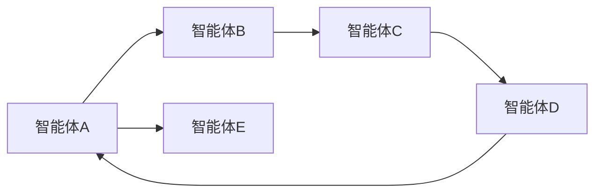
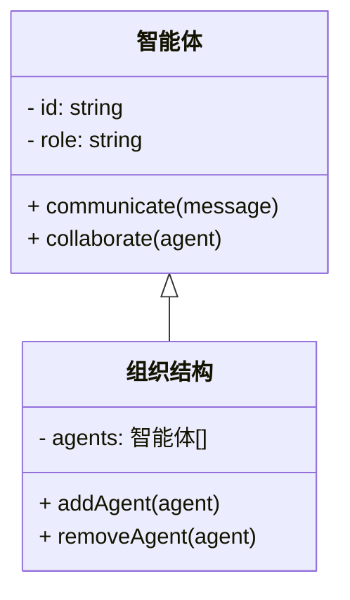
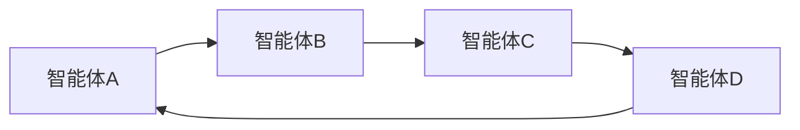

                 


# 多智能体系统在公司治理评估中的应用

## 关键词：多智能体系统、公司治理、人工智能、协作机制、评估模型

## 摘要：  
多智能体系统（Multi-Agent Systems, MAS）作为一种新兴的人工智能技术，正在逐步应用于公司治理评估领域。通过分析多智能体系统的核心概念、算法原理及其在公司治理中的应用场景，本文旨在探讨如何利用MAS技术提升公司治理评估的效率和准确性。本文从多智能体系统的背景、核心概念、算法原理、系统架构设计、项目实战等多个方面展开讨论，并结合实际案例分析，提出了一种基于MAS的公司治理评估模型，为相关领域的研究与实践提供了新的思路。

---

## 第1章 多智能体系统概述

### 1.1 多智能体系统的基本概念

#### 1.1.1 智能体的定义与特征
- **智能体（Agent）**：智能体是指能够感知环境、自主决策并采取行动的实体。  
- **特征**：智能体具有主动性、反应性、社会性、自主性和学习性。

#### 1.1.2 多智能体系统的定义与特点
- **多智能体系统（MAS）**：由多个智能体组成的系统，智能体之间通过通信和协作完成复杂任务。
- **特点**：分布式、协作性、动态性、适应性和自主性。

#### 1.1.3 多智能体系统与传统AI的区别
| 特性 | 传统AI | 多智能体系统 |
|------|--------|-------------|
| 结构  | 集中式 | 分布式       |
| 任务  | 单一任务 | 多任务协作   |
| 智能体 | 单一智能体 | 多个智能体   |

### 1.2 公司治理评估的背景与意义

#### 1.2.1 公司治理的基本概念
公司治理是通过公司章程、董事会、管理层和股东之间的关系，确保公司有效运作和合规经营的过程。

#### 1.2.2 公司治理评估的重要性
- 提高公司透明度和信任度。
- 优化公司内部管理流程。
- 降低公司运营风险。

#### 1.2.3 公司治理评估的常见方法
- 财务指标评估。
- 风险评估。
- 管理层能力评估。

### 1.3 多智能体系统在公司治理中的应用前景

#### 1.3.1 多智能体系统的优势
- 分布式计算能力强。
- 支持多任务协作。
- 适应性强。

#### 1.3.2 多智能体系统在公司治理中的潜在应用场景
- 股东关系管理。
- 风险评估与预警。
- 决策支持。

#### 1.3.3 当前研究与实践中的挑战
- 智能体之间的通信效率。
- 多智能体系统的可扩展性。
- 系统的安全性与隐私保护。

---

## 第2章 多智能体系统的核心概念与联系

### 2.1 多智能体系统的原理

#### 2.1.1 智能体的通信与协作机制
- **通信机制**：智能体之间通过消息传递进行信息共享。
- **协作机制**：智能体通过协商和合作完成共同目标。

#### 2.1.2 多智能体系统的组织与协调
- **组织结构**：星形结构、网状结构、树形结构。
- **协调机制**：基于规则的协调、基于博弈论的协调。

#### 2.1.3 多智能体系统的动态性与适应性
- 动态环境中的智能体行为调整。
- 系统的自适应优化。

#### 2.1.4 智能体的通信与协作机制的Mermaid流程图


#### 2.1.5 多智能体系统的组织结构类图


### 2.2 多智能体系统与公司治理的关系

#### 2.2.1 公司治理中的多方利益相关者分析
- 股东、董事会、管理层、客户、供应商。

#### 2.2.2 多智能体系统在公司治理中的角色定位
- 作为决策支持工具。
- 作为风险评估与预警系统。
- 作为协作平台。

#### 2.2.3 多智能体系统如何支持公司治理决策
- 提供实时数据支持。
- 进行多维度分析。
- 支持多方协作。

---

## 第3章 多智能体系统的算法原理

### 3.1 多智能体系统的通信与协作算法

#### 3.1.1 分布式计算与通信机制
- 分布式计算的基本原理。
- 智能体之间的消息传递机制。

#### 3.1.2 协作协议与协调算法
- 协作协议的设计。
- 基于博弈论的协调算法。

#### 3.1.3 一致性算法与同步机制
- 一致性算法（如Paxos、Raft）。
- 同步机制的设计。

#### 3.1.4 协作协议的Mermaid流程图


### 3.2 多智能体系统的博弈论模型

#### 3.2.1 博弈论基础
- 理解博弈论的基本概念。
- Nash均衡的定义。

#### 3.2.2 多智能体系统的博弈模型
- 博弈模型的构建。
- Nash均衡的应用。

#### 3.2.3 Nash均衡与协作优化
- Nash均衡的计算。
- 协作优化的策略。

#### 3.2.4 博弈论模型的Mermaid流程图


### 3.3 多智能体系统的数学模型

#### 3.3.1 协作模型的数学表达
- 协作模型的数学公式。
- 多智能体系统的数学模型。

#### 3.3.2 动态博弈的数学公式
- 动态博弈的数学模型。
- Nash均衡的数学表达。

---

## 第4章 公司治理评估的系统分析与架构设计

### 4.1 项目背景与目标

#### 4.1.1 项目背景
- 当前公司治理评估的挑战。
- 多智能体系统的优势。

#### 4.1.2 项目目标
- 提供高效的公司治理评估工具。
- 实现智能体之间的协作。

### 4.2 系统功能设计

#### 4.2.1 领域模型设计
- 公司治理评估的领域模型。
- 多智能体系统的领域模型。

#### 4.2.2 功能模块划分
- 数据采集模块。
- 评估模块。
- 协作模块。

#### 4.2.3 模块之间的关系
- 数据流图。
- 功能模块的交互流程。

### 4.3 系统架构设计

#### 4.3.1 系统架构图


#### 4.3.2 智能体的分布架构
- 分布式架构设计。
- 集中式架构设计。

#### 4.3.3 系统的可扩展性设计
- 模块化设计。
- 扩展接口设计。

### 4.4 系统接口与交互设计

#### 4.4.1 系统接口设计
- 接口定义。
- 接口实现。

#### 4.4.2 系统交互流程
- 交互流程图。
- 交互步骤说明。

---

## 第5章 项目实战

### 5.1 环境安装与配置

#### 5.1.1 环境要求
- 操作系统要求。
- 软件依赖。

#### 5.1.2 环境配置
- 安装Python。
- 安装相关库（如numpy、pandas、matplotlib）。

### 5.2 系统核心实现

#### 5.2.1 核心代码实现
```python
class Agent:
    def __init__(self, id):
        self.id = id
        self.role = "default"
    
    def communicate(self, message):
        print(f"Agent {self.id} received message: {message}")
    
    def collaborate(self, other_agent):
        print(f"Agent {self.id} collaborating with {other_agent.id}")
```

#### 5.2.2 代码实现说明
- 类的定义。
- 方法的实现。

### 5.3 案例分析与解读

#### 5.3.1 案例分析
- 案例背景。
- 案例分析步骤。

#### 5.3.2 代码应用解读
- 代码的功能分析。
- 案例的结果解读。

### 5.4 项目总结

#### 5.4.1 项目成果
- 成功实现多智能体系统。
- 实现公司治理评估模型。

#### 5.4.2 经验总结
- 项目中的经验教训。
- 改进方向。

---

## 第6章 总结与展望

### 6.1 最佳实践 tips

#### 6.1.1 项目开发建议
- 代码规范。
- 文档管理。

#### 6.1.2 系统维护建议
- 定期更新。
- 安全维护。

### 6.2 小结

#### 6.2.1 系统实现的成果
- 多智能体系统的实现。
- 公司治理评估模型的应用。

#### 6.2.2 系统实现的意义
- 提高公司治理效率。
- 降低公司治理成本。

### 6.3 注意事项

#### 6.3.1 系统安全注意事项
- 数据加密。
- 权限管理。

#### 6.3.2 系统维护注意事项
- 定期备份。
- 系统监控。

### 6.4 拓展阅读

#### 6.4.1 推荐书籍
- 《多智能体系统》。
- 《人工智能与公司治理》。

#### 6.4.2 推荐论文
- 多智能体系统在公司治理中的应用研究。
- 基于MAS的公司治理模型构建。

---

## 作者：AI天才研究院/AI Genius Institute & 禅与计算机程序设计艺术/Zen And The Art of Computer Programming

---

本文通过系统地分析多智能体系统的核心概念、算法原理以及在公司治理评估中的应用场景，提出了一种基于MAS的公司治理评估模型。这一模型能够有效提高公司治理的效率和准确性，为相关领域的研究与实践提供了新的思路。

