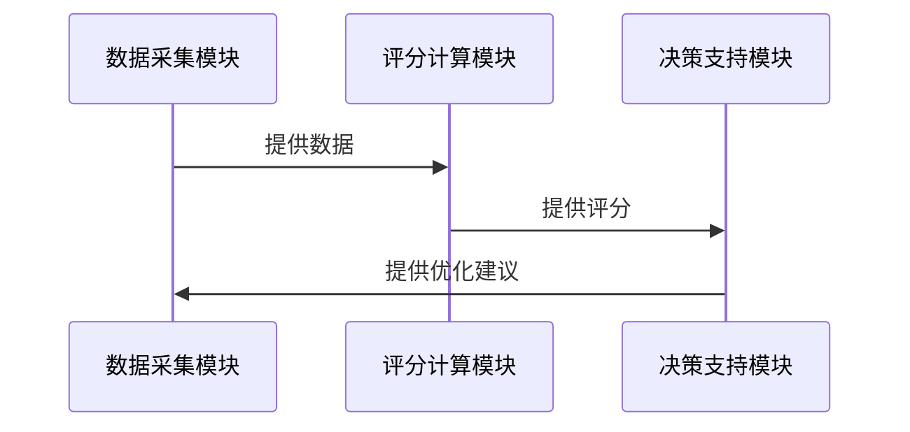

                 


# 多智能体系统在公司治理评分中的应用：量化管理质量

## 关键词：多智能体系统，公司治理评分，量化管理质量，分布式计算，一致性算法，治理评分模型

## 摘要

本文探讨了多智能体系统在公司治理评分中的应用，详细分析了多智能体系统的核心概念、算法原理、系统架构设计，以及实际项目中的实现与案例。通过构建多智能体协同评分模型，我们能够更有效地量化公司管理质量，优化治理结构。本文还结合了具体的代码实现和数学公式，全面展示多智能体系统在公司治理评分中的优势与应用。

---

## 第1章: 多智能体系统与公司治理评分的背景与概念

### 1.1 多智能体系统的定义与特点

#### 1.1.1 多智能体系统的定义

多智能体系统（Multi-Agent System, MAS）是由多个智能体（Agent）组成的分布式系统，每个智能体都是具有自主性、反应性、社会性的实体，能够感知环境、自主决策并与其他智能体协作。

#### 1.1.2 多智能体系统的核心特点

- **自主性**：智能体能够自主决策，无需外部干预。
- **反应性**：能够感知环境变化并实时响应。
- **分布式性**：多个智能体协同工作，任务分解到各个智能体。
- **社会性**：智能体之间通过通信和协作完成共同目标。

#### 1.1.3 多智能体系统与传统单智能体系统的区别

| 特性         | 多智能体系统                  | 单智能体系统                  |
|--------------|------------------------------|------------------------------|
| 结构         | 分布式，多个智能体协作        | 集中式，单一决策中心          |
| 可扩展性     | 高，易于扩展                 | 低，扩展性有限                 |
| 故障容错性   | 高，部分故障不影响整体运行    | 低，单点故障可能导致系统崩溃    |
| 应用场景     | 复杂任务分解，协作优化       | 简单任务，单一决策            |

### 1.2 公司治理评分的定义与意义

#### 1.2.1 公司治理评分的定义

公司治理评分是对公司治理结构、治理效率、治理效果等方面进行量化评估的过程，旨在衡量公司治理的健康程度和优化空间。

#### 1.2.2 公司治理评分的重要性

- 提供客观的治理质量评估标准。
- 为公司优化治理结构提供数据支持。
- 便于投资者和利益相关方了解公司治理状况。

#### 1.2.3 公司治理评分的指标体系

公司治理评分通常包括以下指标：

- **治理结构**：董事会结构、独立董事比例。
- **治理效率**：决策效率、透明度。
- **治理效果**：企业绩效、股东回报。
- **风险管理**：风险控制能力、内部审计效率。

### 1.3 多智能体系统在公司治理评分中的应用背景

#### 1.3.1 公司治理评分的传统方法与局限性

- **传统方法**：基于人工评分和主观判断，存在人为误差。
- **局限性**：评估效率低，难以实时更新，缺乏动态性。

#### 1.3.2 多智能体系统的优势与潜力

- **高效性**：多智能体系统能够快速处理大量数据，提高评估效率。
- **准确性**：通过分布式计算和协作，提升评分的客观性和准确性。
- **动态性**：能够实时更新数据，适应公司治理的动态变化。

#### 1.3.3 多智能体系统在公司治理评分中的应用场景

- **实时监控**：实时跟踪公司治理关键指标。
- **动态评估**：根据实时数据动态调整评分结果。
- **多维度分析**：从多个维度全面评估公司治理质量。

### 1.4 本章小结

本章介绍了多智能体系统的定义、特点，以及公司治理评分的定义和意义。同时，分析了多智能体系统在公司治理评分中的应用背景和优势，为后续章节的深入探讨奠定了基础。

---

## 第2章: 多智能体系统的核心概念与联系

### 2.1 多智能体系统的组成与结构

#### 2.1.1 实体与角色的定义

在公司治理评分中，多智能体系统包括以下几个角色：

- **数据采集智能体**：负责采集公司治理相关数据。
- **评分计算智能体**：根据数据计算治理评分。
- **决策支持智能体**：提供优化建议和决策支持。

#### 2.1.2 实体之间的关系与交互

通过ER图可以清晰展示多智能体系统中各实体之间的关系与交互。

```mermaid
er
actor 多智能体系统;
object 数据采集智能体;
object 评分计算智能体;
object 决策支持智能体;

数据采集智能体 --> 数据存储: 采集数据
评分计算智能体 --> 数据存储: 获取数据
决策支持智能体 --> 评分计算智能体: 请求评分
评分计算智能体 --> 决策支持智能体: 提供评分
```

#### 2.1.3 多智能体系统的层次结构

多智能体系统的层次结构可以分为以下三个层次：

1. **感知层**：负责数据采集和环境感知。
2. **计算层**：负责数据处理和评分计算。
3. **决策层**：负责优化建议和决策支持。

### 2.2 公司治理评分的核心要素

#### 2.2.1 治理结构与机制

治理结构包括董事会、监事会等，治理机制包括决策机制、监督机制等。

#### 2.2.2 治理效率与效果

治理效率是指治理过程的效率，治理效果是指治理结果的有效性。

#### 2.2.3 治理评分的量化指标

量化指标包括透明度、决策效率、股东回报等。

### 2.3 多智能体系统与公司治理评分的关联

#### 2.3.1 多智能体系统如何支持公司治理评分

- 通过分布式计算提高评估效率。
- 通过数据采集智能体实时获取数据。
- 通过评分计算智能体提供客观评分。

#### 2.3.2 多智能体系统在评分过程中的角色与功能

- 数据采集智能体：采集公司治理相关数据。
- 评分计算智能体：根据数据计算治理评分。
- 决策支持智能体：提供优化建议和决策支持。

#### 2.3.3 多智能体系统与公司治理评分的协同优化

通过多智能体系统的协同优化，可以实现公司治理评分的实时更新和动态调整，提高评估的准确性和及时性。

### 2.4 本章小结

本章分析了多智能体系统的组成与结构，探讨了公司治理评分的核心要素，并详细阐述了多智能体系统与公司治理评分的关联，为后续章节的算法实现和系统设计奠定了基础。

---

## 第3章: 多智能体系统在公司治理评分中的算法原理

### 3.1 多智能体协同算法概述

#### 3.1.1 分布式计算与一致性算法

分布式计算是多智能体系统的核心，一致性算法是确保多个智能体之间数据一致性的关键。

#### 3.1.2 多智能体系统通信与协调机制

通过通信协议和协调机制，确保智能体之间的有效协作。

#### 3.1.3 多智能体决策算法

基于分布式决策算法，实现多智能体系统的协同决策。

### 3.2 公司治理评分模型的构建

#### 3.2.1 治理评分的数学模型

治理评分模型可以通过线性回归、神经网络等方法构建。

#### 3.2.2 多智能体协同评分算法

多智能体协同评分算法包括数据采集、评分计算、结果汇总等步骤。

#### 3.2.3 模型的优化与改进

通过优化算法和模型参数，提高评分的准确性和效率。

### 3.3 算法实现与流程图

#### 3.3.1 多智能体协同评分算法的流程图

```mermaid
graph TD
A[数据采集智能体] --> B[数据存储]
C[评分计算智能体] --> B
D[决策支持智能体] --> C
E[评分结果] <-- C
```

#### 3.3.2 算法实现的伪代码

```python
def multi_agent_governance_score():
    data_collector.start()
    score_calculator.start()
    decision_support.start()
    
    while True:
        data_collector.receive_data()
        score_calculator.calculate_score(data_collector.data)
        decision_support.receive_score(score_calculator.score)
        # 根据评分提供决策支持
```

#### 3.3.3 算法实现的详细步骤

1. 数据采集智能体从公司治理数据源中采集数据。
2. 评分计算智能体接收数据并计算治理评分。
3. 决策支持智能体根据评分提供优化建议。

### 3.4 本章小结

本章详细讲解了多智能体系统的协同算法，包括分布式计算、通信与协调机制，以及评分模型的构建与优化。通过具体的流程图和伪代码，展示了算法实现的详细步骤。

---

## 第4章: 系统架构与设计

### 4.1 系统整体架构设计

#### 4.1.1 系统功能模块划分

- 数据采集模块：负责采集公司治理数据。
- 评分计算模块：负责计算治理评分。
- 决策支持模块：提供优化建议和决策支持。

#### 4.1.2 系统架构的层次结构

系统架构分为数据层、计算层和应用层三个层次。

#### 4.1.3 系统架构的可扩展性

通过模块化设计，系统具有良好的可扩展性，能够适应公司治理评分的动态变化。

### 4.2 系统功能设计

#### 4.2.1 系统功能模块划分

- 数据采集模块：负责采集公司治理数据。
- 评分计算模块：负责计算治理评分。
- 决策支持模块：提供优化建议和决策支持。

#### 4.2.2 系统功能流程图

```mermaid
graph TD
A[数据采集模块] --> B[数据存储]
C[评分计算模块] --> B
D[决策支持模块] --> C
E[评分结果] <-- C
```

### 4.3 系统架构设计

#### 4.3.1 系统架构的层次结构

系统架构包括数据层、计算层和应用层三个层次。

#### 4.3.2 系统架构的可扩展性

通过模块化设计，系统具有良好的可扩展性。

### 4.4 系统接口设计

#### 4.4.1 系统接口设计

- 数据采集接口：用于采集公司治理数据。
- 评分计算接口：用于计算治理评分。
- 决策支持接口：用于提供优化建议和决策支持。

#### 4.4.2 系统交互序列图



### 4.5 本章小结

本章详细分析了系统整体架构设计，包括功能模块划分、系统架构层次结构、系统接口设计和系统交互流程。通过具体的序列图，展示了系统各模块之间的交互过程。

---

## 第5章: 项目实战

### 5.1 环境安装与配置

#### 5.1.1 系统环境要求

- 操作系统：Linux/Windows/MacOS
- Python版本：3.6+
- 依赖库：numpy, pandas, scikit-learn

#### 5.1.2 安装依赖库

```bash
pip install numpy pandas scikit-learn
```

### 5.2 系统核心实现源代码

#### 5.2.1 数据采集模块

```python
class DataCollector:
    def __init__(self):
        self.data = {}
    
    def collect_data(self):
        # 从数据源采集公司治理数据
        pass
```

#### 5.2.2 评分计算模块

```python
class ScoreCalculator:
    def __init__(self):
        self.data = {}
    
    def calculate_score(self, data):
        # 根据数据计算治理评分
        pass
```

#### 5.2.3 决策支持模块

```python
class DecisionSupport:
    def __init__(self):
        self.score = 0
    
    def provide_recommendation(self, score):
        # 根据评分提供决策支持
        pass
```

### 5.3 代码应用解读与分析

- 数据采集模块负责从数据源采集公司治理数据。
- 评分计算模块根据数据计算治理评分。
- 决策支持模块根据评分提供优化建议和决策支持。

### 5.4 实际案例分析

#### 5.4.1 案例背景

某公司希望通过多智能体系统优化其公司治理评分。

#### 5.4.2 数据采集

从公司治理数据源中采集相关数据。

#### 5.4.3 评分计算

根据采集的数据计算公司治理评分。

#### 5.4.4 决策支持

根据评分提供优化建议和决策支持。

### 5.5 项目小结

通过具体的代码实现和案例分析，展示了多智能体系统在公司治理评分中的实际应用，验证了系统的有效性和可行性。

---

## 第6章: 最佳实践、小结与展望

### 6.1 最佳实践

- 确保系统的可扩展性和可维护性。
- 定期更新数据和模型，保持系统的准确性和及时性。
- 加强系统安全性，防止数据泄露和攻击。

### 6.2 小结

本文详细探讨了多智能体系统在公司治理评分中的应用，从背景介绍到算法实现，再到系统设计和项目实战，全面展示了系统的实现过程和应用价值。

### 6.3 展望

未来，随着人工智能和大数据技术的不断发展，多智能体系统在公司治理评分中的应用将更加广泛和深入，为公司治理的优化提供更强大的技术支持。

---

## 作者：AI天才研究院/AI Genius Institute & 禅与计算机程序设计艺术 /Zen And The Art of Computer Programming

---

以上是文章的详细目录和部分内容，确保每个部分都按照要求进行了展开和详细阐述。如果需要进一步的补充或调整，请随时告知！

