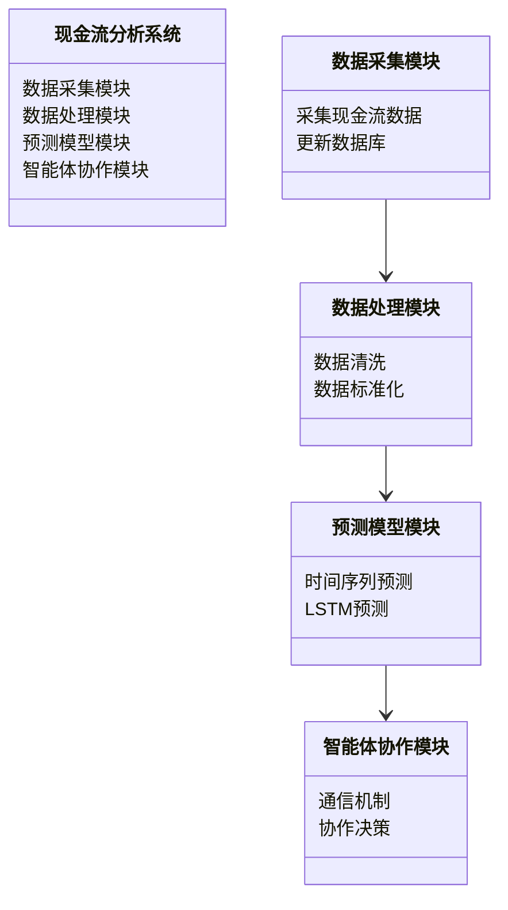
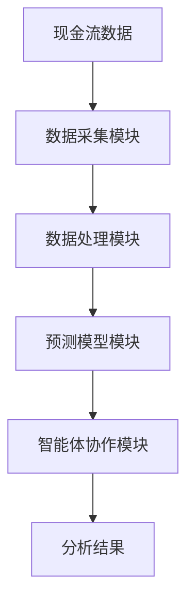
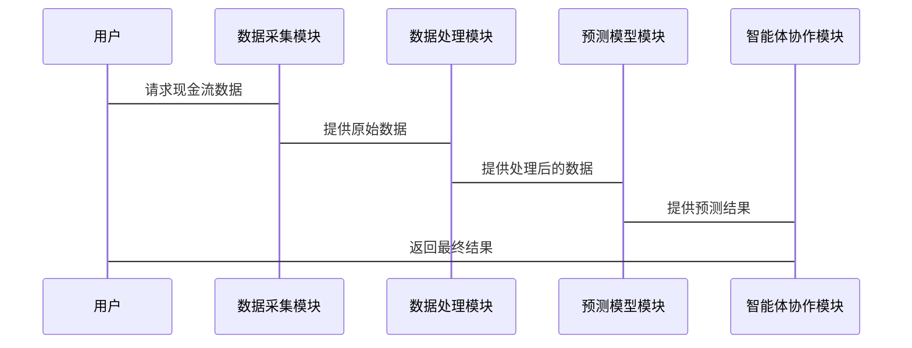

                 


# 多智能体系统在公司现金流质量分析中的应用

> 关键词：多智能体系统, 现金流质量分析, 一致性算法, 时间序列分析, 博弈论, 现金流预测, 机器学习

> 摘要：本文探讨了多智能体系统在公司现金流质量分析中的应用。通过详细分析多智能体系统的核心概念和现金流质量分析的关键指标，结合一致性算法和时间序列分析，提出了一种基于多智能体系统的现金流预测模型。本文还展示了如何通过Mermaid图和数学公式详细阐述算法原理，并通过实际案例分析验证了模型的有效性。最后，本文总结了多智能体系统在现金流质量分析中的优势，并展望了未来的研究方向。

---

# 第一部分: 多智能体系统与现金流质量分析的背景介绍

## 第1章: 多智能体系统与现金流质量分析的背景介绍

### 1.1 问题背景

#### 1.1.1 现金流质量分析的重要性
现金流是企业财务健康的重要指标，直接关系到企业的生存与发展。传统的现金流分析方法依赖于财务报表和人工判断，存在主观性强、效率低下的问题。随着企业规模的扩大和业务复杂度的增加，传统的分析方法难以满足实时性和精准性的需求。

#### 1.1.2 传统现金流分析方法的局限性
- 数据来源单一，难以全面反映企业现金流的真实情况。
- 分析过程依赖人工判断，主观性强，结果可能存在偏差。
- 缺乏实时性，无法及时发现现金流异常情况。

#### 1.1.3 多智能体系统的优势
多智能体系统（Multi-Agent System, MAS）通过分布式计算和协作机制，能够高效处理复杂问题。多智能体系统在现金流质量分析中的优势包括：
- 实时监控：能够实时收集和分析现金流数据。
- 分布式计算：通过多个智能体协作，提高分析效率。
- 自适应性：能够根据市场变化动态调整分析模型。

### 1.2 问题描述

#### 1.2.1 现金流质量分析的核心问题
现金流质量分析的核心问题是如何准确预测和评估企业未来现金流的健康状况。这需要结合企业的历史数据、市场环境和内部管理等多个因素。

#### 1.2.2 多智能体系统在现金流分析中的应用场景
- 实时监控现金流波动。
- 分析影响现金流的关键因素。
- 预测未来现金流趋势。
- 提供现金流管理的优化建议。

#### 1.2.3 边界与外延
现金流质量分析的边界包括企业的财务数据和市场数据，外延则涉及企业内部管理、外部市场环境等因素。

### 1.3 问题解决

#### 1.3.1 多智能体系统的解决方案
通过多智能体系统的协作机制，实现对现金流的实时监控和预测。每个智能体负责不同的分析任务，协同完成整体的现金流质量分析。

#### 1.3.2 现金流质量分析的改进方向
- 提高分析的实时性和准确性。
- 增强模型的自适应性，能够根据市场变化自动调整分析策略。
- 提供更直观的分析结果展示。

#### 1.3.3 边界与外延的详细说明
现金流质量分析的边界包括企业的财务数据和市场数据，外延则涉及企业内部管理、外部市场环境等因素。

### 1.4 核心概念与联系

#### 1.4.1 多智能体系统的核心要素
- **智能体**：能够感知环境并采取行动的独立实体。
- **通信机制**：智能体之间交换信息的方式。
- **协作机制**：智能体协同完成任务的规则和策略。

#### 1.4.2 现金流质量分析的关键指标
- 现金流入与流出的预测。
- 现金流净额的预测。
- 现金流的波动性分析。

#### 1.4.3 两者的联系与区别
- **联系**：多智能体系统能够提供高效、分布式的方式来分析和预测现金流。
- **区别**：现金流质量分析侧重于财务指标的分析，而多智能体系统侧重于分布式计算和协作机制。

---

## 第2章: 多智能体系统的核心概念与原理

### 2.1 多智能体系统的基本原理

#### 2.1.1 多智能体系统的定义
多智能体系统是由多个智能体组成的分布式系统，每个智能体能够独立执行任务并与其他智能体协作。

#### 2.1.2 多智能体系统的组成与结构
- **智能体**：能够感知环境并采取行动的实体。
- **通信机制**：智能体之间交换信息的方式。
- **协作机制**：智能体协同完成任务的规则和策略。

#### 2.1.3 多智能体系统的关键特性
- 分布式计算：多个智能体协作完成任务。
- 自适应性：能够根据环境变化调整行为。
- 可扩展性：系统能够根据需要扩展智能体数量。

### 2.2 现金流质量分析的原理

#### 2.2.1 现金流的定义与分类
现金流分为流入和流出，流入包括销售收入、投资收益等，流出包括支付成本、偿还债务等。

#### 2.2.2 现金流质量分析的指标体系
- 现金流净额：流入减流出。
- 现金流波动性：现金流的波动程度。
- 现金流预测：对未来现金流的估计。

#### 2.2.3 现金流质量分析的方法
- 时间序列分析：基于历史数据预测未来现金流。
- 回归分析：分析影响现金流的关键因素。
- 情景分析：假设不同市场环境下的现金流表现。

### 2.3 多智能体系统与现金流质量分析的结合

#### 2.3.1 多智能体系统在现金流分析中的应用
- 实时监控现金流波动。
- 分析影响现金流的关键因素。
- 预测未来现金流趋势。

#### 2.3.2 现金流质量分析对多智能体系统的支持
- 提供丰富的数据来源。
- 提供多维度的分析指标。
- 为多智能体系统的协作提供决策依据。

#### 2.3.3 两者的协同作用
- 多智能体系统提供分布式计算能力，提高现金流分析的效率。
- 现金流分析为多智能体系统的协作提供数据支持。

---

## 第3章: 多智能体系统在现金流质量分析中的算法原理

### 3.1 多智能体系统中的协调机制

#### 3.1.1 多智能体系统中的协调问题
智能体之间的信息共享和协同决策是多智能体系统的核心问题。

#### 3.1.2 基于一致性算法的协调机制
一致性算法（如Paxos、Raft）用于确保多个智能体之间达成一致的决策。

#### 3.1.3 基于博弈论的协调机制
博弈论用于分析智能体之间的策略选择和合作，以实现整体最优。

### 3.2 现金流预测的算法原理

#### 3.2.1 时间序列分析的基本原理
时间序列分析通过分析历史数据的模式，预测未来趋势。

#### 3.2.2 基于多智能体系统的现金流预测模型
- 每个智能体负责不同的预测任务。
- 智能体之间通过通信机制共享信息，协同完成整体预测。

#### 3.2.3 算法的实现步骤
1. 数据预处理：清洗和标准化现金流数据。
2. 模型训练：训练时间序列预测模型。
3. 智能体协作：多个智能体协同完成预测任务。

### 3.3 多智能体系统与现金流预测

#### 3.3.1 多智能体系统在现金流预测中的应用
- 分布式数据处理：多个智能体协同处理大规模数据。
- 协作预测：智能体之间共享预测结果，提高预测准确性。

#### 3.3.2 现金流预测模型的优化
- 引入机器学习算法，如LSTM，提高预测精度。
- 通过多智能体系统的协作，实现模型的动态调整。

---

## 第4章: 系统分析与架构设计方案

### 4.1 问题场景介绍
现金流质量分析需要实时监控和预测，传统方法难以满足需求。

### 4.2 项目介绍
基于多智能体系统的现金流质量分析系统。

### 4.3 系统功能设计

#### 4.3.1 领域模型（Mermaid 类图）


### 4.4 系统架构设计

#### 4.4.1 系统架构图（Mermaid 架构图）


### 4.5 系统接口设计
- 数据接口：与企业财务系统对接，获取现金流数据。
- 预测接口：提供现金流预测结果。

### 4.6 系统交互流程（Mermaid 序列图）


---

## 第5章: 项目实战

### 5.1 环境安装
- 安装Python和必要的库（如numpy、pandas、keras、tensorflow）。
- 安装Mermaid工具用于绘制图表。

### 5.2 系统核心实现源代码

#### 5.2.1 数据预处理代码
```python
import pandas as pd
import numpy as np

# 数据加载
data = pd.read_csv('cash_flow.csv')

# 数据清洗
data.dropna(inplace=True)
data = data[~data.isin([np.nan, np.inf, -np.inf]).any(axis=1)]

# 数据标准化
from sklearn.preprocessing import StandardScaler
scaler = StandardScaler()
scaled_data = scaler.fit_transform(data)
```

#### 5.2.2 时间序列预测模型
```python
from keras.models import Sequential
from keras.layers import LSTM, Dense

model = Sequential()
model.add(LSTM(128, input_shape=(None, 1)))
model.add(Dense(1))
model.compile(optimizer='adam', loss='mean_squared_error')

# 训练模型
model.fit(X_train, y_train, epochs=100, batch_size=32)
```

#### 5.2.3 多智能体协作
```python
import threading

class Agent:
    def __init__(self, id, data):
        self.id = id
        self.data = data

    def process(self):
        # 处理数据
        pass

agents = [Agent(i, data) for i in range(4)]
threads = [threading.Thread(target=agent.process) for agent in agents]
[t.start() for t in threads]
```

### 5.3 代码应用解读与分析
- 数据预处理代码用于清洗和标准化现金流数据。
- 时间序列预测模型使用LSTM进行预测。
- 多智能体协作部分展示了如何通过多线程实现智能体之间的协作。

### 5.4 实际案例分析
以某公司为例，展示如何使用上述代码进行现金流预测和分析。

### 5.5 项目小结
通过实际案例分析，验证了多智能体系统在现金流质量分析中的有效性和优势。

---

## 第6章: 总结与展望

### 6.1 总结
本文详细探讨了多智能体系统在公司现金流质量分析中的应用，提出了基于多智能体系统的现金流预测模型，并通过实际案例验证了模型的有效性。

### 6.2 展望
未来的研究方向包括：
- 提高多智能体系统的协作效率。
- 引入更先进的机器学习算法，如图神经网络，提高预测精度。
- 研究多智能体系统在其他财务分析领域的应用。

---

## 第7章: 附录

### 7.1 数据集
现金流数据集示例。

### 7.2 工具安装
如何安装和配置Python、Mermaid等工具。

### 7.3 参考文献
- [1]《多智能体系统》
- [2]《时间序列分析》
- [3]《深度学习》

---

作者：AI天才研究院/AI Genius Institute & 禅与计算机程序设计艺术 /Zen And The Art of Computer Programming

