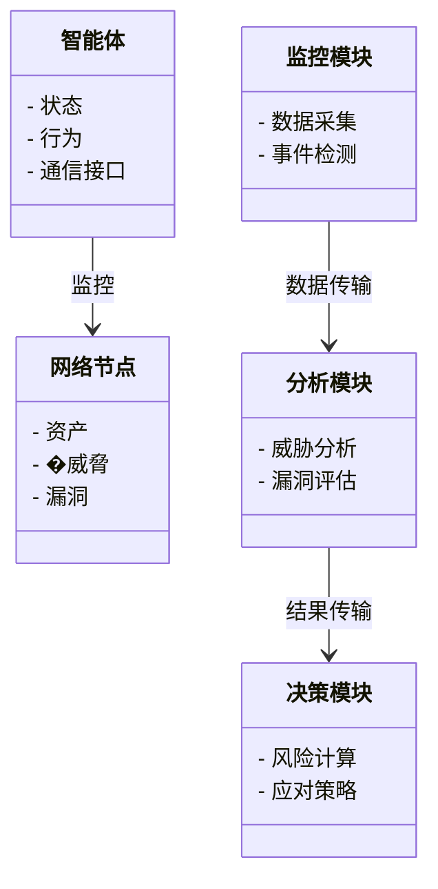
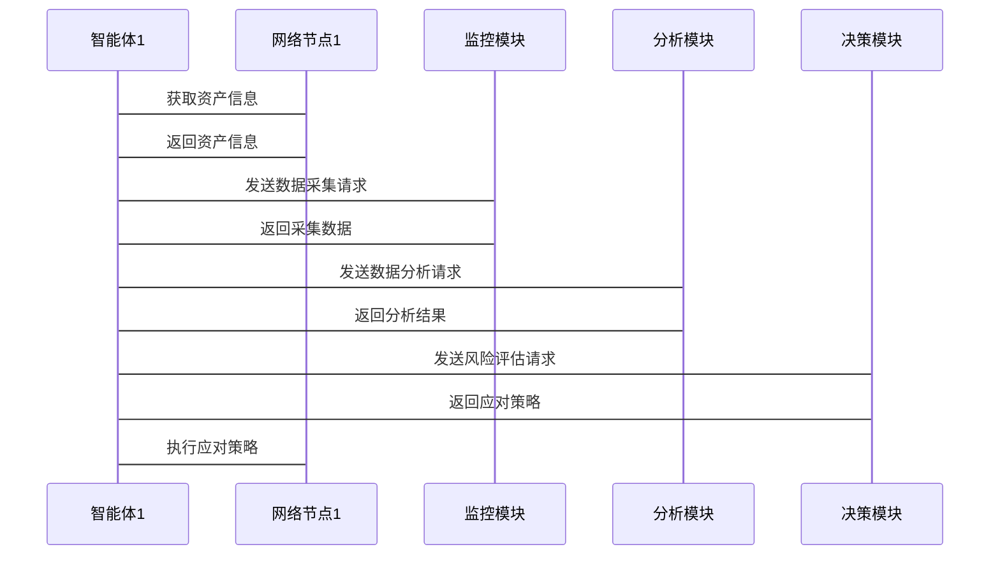

                 


# 多智能体系统在公司网络安全风险评估中的应用

## 关键词：多智能体系统，网络安全，风险评估，分布式计算，协作算法

## 摘要：  
随着企业网络环境的日益复杂化，传统的集中式网络安全风险评估方法已难以满足实时性和准确性要求。本文探讨了多智能体系统（Multi-Agent System, MAS）在公司网络安全风险评估中的应用。通过分析MAS的核心概念、算法原理、系统架构及实际案例，本文展示了如何利用MAS的分布式计算和协作能力，提高网络安全风险评估的效率和准确性。文章还详细讲解了MAS在网络安全风险评估中的优势、挑战及解决方案，为相关领域的研究和实践提供了有价值的参考。

---

# 第1章: 多智能体系统与网络安全风险评估概述

## 1.1 多智能体系统的基本概念

### 1.1.1 多智能体系统的定义与特点
多智能体系统（MAS）是由多个智能体（Agent）组成的分布式系统，每个智能体都是一个能够感知环境、自主决策并执行任务的实体。MAS具有以下特点：
- **分布式性**：智能体独立运行，不存在集中控制节点。
- **协作性**：智能体之间通过通信和协作完成共同目标。
- **动态性**：智能体能够适应环境变化并实时调整行为。
- **自主性**：每个智能体都具备自主决策能力。

### 1.1.2 多智能体系统的核心要素
- **智能体（Agent）**：MAS的基本组成单元，具备感知、推理、规划和执行能力。
- **通信机制**：智能体之间通过消息传递进行信息交换。
- **协作协议**：定义智能体之间的协作规则和任务分配方式。
- **环境模型**：描述智能体所处的环境及其与环境的交互方式。

### 1.1.3 多智能体系统与网络安全的结合
网络安全问题具有复杂性和动态性，MAS的分布式协作能力能够有效应对这些问题。例如，多个智能体可以分别负责网络流量监控、漏洞扫描和威胁检测，通过协作实现全面的风险评估。

---

## 1.2 网络安全风险评估的基本概念

### 1.2.1 网络安全风险的定义与分类
网络安全风险是指由于人为或技术原因导致的网络系统损坏或信息泄露的可能性。根据风险来源，可以分为：
- **内部风险**：如员工误操作或内鬼行为。
- **外部风险**：如黑客攻击或病毒传播。
- **技术风险**：如系统漏洞或数据泄露。

### 1.2.2 风险评估的方法与流程
风险评估通常包括以下几个步骤：
1. **资产识别**：识别企业的重要资产，如服务器、数据库等。
2. **威胁分析**：分析可能的威胁来源及其影响程度。
3. **漏洞评估**：识别资产存在的安全漏洞。
4. **风险计算**：根据威胁和漏洞的组合，计算风险值。
5. **风险应对**：制定相应的风险缓解策略。

### 1.2.3 多智能体系统在风险评估中的作用
MAS能够通过分布式计算和协作能力，实时收集和分析网络数据，快速识别潜在风险。例如，多个智能体可以分别监控网络流量、主机状态和用户行为，通过协作生成全面的风险评估报告。

---

## 1.3 多智能体系统在网络安全中的应用背景

### 1.3.1 网络安全面临的挑战
- **复杂性**：现代网络系统由多个子系统组成，结构复杂。
- **动态性**：网络环境不断变化，威胁也在不断演变。
- **实时性**：需要快速响应潜在威胁，避免损失。

### 1.3.2 多智能体系统的优势与潜力
- **分布式计算**：MAS能够利用分布式计算能力，提高评估效率。
- **协作能力**：智能体之间的协作能够覆盖更广泛的网络范围。
- **动态适应**：MAS能够根据环境变化实时调整评估策略。

### 1.3.3 应用场景与实际案例
- **企业网络监控**：多个智能体分别负责不同网络节点的监控，实时评估风险。
- **威胁情报共享**：智能体之间共享威胁情报，提升整体安全防护能力。

---

## 1.4 本章小结
本章介绍了多智能体系统的基本概念、核心要素及其在网络安全中的应用背景。通过分析MAS的特点和优势，展示了其在网络安全风险评估中的潜力和实际应用场景。

---

# 第2章: 多智能体系统的核心概念与原理

## 2.1 多智能体系统的体系结构

### 2.1.1 分布式多智能体系统
分布式MAS没有集中控制节点，每个智能体独立运行，通过通信机制协作完成任务。例如，企业网络中可以部署多个智能体，分别负责不同区域的网络安全监控。

### 2.1.2 集中式多智能体系统
集中式MAS有一个中心控制节点，负责协调和管理所有智能体的行动。这种结构适合任务简单但需要统一协调的场景。

### 2.1.3 混合式多智能体系统
混合式MAS结合了分布式和集中式的特点，部分智能体独立运行，部分智能体受中心节点控制。这种结构能够兼顾灵活性和协调性。

---

## 2.2 多智能体系统中的通信机制

### 2.2.1 通信协议的选择
智能体之间的通信需要选择合适的协议，如HTTP、WebSocket或MQTT。通信协议的选择影响系统的实时性和可靠性。

### 2.2.2 消息传递机制
消息传递机制包括发布-订阅模式和请求-响应模式。发布-订阅模式适合异步通信，请求-响应模式适合同步通信。

### 2.2.3 通信中的安全问题
为确保通信安全，需要采用加密技术和认证机制，防止信息被窃听或篡改。

---

## 2.3 多智能体系统中的协作与协调

### 2.3.1 协作机制
协作机制包括任务分配、资源共享和协同决策。例如，智能体可以通过协商分配任务，共享资源以提高整体效率。

### 2.3.2 协调算法
协调算法包括基于博弈论的算法和基于强化学习的算法。博弈论算法通过模拟竞争关系实现协作，强化学习算法通过奖励机制优化协作策略。

### 2.3.3 冲突解决策略
冲突解决策略包括仲裁机制和容错机制。仲裁机制用于解决智能体之间的冲突，容错机制用于处理智能体故障或通信失败的情况。

---

## 2.4 多智能体系统的性能评估

### 2.4.1 性能指标
性能指标包括响应时间、吞吐量和错误率。这些指标用于衡量MAS的效率和可靠性。

### 2.4.2 评估方法
评估方法包括模拟测试和实际运行测试。通过模拟测试可以验证系统的理论性能，通过实际运行测试可以评估系统的实际表现。

### 2.4.3 优化策略
优化策略包括算法优化和系统架构优化。算法优化通过改进协作算法提高效率，系统架构优化通过调整系统结构减少延迟。

---

## 2.5 本章小结
本章详细讲解了多智能体系统的体系结构、通信机制、协作与协调以及性能评估。这些内容为后续章节的应用提供了理论基础。

---

# 第3章: 网络安全风险评估的理论与方法

## 3.1 网络安全风险评估的基本理论

### 3.1.1 风险的定义与特征
风险是某一事件发生的可能性及其可能造成的影响的综合度量。风险具有不确定性、动态性和可变性。

### 3.1.2 风险评估的框架与模型
风险评估框架包括资产识别、威胁分析、漏洞评估和风险计算四个步骤。风险评估模型可以采用概率论模型或模糊逻辑模型。

### 3.1.3 风险评估的数学模型
风险值（R）可以表示为威胁（T）和漏洞（V）的函数：
$$ R = f(T, V) $$

---

## 3.2 多智能体系统在风险评估中的应用

### 3.2.1 多智能体系统的分布式计算优势
MAS能够通过分布式计算快速收集和分析网络数据，提高风险评估的实时性。

### 3.2.2 多智能体系统的协作能力
智能体之间的协作能够覆盖更广泛的网络范围，提高风险评估的全面性。

### 3.2.3 多智能体系统的实时性与动态性
MAS能够实时感知网络环境的变化，动态调整风险评估策略。

---

## 3.3 基于多智能体系统的风险评估方法

### 3.3.1 基于MAS的分布式风险评估模型
分布式模型通过多个智能体分别评估不同网络节点的风险，然后汇总生成整体风险报告。

### 3.3.2 基于MAS的协作式风险评估流程
协作式流程通过智能体之间的协作，综合考虑不同威胁和漏洞的影响，生成更准确的风险评估结果。

### 3.3.3 基于MAS的动态风险评估机制
动态机制能够实时更新风险评估结果，适应网络环境的变化。

---

## 3.4 本章小结
本章介绍了网络安全风险评估的基本理论和基于MAS的风险评估方法。通过MAS的分布式计算和协作能力，可以显著提高风险评估的效率和准确性。

---

# 第4章: 多智能体系统在网络安全风险评估中的算法原理

## 4.1 多智能体协作算法

### 4.1.1 分布式协作算法
分布式协作算法通过智能体之间的消息传递实现任务分配和资源共享。例如，智能体可以使用协商算法决定各自的任务分工。

### 4.1.2 基于博弈论的协作策略
基于博弈论的协作策略通过模拟智能体之间的竞争和合作关系，优化协作效果。例如，可以通过纳什均衡模型确定最优协作策略。

### 4.1.3 基于强化学习的协作机制
基于强化学习的协作机制通过奖励机制激励智能体之间的协作行为，例如，当智能体成功协作完成任务时，给予正向奖励。

---

## 4.2 网络安全风险评估算法

### 4.2.1 风险评估的数学模型
风险评估可以采用概率模型，例如：
$$ P(R) = \sum_{i=1}^{n} P(T_i) \times P(V_i) $$
其中，$P(T_i)$表示威胁$i$发生的概率，$P(V_i)$表示漏洞$i$存在的概率。

### 4.2.2 基于概率论的风险评估方法
基于概率论的方法通过计算威胁和漏洞的联合概率，评估风险的可能性。

### 4.2.3 基于模糊逻辑的风险评估模型
基于模糊逻辑的模型能够处理模糊和不确定的信息，例如，使用模糊集理论表示威胁和漏洞的不确定性。

---

## 4.3 基于多智能体系统的联合算法

### 4.3.1 多智能体协同学
通过结合分布式协作算法和风险评估算法，实现MAS在网络安全风险评估中的联合应用。例如，智能体通过分布式协作算法分配任务，然后使用概率模型评估风险。

### 4.3.2 算法实现步骤
1. 初始化多个智能体，分配任务。
2. 智能体通过通信机制共享威胁和漏洞信息。
3. 使用概率模型计算风险值。
4. 根据风险值制定应对策略。

---

## 4.4 本章小结
本章详细讲解了多智能体协作算法和网络安全风险评估算法的原理及实现步骤。通过结合MAS的分布式计算和协作能力，可以显著提高风险评估的效率和准确性。

---

# 第5章: 系统架构设计与实现

## 5.1 问题场景介绍
假设某企业需要对内部网络进行风险评估，网络中包含多个服务器、终端和网络设备。为了实现高效的网络安全风险评估，可以部署一个多智能体系统，分别监控不同网络节点的安全状态。

---

## 5.2 系统功能设计

### 5.2.1 功能模块划分
- **监控模块**：负责收集网络数据，如流量、日志等。
- **分析模块**：对收集的数据进行分析，识别威胁和漏洞。
- **决策模块**：根据分析结果生成风险评估报告，并制定应对策略。

### 5.2.2 领域模型（mermaid类图）


---

## 5.3 系统架构设计（mermaid架构图）


---

## 5.4 系统接口设计

### 5.4.1 智能体通信接口
智能体之间的通信接口需要支持消息的发布和订阅，例如：
- `subscribe(topic: String, callback: Function)`
- `publish(topic: String, message: String)`

### 5.4.2 网络节点接口
网络节点需要提供接口供智能体进行数据采集和控制，例如：
- `get_asset_info()`
- `apply_policy(policy: String)`

---

## 5.5 系统交互设计（mermaid序列图）



---

## 5.6 本章小结
本章通过系统架构设计和实现，展示了多智能体系统在网络安全风险评估中的具体应用。通过模块化设计和协作机制，实现了高效的风险评估和应对策略。

---

# 第6章: 项目实战与案例分析

## 6.1 环境安装与配置

### 6.1.1 安装依赖
- 安装Python和相关库（如pymqtt、requests）
- 安装JDK和相关开发工具

### 6.1.2 网络环境配置
- 配置网络接口和通信协议
- 设置防火墙规则，允许智能体之间的通信

---

## 6.2 核心代码实现

### 6.2.1 智能体通信接口
```python
import paho.mqtt.client as mqtt

class Agent:
    def __init__(self, broker):
        self.broker = broker
        self.client = mqtt.Client()
        self.client.on_message = self.on_message
        self.client.connect(broker)

    def subscribe(self, topic):
        self.client.subscribe(topic)

    def publish(self, topic, message):
        self.client.publish(topic, message)

    def on_message(self, message):
        print(f"Received message: {message.payload.decode()}")
```

### 6.2.2 风险评估算法实现
```python
def calculateRisk(threats, vulnerabilities):
    risk = 0
    for threat, vulnerability in zip(threats, vulnerabilities):
        risk += threat * vulnerability
    return risk
```

---

## 6.3 实际案例分析

### 6.3.1 案例背景
某企业网络中存在多个服务器和终端，部署了一个MAS进行风险评估。智能体分别负责监控网络流量、主机状态和用户行为。

### 6.3.2 数据采集与分析
智能体通过通信接口收集网络数据，分析模块使用概率模型计算风险值。

### 6.3.3 应对策略制定
根据风险评估结果，决策模块制定相应的应对策略，例如，封堵高风险的端口或加强用户权限管理。

---

## 6.4 本章小结
本章通过实际案例分析，展示了多智能体系统在网络安全风险评估中的具体应用。通过项目实战，验证了MAS的优势和可行性。

---

# 第7章: 最佳实践与总结

## 7.1 最佳实践 Tips

### 7.1.1 系统安全性
确保智能体之间的通信安全，采用加密技术和认证机制。

### 7.1.2 数据隐私
在 MAS 中处理敏感数据时，需严格控制数据访问权限。

### 7.1.3 系统可扩展性
设计模块化架构，便于后续扩展和升级。

---

## 7.2 小结

多智能体系统在网络安全风险评估中的应用具有显著优势，能够通过分布式计算和协作能力，提高风险评估的效率和准确性。然而，MAS也面临通信延迟、协作复杂性等挑战，需要进一步优化算法和系统架构。

---

## 7.3 未来展望

未来，随着人工智能和区块链等技术的发展，MAS在网络安全中的应用将更加广泛。例如，可以通过区块链技术实现智能体之间的信任机制，进一步提升系统的安全性和可靠性。

---

# 作者：AI天才研究院/AI Genius Institute & 禅与计算机程序设计艺术 /Zen And The Art of Computer Programming

